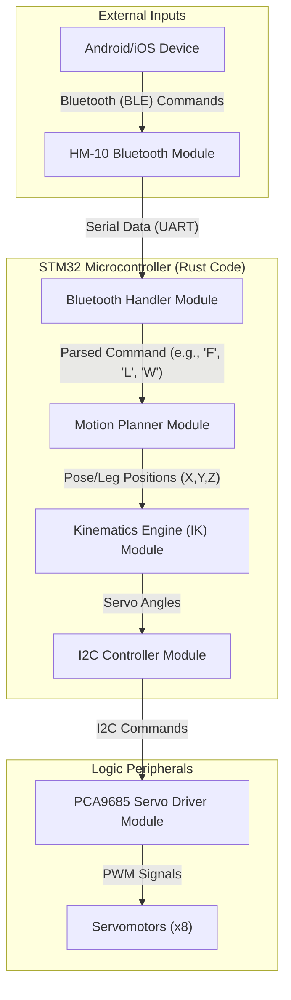
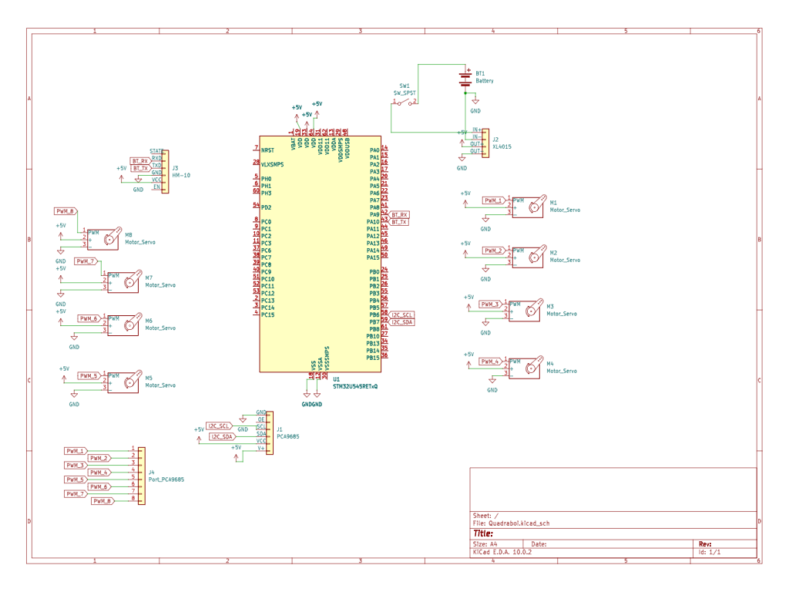

# Quadraped Robot
A bluetooth-controlled spider robot that can move around via 8 servos.

:::info

**Author**: Alexandru-Bogdan Gherghiceanu \
**GitHub Project Link**: https://github.com/UPB-PMRust-Students/acs-project-2026-alexgherghiceanu

:::

<!-- do not delete the \ after your name -->

## Description

This project is a bluetooth controlled spider robot that you can sync up to your phone/tablet. From your device you can control it's speed,direction of travel and issue it extra gestures and commands, such as a wave. 

## Motivation

From a young age, I have been interested in robots and the process of building them. Futhermore, I have been following the
progress of boston dynamics projects for a long time, so I knew that I wanted to build a quadraped robot myself. When I recently
watched the movie Project Hail Mary, I decided that a spider is the best shape for my project to take.

## Architecture

## Log

<!-- write your progress here every week -->
### Week 16 - 22 March

Decided on the project idea


### Week 13 - 19 April

Ordered the necessary hardware components.

### Week 20 - 26 April

All hardware components arrived. 

## Week 27 April - 3 May

Started writing the documentation and modifying the source chasis to fit my components.

### Week 5 - 11 May

### Week 12 - 18 May

### Week 19 - 25 May

## Hardware

The main brain of the project is the STM32 Nucleo-U545RE-Q microcontroller provided by the PM team. This takes the input from the HM-10 Bluetooth module and processes it into a signal the i2c controller can then give to the PCA9685 Servo Driver. From there, the signal is passed on to the 8 servomotors that power our robot spider, 2 in each leg. The system is powered by a 1000mAh 7.4v LiPo 2 cell batery and will be built on a modified version of the chasis of the Sesame spider-robot linked in the link section.   

### Schematics



### Bill of Materials

<!-- Fill out this table with all the hardware components that you might need.

The format is
```
| [Device](link://to/device) | This is used ... | [price](link://to/store) |

```

-->

| Device | Usage | Price |
|--------|--------|-------|
| [STM32 Nucleo-U545RE-Q](https://www.st.com/en/evaluation-tools/nucleo-u545re-q.html) | The microcontroller | [~120 RON]() |
| [Servomotor MG90S, angrenaje Aluminiu](https://sigmanortec.ro/servomotor-mg90s-angrenaje-aluminiu) | The servomotors, we will use 8 | [19,34 RON]() |
| [Modul PCA9685, interfata I2C, 16 CH, servo motor](https://sigmanortec.ro/Modul-PCA9685-interfata-I2C-16-CH-servo-motor-p126016016) | Used to interface the microcontroller and the servomotors | [27.27 RON]() |
| [Modul coborator tensiune XL4015, 8-36VDC, 5A, 75W](https://sigmanortec.ro/Modul-coborator-tensiune-XL4015-8-36VDC-5A-75W-p158483017) | Used to interface the microcontroller and the servomotors | [9,96 RON]() |
| [Intrerupator KCD-1, SPST, On/Off, 23mm](https://sigmanortec.ro/Modul-coborator-tensiune-XL4015-8-36VDC-5A-75W-p158483017) | Used to turn the robot on or off | [1,85 RON]() |
| [4.0 Bluetooth Module (3.3 V and 5 V Compatible)](https://www.optimusdigital.ro/en/wireless-bluetooth/862-modul-bluetooth-40-cu-adaptor-compatibil-33v-si-5v.html?search_query=4.0+Bluetooth+Module+%283.3+V+and+5+V+Compatible%29&results=21) | Used to connect from the phone to the robot | [29,99 RON]() |
| [Electrolytic Capacitor 1000 uF, 50 V](https://www.optimusdigital.ro/en/capacitors/3006-electrolytic-condensator-from-1000-uf-to-50-v.html?search_query=0104210000027129&results=1) | Used to store excess voltage | [1,49 RON]() |
| [0.25 W 1K Ω Resistor](https://www.optimusdigital.ro/en/resistors/848-025w-22k-resistor.html?search_query=0.25+W+1K+%CE%A9+Resistor&results=32) | Used to provide resistance in the circuit | [0,10 RON]() |
| [Undervoltage Battery Alarm Module](https://www.optimusdigital.ro/en/others/2237-alarma-scadere-tensiune-acumulatori.html?search_query=Undervoltage+Battery+Alarm+Module&results=1) | Used to signal when the battery is low | [7,99 RON]() |
| [Incarcator B3 20W 1.6A pentru Acumulatori 2S si 3S cu Echilibrare Celule](https://www.emag.ro/incarcator-b3-20w-1-6a-pentru-acumulatori-2s-si-3s-cu-echilibrare-celule-b3-20w-1600-2s3s/pd/DGCKNZ3BM/?ref=history-shopping_484971926_47538_1) | Used to charge the batery | [29,90 RON]() |
| [Baterie Gens Ace G-Tech Soaring 1000mAh 7.4V 30C 2S1P XT60](https://www.emag.ro/baterie-gens-ace-g-tech-soaring-1000mah-7-4v-30c-2s1p-xt60-kxg0060208/pd/D5RNQWMBM/?ref=history-shopping_484971926_36153_1) | Used to power the robot | [58,20 RON]() |
| [Set conectori electrici Amass XT60, 1 mama si 1 tata si 2 carcase](https://www.emag.ro/set-conectori-electrici-amass-xt60-1-mama-si-1-tata-si-2-carcase-amxt60/pd/DN37BB3BM/?ref=history-shopping_484971926_3410_1) | Used to connect the battery | [8,82 RON]() |
| [10 x Fire Dupont mama-mama 20cm](https://www.emag.ro/10-x-fire-dupont-mama-mama-20cm-ai307-s465/pd/D1J66JBBM/?ref=history-shopping_484971926_38837_1) | Used to connect different parts of the project | [2,67 RON]() |
| [40 x Fire Dupont mama-tata 20cm](https://www.emag.ro/40-x-fire-dupont-mama-tata-20cm-zcbozh-fdp-fm-40x20/pd/DRQD522BM/?ref=history-shopping_484971926_156063_1) | Used to connect different parts of the project | [19,72 RON]() |


## Software

| Library | Description | Usage |
|---------|-------------|-------|
| [st7789](https://github.com/almindor/st7789) | Display driver for ST7789 | Used for the display for the Pico Explorer Base |

## Links

<!-- Add a few links that inspired you and that you think you will use for your project -->

1. [Laboratoarele PM](https://embedded-rust-101.wyliodrin.com/docs/acs_cc/category/lab)
2. [Proiectul de inspiratie](https://www.doriantodd.com/sesame)
3. [Repository-ul Proiectului Sesame](https://github.com/dorianborian/sesame-robot/tree/main)
...
