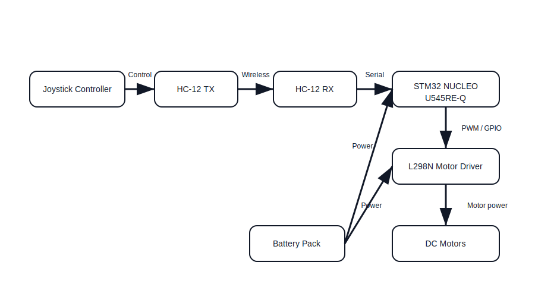

# RC Car

Remote controlled car using wireless serial communication.

:::info 

**Author**: Alex Mark Stan \
**GitHub Project Link**: https://github.com/UPB-PMRust-Students/acs-project-2026-MRK1717

:::

## Description

This project consists of building a remote-controlled car using wireless serial communication through the HC-12 module.

A joystick is used as input on the controller side, sending commands wirelessly to the car. The STM32 NUCLEO board receives these commands and controls the motors accordingly.

The system allows forward, backward, left, and right movement by controlling four DC motors through a motor driver.

## Motivation

I chose this project because it combines both hardware and software concepts, allowing me to learn about wireless communication, motor control, and processing analog inputs.

It is also a practical project that can be extended later with additional sensors or control features.

## Architecture 

The system is composed of two main parts:
- Controller side: joystick module and HC-12 transmitter
- Car side: HC-12 receiver, STM32 NUCLEO board, motor driver, DC motors, and battery pack

The joystick generates analog input values. These values are converted into movement commands and transmitted wirelessly through the HC-12 module. The STM32 receives the commands and sends control signals to the motor driver, which drives the DC motors.

## Log

### Week 20 - 24 April
Chose the project idea and analyzed the system architecture. Studied the components required for building the RC car, including the STM32 NUCLEO board, HC-12 module, and motor driver.

### Week 25 - 28 April
Researched communication between controller and car using the HC-12 module. Planned the hardware setup and started preparing the initial documentation.

## Hardware

STM32 NUCLEO-U545RE-Q board: Responsible for receiving commands and controlling the motors.

HC-12 Wireless Module: Used for wireless serial communication between the controller and the car.

Joystick Module: Used to generate movement commands based on user input.

L298N Motor Driver: Controls the speed and direction of the DC motors.

DC Motors: Provide physical movement for the car.

Battery Pack: Provides power for the car components.

### Schematics

TBD

### Bill of Materials

| Device | Usage | Price |
|--------|--------|-------|
| [STM32 Nucleo U545RE-Q](https://www.st.com/en/evaluation-tools/nucleo-u545re-q.html) | The microcontroller | [110 RON](https://ro.rsdelivers.com/product/stmicroelectronics/nucleo-u545re-q/stmicroelectronics-nucleo-u545re-q-stm32-nucleo/1899566) |
| [Chassis Kit](https://www.pololu.com/category/2/motors) | The base for the car | [48.40 RON](https://www.emag.ro/) |
| [HC-12 Wireless Module](https://components101.com/wireless/hc-12-wireless-module) | Used for wireless communication | [20 RON](https://www.emag.ro/) |
| [Joystick Module](https://components101.com/modules/joystick-module) | Used for user input control | [20 RON](https://www.emag.ro/) |
| [L298N Motor Driver](https://components101.com/modules/l298n-motor-driver-module) | Used to control the motors | [10.84 RON](https://www.emag.ro/) |
| [DC Motors](https://www.pololu.com/category/2/motors) | Used for movement | [4 x 15 RON](https://www.emag.ro/) |
| [Battery Pack](https://components101.com/batteries/18650-lithium-cell) | Power supply | [30 RON](https://www.emag.ro/) |

## Software

| Library | Description | Usage |
|---------|-------------|-------|
| [embassy-stm32](https://github.com/embassy-rs/embassy/tree/main/embassy-stm32) | Hardware interface | Used as the base library for controlling STM32 peripherals |
| [embassy-time](https://github.com/embassy-rs/embassy) | Timing utilities | Used for delays and timing control |
| [embedded-hal](https://github.com/rust-embedded/embedded-hal) | Hardware abstraction traits | Used for portable embedded hardware interfaces |

## Links

1. https://components101.com/wireless/hc-12-wireless-module
2. https://components101.com/modules/l298n-motor-driver-module
3. https://components101.com/modules/joystick-module
4. https://www.st.com/en/evaluation-tools/nucleo-u545re-q.html
5. https://github.com/embassy-rs/embassy