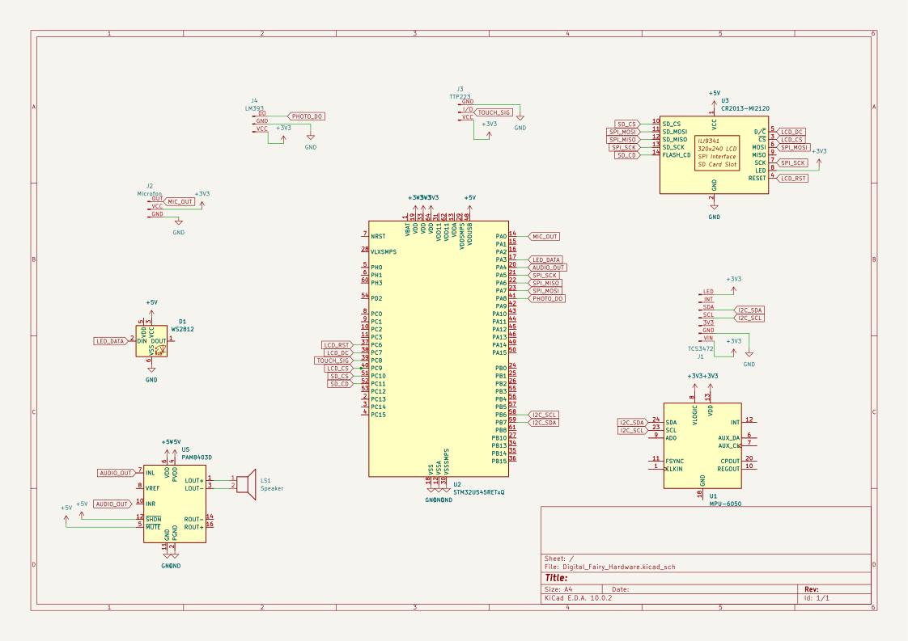

# Digital Fairy Companion
An embedded fairy companion that reacts to light, sound, touch, and color with animated expressions, synchronized audio, and mood-driven lighting.

:::info 

**Author**: Ciupitu Alexandra-Isabela\
**GitHub Project Link**: [link_to_github](https://github.com/UPB-PMRust-Students/acs-project-2026-SabeCiupi)

:::

<!-- do not delete the \ after your name -->

## Description

The Digital Fairy Companion functions as a reactive embedded system that translates environmental data into interactive emotional responses to simulate a sentient digital presence. By continuously monitoring real-time inputs from light, motion, sound, color sensors and by capacitive touch interaction, the system utilizes a complex Finite State Machine to manage over seventeen distinct behavioral states. These inputs are processed by an STM32 Nucleo microcontroller which autonomously coordinates visual animations on a 2.4-inch LCD, synchronized audio responses stored on a microSD card, and dynamic ambient lighting via RGB LEDs. In practice, the system adapts its persona based on environmental triggers, such as entering a sleep state in low light or initiating a productivity timer when specific colors are detected, providing a comprehensive multi-sensory user experience.

## Motivation

I chose this project because of a deep conviction that mood and mental well-being are fundamental pillars for personal growth and resilience in daily life. By merging the technical rigor of embedded systems with the whimsical charm of childhood nostalgia, I aimed to recreate the sense of magic that is often absent in standard modern technology. This project serves as a bridge between the complex mechanics of real-time sensor processing and the emotional human experience, providing a supportive companion that acknowledges and reacts to its user's environment. Ultimately, developing this system from the ground up allows me to explore how hardware and software can be harnessed not just for utility, but to foster a more mindful and enchanting atmosphere within a personal workspace.

## Architecture 

<!--Add here the schematics with the architecture of your project. Make sure to include:
 - what are the main components (architecture components, not hardware components)
 - how they connect with each other-->


### Components and Interconnection
The Digital Fairy Companion is structured into three primary functional modules that work in tandem to create an interactive experience:
* **Sensory Module**

  This layer is responsible for environmental data acquisition. It utilizes a TCS34725 for color identification, an MPU 6050 for motion and rhythm detection, a photoresistor for light intensity, an analog microphone for sound levels, and a TTP223 capacitive sensor for touch interaction. These sensors are connected to the central unit using a mix of I2C, SPI, and ADC interfaces.

* **Processing & Logic Module**

  At the core of the system sits the NUCLEO-U545RE-Q microcontroller, which implements a Finite State Machine (FSM) to manage over 17 distinct emotional states. It evaluates incoming sensor data to determine the appropriate behavior, such as switching from "Sleepy" to "Scared" based on sudden light and sound changes.

* **Feedback & Enclosure Module**

  The system produces outputs through a 2.4-inch ILI9341 LCD for pixel-art animations, a PAM8403 amplifier paired with a 1W speaker for audio, and WS2812 RGB LEDs for status-based lighting. The entire system is integrated into a thematic "Fairy House" enclosure, where the screen acts as a window and sensors are strategically hidden in decorative elements like an entrance flower or the roof.

### Data & Logic Flow
Data enters the system through various protocols: I2C for complex sensory modules (Color and IMU) and SPI for high-speed communication with the LCD and SD card. The microcontroller performs real-time analysis of these inputs to trigger state transitions. Once a state is identified, the MCU retrieves corresponding graphical frames and audio clips from the microSD card and updates the visual and auditory outputs simultaneously.

## Log

<!-- write your progress here every week -->
### Week 2 - 8 March
I choosed my project idea and I thought the details of the project.

### Week 13 - 19 April
I wrote the initial documentation.

### Week 5 - 11 May

This week, I focused on the hardware assembly of the project. I successfully soldered the components onto the pins using a soldering iron and solder, ensuring reliable electrical connections. Additionally, I purchased a speaker to complete the audio subsystem for the device.

### Week 12 - 18 May

### Week 19 - 25 May

## Hardware



Each component was selected to balance high performance with the low-power requirements of an always-on companion device:
* **Microcontroller (MCU)**

  The NUCLEO-U545RE-Q was chosen for its ultra-low-power capabilities and sufficient processing power to handle multiple serial protocols and complex FSM logic concurrently.

* **Display & Storage**

  The ILI9341 LCD module was selected for its vibrant color reproduction and integrated microSD slot, which simplifies the wiring for the SPI bus while providing ample storage for pixel-art assets.

* **Sensors**

  The TCS34725 provides superior color accuracy via I2C, while the MPU 6050 (GY-521) offers 3-axis precision for detecting physical interaction or "dizziness". The TTP223 capacitive touch sensor allows for a seamless "petting" interface without mechanical wear.

* **Audio Subsystem**

  To provide clear auditory feedback, the PAM8403 Class D amplifier is used to drive a compact 1W 8ohm speaker, delivering high-efficiency sound reproduction directly from the board's DAC.

* **Prototyping & Power**

  The system is assembled on an MB102 830-point breadboard using a combination of male-to-female and male-to-male jumper wires. Power is supplied through the USB connection of the Nucleo board, ensuring a stable 5V and 3.3V supply for all modules.

### Schematics

<!--Place your KiCAD or similar schematics here in SVG format.-->

### Bill of Materials

<!-- Fill out this table with all the hardware components that you might need.

The format is 
```
| [Device](link://to/device) | This is used ... | [price](link://to/store) |

```

-->

| Device | Usage | Price |
|--------|-------|-------|
| [ILI9341 2.4" LCD with Touch and SD Slot](https://www.bitmi.ro/ecran-lcd-ili9341-cu-touch-si-slot-pentru-card-sd-2-4-10797-bitmi-ro.html?gad_source=1&gad_campaignid=22990790771&gclid=Cj0KCQjwm6POBhCrARIsAIG58CI9J_OjbqLsP55WVXLVXK4t0tbIUI6HwqQBbrRAZelJB7tnRIu_BBwaAl8tEALw_wcB) | Display for pixel-art animations and SD card storage | [66,99 RON](https://www.bitmi.ro) |
| [TCS34725 Color Recognition Sensor](https://www.bitmi.ro/senzor-de-recunoastere-culorilor-tcs34725-11528.html?gad_source=1&gad_campaignid=21312430054&gclid=Cj0KCQjwm6POBhCrARIsAIG58CKA59ezjv7EMOcSnebIJfpuMzCeV7eYwOhPFfXKTtjKoG95O3QhUHIaAs4fEALw_wcB) | Detects ambient colors for state transitions | [19,99 RON](https://www.bitmi.ro) |
| [GY-521 MPU-6050 Gyroscope + Accelerometer](https://www.bitmi.ro/modul-giroscop-accelerometru-pe-3-axe-gy-521-11022.html?gad_source=1&gad_campaignid=22991722025&gclid=Cj0KCQjwm6POBhCrARIsAIG58CLV1czH8KcB0ugE427ynmQnYKl73YCqR8sPsFia3oSTV-r8sD_R5LIaAvUKEALw_wcB) | Motion and rhythm detection | [24,19 RON](https://www.bitmi.ro) |
| [PAM8403 Class D Audio Amplifier Module](https://www.bitmi.ro/modul-amplificator-audio-clasa-d-2x3w-dc-5v-pam8403-10764.html) | Drives the speaker for audio feedback | [5,99 RON](https://www.bitmi.ro) |
| [High Sensitivity Microphone Sound Sensor Module](https://www.bitmi.ro/modul-senzor-sunet-cu-microfon-sensibilitate-ridicata-iesire-analogica-11248.html?gad_source=1&gad_campaignid=21312430054&gclid=Cj0KCQjwm6POBhCrARIsAIG58CKOXY7KbNqWNDGkSCjvKiWgJLeFwFiP5H9MZ4EDyVmPl2ZfKPiSrCIaAh34EALw_wcB) | Detects ambient sound levels | [13,92 RON](https://www.bitmi.ro) |
| [WS2812 RGB5050 LED Module](https://www.bitmi.ro/modul-led-rgb5050-ws2812-10402.html) | Status-based ambient lighting | [3,99 RON](https://www.bitmi.ro) |
| [LM393 Photodiode Sensor Module](https://www.bitmi.ro/senzori-electronici/modul-senzor-cu-fotodioda-lm393-10524.html) | Detects ambient light intensity | [3,65 RON](https://www.bitmi.ro) |
| [TTP223 Capacitive Touch Sensor](https://www.bitmi.ro/senzor-touch-capacitiv-ttp223-10993.html?gad_source=1&gad_campaignid=22991722025&gclid=Cj0KCQjwm6POBhCrARIsAIG58CJL3fHTJQgAh4WWhmBka0jOd8Hln5wbZWOXjDbRidbKQH-Fw2FF9ZcaAlqQEALw_wcB) | Touch/petting interaction interface | [1,98 RON](https://www.bitmi.ro) |
| [MB102 830-Point Breadboard](https://www.bitmi.ro/componente-electronice/breadboard-830-puncte-mb-102-10500.html) | Prototyping platform | [13,99 RON](https://www.bitmi.ro) |
| [400-Point Breadboard](https://www.bitmi.ro/electronica/breadboard-400-puncte-pentru-montaje-electronice-rapide-10633.html) | Buttons platform | [6,99 RON](https://www.bitmi.ro) |
| [40x Dupont Wires Male-Female 20cm](https://www.bitmi.ro/electronica/40-x-fire-dupont-tata-mama-20cm-10512.html) | Connecting modules to microcontroller | [6,99 RON](https://www.bitmi.ro) |
| [40x Dupont Wires Male-Male 20cm](https://www.bitmi.ro/electronica/40-x-fire-dupont-tata-tata-20cm-10511.html) | Breadboard connections | [8,99 RON](https://www.bitmi.ro) |
| [40x Dupont Wires Female-Female 30cm](https://www.bitmi.ro/electronica/40-fire-dupont-mama-mama-30cm-10503.html) | Breadboard connections | [6,99 RON](https://www.bitmi.ro) |
| Mini Speaker 1W 8Ω | Audio output | 18 RON |
| MicroSD Card | Storing graphical frames and audio clips | ? RON |
| Tactile Push Button 6x6mm | Reset and color detection triggers | 0.65 RON x 3 |
| 1x40 Pin Header 2.54mm | Connecting PAM8403 to breadboard | 2 RON |
| NUCLEO-U545RE-Q | Main microcontroller running the FSM logic | - RON |


## Software
<!--
| Library | Description | Usage |
|---------|-------------|-------|
| [st7789](https://github.com/almindor/st7789) | Display driver for ST7789 | Used for the display for the Pico Explorer Base |
| [embedded-graphics](https://github.com/embedded-graphics/embedded-graphics) | 2D graphics library | Used for drawing to the display |
-->

## Links

<!-- Add a few links that inspired you and that you think you will use for your project -->

<!--1. [link](https://example.com)
2. [link](https://example3.com)
...-->
