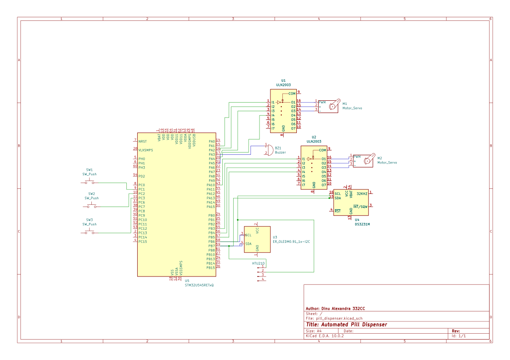

# Automated Pill Dispenser
A sensor-verified automatic medication dispenser with dual stepper motor carousel and shutter mechanism.

info 
**Author**: Dinu Alexandra \
**GitHub Project Link**: [GitHub Repository](https://github.com/UPB-PMRust-Students/acs-project-2026-alexandraioana3)

## Description

The device dispenses pills from a 7-day rotating carousel according to a preset schedule. A stepper motor rotates the pill box to the correct day, while a second stepper motor controls a shutter disc that opens to release pills by gravity. An IR sensor confirms dispensing, a Hall sensor verifies carousel position, an ultrasonic sensor detects user proximity, and a temperature/humidity sensor monitors storage conditions. The user sets schedules via 3 buttons and an OLED display. A servo motor locks the lid to prevent unauthorized access. All dispensing events are logged to a MicroSD card.

## Motivation

Elderly people and patients with complex treatments frequently forget to take their medication on time. Commercial automated dispensers are expensive and often lack verification mechanisms. This project provides an affordable solution that verifies every step of the dispensing process through multiple sensors, monitors storage conditions, and alerts the user through audio and visual feedback — all without requiring internet connectivity.

## Architecture 

The system has three main subsystems connected to the STM32 Nucleo-U545RE-Q:

- **Sensor subsystem** — 4 sensors provide feedback: Hall effect (KY-035, ADC) for carousel homing, IR obstacle sensor (GPIO) for pill detection, HTU21D (I2C) for temperature and humidity, HC-SR04P (GPIO) for user proximity detection.
- **Actuator subsystem** — 3 actuators control dispensing: Stepper motor 1 + ULN2003 (GPIO×4) rotates the carousel, Stepper motor 2 + ULN2003 (GPIO×4) controls the shutter disc, Servo SG90 (PWM) locks/unlocks the lid.
- **Interface subsystem** — OLED SSD1306 display (I2C), DS3231 RTC (I2C) for scheduling, MicroSD card module (SPI) for event logging, active buzzer (PWM) for alarms, 3 push buttons (GPIO) for menu navigation.

All I2C devices (OLED, DS3231, HTU21D) share the same bus on PB6/PB7 with 4.7kΩ pull-up resistors. Communication protocols used: I2C, SPI, GPIO, PWM, ADC.

## Log

### Week 5 - 11 May

### Week 12 - 18 May

### Week 19 - 25 May

## Hardware

The mechanical assembly uses a commercially available 7-day round pill box mounted upside-down on the first stepper motor's shaft. The compartments face downward onto a fixed base plate. A second stepper motor drives a shutter disc beneath the base — when the shutter hole aligns with the active compartment, pills fall through by gravity into a collection tray. A neodymium magnet glued to the carousel triggers the Hall sensor once per revolution for position calibration. The IR sensor at the dispensing window confirms that pills actually fell through. The entire assembly sits inside a box enclosure containing the breadboard, STM32 Nucleo, battery holder, and all electronics.

### Schematics

### Bill of Materials

| Device | Usage | Price |
|--------|--------|-------|
| [STM32 Nucleo-U545RE-Q](https://www.st.com/en/evaluation-tools/nucleo-u545re-q.html) | The microcontroller | Provided by university |
| [OLED Display 0.96" SSD1306 I2C](https://sigmanortec.ro/en/oled-display-096-i2c-iic-blue) | Displays schedule, status, alerts | [16.96 RON](https://sigmanortec.ro/en/oled-display-096-i2c-iic-blue) |
| [DS3231 RTC Module](https://sigmanortec.ro/en/precision-real-time-module-rtc-ds3231-with-battery-33-5v) | Real-time clock for dose scheduling | [17.98 RON](https://sigmanortec.ro/en/precision-real-time-module-rtc-ds3231-with-battery-33-5v) |
| [HTU21D Temp & Humidity Sensor](https://sigmanortec.ro/en/temperature-and-humidity-sensor-htu21d-i2c-15-36v) | Monitors medication storage conditions | [17.22 RON](https://sigmanortec.ro/en/temperature-and-humidity-sensor-htu21d-i2c-15-36v) |
| [Hall Sensor KY-035](https://sigmanortec.ro/en/senzor-hall-analog-magnetic-ky-035-5v) | Carousel homing and position verification | [4.15 RON](https://sigmanortec.ro/en/senzor-hall-analog-magnetic-ky-035-5v) |
| [IR Obstacle Sensor](https://sigmanortec.ro/en/ir-obstacle-sensor-33-5v) | Detects pills falling through dispensing window | [3.12 RON](https://sigmanortec.ro/en/ir-obstacle-sensor-33-5v) |
| [HC-SR04P Ultrasonic Sensor](https://sigmanortec.ro/en/ultrasonic-sensor-hc-sr-04p-3-55v) | Detects user proximity for display wake-up | [10.14 RON](https://sigmanortec.ro/en/ultrasonic-sensor-hc-sr-04p-3-55v) |
| [28BYJ-48 Stepper Motor](https://sigmanortec.ro/en/stepper-motor-5v-28byj48-with-reducer) ×2 | Rotates carousel and shutter disc | [20.58 RON](https://sigmanortec.ro/en/stepper-motor-5v-28byj48-with-reducer) |
| [ULN2003 Driver Module](https://sigmanortec.ro/en/stepper-motor-driver-module-4-phases-uln2003-5-12v) ×2 | Drives the stepper motors | [9.94 RON](https://sigmanortec.ro/en/stepper-motor-driver-module-4-phases-uln2003-5-12v) |
| [SG90 Servo Motor 180°](https://sigmanortec.ro/en/servo-motor-sg90-with-limiter) | Locks/unlocks the lid | [9.49 RON](https://sigmanortec.ro/en/servo-motor-sg90-with-limiter) |
| [Active Buzzer 5V](https://sigmanortec.ro/en/active-buzzer-5v) ×2 | Audible alarm for dose reminders | [2.22 RON](https://sigmanortec.ro/en/active-buzzer-5v) |
| [Mini Button 6×6×5mm](https://sigmanortec.ro/en/mini-button-6x6x5-4-pins) ×4 | Menu / Up / Down navigation | [1.44 RON](https://sigmanortec.ro/en/mini-button-6x6x5-4-pins) |
| [MicroSD Card Module SPI](https://www.optimusdigital.ro/ro/memorii/1516-modul-slot-card-microsd.html) | Logs dispensing events in CSV format | [~7.00 RON](https://www.optimusdigital.ro/ro/memorii/1516-modul-slot-card-microsd.html) |
| [Breadboard MB102 830pts](https://sigmanortec.ro/en/breadboard-mb102-830-puncte-transparent) | Prototyping platform | [16.66 RON](https://sigmanortec.ro/en/breadboard-mb102-830-puncte-transparent) |
| [Breadboard Power Supply](https://sigmanortec.ro/en/sursa-alimentare-33v-si-5v-pentru-breadboard) | Regulates power to 3.3V and 5V rails | [6.69 RON](https://sigmanortec.ro/en/sursa-alimentare-33v-si-5v-pentru-breadboard) |
| [4×AA Battery Holder](https://sigmanortec.ro/en/suport-baterii-aa-4aa-cu-capac-si-intrerupator) | Power source (6V) | [6.34 RON](https://sigmanortec.ro/en/suport-baterii-aa-4aa-cu-capac-si-intrerupator) |
| [Varta AA Batteries ×8](https://www.emag.ro/baterii-alcaline-varta-helps-longlife-power-aa-6-2-buc-4906121428/pd/DRFZL2MBM/) | Powers the system | [13.18 RON](https://www.emag.ro/baterii-alcaline-varta-helps-longlife-power-aa-6-2-buc-4906121428/pd/DRFZL2MBM/) |
| [TP4056 Charging Module](https://sigmanortec.ro/en/lithium-battery-charging-module-tp4056-typec-5v-1a-with-protection) | Optional LiPo charging | [4.72 RON](https://sigmanortec.ro/en/lithium-battery-charging-module-tp4056-typec-5v-1a-with-protection) |
| [Resistor Kit 600pcs](https://sigmanortec.ro/en/resistors-kit-30-values-600-pieces-1-4w-10r-1m) | Pull-up resistors for I2C, button pull-downs | [15.16 RON](https://sigmanortec.ro/en/resistors-kit-30-values-600-pieces-1-4w-10r-1m) |
| [Dupont Wires MM 30cm ×40](https://sigmanortec.ro/en/40-fire-dupont-30cm-tata-tata) | Breadboard connections | [8.39 RON](https://sigmanortec.ro/en/40-fire-dupont-30cm-tata-tata) |
| [Dupont Wires FM 10cm ×40](https://sigmanortec.ro/en/40-fire-dupont-10cm-tata-mama) | Module-to-breadboard connections | [7.73 RON](https://sigmanortec.ro/en/40-fire-dupont-10cm-tata-mama) |
| [Dupont Wires FF 30cm ×40](https://sigmanortec.ro/en/40-fire-dupont-30cm-mama-mama) | Module-to-module connections | [7.59 RON](https://sigmanortec.ro/en/40-fire-dupont-30cm-mama-mama) |
| [Neodymium Magnets 5×2mm ×20](https://www.emag.ro/set-magneti-rotunzi-puternici-neodim-5x2-mm-argintii-20-buc-ebn2481/pd/D2R1YT3BM/) | Position marker on carousel for Hall sensor | [24.16 RON](https://www.emag.ro/set-magneti-rotunzi-puternici-neodim-5x2-mm-argintii-20-buc-ebn2481/pd/D2R1YT3BM/) |
| 7-Day Round Pill Box | Carousel body (7 wedge compartments) | 3.81 RON |

## Software

| Library | Description | Usage |
|---------|-------------|-------|
| [embassy-stm32](https://github.com/embassy-rs/embassy) | HAL and async runtime for STM32 | GPIO, I2C, SPI, PWM, ADC peripheral access |
| [embassy-executor](https://github.com/embassy-rs/embassy) | Async task executor | Runs 6 concurrent tasks: scheduler, motor control, sensors, display, proximity, logging |
| [embassy-time](https://github.com/embassy-rs/embassy) | Async timers and delays | Non-blocking delays for stepper stepping, sensor polling, alarm timeouts |
| [ssd1306](https://github.com/jamwaffles/ssd1306) | OLED display driver | Renders schedule, status pages, and alerts on the 0.96" I2C display |
| [ds323x](https://github.com/eldruin/ds323x-rs) | DS3231 RTC driver | Reads current time, sets alarm times for dose scheduling |
| [embedded-sdmmc](https://github.com/rust-embedded-community/embedded-sdmmc-rs) | SD card FAT32 filesystem driver | Writes timestamped dispensing events to CSV files via SPI |
| [embedded-hal](https://github.com/rust-embedded/embedded-hal) | Hardware abstraction layer | Standardized interfaces for GPIO, I2C, SPI, ADC peripherals |
| [defmt](https://github.com/knurling-rs/defmt) + [defmt-rtt](https://github.com/knurling-rs/defmt) | Logging framework | Structured debug logging via RTT during development |
| [panic-probe](https://github.com/knurling-rs/probe-run) | Panic handler | Prints panic info and backtraces via RTT probe |

## Links

1. [Embassy-rs — Async framework for embedded Rust](https://github.com/embassy-rs/embassy)
2. [SSD1306 OLED driver crate](https://crates.io/crates/ssd1306)
3. [DS323x RTC driver crate](https://crates.io/crates/ds323x)
4. [Embedded SDMMC crate](https://crates.io/crates/embedded-sdmmc)
5. [PM Rust Course — Lab 01](https://pmrust.pages.upb.ro/docs/acs_cc/lab/01)
6. [PM Rust Course — Lab 02](https://pmrust.pages.upb.ro/docs/acs_cc/lab/02)
7. [PM Rust Course — Lab 03](https://pmrust.pages.upb.ro/docs/acs_cc/lab/03)
8. [28BYJ-48 Stepper Motor Datasheet](https://components101.com/motors/28byj-48-stepper-motor)
9. [HTU21D Sensor Datasheet](https://www.te.com/commerce/DocumentDelivery/DDEController?Action=showdoc&DocId=Data+Sheet%7FHPC199_6%7FA6%7Fpdf%7FEnglish%7FENG_DS_HPC199_6_A6.pdf%7FCAT-HSC0004)
