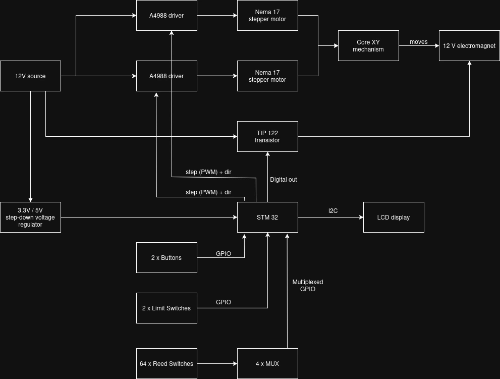
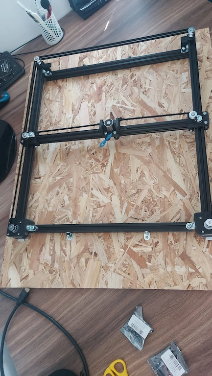

# Automated Chessboard
A fully automated chess system featuring a CoreXY magnetic mechanism for autonomous piece movement.

:::info 

Author: Babacea Alexandru \
GitHub Project Link: https://github.com/UPB-PMRust-Students/acs-project-2026-AlexandruBabacea-student

:::

## Description

The Automated Chessboard project involves the development of a fully automated chess system that allows both human-versus-human gameplay (with move validation) and human-versus-AI gameplay. 

The core innovation and complexity lie in the hidden mechanism that moves the pieces autonomously. This utilizes a CoreXY rail system positioned beneath the playing surface. This allows an electromagnet to navigate under the board and drag the magnetic chess pieces to their new positions. The detection of piece locations on the board is achieved through an 8x8 matrix of 64 magnetic sensors.

## Motivation

This project was undertaken to integrate complex mechanical design with embedded software and artificial intelligence. The goal is to demonstrate how embedded Rust can be used to manage precise motor control (CoreXY kinematics), high-density sensor arrays and algorithmic decision-making in a real-time, physical interactive system.

## Architecture 

The system architecture comprises the following modules:
- Processing Module: An STM32 microcontroller serves as the central processing unit, running both the game logic (chess engine) and the motion logic (step generation).
- Actuation Module: Controls the physical movement using two Nema 17 stepper motors and a powerful electromagnet.
- Detection Module: A grid of 64 magnetic Reed sensors read via external multiplexers, compensating for the limited GPIO pins on the microcontroller.

## Log

### Weeks March 16th - March 29th
Researched and finalized the bill of materials. Placed orders for the necessary electronic and mechanical components. Initiated the 3D printing process for the custom magnetic chess pieces.

### Weeks March 30th - April 12th
Prepared the physical structure by cutting the V-slot aluminum profiles and the OSB base panel. Successfully assembled the main outer frame of the chessboard and completed the 3D printing of the structural parts.

### Weeks April 13th - April 26th
Installed the CoreXY mechanical drive system, including pulleys, timing belts, and the Nema 17 stepper motors. Developed and executed the initial test scripts to validate motor movement and control via the A4988 drivers.

## Hardware

The hardware setup includes an STM32 microcontroller, 64 magnetic Reed sensors for piece detection, two Nema 17 stepper motors for the CoreXY movement and a 12V electromagnet to physically drag the pieces.

### Schematics

### Photo

### Bill of Materials

| Device | Usage | Price | Link |
|--------|--------|-------| ------ |
| STM32 Microcontroller | Main processing unit | 121 RON | [Link](https://ardushop.ro/ro/plci-de-dezvoltare/2411-stmicroelectronics-nucleo-g0b1re-6427854012296.html?gad_source=1&gad_campaignid=17003133061&gclid=Cj0KCQjwkrzPBhCqARIsAJN460mPAlJ6u6wInd95khH3RsV0L5u3VJBf06mP8uxdrzOwLBNtfjXcb6QaAlCFEALw_wcB)
| Nema 17 Stepper Motor | CoreXY movement | 2 x 67 RON | [Link](https://sigmanortec.ro/Nema17-1-5A-p125805542)
| A4988 Stepper Driver | Motor control | 2 x 8 RON | [Link](https://www.optimusdigital.ro/en/stepper-motor-drivers/866-driver-pentru-motoare-pas-cu-pas-a4988-rosu.html?search_query=A4988&results=8)
| 12V Electromagnet (5kg) | Moving the chess pieces | 7.51 EURO | [Link](https://ampul.eu/ro/electromagnei-adezivi/3826-1623-electromagnet-5kg-50n-25x20mm?utm_source=google&utm_medium=cpc&gad_source=1&gad_campaignid=17339270587&gclid=Cj0KCQjwkrzPBhCqARIsAJN460kEl4_91gEkpgTrI4AhOqYvAlbM5sYt642dCYwF1qAknT5J9WZYmxoaAss2EALw_wcB#/tensiune-3_v_dc)
| TIP122 Transistor + Diode | Electromagnet control | 5 RON | - |
| Reed Sensor | Piece detection matrix | 64 x 1.86 RON | [Link](https://sigmanortec.ro/en/magnetic-reed-switch-n-o)
| CD74HC4067 Multiplexer | Sensor matrix reading | 4 x 4.76 RON | [Link](https://sigmanortec.ro/Modul-multiplexor-16-canale-p126258652)
| LCD Display | User interface | 12 RON | [Link](https://sigmanortec.ro/LCD-1602-p125700685)
| Endstop limit switch | Axis calibration (homing) | 2 x 5.23 RON | [Link](https://sigmanortec.ro/Endstop-mecanic-SS-5GL2-p136284192)
| Push button | UI control | 2 x 1.33 ron | [Link](https://sigmanortec.ro/en/button-12x12x73)
| V-slot profiles and belts | Mechanical frame | 5 x 24.79 RON | [Link](https://www.emag.ro/profil-aluminiu-v-slot-20x20-50cm-negru-pentru-constructii-3d-5905832546328/pd/DBP10N3BM/?cmpid=146733&utm_source=google&utm_medium=cpc&utm_content=79559759954&utm_campaign=(RO:Whoop!)_3P-Y_%3e_Utilaje_si_materiale_de_constructii_order_test&gad_source=1&gad_campaignid=2078923426&gclid=Cj0KCQjwkrzPBhCqARIsAJN460lV6vih-NN5hh__M_T-HASOowbW36AljFTTpLsIYPJTcgxXrF2SGokaAhDlEALw_wcB)
| Mini V wheels | Smooth movement along the axes | 93,68 RON | [Link](https://www.emag.ro/set-de-role-kit-de-roti-mini-v-hw1214wk/pd/DQBXRGMBM/?cmpid=146055&utm_source=google&utm_medium=cpc&utm_campaign=(RO:eMAG!)_3P_NO_SALES_%3e_Imprimante,_scanere_and_consumabile&utm_content=85337494034&gad_source=1&gad_campaignid=7971894862&gclid=Cj0KCQjwkrzPBhCqARIsAJN460kJ9blGKkHQRf67tIr1FPX4YvTQLGhOdl1p8ifyoAWFnInp7YoXALoaAifsEALw_wcB)
| Neodymium magnets | Inside the chess pieces | 37.92 RON | [Link](https://www.emag.ro/set-50-magneti-neodim-universali-diverse-activitati-8x2-mm-rotund-argintiu-dactylionr-dactylion-10142/pd/D26HTPYBM/?ref=ohs_buy_again_481488949)

## Software

| Library | Description | Usage |
|---------|-------------|-------|
| embassy-rs | Asynchronous framework | Efficient task management and hardware abstraction |
| embassy-stm32 | HAL for STM32 | Controlling PWM for steppers and GPIO for sensors |
| defmt | Logging framework | Real-time debugging and telemetry |

## Links

1. [Automated Chessboard by Greg06 (Instructables)](https://www.instructables.com/Automated-Chessboard/?fbclid=PAVERTVgQkc31leHRuA2FlbQIxMABzcnRjBmFwcF9pZA81NjcwNjczNDMzNTI0MjcAAaf3d5kjWfOXYe6eTNwDwONbe9yrm8rgNCHcAq2UOxQGzEu7HfhKyTgcw8Q93w_aem_8qWs7lUFjMI_7Cdr_kOIEA)
2. [CoreXY Kinematics Theory](https://corexy.com/theory.html)