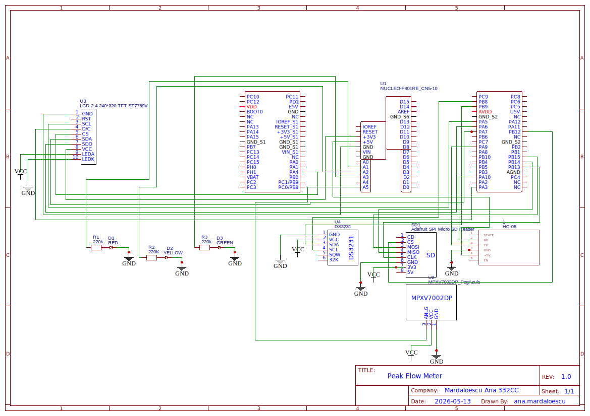

# Portable Peak Flow Meter with Asthma Journal
A portable medical device that measures lung function and tracks asthma evolution over time.

:::info 

**Author**: Mardaloescu Ana \
**GitHub Project Link**: [UPB-PMRust-Students/acs-project-2026-anamardaloescu2802](https://github.com/UPB-PMRust-Students/acs-project-2026-anamardaloescu2802)

:::

<!-- do not delete the \ after your name -->

## Description

A handheld peak flow meter built around the STM32U545 microcontroller that measures PEF (Peak Expiratory Flow) and FEV1 by analyzing differential pressure generated when the user exhales forcefully into a calibrated tube. Results are displayed in real time as a waveform graph on a 2.4" touchscreen TFT display, compared against the user's personal best and color-coded via an RGB LED, timestamped using a DS3231 real-time clock module, logged to a microSD card, and transmitted via Bluetooth to a mobile device for long-term trend visualization.

## Motivation

What motivated me specifically to chose this project was the gap between what exists and what patients actually need. Clinical spirometers are accurate but expensive and confined to hospitals. Cheap plastic peak flow meters give a single number with no history and no connectivity. I wanted to design something in between: a portable device that logs every measurement with an accurate timestamp, visualizes trends over time, and lets the patient share real data with their doctor at the next appointment instead of trying to describe how they have been feeling from memory.

## Architecture 

- **Pressure sensor** (**MPXV7002DP**) measures the pressure difference generated when the user exhales through a **PVC tube** with a **calibrated 6mm orifice**. The output voltage is stepped down from **5V to 3.3V** via a **resistive voltage divider** before reaching the microcontroller.

- **STM32U545** samples the sensor at **~1kHz**, applies **Bernoulli's equation** to convert pressure into airflow **(L/min)**, detects the **PEF peak**, and computes **FEV1** by numerically integrating the **first second** of the flow curve.

- **TFT touchscreen** displays the **exhalation waveform** in real time and shows the final **PEF** and **FEV1** values at the end of each measurement. It also handles all **user input**, replacing physical buttons entirely.

- **RGB LED** provides an immediate **visual zone indicator** — **green**, **yellow**, or **red** — based on how the current **PEF** compares to the user's stored **personal best**.

- **MicroSD card** logs every measurement as a **timestamped CSV entry**, with accurate date and time provided by the **DS3231** real-time clock module.

- **Bluetooth module** transmits measurement data wirelessly to an **Android device** for **long-term trend visualization**.


## Log

<!-- write your progress here every week -->

### Week 5 - 11 May
Defined the concept of a portable respiratory monitoring device (peak flow meter).
Chosen STM32 as the main microcontroller.
Outlined system architecture and main hardware components.

### Week 12 - 18 May
Selected main hardware components: pressure sensor, TFT display, RTC, microSD, Bluetooth module.
Designed initial schematic and defined communication interfaces (SPI, I2C, UART, ADC).
Completed STM32 pin mapping.
Finalized system architecture and data flow (sensing, processing, display, logging, communication).
Prepared system for firmware implementation and hardware testing.

### Week 19 - 25 May

## Hardware

- The heart of the device is the STM32U545 microcontroller, which handles all ADC sampling, signal processing, display rendering, and peripheral communication.
- The MPXV7002DP differential pressure sensor is the most critical component — it measures the pressure drop across a 6mm calibrated orifice in the exhalation tube and converts it into a voltage that the STM32 reads through a resistive voltage divider, since the sensor outputs up to 5V while the STM32 ADC accepts a maximum of 3.3V.
- The 2.4 inch TFT shield combines the ILI9341 display and an XPT2046 resistive touchscreen controller on a single board, handling both waveform visualization and all user input without the need for physical buttons.
- The microSD module connects over the same SPI bus as the display using a dedicated chip select line and stores every measurement as a CSV file.
- The DS3231 real-time clock module communicates over I2C and ensures every log entry carries an accurate date and time even after the device is powered off and back on.
- The Bluetooth module handles wireless data transfer to an Android phone over a USART serial link.
- The RGB LED is driven directly from three GPIO pins through current-limiting resistors and lights up green, yellow, or red depending on how the current measurement compares to the stored personal best.

### Schematics




### Bill of Materials

<!-- Fill out this table with all the hardware components that you might need.

The format is 
```
| [Device](link://to/device) | This is used ... | [price](link://to/store) |

```

-->

| Device | Usage | Price |
|--------|--------|-------|
| STM32U545 Development Board | Main microcontroller | - |
| [MPXV7002DP Pressure Sensor Module](https://www.optimusdigital.ro/ro/senzori-senzori-de-presiune/1163-modul-senzor-de-presiune-mpxv7002dp.html) | Differential pressure measurement | 279.00 RON |
| [DS3231 Real Time Clock Module](https://www.optimusdigital.ro/ro/altele/12432-modul-cu-ceas-in-timp-real-ds3231-fara-baterie.html) | Accurate timestamping for CSV log | 15.98 RON |
| [Assorted LED Kit 310pcs + Resistors](https://www.optimusdigital.ro/ro/kituri-optimus-digital/9517-set-de-led-uri-asortate-de-5-mm-si-3-mm-310-buc-cu-rezistoare-bonus.html) | RGB LED indicator + current limiting resistors + voltage divider resistors | 26.99 RON |
| [Bluetooth 4.0 Module with Adapter](https://www.optimusdigital.ro/ro/wireless-bluetooth/635-modul-cu-bluetooth-40-si-adaptor-compatibil-33v-si-5v.html) | Wireless data transmission to Android phone | 29.99 RON |
| [4x Breadboard Combo SYB-500](https://www.optimusdigital.ro/ro/kituri/12463-set-4-breadboard-uri-combo-syb-500.html) | Prototyping | 49.99 RON |
| [2.4" TFT Touchscreen Shield](https://www.optimusdigital.ro/ro/lcd-uri/3544-shield-cu-display-tft-cu-touchscreen-de-24.html) | Real-time waveform display and touch menu navigation | 65.44 RON |
| [MicroSD Card Slot Module](https://www.optimusdigital.ro/ro/memorii/1516-modul-slot-card-compatibil-cu-microsd.html) | CSV measurement logging | 4.39 RON |
| [Jumper Wires M-M 20cm (x10)](https://www.optimusdigital.ro/ro/fire-fire-cu-mufe/880-set-10-fire-colorate-separate-tata-tata-de-20-cm.html) | Breadboard connections | 5.95 RON |
| [Jumper Wires F-M 20cm (x10)](https://www.optimusdigital.ro/ro/fire-fire-cu-mufe/879-fire-colorate-mama-tata-10p-20-cm.html) | Breadboard connections | 15.96 RON |
| [Jumper Wires F-F 20cm (x10)](https://www.optimusdigital.ro/ro/fire-fire-cu-mufe/881-set-10-fire-colorate-separate-mama-mama-de-20-cm.html) | Breadboard connections | 9.90 RON |
| [100nF Capacitors](https://www.optimusdigital.ro/ro/componente-electronice-condensatoare/27-capacitor-100nf50-pcs-set.html) | Sensor power supply decoupling | ~5 RON |
| PVC tube 20mm + silicone tubing | Exhalation channel and sensor port connection | ~10 RON |

**Total: 519 RON**

## Software

| Library | Description | Usage |
|---------|-------------|-------|
| [st7789](https://github.com/almindor/st7789) | Display driver for ST7789 | Used for the display for the Pico Explorer Base |
| [embedded-graphics](https://github.com/embedded-graphics/embedded-graphics) | 2D graphics library | Used for drawing to the display |

## Links

<!-- Add a few links that inspired you and that you think you will use for your project -->

1. [MPXV7002DP Datasheet - NXP](https://www.nxp.com/docs/en/data-sheet/MPXV7002.pdf)
2. [How a peak flow meter works - Asthma UK](https://www.asthma.org.uk/advice/manage-your-asthma/peak-flow/)
3.  [Bernoulli equation for flow measurement](https://www.engineeringtoolbox.com/bernoulli-equation-d_183.html)