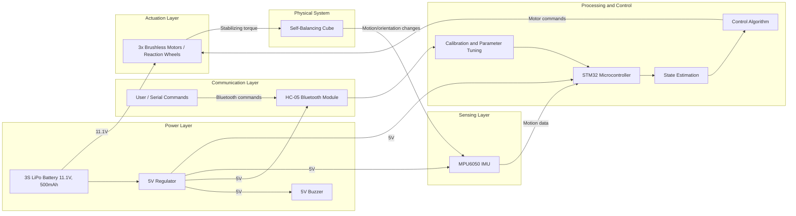
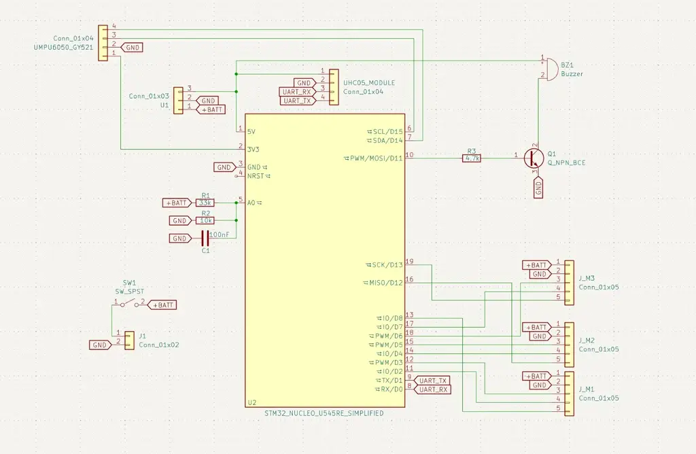

# Self-Balancing Cube

A self-balancing cube controlled by an STM32 microcontroller, using IMU feedback and internal reaction wheels to balance on an edge or corner.

:::info

**Author**: Ana-Maria-Raluca Lupu \
**GitHub Project Link**: [acs-project-2026-lupuana](https://github.com/UPB-PMRust-Students/acs-project-2026-lupuana)

:::

<!-- do not delete the \ after your name -->

## Description

This project implements a self-balancing cube based on reaction-wheel control. The system reads motion and orientation data from an IMU sensor, estimates the cube state, and computes corrective motor commands in real time. Three internal motors spin reaction wheels to generate stabilizing torques, allowing the cube to recover balance and remain upright on an edge or corner.

## Motivation

I chose this project because it combines embedded programming, control systems, electronics, mechanical design, and real-time testing in a single system. It is a good practical challenge because it requires both hardware integration and software development, especially sensor processing, feedback control, and actuator coordination on an STM32 platform.

## Architecture

The main architecture components of the project are:

- **Sensing layer**  
  Reads acceleration and angular velocity data from the IMU.

- **State estimation layer**  
  Processes raw IMU data and computes the current orientation and angular motion of the cube.

- **Control layer**  
  Runs the balancing algorithm and computes correction values for each axis.

- **Actuation layer**  
  Sends control signals to the three reaction-wheel motors.

- **Communication and tuning layer**  
  Allows calibration and parameter adjustment through a Bluetooth serial connection.

- **Power layer**  
  Supplies the motors directly from the battery and powers the logic through a regulated 5V rail.

### Architecture Diagram

## Log

### Week 14 - 29 April

- Finalized project theme and received approval.
- Researched and ordered components.

### Week 4 - 10 May

- Components arrived

### Week 11 - 17 May

- Tested components separately
- Started assembling the project

## Hardware

The hardware platform is built around an STM32 microcontroller, an MPU6050 IMU for motion sensing, three brushless motors with encoders for the reaction wheels, a 3S LiPo battery for power, a 5V regulator for the logic section, a Bluetooth module for tuning, and a buzzer for status feedback.

## Schematics

## Bill of Materials

| Device | Usage | Price | Link |
|---|---|---:|---|
| Dupont wire kit | Prototyping and signal wiring | 24.39 RON | [AliExpress](https://www.aliexpress.com/item/4000203371860.html?spm=a2g0o.order_list.order_list_main.5.b7a61802PaQuli) |
| 2x MPU6050 GY-521 | IMU sensing | 48.84 RON | [AliExpress](https://www.aliexpress.com/item/1005008796700745.html?spm=a2g0o.order_list.order_list_main.11.b7a61802PaQuli) |
| 3x Nidec 24H brushless servo motors | Reaction-wheel actuation | 138.57 RON | [AliExpress](https://www.aliexpress.com/item/1005005779471604.html?spm=a2g0o.order_list.order_list_main.17.b7a61802PaQuli) |
| HC-05 Bluetooth module | Wireless tuning and calibration | 24.35 RON | [AliExpress](https://www.aliexpress.com/item/32582656795.html?spm=a2g0o.order_list.order_list_main.23.b7a61802PaQuli) |
| 3S LiPo 11.1V 500mAh battery | Main power source | 85.33 RON | [AliExpress](https://www.aliexpress.com/item/1005006702079264.html?spm=a2g0o.order_list.order_list_main.29.b7a61802PaQuli) |
| Active 5V buzzer | Audio feedback / status signal | 15.72 RON | [AliExpress](https://www.aliexpress.com/item/1005010321957502.html?spm=a2g0o.order_list.order_list_main.35.b7a61802PaQuli) |
| LM7805 5V regulator module | Logic power regulation | 16.72 RON | [AliExpress](https://www.aliexpress.com/item/1005005382976127.html?spm=a2g0o.order_list.order_list_main.41.b7a61802PaQuli) |
| 3S LiPo balance charger | Battery charging | 28.24 RON | [AliExpress](https://www.aliexpress.com/item/1005007620618797.html?spm=a2g0o.order_list.order_list_main.47.b7a61802PaQuli) |
| ON/OFF switch | Main power control | 21.29 RON | [AliExpress](https://www.aliexpress.com/item/1005009232308550.html?spm=a2g0o.order_list.order_list_main.53.b7a61802PaQuli) |

## Software
