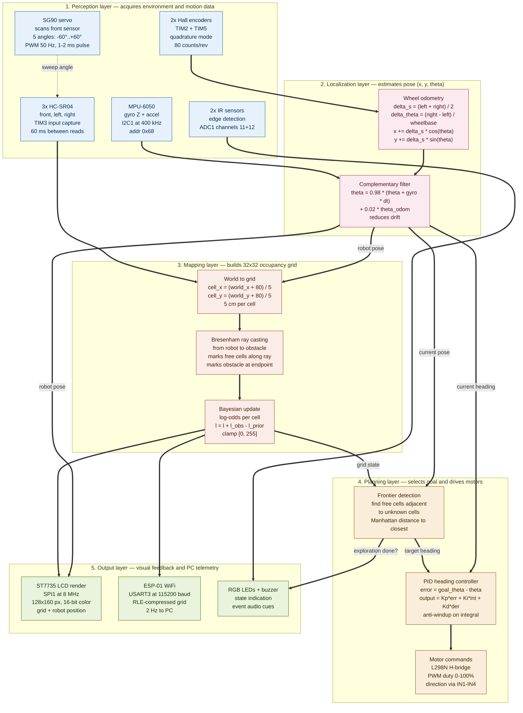

# AutoNav
Autonomous Robot with Mapping and Simplified SLAM

:::info

**Author**: Anca Stefania Maxim \
**GitHub Project Link**: https://github.com/UPB-PMRust-Students/acs-project-2026-ancamaxim

:::

## Description

AutoNav is an autonomous mobile robot that explores an unknown space, builds a 2D obstacle map in real time, and makes navigation decisions independently — without human intervention. The project implements a simplified SLAM (Simultaneous Localization and Mapping) system, adapted to the hardware constraints of an STM32 microcontroller.

The robot uses three ultrasonic sensors and a scanning servo to detect surrounding obstacles, wheel encoders for odometry, and an IMU for heading error correction. From this data, it builds a probabilistic occupancy grid — a 2D map where each cell has an associated probability of containing an obstacle.

The map is displayed live on a color LCD mounted on the robot, updated at 10Hz. Simultaneously, data is transmitted wirelessly via ESP8266 to a PC, where it can be visualized in real time through a graphical interface.

The exploration algorithm uses frontier-based exploration: the robot identifies boundaries between explored and unknown space and autonomously heads toward the nearest unexplored frontier until the accessible space is completely mapped.

## Motivation

This project was chosen because it covers all peripherals and protocols studied in the lab — SPI, I2C, UART, PWM, GPIO, ADC, TIM input capture — demonstrated simultaneously in a functional integrated system. It implements algorithms relevant to real-world applications: odometry, sensor fusion, probabilistic mapping, and graph search for trajectory planning — all in Rust without an operating system. Similar SLAM systems are used in industrial robots (Amazon warehouses), autonomous vacuum cleaners (Roomba), exploration drones, and autonomous vehicles.

## Architecture 

The system is structured in four functional layers:

- **Perception Layer**: 3x HC-SR04 + scanning servo + MPU-6050 IMU + wheel encoders — collects data about the environment and robot movement
- **Localization Layer**: odometry from encoders, fused with the IMU gyroscope through a complementary filter — estimates the robot's position and orientation in space
- **Mapping Layer**: 32x32 occupancy grid updated through Bresenham ray casting — builds the probabilistic obstacle map
- **Planning Layer**: frontier-based exploration + PID on heading — decides the next destination and controls movement

### Processing Pipeline

At each 100ms cycle, the system executes sequentially:

1. Read encoders -> calculate distance traveled per wheel
2. Read IMU gyroscope -> heading correction through complementary filter
3. Update odometry -> current position (x, y, theta) in space
4. Servo scan 5 positions -> 5 ultrasonic distances -> 5 obstacle points in space
5. Update occupancy grid -> ray casting for free cells + obstacle probability increment
6. Frontier detection -> find nearest unexplored cell adjacent to free space
7. PID heading -> direction correction calculation -> motor PWM
8. LCD render -> updated 2D map + robot position + status
9. UART ESP8266 -> compressed grid wireless transmission

## Log

<!-- write your progress here every week -->

### Week 5 - 11 May

### Week 12 - 18 May

### Week 19 - 25 May

## Hardware

The robot is built on a 2WD chassis with two DC motors with Hall encoders for precise odometry. Three HC-SR04 ultrasonic sensors (front, left, right) mounted on an SG90 scanning servo provide obstacle detection. An MPU-6050 IMU handles heading correction, while two IR sensors detect floor edges. An ST7735 128x160 color LCD displays the live map, and an ESP8266 WiFi module streams data wirelessly to a PC. The system is powered by a 7.4V 2000mAh LiPo battery with an LM2596 voltage regulator.

### Schematics

Place your KiCAD or similar schematics here in SVG format.

### Bill of Materials

| Device | Usage | Price |
|--------|--------|-------|
| [STM32 Nucleo-U545RE-Q](https://www.st.com/en/evaluation-tools/nucleo-u545re-q.html) | Main microcontroller | provided |
| [2WD Robot Chassis](https://www.optimusdigital.ro/en/robot-chassis/2-robot-chassis.html) | Physical robot structure | [30 RON](https://www.optimusdigital.ro/en/robot-chassis/2-robot-chassis.html) |
| [DC Motors with Hall Encoders x2](https://www.optimusdigital.ro/en/dc-motors/1804-motor-with-encoder.html) | Propulsion + precise odometry | [40 RON](https://www.optimusdigital.ro/en/dc-motors/1804-motor-with-encoder.html) |
| [L298N Motor Driver](https://www.optimusdigital.ro/en/motor-drivers/145-l298n-dual-motor-driver.html) | Dual H-bridge motor control | [15 RON](https://www.optimusdigital.ro/en/motor-drivers/145-l298n-dual-motor-driver.html) |
| [HC-SR04 Ultrasonic Sensor x3](https://www.optimusdigital.ro/en/ultrasonic-sensors/9-hc-sr04-ultrasonic-sensor.html) | Distance measurement front + left + right | [20 RON](https://www.optimusdigital.ro/en/ultrasonic-sensors/9-hc-sr04-ultrasonic-sensor.html) |
| [SG90 Servo Motor](https://www.optimusdigital.ro/en/servomotors/26-sg90-micro-servo-motor.html) | Front sensor 180° rotation scanning | [15 RON](https://www.optimusdigital.ro/en/servomotors/26-sg90-micro-servo-motor.html) |
| [MPU-6050 IMU](https://www.optimusdigital.ro/en/inertial-sensors/96-mpu-6050-imu.html) | Gyroscope heading + accelerometer | [15 RON](https://www.optimusdigital.ro/en/inertial-sensors/96-mpu-6050-imu.html) |
| [IR Sensors x2](https://www.optimusdigital.ro/en/optical-sensors/4-ir-obstacle-sensor.html) | Floor edge / table edge detection | [10 RON](https://www.optimusdigital.ro/en/optical-sensors/4-ir-obstacle-sensor.html) |
| [ST7735 LCD 128x160](https://www.optimusdigital.ro/en/lcds/3-18-inch-tft-lcd.html) | Live 2D map + robot status display | [20 RON](https://www.optimusdigital.ro/en/lcds/3-18-inch-tft-lcd.html) |
| [ESP8266 WiFi Module](https://www.optimusdigital.ro/en/wireless-modules/28-esp8266-wifi-module.html) | Wireless map streaming to PC | [20 RON](https://www.optimusdigital.ro/en/wireless-modules/28-esp8266-wifi-module.html) |
| RGB LEDs x4 | Visual robot state status | 8 RON |
| Passive Buzzer | Audio feedback for events | 5 RON |
| LiPo Battery 7.4V 2000mAh | Autonomous power supply (~45min) | 35 RON |
| LM2596 5V Regulator | Voltage step-down for logic | 10 RON |
| Capacitors 100uF x4 | Motor noise filtering | 5 RON |
| Breadboard + Jumper Wires | Prototype circuit | 30 RON |
| Resistors + Misc | Protection + connections | 8 RON |

## Software

| Library | Description | Usage |
|---------|-------------|-------|
| [embassy-stm32](https://github.com/embassy-rs/embassy) | Async HAL for STM32 | Used as the main async runtime and hardware abstraction layer for STM32U5 |
| [embassy-executor](https://github.com/embassy-rs/embassy) | Async executor without OS | Used for concurrent task scheduling (sensor, odometry, SLAM, display, WiFi tasks) |
| [embassy-time](https://github.com/embassy-rs/embassy) | Precision timers | Used for microsecond-precision timing for sensor readings and task scheduling |
| [embedded-graphics](https://github.com/embedded-graphics/embedded-graphics) | 2D graphics library | Used for rendering the 2D occupancy grid map on the LCD |
| [st7735-lcd](https://github.com/sajattack/st7735-lcd-rs) | Display driver for ST7735 | Used to drive the ST7735 128x160 color LCD via SPI |
| [heapless](https://github.com/rust-embedded/heapless) | Static data structures | Used for Vec and Queue without heap allocation |
| [libm](https://github.com/rust-lang/libm) | Math functions in no_std | Used for sin, cos, sqrt calculations in odometry and SLAM |

## Links

1. [Embassy-rs Documentation](https://embassy.dev/)
2. [Occupancy Grid Mapping - Wikipedia](https://en.wikipedia.org/wiki/Occupancy_grid_mapping)
3. [Frontier-Based Exploration](https://en.wikipedia.org/wiki/Frontier-based_exploration)
4. [Bresenham's Line Algorithm](https://en.wikipedia.org/wiki/Bresenham%27s_line_algorithm)
5. [PID Controller](https://en.wikipedia.org/wiki/PID_controller)
