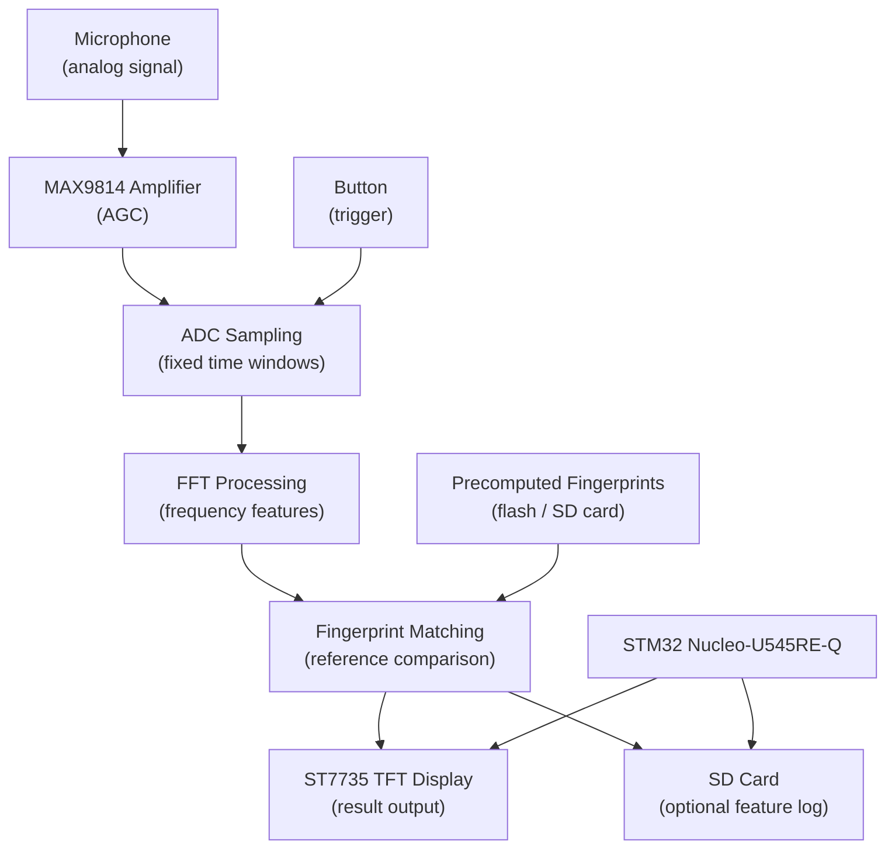

# Embedded Audio Recognition System

Real-time audio fingerprint recognition on an STM32 Nucleo microcontroller.

:::info

**Author**: Andreea-Maria Pascu \
**GitHub Project Link**: https://github.com/UPB-PMRust-Students/acs-project-2026-andreeaa-10.git

:::

## Description

The system captures audio through a microphone triggered by a button press. The analog signal is amplified by a MAX9814 module before being digitized by the STM32's ADC. Each fixed-length audio window is processed with FFT to extract frequency-domain features, which are then compared against precomputed fingerprints stored on the device. The closest match is displayed on the TFT screen in real time.

## Motivation

I chose this project because it combines signal processing and embedded programming in a way that felt more challenging than a typical sensor project. Through university coursework I have worked with algorithms and low-level programming, and this project is a natural next step (applying those concepts under real hardware constraints). I also listen to a lot of music, so building something that can actually recognize songs made it a more personal goal.

## Architecture

- **Audio Capture Module** - reads the microphone signal through the MAX9814 amplifier (with automatic gain control), then samples the amplified analog signal via the ADC in fixed-length windows triggered by a button press.
- **FFT Module** - applies a fast Fourier transform (FFT) on each sampled window to extract frequency-domain features.
- **Matching Module** - compares extracted frequency-domain features against precomputed fingerprints of reference songs stored in flash or on the SD card.
- **Display Module** - shows the identified song (or a no-match result) on the ST7735 TFT over SPI.
- **Logging Module (optional)** - writes captured feature vectors to the SD card for offline analysis.

## Log

### Week 6 - 12 April
Defined project scope: audio fingerprinting on STM32 Nucleo-U545RE-Q using Rust and Embassy. Identified main components and risks.

### Week 20 - 26 April
Performed initial research on required libraries and reviewed Embassy STM32 ADC examples.

### Week 27 - 3 May
Completed initial documentation. Hardware components ordered and received. 

### Week 4 - 10 May

### Week 11 - 17 May

### Week 18 - 24 May

## Hardware

- **STM32 Nucleo-U545RE-Q** - main microcontroller running firmware in Rust with the Embassy async framework.
- **Electret Microphone Capsule** - captures audio input as an analog signal.
- **MAX9814 Microphone Amplifier Module** - amplifies the microphone signal and provides automatic gain control (AGC) before feeding it into the MCU ADC.
- **ST7735 TFT Display (1.8")** - shows recognition result over SPI.
- **SD Card Module** - optional storage for feature data, connected over SPI.
- **Push Button** - triggers recording session.
- **Breadboard** - solderless prototyping platform.
- **Jumper Wires (M-M, F-M, F-F)** - electrical interconnections between components.
- **Resistors** - used for biasing, current limiting, and voltage division.
- **Ceramic Capacitors** - used for decoupling, filtering, and signal stabilization.

### Schematics

<!-- TODO: add KiCad schematic at Hardware Milestone (week 11) -->

### Bill of Materials

| Device | Usage | Price |
|--------|-------|-------|
| STM32 Nucleo-U545RE-Q | Main microcontroller | Provided by university |
| [Electret microphone capsule](https://sigmanortec.ro/Microfon-electret-capsula-p126469106) | Audio capture | ~5 RON |
| [MAX9814 amplifier module](https://www.emag.ro/amplificator-microfon-max9814-ai1095/pd/DJGRKFMBM/) | Microphone amplifier | ~24 RON |
| [ST7735 TFT Display (1.8")](https://sigmanortec.ro/Display-Color-1-8-TFT-LCD-p130546947) | Result display | ~41 RON |
| [MicroSD Card module](https://sigmanortec.ro/Modul-MicroSD-p126079625) | Feature logging | ~5 RON |
| [Push button](https://sigmanortec.ro/Buton-Mini-6x6x5-p134585482) | Recording trigger | ~2 RON |
| [Breadboard](https://www.emag.ro/breadboard-h-hct-tronic-830-puncte-de-conectare-abs-200x630-puncte-034-066/pd/DBNQ7R3BM/) | Prototyping | ~10 RON |
| [Jumper wires M-M](https://sigmanortec.ro/40-Fire-Dupont-30cm-Tata-Tata-p210849599) | Component interconnections | ~7 RON |
| [Jumper wires M-F](https://sigmanortec.ro/40-Fire-Dupont-30cm-Tata-Mama-p210854349) | Component interconnections | ~7 RON |
| [Jumper wires F-F](https://sigmanortec.ro/40-Fire-Dupont-30cm-Mama-Mama-p126421578) | Component interconnections | ~7 RON |
| [Ceramic Capacitor Kit](https://sigmanortec.ro/Set-condensatori-ceramici-300-bucati-p136306101) | Decoupling, filtering, and signal stabilization | ~13 RON |
| [Resistor Kit](https://sigmanortec.ro/kit-rezistori-30-valori-20-bucati) | Biasing, current limiting, and voltage division | ~15 RON |

**Estimated total**: ~136 RON

## Software

| Library | Description | Usage |
|-----------------|-------------|-------|
| [dasp](https://crates.io/crates/dasp) | Digital audio signal processing framework | Audio processing abstraction for sampling, buffering and feature extraction pipeline |
| [embedded-graphics](https://crates.io/crates/embedded-graphics) | 2D graphics library for embedded displays | Rendering structured UI elements and text on the ST7735 TFT display |
| [mipidsi](https://crates.io/crates/mipidsi) | ST7735 SPI display driver | Low-level control of the TFT LCD (ST7735S) over SPI |
| [microfft](https://crates.io/crates/microfft) | FFT implementation for no_std environments | Frequency-domain feature extraction from audio windows |

## Links

1. [Shazam algorithm overview](https://www.toptal.com/algorithms/shazam-it-music-processing-fingerprinting-and-recognition)