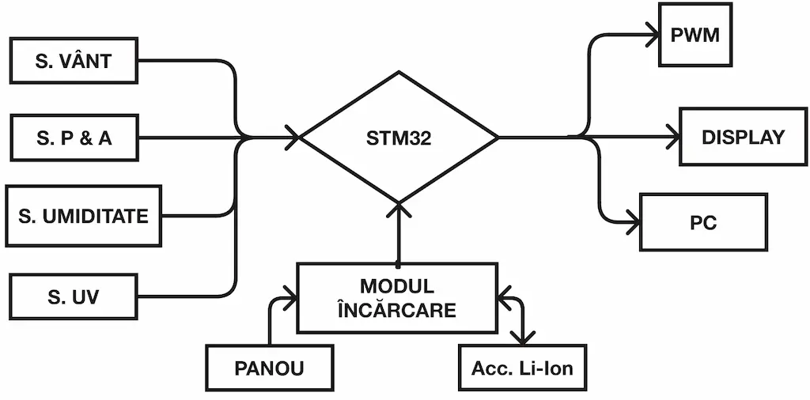
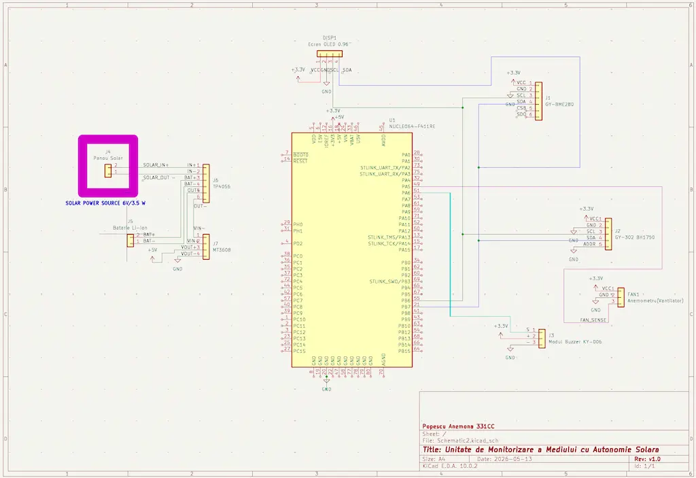

# **Unitate de Monitorizare a Mediului cu Autonomie Solara**

:::info

*Author:* Anemona Georgia Popescu \
*GitHub Project Link:* [anemona.popescu/website](https://github.com/UPB-PMRust-Students/acs-project-2026-ds2mon)

:::

---

## Descriere
Proiectul implementeaza un sistem embedded fiabil pe microcontroller-ul **STM32U545RE-Q**, progrmat in Rust. Sistemul colecteaza date in timp real de la senzori de vant, umiditate, index UV, altitudine, presiune barometrica. Dispozitivul asigura functionare autonoma prin alimentare solara, integrand un circuit de incarcare si acumulator Li-Ion. Datele sunt afisate local pe un display si transmise prin interfata seriala catre PC. Sistemul include un mecanism de siguranta prin alertare sonora PWM, declansat automat la depasirea pragurilor critice de umiditate sau presiune.

## **Motivatia**
Motivatia mea a constat in dorinta mea de a folosi in cadrul acestui proiect un panou solar. Pornind de la acest aspect, am ajuns la ideea dezvoltarii unei solutii de monitorizare ambientala complet autonome, care sa fie capabila sa functioneze in locatii izolate sau greu accesibile. Alegerea senzorilor si a parametriilor meteorologici a fost facuta astfel incat sa pot sa creez un tablou climatic complex

## **Arhitectura**

## **Hardware**
1.  Microcontroller si baza
    *   **STM32U545RE-Q**
    *   Breadboard
    *   jumpers
2.  Senzori

    Pentru a-mi fi mai usor am incercat sa aleg niste senzori care folosesc I2C pentru a avea deja crates
    *   **BMP280** - presiune barometrica si altitudine
    *   **GY-302 BH1750** - Intensitate UV
    *   **Ventilator PC cu senzor** - Pe post de anemometru
3.  Management Energetic
    *   **Panou Fotovoltaic** - 6V / 3.5W
    *   **Modul TP4056** - pentru incarcare acumulatori Litiu 5V/1A
    *   **Li-Ion 18650** - acumulator
    *   **Modul ridicator de tensiune MT3608**

4.  Interfata si feedback
    * **OLED 0.96"** - display local prin I2C
    * **Buzzer pasiv**

## *Schematic*

## **Software**
| Librarie | Rol | Protocol/Funcție |
| :--- | :--- | :--- |
| `embassy-executor` | async executor ightweight pentru embedded | Gestiune GPIO, I2C, PWM |
| `embassy-stm32` | pentru STM32U5 | Gestiune GPIO, I2C, PWM |
| `embassy-time` | async time management | Gestiune intervale de esantionare a datelor si temporizarea semnalelor sonore de alerta |
| `bme280-rs` | Driver Senzor | Citire Umiditate/Presiune |
| `ssd1306` | Driver Ecran | Afisare date pe OLED |
| `embedded-graphics` | Randare Grafica | Desenare text si forme pe display-ul OLED|

