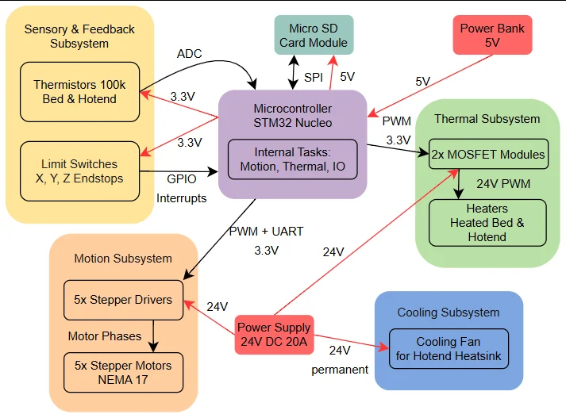
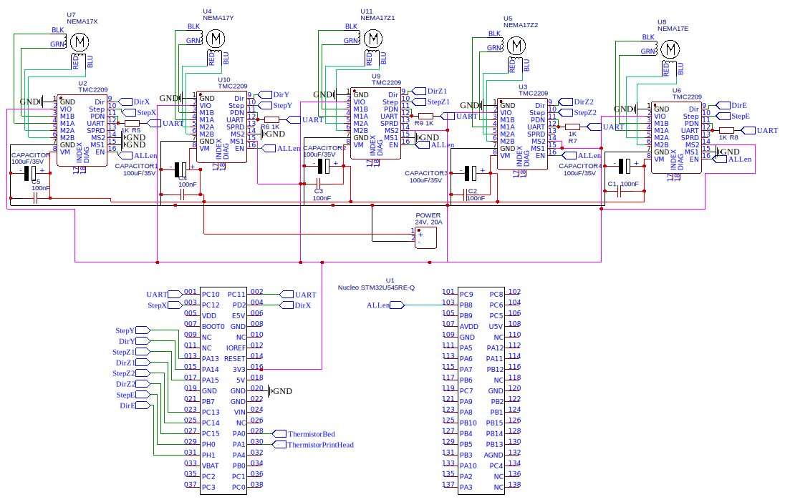
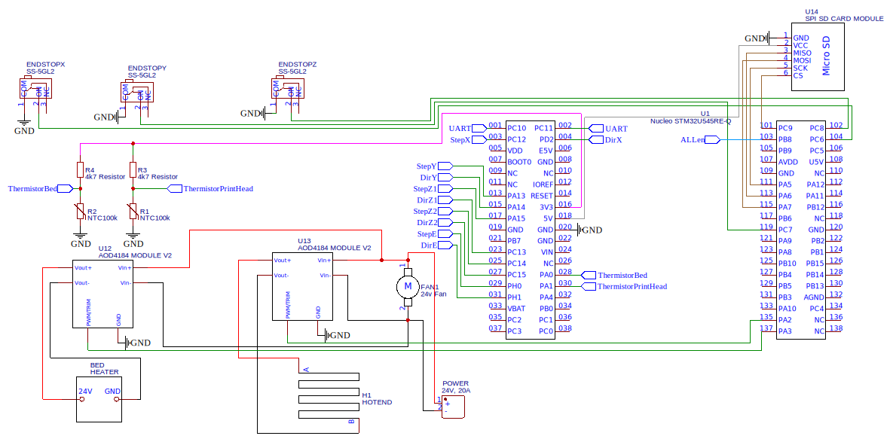

# 3D Printer
An engineered-from-scratch 3D printer powered by a 32-bit STM32 board, featuring custom hand-wired electronics, silent motor operation, and robust thermal management.

:::info 

**Author**: Bârsan Clara Maria \
**GitHub Project Link**: [link_to_github](https://github.com/UPB-PMRust-Students/acs-project-2026-clarabarsan)

:::

<!-- do not delete the \ after your name -->

## Description

This project is a custom-built Cartesian 3D printer based on the classic Prusa i3 architecture.
Its main purpose is to manufacture physical 3D objects by melting and depositing plastic filament layer by layer.
The end-user interacts with the device by providing a digital 3D model that has been sliced into a "G-code" file.
Once started, the machine autonomously coordinates its three axes (X, Y, and Z) and regulates high temperatures to print the object.
It solves the problem of needing an affordable, highly customizable, and easily repairable manufacturing tool for personal DIY projects and prototyping.

## Motivation

My primary motivation for building this 3D printer is to create a personal manufacturing hub at home.
I want the independence to design, prototype, and print highly customized components for my other DIY endeavors.
Having a tailor-made machine will give me the freedom to bring complex ideas to life, ensuring my future projects are never limited by off-the-shelf parts.

## Architecture 



The architecture of this custom 3D printer controller is designed as a standalone, state-machine-driven embedded system. To ensure safety, signal integrity, and a strict separation of concerns, the system is logically divided into distinct architectural subsystems. This design isolates low-voltage processing logic from high-voltage mechanical and thermal actuation.

**Core Processing Unit (MCU):** The central "brain" of the system is the STM32 Nucleo microcontroller. It is responsible for parsing G-code, executing the internal state machine, and orchestrating asynchronous tasks (Motion, Thermal, and I/O management).

**Data Storage Subsystem:** A Micro SD Card Module acts as the local repository for G-code files, allowing the printer to operate fully standalone.

**Sensory & Feedback Subsystem:** The input layer continuously gathers physical data from the machine's environment (temperatures and physical axis limits) and feeds it back to the processing unit to close the control loop.

**Motion Subsystem:** The kinematic layer translates digital movement commands into physical steps, driving the printer's axes and the extruder mechanism.

**Thermal Subsystem:** The high-current heating layer manages the rapid heating of the print bed and the hotend nozzle based on PWM duty cycles received from the Core Processing Unit.

**Cooling Subsystem:** The thermal management layer provides continuous hotend heatsink ventilation — powered permanently by the direct 24V supply — to prevent heat creep and maintain hardware integrity.

## Log

<!-- write your progress here every week -->

### Weeks 23 March - 12 April
Chose the project idea, researched components, and ordered hardware.

### Week 13 - 26 April
Assembled the frame and the Y axis.

### Week 27 April - 10 May
Finished the Z axis and parts of the X axis.

### Week 11 - 17 May
Structured and organized the hardware schematic in EasyEDA and soldered the physical hardware components using a soldering iron.

## Hardware

This custom 3D printer utilizes an STM32 Nucleo-U545RE-Q microcontroller as the core processing unit. The motion system features NEMA 17 stepper motors driven by ultra-silent TMC2209 modules, with axis limits detected by reliable SS-5GL2 mechanical endstops. Thermal actuation for the MK3 heated bed and MK8 extruder is safely managed by optoisolated external MOSFETs and continuously monitored by NTC 100k thermistors. To ensure signal integrity, the system employs a dual-isolated power architecture—a 5V power bank for logic circuits and a 24V 20A PSU for high-current loads. The entire setup operates independently of a PC using an SPI Micro SD Card module, with all custom signal routing soldered onto a double-sided FR4 prototype PCB.

### Schematics




### Bill of Materials

<!-- Fill out this table with all the hardware components that you might need.

The format is 
```
| [Device](link://to/device) | This is used ... | [price](link://to/store) |

```

-->

| Device | Usage | Price |
|--------|--------|-------|
| [STM32 NUCLEO-U545RE-Q](https://www.st.com/resource/en/data_brief/nucleo-c031c6.pdf) | Main microcontroller processing G-code and controlling the entire system | [105 RON](https://ro.mouser.com/ProductDetail/STMicroelectronics/NUCLEO-U545RE-Q?qs=mELouGlnn3cp3Tn45zRmFA%3D%3D) |
| [NEMA 17 Stepper Motor](https://www.alldatasheet.com/datasheet-pdf/pdf/1245674/NINGBO/17HS8401.html) | Stepper motor driving the physical movement of the axes and the extruder | [218 RON](https://www.emag.ro/motor-pas-cu-pas-nema17-pentru-imprimanta-3d-cnc-reprap-42mm-multicolor-1-w-020/pd/D83GKLMBM/?utm_source=email&utm_medium=tranzactional&utm_campaign=cns_confirmation_order&utm_content=cns_product_image&ref_id=2102441991#specification-section) |
| [TMC2209 Motor Driver](https://www.alldatasheet.com/datasheet-pdf/pdf/1180128/TRINAMIC/TMC2209.html) | Ultra-silent stepper driver translating MCU logic signals into motor movement | [157 RON](https://www.emag.ro/modul-driver-motor-pas-cu-pas-tmc2209-v2-0-set-de-5-bucati-2-8-a-pentru-imprimante-3d-ultra-silentios-novamart-k0079-260327-3200/pd/DZTFZ32BM/?utm_source=email&utm_medium=tranzactional&utm_campaign=cns_confirmation_order&utm_content=cns_product_image&ref_id=2116328933) |
| [NTC 100k Thermistor](https://fab.cba.mit.edu/classes/863.18/CBA/people/erik/reference/11_NTC-3950-100K.pdf) | Temperature sensor used to continuously monitor the hotend and heated bed | [9,7 RON](https://sigmanortec.ro/Termistor-NTC-100k-p125162185) |
| [SS-5GL2 Mechanical Endstop](https://omronfs.omron.com/en_US/ecb/products/pdf/en-ss.pdf) | Physical microswitch used to detect the 0-position (home) of the printer's axes | [15,7 RON](https://sigmanortec.ro/Endstop-mecanic-SS-5GL2-p136284192) |
| Micro SD Card Module | SPI storage module allowing the printer to read G-code and work standalone | [4,7 RON](https://sigmanortec.ro/Modul-card-SD-p137611367) |
| External MOSFET Module | High-current solid-state switch used to safely route 24V power to the heaters | [41,2 RON](https://sigmanortec.ro/modul-mosfet-e-switch-control-3-12v-iesire-5-36v-cu-optoizolator) |
| MK3 Heated Print Bed | Aluminum build plate that heats up to ensure first-layer print adhesion | [54 RON](https://www.emag.ro/incalzitor-aluminiu-pentru-imprimanta-3d-elektroweb-mk3-senzor-de-temperatura-214x214x3mm-z-003/pd/DHG9KM2BM/?ref_id=2116328933&utm_campaign=cns_confirmation_order&utm_content=cns_product_image&utm_medium=tranzactional&utm_source=email) |
| 24V 20A Power Supply | Main power supply unit providing high-current 24V for heaters and motors | [111 RON](https://altex.ro/sursa-alimentare-profesionala-yds-24v-20a-in-comutatie-cu-carcasa-metalica-cu-ventilator-480w/cpd/68F7A90A9BF88/) |
| FR4 Prototype PCB (7x9cm) | Double-sided board used to solder and route the custom electronic circuits | [5,8 RON](https://sigmanortec.ro/Placa-PCB-prototipare-fata-dubla-7x9cm-p125747328) |
| MK8 Extruder Components | Mechanical assembly responsible for feeding, melting, and depositing the filament | [211 RON](https://www.skroutz.ro/s/58723451/49041-Manson-din-aluminiu-pentru-mana-stanga-24v-0-4-1-75-Extruder-unic-Mk8-40-Inalt.html) |

## Software

| Library | Description | Usage |
|---------|-------------|-------|
| [st7789](https://github.com/almindor/st7789) | Display driver for ST7789 | Used for the display for the Pico Explorer Base |
| [embedded-graphics](https://github.com/embedded-graphics/embedded-graphics) | 2D graphics library | Used for drawing to the display |

## Links

<!-- Add a few links that inspired you and that you think you will use for your project -->

1. [link](https://example.com)
2. [link](https://example3.com)
...
