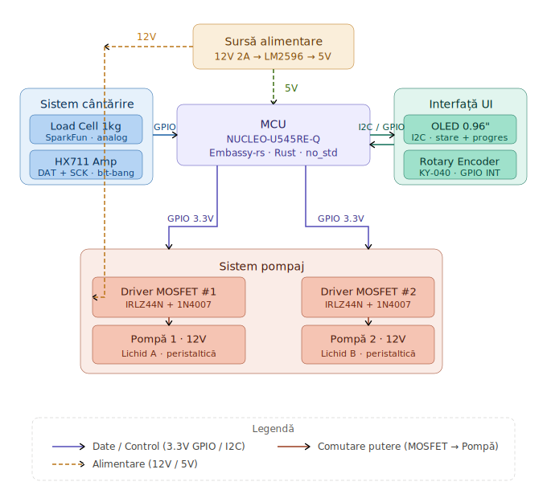
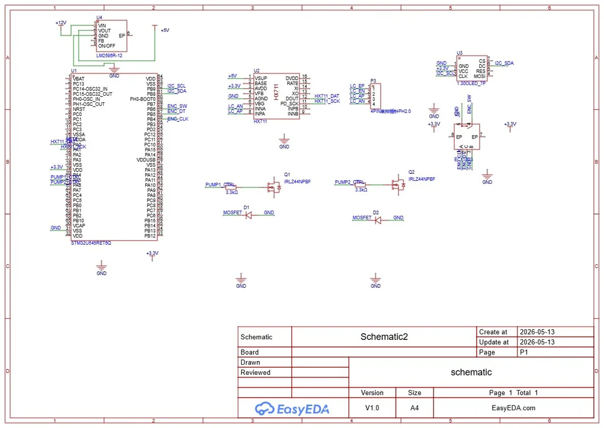
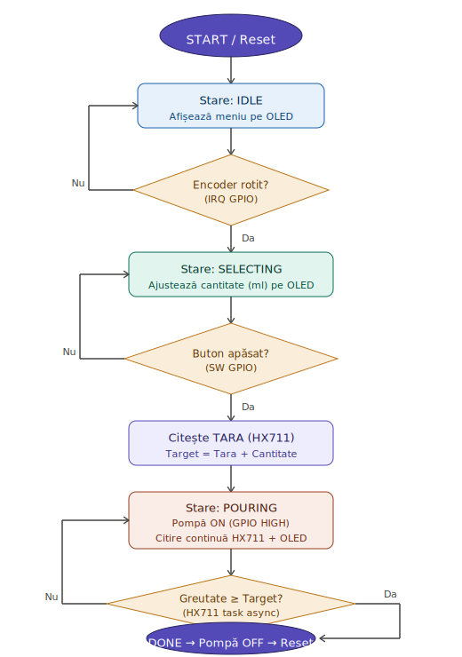

# Automated Drink Dispenser

:::info

**Author:** Moldoveanu Cătălin-Cristian \
**GitHub Project Link:** [Link to your repository](https://github.com/UPB-PMRust-Students/acs-project-2026-Dynamate92)

:::

An automated liquid mixer based on real-time weighing and sequential control of peristaltic pumps.

## Description

The system is an automated dispenser created for the precise mixing of two liquids (e.g., wine and sparkling water for spritz). As inputs, the system takes user commands via a Rotary Encoder (to select the mixing ratio) and continuously reads the weight of a glass placed on a load cell using an HX711 module.

The central unit (NUCLEO-U545RE-Q) calculates the required target weight for each liquid based on the selection. As outputs, the system sequentially starts and stops two independent 12V peristaltic pumps (driven by MOSFET modules) to pour exactly the calculated amounts. The graphical interface, provided by an I2C OLED display, shows the menu and the filling progress in real time.

## Motivation

I chose this project because it practically combines fundamental hardware and low-level software concepts. It represents an interesting challenge to manage sensitive sensor readings (Load Cell) simultaneously with actuating power components (12V pumps), while avoiding interference and code blocking.

It is also an excellent opportunity to use the Rust programming language (and the Embassy framework) to implement a non-blocking system: the graphical interface must remain responsive while waiting for the glass to fill to the desired weight. Lastly, the final result is a useful and fun device, perfect for the PM Fair live demonstration.

## Architecture

The project is divided into four main modules that work together:

1. **Control Unit (MCU):**
   * The NUCLEO-U545RE-Q board acts as the "brain" of the system, running the logic in Rust. It manages interrupts, I2C communication, and GPIO pin control.
2. **Feedback and Input System (I/O):**
   * **Rotary Encoder (KY-040):** Used for navigating the screen menu and confirming selections (via the integrated push button).
   * **0.96" OLED Display:** Communicates via the I2C protocol to display the current state of the machine.
3. **Weighing System:**
   * **1kg Load Cell (SparkFun) + HX711 Module (Soldered):** Reads the weight of the glass and sends the data digitally to the MCU. This component dictates when the pumps should stop.
4. **Pumping System (Power & Output):**
   * Two 12V peristaltic pumps, controlled via two IRLZ44N MOSFET transistors (for switching high current from the 3.3V pins of the board) and protected by 1N4007 flyback diodes against reverse voltage.

*[Here you will add a block diagram drawn in draw.io / diagrams.net]*

## Log

* **Week 6 April - 12 April:** Establishing the project theme, researching components, and ordering parts from Mouser and local electronics shops.
* **Week 13 April - 19 April:** [To be updated - e.g., Hardware assembly on the breadboard and load cell calibration]
* **Week 20 April - 26 April:** [To be updated - e.g., Finalizing the Rust code and OLED interface implementation]

## Hardware

### Schematics
*[Here you will add the schematic drawn in KiCad EDA]*

### Bill of Materials

| Component | Quantity | Value/Model | Link |
| :--- | :--- | :--- | :--- |
| MCU Board | 1 | NUCLEO-U545RE-Q | [Mouser](https://mouser.ro) |
| Load Cell | 1 | SparkFun SEN-13329 (1kg) | [Mouser](https://mouser.ro) |
| Load Cell Amp | 1 | Soldered 333005 (HX711) | [Mouser](https://mouser.ro) |
| Peristaltic Pump | 2 | Generic 12V | [Optimus Digital](#) |
| Display | 1 | OLED 0.96" I2C | [Optimus Digital](#) |
| Rotary Encoder | 1 | KY-040 Module | [Optimus Digital](#) |
| MOSFET | 2 | IRLZ44N | [Optimus Digital](#) |
| Diode | 2 | 1N4007 | [Optimus Digital](#) |
| Step-Down Module| 1 | LM2596 (12V to 5V) | [Optimus Digital](#) |
| Power Supply | 1 | 12V 3A (5.5x2.1mm) | [Optimus Digital](#) |

## Software

The software logic is created exclusively in **Rust**, using an embedded systems framework (e.g., `embassy-rs`). 
* The system will use asynchronous tasks to read the Rotary Encoder without blocking the main execution.
* Data from the HX711 will be polled at regular intervals while the liquid is pumping.
* The I2C interface will be used to update the OLED screen using a state-machine logic (states: Idle, Selecting, Pouring, Done).

*[Here you will add a flowchart of the software logic]*

## Links
* [Rust on ESP/STM32 Book](https://docs.rust-embedded.org/book/)
* [HX711 Datasheet](https://cdn.sparkfun.com/datasheets/Sensors/ForceFlex/hx711_english.pdf)
