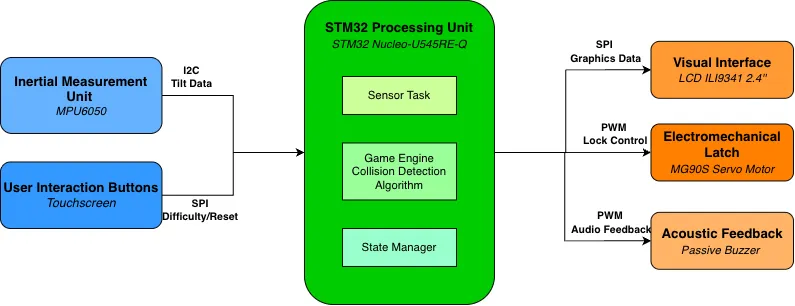
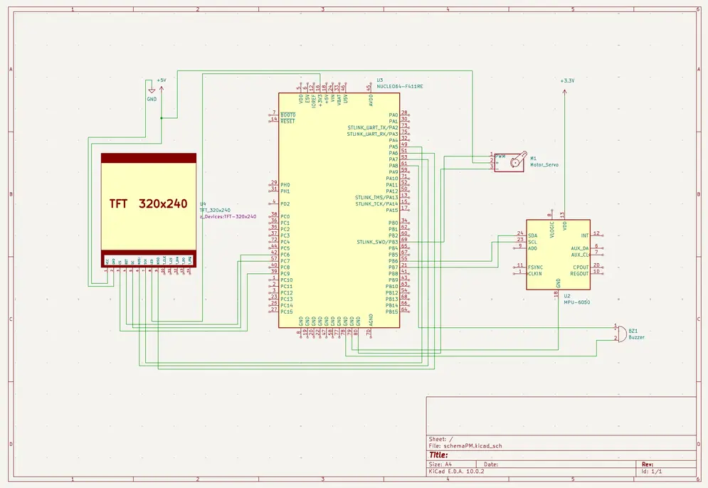

# MazeLock: The Tilting Puzzle Box
A secured box that opens upon solving a tilt-controlled digital maze puzzle.

:::info 

**Author**: GORGAN Delia \
**GitHub Project Link**: [UPB-PMRust-Students/acs-project-2026-deliagorgan](https://github.com/UPB-PMRust-Students/acs-project-2026-deliagorgan)

:::

<!-- do not delete the \ after your name -->

## Description

MazeLock is a secure storage box featuring a digital maze-based locking mechanism. Unlike traditional safes, this box unlocks its physical latch only after the user successfully navigates a virtual ball through a maze displayed on a TFT screen. The movement is entirely tilt-controlled, the user must physically rotate and tilt the box, allowing an internal accelerometer to translate these motions into the ball's navigation. Once the finish point is reached, the system triggers a servo-actuated lock to open the lid.

## Motivation

The inspiration for MazeLock stems from a cherished childhood memory of a physical maze piggy bank. That original mechanical box required navigating a small ball through a complex 3D path spanning all four sides to unlock the contents. This challenge acted as a barrier that prevented impulsive spending. Because the maze took time and effort to solve, it gave me a few extra minutes to reflect on whether I truly wanted to spend my savings, effectively teaching me the value of delayed gratification.

Recently, I repurposed that old piggy bank as a unique gift wrap for a friend. The added suspense and the challenge required to reveal the gift were highly appreciated and made the experience memorable. This sparked my desire to modernize the concept. I decided to build a contemporary version from scratch, transitioning from a purely mechanical puzzle to a digital system. By using an STM32 microcontroller and Rust, I aim to recreate that sense of challenge and reward while mastering the complexities of embedded hardware and software integration.

## Architecture 

## Log

<!-- write your progress here every week -->

### Week 5 - 11 May
Successfully acquired all necessary hardware components and completed the technical documentation review for each module. Completed the wiring for all components on the breadboard and performed functional tests to ensure signal integrity and proper communication with the STM32 board. Finalized the structural design of the box using balsa wood. Built the technical compartment for the electronics.

### Week 12 - 18 May

### Week 19 - 25 May

## Hardware

- **STM32U545RET6Q Microcontroller**: The core of the project that handles sensor data processing, motor control, and graphics rendering.

- **MPU6050 Accelerometer & Gyroscope**: Used to sense the physical tilt of the box, translating movement into the logic for navigating the on-screen maze.

- **2.4" TFT SPI Display (ILI9341)**: A high-resolution screen used to visualize the maze and provides a touchscreen interface for difficulty selection.

- **MG90s Metal Gear Servo**: A high-torque micro servo motor that acts as the physical locking mechanism for the box's side door.

- **HW-131 Breadboard Power Supply**: Provides a stable, independent power source for the servo motor to prevent voltage drops on the microcontroller.

- **Passive Buzzer**: Used to provide acoustic feedback, playing victory melodies or alert sounds during gameplay.

### Schematics

### Bill of Materials

| Device | Usage | Price |
|--------|--------|-------|
| [STM32U545RET6Q](https://www.st.com/en/microcontrollers-microprocessors/stm32u545re.html) | The microcontroller | Lab provided |
| [MPU6050](https://cdn.sparkfun.com/datasheets/Sensors/Accelerometers/RM-MPU-6000A.pdf) | The accelerometer for sensing the tilt | [15 RON](https://www.optimusdigital.ro/ro/senzori-senzori-inertiali/13611-modul-accelerometru-i-giroscop-cu-3-axe-mpu6050-cu-pini-lipiti.html) |
| [MG90s 0-180](https://www.electronicoscaldas.com/datasheet/MG90S_Tower-Pro.pdf) | The servo motor which locks the door | [27 RON](https://www.emag.ro/servomotor-mg90s-cu-rotatie-180-de-grade-ai0208/pd/D8VLCWYBM) |
| [TFT SPI Display 2.4'' ILI9341](https://cdn-shop.adafruit.com/datasheets/ILI9341.pdf) | The display | [55 RON](https://www.emag.ro/display-tft-spi-2-4-inch-240x320-lcd-cu-touchscreen-driver-st7789v-arduino-emg178/pd/DXZMBSYBM) |
| [HW131 Breadbord Power Supply](https://www.handsontec.com/dataspecs/mb102-ps.pdf) | The power supply fo servo motor | [5 RON](https://www.optimusdigital.ro/ro/electronica-de-putere-stabilizatoare-liniare/61-sursa-de-alimentare-pentru-breadboard.html) |
| Passive Buzzer | Triggered when the box opens | [1 RON](https://www.optimusdigital.ro/ro/audio-buzzere/12247-buzzer-pasiv-de-33v-sau-3v.html) |
| 400 points Breadboard | Triggered when the box opens | [14 RON](https://sogest.ro/accesorii-multimetre/placa-test-breadboard-400) |
| Wires | - | - |

<!-- 
| Device | Usage | Price |
|--------|--------|-------|
| [Raspberry Pi Pico W](https://www.raspberrypi.com/documentation/microcontrollers/raspberry-pi-pico.html) | The microcontroller | [35 RON](https://www.optimusdigital.ro/en/raspberry-pi-boards/12394-raspberry-pi-pico-w.html) |

## Software

| Library | Description | Usage |
|---------|-------------|-------|
| [st7789](https://github.com/almindor/st7789) | Display driver for ST7789 | Used for the display for the Pico Explorer Base |
| [embedded-graphics](https://github.com/embedded-graphics/embedded-graphics) | 2D graphics library | Used for drawing to the display | -->

## Links

<!-- Add a few links that inspired you and that you think you will use for your project -->

1. [Animated LED send](https://learn.adafruit.com/animated-led-sand): My reference project demonstrating the use of inertial sensors for real-time physics simulation in an embedded environment.
