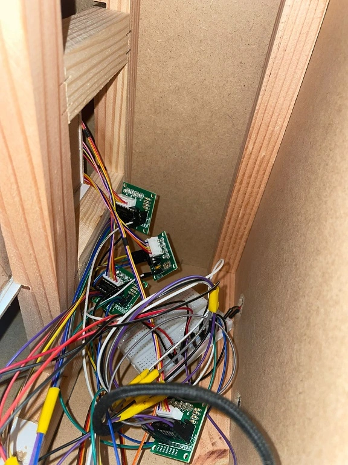
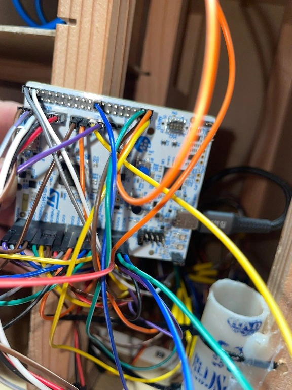
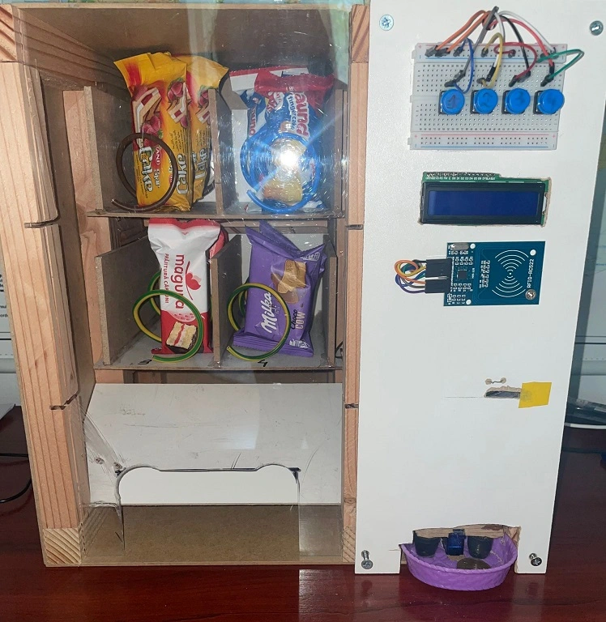
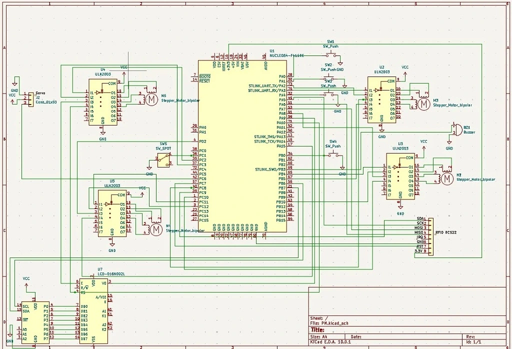

# Mini Vending Machine
A vending machine that releases products after validating user payments and selections.

:::info 

**Author**: Rizescu Delia Maria \
**GitHub Project Link**: https://github.com/UPB-PMRust-Students/acs-project-2026-Xdelia11

:::

## Description

The system receives user input through push buttons, each corresponding to a specific product selection. An STM32 microcontroller acts as the central processing unit, responsible for validating the inserted credit and checking product availability. If the selected item is out of stock or the transaction cannot be completed, the system rejects the inserted coin. When all conditions are met, the microcontroller controls a stepper motor that drives a spiral mechanism to dispense the chosen product. Additionally, the system features an LCD display that provides real-time messages to the user, including payment confirmation, product selection prompts, and error notifications.

## Motivation
I chose this project because it brings together multiple important concepts from both hardware and software in a practical context. I find it particularly interesting to work on a product that is already part of everyday life and explore ways to improve it. This project also gives me the opportunity to expand my understanding of Rust in a real-world scenario while designing a system that is both useful and engaging.

## Architecture 

The project is divided into a few main parts that work together.

Main Architectural Components:

1. **Payment Processing Unit (Input)**
* **Role:** Handles credit validation.
* **Components:** RFID RC522 (digital payment) and Limit Switch (physical coin detection)

2. **User Interface (I/O)**
* **Role:** Responsible for user selections and provides feedback.
* **Components:** 4x Push Buttons, LCD and Passive Buzzer.

3. **Dispensing and Change System (Output)**
* **Logic:** Manages the mechanical release of products and the return of change.
* **Components:** 4x Stepper Motors and SG90 Servo (coin release).

## Log

<!-- write your progress here every week -->

### Week 20 - 26 April

* Researche suitable motors for the project, as well as how to implement the coin detection system and the change mechanism. 
* Order hardware components.

### Week 27 April - 3 May

* Designed and built the vending machine structure, featuring four product compartments, with two compartments on each row.

### Week 4 - 10 May

* Assembled the hardware components inside the vending machine structure and completed the breadboard wiring.

## Hardware
The vending machine is controlled by an STM32U5 microcontroller that manages all system operations. It integrates an MFRC522 RFID reader and push buttons for inputs, while using an I2C LCD 1602 for the display. The physical dispensing is handled by four stepper motors and the coin-return mechanism is driven by a servo motor.

* **STM32U545 Nucleo:** The central microcontroller that executes the Rust firmware to process the system logic and coordinate all other parts.

* **MFRC522 RFID Reader:** An SPI-based card scanner used to authorize admin transactions.

* **28BYJ-48 Stepper Motors & ULN2003 Drivers:** Used to rotate the dispensing spirals inside the compartments.

* **LCD 1602 Display with PCF8574 I2C Adapter:** Provides real-time instructions, credit status, and feedback using only two I2C wires.

* **SG90 Servo Motor:** A micro servo used to operate the physical change coin mechanism.

* **Push Buttons & Limit Switch:** Act as the physical user interface for product selection and mechanical coin detection.

### Schematics

### Bill of Materials

| Device | Usage | Price |
|--------|--------|-------|
| [STM32](https://www.st.com/resource/en/datasheet/stm32f722ic.pdf) | The microcontroller | Provided by faculty |
| [Endstop limit switch](https://sigmanortec.ro/product-reviews-add-from-email?bt_gsr_product_id=166&bt_gsr_order_id=123878&source_url=account_page) | Used as a coin detector | 5.23 RON |
| [Motor Stepper](https://sigmanortec.ro/product-reviews-add-from-email?bt_gsr_product_id=482&bt_gsr_order_id=123878&source_url=account_page) | Used to rotate the dispensing spirals inside the vending machine | 4 X 10.29 RON |
| [Driver motor stepper](https://sigmanortec.ro/product-reviews-add-from-email?bt_gsr_product_id=151&bt_gsr_order_id=123878&source_url=account_page) | A stepper motor driver boosts STM32 signals to power the motor | 3 X 4.53 RON |
| [RFID](https://sigmanortec.ro/product-reviews-add-from-email?bt_gsr_product_id=267&bt_gsr_order_id=123878&source_url=account_page) | Used to scan admin cards to grant free product | 9.53 RON |
| [Wires](https://sigmanortec.ro/product-reviews-add-from-email?bt_gsr_product_id=8&bt_gsr_order_id=123878&source_url=account_page) | Used to create all electrical connections | 31.96 RON |
| [I2C LCD Interface](https://sigmanortec.ro/product-reviews-add-from-email?bt_gsr_product_id=397&bt_gsr_order_id=123878&source_url=account_page) | An I2C LCD interface changes a parallel connection into a 2-wire serial connection, saving STM32 pins| 5.11 RON |
| [LCD 1602 Display](https://sigmanortec.ro/product-reviews-add-from-email?bt_gsr_product_id=292&bt_gsr_order_id=123878&source_url=account_page) | Used to show user instructions, current credit, product selection | 11.18 RON |
| [Breadoard 400](https://sigmanortec.ro/product-reviews-add-from-email?bt_gsr_product_id=56&bt_gsr_order_id=123878&source_url=account_page) | Used to distribute power and connect components | 2 X 6.62 RON |
| [Servomotor SG90](https://sigmanortec.ro/product-reviews-add-from-email?bt_gsr_product_id=689&bt_gsr_order_id=123878&source_url=account_page) | Used for the change mechanism that dispenses coins back to the user  | 9.49 RON |
| [Push Buttons, 12x12x7.3mm](https://sigmanortec.ro/product-reviews-add-from-email?bt_gsr_product_id=62&bt_gsr_order_id=123878&source_url=account_page) | Used as product selection buttons | 4 X 1.33 RON |
| [Buzzer pasiv](https://sigmanortec.ro/product-reviews-add-from-email?bt_gsr_product_id=347&bt_gsr_order_id=123878&source_url=account_page) | Used to generate acoustic feedback | 5.03 RON |
| Total |  | 155.37 RON |

## Software

| Library | Description | Usage |
|---------|-------------|-------|
| [embassy-stm32](https://github.com/embassy-rs/embassy/tree/main/embassy-stm32) | STM32 driver library | Configures GPIO, I2C, SPI, and PWM. |
| [embassy-executor](https://github.com/embassy-rs/embassy) | Async executor | Used for running the async main loop. |
| [embassy-time](https://github.com/embassy-rs/embassy) | Async time utilities | Used for non-blocking delays. |
| [defmt](https://github.com/knurling-rs/defmt) | Embedded debugging tool | Used for debug and info. |
| [defmt-rtt](https://github.com/knurling-rs/defmt) | RTT transport for defmt | Used to transmit defmt logs over the debug probe. |
| [heapless](https://github.com/rust-embedded/heapless) | Static data structures | Allocates text buffers for the LCD display. |
| [panic-probe](https://github.com/knurling-rs/probe-run) | Panic handler for debugging | Prints error info. |

## Links

1. [Hardware Ideas and Design](https://www.youtube.com/watch?v=DO3AciBz_-A&t=5s)
2. [Lab Support](https://embedded-rust-101.wyliodrin.com/docs/acs_cc/category/lab)
3. [DIY Coin Dispenser](https://www.youtube.com/watch?v=V7L139xnTR0)
4. [Vending Machine Mechanism](https://www.youtube.com/watch?v=-gdm71P1k9c&t=2s)