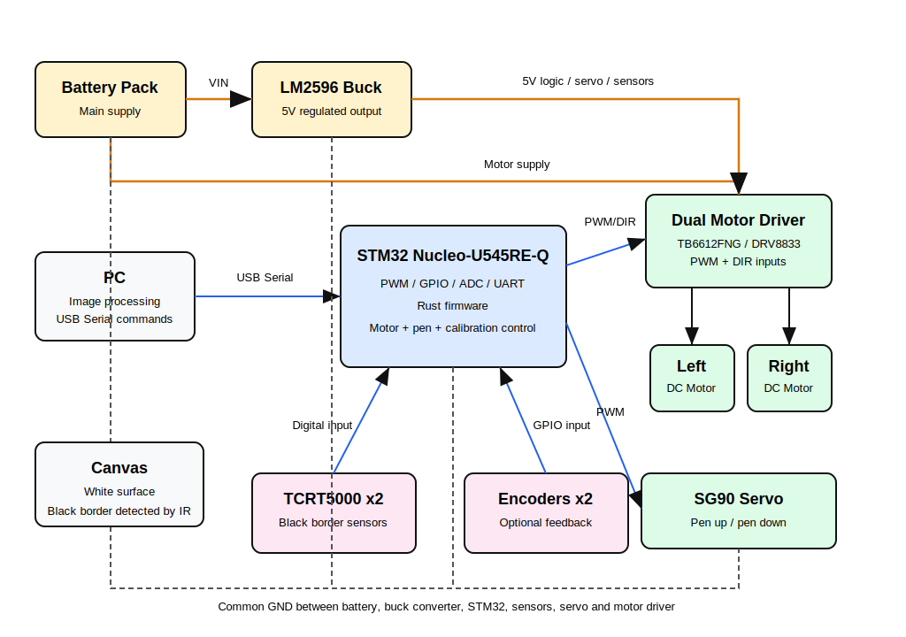

# Mobile Drawing Robot with Automatic Canvas Calibration
A mobile drawing robot that reproduces digital images on a physical canvas using automatic border detection.

:::info

**Author**: Denis-Dumitru Sarca \
**Github Project Link**: https://github.com/UPB-PMRust-Students/acs-project-2026-Denis-bit

:::
## Description

This project consists of a mobile robot capable of drawing digital images on a physical surface. The robot receives a processed drawing path from a PC and follows the generated trajectory using a differential drive system.
The drawing area is delimited using a black border placed around the canvas. The robot uses IR reflective sensors to detect this border and estimate the available drawing surface. Based on the detected canvas dimensions, the input image is scaled so that it fits inside the physical workspace.
The robot uses two powered wheels for movement and a third caster wheel for mechanical support. A servo motor controls the pen mechanism, allowing the system to lift or lower the pen while following the drawing path.

## Motivation

Thought it would be a fun way to start my journey in embedded development. I also find it useful in different scenarios, since it has the automatic drawing surface detection.

## Architecture
The system is divided into two main parts: the PC application and the embedded firmware running on the STM32 board.
The PC application is responsible for image processing. It loads the input image, converts it into a simplified drawing path and scales the result according to the canvas dimensions detected by the robot. The generated path is then sent to the microcontroller through a USB serial connection.
The STM32 Nucleo-U545RE-Q board receives movement commands and controls the hardware modules. It drives the two DC motors through a motor driver, reads encoder feedback for position estimation, reads the IR sensors for black border detection and controls the servo motor used for lifting and lowering the pen.

MAIN ARCHITECTURE COMPONENTS:
PC image processing module
USB serial communication module
STM32 command parser
motor control module
encoder feedback module
encoder feedback module
canvas calibration module
pen control module

## Log

## Hardware
STM32 Nucleo-U545RE-Q
2 sau 4 motoare DC cu encodere
driver motoare
roti omnidirectionale
roata caster
servo pentru marker
senzori IR pentru detectarea marginii canvasului
baterie
convertor buck

### Schematics

### Bill of Materials

| [Device](https://sigmanortec.ro/Modul-coborator-tensiune-adjustabil-LM2596-DC-DC-4-5-40V-3A-p134532509) | Used for tension adjustment | [price](7 ron) |
| [Device](https://sigmanortec.ro/Motor-DC-mini-angrenaje-metal-N20-100RPM-p125711198) | The motors | [price](46 ron) |
| [Device](https://sigmanortec.ro/shield-motoare-pentru-wemos-d1-mini-i2c-dual-motor-tb6612fng) | Motor driver | [price](47 ron) |
| [Device](https://sigmanortec.ro/servomotor-sg90-360-continuu) | Servomotor | [price](13 ron) |
| [Device](https://sigmanortec.ro/Senzor-urmarire-linie-IR-p126025109) | IR sensor | [price](12 ron) |
| [Device](https://sigmanortec.ro/Kit-sasiu-masina-2WD-urmaritor-linie-p172447939) | sasiu + roti | [price](41 ron) |

## Software
| Library | Description | Usage |
|---------|-------------|-------|
| [embassy-stm32](https://github.com/embassy-rs/embassy) | STM32 hardware abstraction layer from the Embassy framework | Used for GPIO, UART, PWM, timers and ADC configuration |
| [embassy-executor](https://github.com/embassy-rs/embassy) | Async executor for embedded Rust applications | Used for running concurrent firmware tasks |
| [embassy-time](https://github.com/embassy-rs/embassy) | Time utilities for embedded async applications | Used for delays, timeouts and movement timing |
| [embedded-hal](https://github.com/rust-embedded/embedded-hal) | Standard hardware abstraction traits for embedded systems | Used to keep hardware interfaces modular |
| [defmt](https://github.com/knurling-rs/defmt) | Lightweight logging framework for embedded systems | Used for debugging firmware behavior |
| [panic-probe](https://github.com/knurling-rs/probe-run/tree/main/panic-probe) | Panic handler for embedded Rust | Used for debugging runtime errors |
| [heapless](https://github.com/rust-embedded/heapless) | Fixed-capacity data structures without dynamic allocation | Used for command buffers and path data |
| [serde](https://github.com/serde-rs/serde) | Serialization framework | Used for encoding and decoding commands |
| [postcard](https://github.com/jamesmunns/postcard) | Compact binary serialization format for embedded systems | Used for sending drawing commands from the PC to the STM32 |
| [image](https://github.com/image-rs/image) | Image processing library for Rust | Used on the PC side for loading and processing input images |
| [serialport](https://github.com/serialport/serialport-rs) | Cross-platform serial communication library | Used on the PC side for USB serial communication with the robot |
| [clap](https://github.com/clap-rs/clap) | Command-line argument parser | Used on the PC side for configuring image input and serial port |

## Links
https://www.youtube.com/watch?v=_SbTXNRn7qA