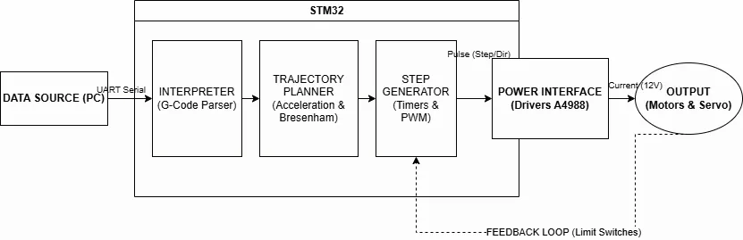
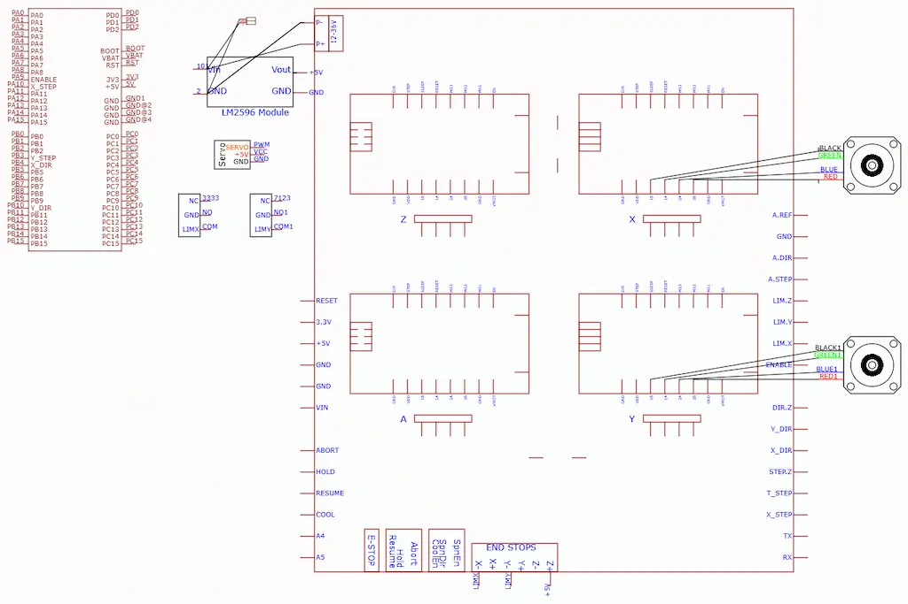

# Automatic A4 Drawer

An automated system that guides a pen along an A4 sheet of paper in order to draw any image.

:::info

Author: Necula Ioan Cristian \

GitHub Project Link: https://github.com/UPB-PMRust-Students/acs-project-2026-nchristiann

:::

## Description

The project aims to be a 2D cartesian plotter designed to reproduce images in an A4 format. The device recieves instructions in G-Code form through serial interface and transforms them into fast, precise movements using 2 stepper motors(1 for the X axis and the other for the Y axis) and a servomotor that controls the pen by lifting it up and down. The control logic is implemented in Rust.

## Motivation

I have always been passionate about art and always looked up to artists who could give their vision form. As I do not have that talent myself, this might've been the deciding factor that pushed me to choose this particular project. The other part of it was me thinking how cool it would be to reproduce literally ANY image on the internet. Also, this requires good knowledge of physics, mechanics in particular, which I found to be an interesting challenge for myself

## Architecture 

## Log

<!-- write your progress here every week -->

### Week 5 - 11 May
Pondering.

### Week 12 - 18 May
More pondering.

### Week 19 - 25 May
Pondering about getting started.

## Hardware 

The hardware subsystem implements a cartesian XY architecture, utilizingsteel rods and linear bearings to ensure smooth translation with low. Actuation is provided by two stepper motors , coupled with a GT2 timing belt and 20-tooth pulley transmission system. This configuration allows for high mechanical resolution, further optimized by microstepping managed via A4988 drivers. Power management is handled by a 12V DC supply, with voltage distributed to the motor power stage and simultaneously regulated through abuck converter to 5V for the STM32 microcontroller and the servo motor responsible for the Z-axis (pen-lift) action.

## Schematics

## Bill of Materials

| Device | Usage | Price |
|--------|-------|-------|
| STM32 Nucleo-64| Main Controller running the Rust firmware |0 RON |
| 2x Nema 17 Steppers | X and Y axis precision movement |113,98 RON |
| 2x A4988 Drivers | Power interface for stepper motors | 15,98 RON|
| Servo SG90 | Pen lift mechanism (Z-axis) | 13,99 RON |
| LM2596 Converter | Voltage regulation (12V to 5V) | 12,99 RON |
| 8mm Linear Rods | Structural guides for X and Y axes | - RON|
| LM8UU Bearings | Low-friction motion on rods | 39,20 RON |
| GT2 Belt & Pulleys | Motion transmission system | - RON |
| 12V 5A Power Supply | Main system power source | 29,99 RON |

## Software

| Library | Description | Usage |
|---------|-------------|-------|
| [embassy-stm32] | Async HAL for STM32 | Main framework for async task management |
| [embedded-hal] | Digital I/O and PWM traits | Generic hardware abstraction |
| [nom] | Parser combinators | Efficient G-code parsing |