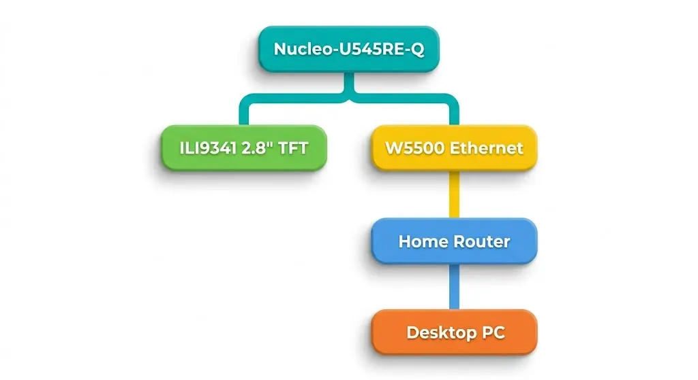

# BayPanel — PC Remote Management System

A 2.5" drive bay panel for monitoring and controlling a desktop PC over Ethernet, featuring a high-resolution display for animated system stats.

:::info

**Author**: Ioan Teodor Pop \
**GitHub Project Link**: [https://github.com/UPB-PMRust-Students/acs-project-2026-tedipop16](https://github.com/UPB-PMRust-Students/acs-project-2026-tedipop16)

:::

## Description

BayPanel is an embedded device that fits into a standard 2.5" HDD bay slot of a desktop PC. It uses an STM32 Nucleo-U545RE-Q connected to a W5500 Ethernet module to join the home network and expose an HTTP API. A companion lightweight agent running on the host PC communicates with the Nucleo over the local network, forwarding system metrics (CPU usage, RAM, temperatures, uptime) and accepting control commands (shutdown, reboot, execute shell commands). A 3.2" ILI9341 TFT display (320×240 px) mounted flush with the drive bay faceplate shows live system stats and animated temperature graphs. Power-on is handled via Wake-on-LAN magic packets sent directly from the Nucleo.

## Motivation

I wanted a permanent, always-on control panel for my desktop that doesn't depend on the PC being awake — something physical that sits in the case itself. Existing software solutions require the OS to be running. By putting the management logic on a microcontroller with its own Ethernet connection, the panel stays functional for Wake-on-LAN even when the PC is off, and the display shows status without needing the host to render anything. It also gave me a good reason to work with Ethernet, async networking, and SPI displays in embedded Rust.

## Architecture

## Log

### Week 21 - 27 April

Finalized project idea, chose components, and had the theme approved. Ordered W5500 module and ILI9341 display. Drafted the architecture and started reading embassy-net documentation.

### Week 5 - 11 May

### Week 12 - 18 May

### Week 19 - 25 May

## Hardware

### Schematics

To be added at Hardware Milestone (Week 11).

### Bill of Materials

| Device | Usage | Price |
|--------|--------|-------|
| [STM32 Nucleo-U545RE-Q](https://www.st.com/en/evaluation-tools/nucleo-u545re-q.html) | Main microcontroller | Free (Faculty) |
| [W5500 Ethernet Module](https://www.emag.ro/modul-retea-ethernet-shield-w5500-cu-suport-tcp-ip-bn484/pd/D010W5YBM/) | Hardware TCP/IP stack, LAN connectivity | ~41 RON |
| [3.2" ILI9341 TFT SPI Display (320×240)](https://www.emag.ro/display-tft-lcd-3-2-inch-320x240-touchscreen-14pini-spi-ili9341-arduino-rx407/pd/D7Q411YBM/) | Live stats display mounted in bay faceplate | ~89 RON |
| [Breadboard 400 points](https://www.optimusdigital.ro/ro/prototipare-breadboard-uri/44-breadboard-400-puncte.html) | Prototyping connections | ~10 RON |
| [Jumper Wires M-F 40p 20cm](https://www.optimusdigital.ro/ro/fire-fire-mufate/92-fire-colorate-mama-tata-40p.html) | Component interconnections | ~8 RON |

**Total estimated cost: ~148 RON** (excluding Nucleo)

## Software

| Library | Description | Usage |
|---------|-------------|-------|
| [embassy-stm32](https://github.com/embassy-rs/embassy) | Async HAL for STM32 | SPI1 (display), SPI2 (W5500), GPIO, clocks |
| [embassy-net](https://github.com/embassy-rs/embassy/tree/main/embassy-net) | Async TCP/IP networking | HTTP server, DHCP client, UDP for WoL |
| [w5500-dhcp](https://github.com/newAM/w5500-rs) | W5500 driver + DHCP | Drives the Ethernet module over SPI |
| [mipidsi](https://github.com/almindor/mipidsi) | Display driver (ILI9341) | Initializes and writes to the TFT |
| [embedded-graphics](https://github.com/embedded-graphics/embedded-graphics) | 2D graphics library | Renders text and stats to the display |
| [embassy-executor](https://github.com/embassy-rs/embassy) | Async task executor | Runs network, display, and WoL tasks concurrently |
| [embassy-time](https://github.com/embassy-rs/embassy) | Async timers | Periodic display refresh and metric polling intervals |
| [defmt](https://github.com/knurling-rs/defmt) | Logging framework | Debug output over RTT |
| [serde-json-core](https://github.com/rust-embedded-community/serde-json-core) | no_std JSON parsing | Parses metric JSON POSTed by the host agent |

## Links

1. [link](https://example.com)
