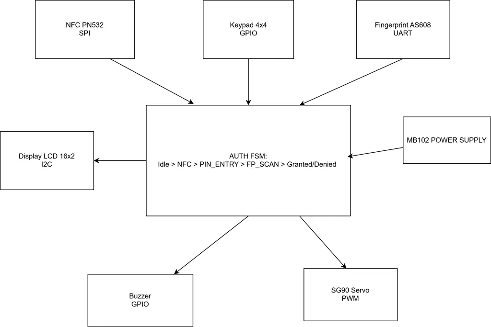
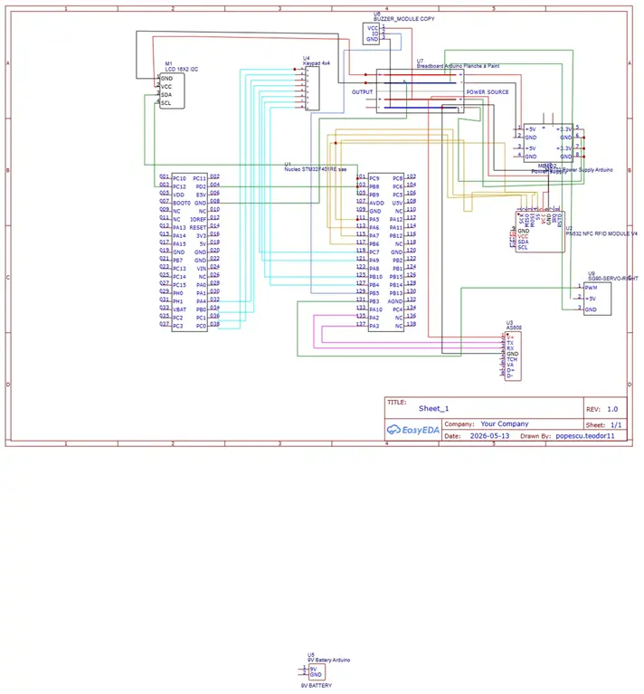

# Multi-Factor Authentication Safe Lock System
 
A multi-layered physical access control system that requires NFC card scanning, PIN entry, and fingerprint verification before unlocking a safe via a servo motor.

:::info 

**Author**: Popescu Ionut-Teodor \
**GitHub Project Link**: [link_to_github](https://github.com/UPB-PMRust-Students/acs-project-2026-Waffle20)

::: 

## Description
 
The Multi-Factor Authentication Safe Lock is an embedded security device built around the STM32 Nucleo-U545RE-Q microcontroller. It enforces three successive authentication levels before actuating the locking mechanism: an NFC card scan using the PN532 module over SPI, a 4-digit PIN entered on a 4x4 matrix keypad via GPIO, and a fingerprint scan using the AS608 optical sensor over UART. Each step's result is shown on a 16x2 LCD display connected via I2C. Upon successful completion of all three levels, an SG90 servo motor rotates to release the safe latch. Acoustic feedback is provided by a passive buzzer and visual feedback by three LEDs (red, green, yellow).
 
## Motivation
 
Standard single-factor physical security — a PIN pad or a key alone — presents a single point of failure. If the PIN is observed or the key is stolen, access is compromised. A multi-factor approach eliminates this by requiring an attacker to simultaneously possess the authorized NFC card, know the correct PIN, and have the registered fingerprint — a combination that is practically impossible to obtain.
 
Beyond the security aspect, this project offered a challenging opportunity to integrate five different hardware interfaces (SPI, UART, I2C, GPIO, PWM) on a single STM32 microcontroller, and to structure the firmware using Embassy's asynchronous task model in Rust, which provides a clean and safe concurrency model without an operating system.
 
## Architecture
 
- **NFC Task**: Runs on SPI1 and continuously polls for a MIFARE card. When a card is detected, it extracts the 4-byte UID and sends it to the authentication state machine via a message channel.
- **Keypad Task**: Scans the 4x4 matrix over 8 GPIO pins (PC0–PC7) using a row-column sweep with async debounce. It collects 4 digit presses and forwards the PIN to the authentication channel.
- **Fingerprint Task**: Communicates with the AS608 sensor over UART2 at 57600 bps using Embassy's interrupt-driven reception. It sends the binary verification result to the authentication channel.
- **Display Task**: Listens on a dedicated display command channel and updates the LCD 16x2 over I2C1 to show the current step, success, or failure messages.
- **Authentication FSM Task**: The central coordinator. It consumes events from the NFC, keypad, and fingerprint tasks in order. Each level has a configurable timeout; failure or timeout at any level resets the system to the idle state. On full success it drives the servo to the open position, waits 10 seconds, then closes and returns to idle. It also controls the buzzer and LEDs for acoustic and visual feedback.
### Architecture Diagram
 

 
## Log
 
### Week 4 - 10 May
The components arrived and I spent the first week familiarizing myself with the datasheets and documentation for the STM32U545, PN532, AS608, and the LCD.
### Week 11 - 17 May
I assembled the hardware on a breadboard, connecting the Nucleo board to the NFC module, fingerprint sensor, keypad, LCD, servo, buzzer, and LEDs according to the planned pinout. I also set up the power supply to provide 3.3V and 5V rails as needed.
### Week 18 - 24 May
I finalized the software architecture and implemented most of it.
## Hardware
 
The project is built around the STM32 Nucleo-U545RE-Q (ARM Cortex-M33, 160 MHz) with its integrated ST-LINK/V3E debugger. The PN532 NFC module is connected over SPI1 on pins PA5 (SCK), PA6 (MISO), PA7 (MOSI), and PB6 (CS); it reads MIFARE Classic 1K cards and tags. The AS608 optical fingerprint sensor connects over UART2 on PA2 (TX) and PA3 (RX) for biometric enrollment and verification. The 4x4 membrane keypad uses 8 GPIO lines on PC0–PC7, with rows as push-pull outputs and columns as inputs with internal pull-ups. The LCD 16x2 display uses a PCF8574 I2C backpack at address 0x27, connected on PB8 (SCL) and PB9 (SDA). The SG90 servo motor is driven by a 50 Hz PWM signal from TIM2 Channel 1 on PA0, with a pulse width between 1 ms and 2 ms controlling the 0° to 90° range. A passive buzzer on PB0 generates different tone patterns for success and failure events. Three 5 mm LEDs (red on PB2, green on PB1, yellow on PB3) with 220-ohm series resistors provide per-step visual status. An MB102 breadboard power supply provides a regulated 5V rail for the AS608 sensor and LCD backlight, and 3.3V for the NFC module, with a common ground shared with the Nucleo board.
 
### Schematics
 
 
### Bill of Materials
 
| Device | Usage | Price |
| --- | --- | --- |
| [STM32 Nucleo-U545RE-Q](https://www.st.com/en/evaluation-tools/nucleo-u545re-q.html) | Main microcontroller | Provided by university |
| [PN532 NFC Module](https://www.nxp.com/docs/en/user-guide/141520.pdf) | NFC card reading — Level 1 | ~40 RON |
| MIFARE Classic 1K Card | NFC access token | ~5 RON |
| [AS608 Optical Fingerprint Sensor](https://cdn-learn.adafruit.com/assets/assets/000/083/513/original/Optical_Fingerprint_Sensor_-_User_Manual.pdf) | Biometric verification — Level 3 | ~50 RON |
| [4x4 Membrane Keypad](https://www.optimusdigital.ro/ro/senzori-senzori-de-atingere/470-tastatura-matriceala-4x4-cu-conector-pin-de-tip-mama.html) | PIN entry — Level 2 | ~12 RON |
| [LCD 16x2 with I2C Module PCF8574](https://www.handsontec.com/dataspecs/module/I2C_1602_LCD.pdf) | User interface display | ~18 RON |
| [Servo SG90](http://www.towerpro.com.tw/product/sg90-7/) | Safe latch actuator | ~15 RON |
| [Passive Buzzer 5V](https://www.handsontec.com/dataspecs/module/passive%20buzzer.pdf) | Acoustic feedback | ~5 RON |
| Red, Green, Yellow LEDs + 220 ohm resistors | Visual step indicators | ~5 RON |
| [MB102 Breadboard Power Supply](https://www.optimusdigital.ro/ro/surse-de-alimentare/61-sursa-de-alimentare-pentru-breadboard.html) | 3.3V / 5V regulated power | ~12 RON |
| Breadboard 830 points | Prototyping | ~15 RON |
| Jumper wire set M-M and M-F | Wiring | ~15 RON |
 
## Software
 
| Library | Description | Usage |
| --- | --- | --- |
| [embassy-stm32](https://github.com/embassy-rs/embassy) | Async HAL for STM32 microcontrollers | SPI, UART, I2C, GPIO, PWM peripheral drivers |
| [embassy-executor](https://github.com/embassy-rs/embassy) | Async task executor for bare-metal Rust | Runs all concurrent tasks without an OS |
| [embassy-sync](https://github.com/embassy-rs/embassy) | Async synchronization primitives | `Channel` and `Mutex` for inter-task communication |
| [embassy-time](https://github.com/embassy-rs/embassy) | Async timers and delays | Timeouts per authentication level, keypad debounce |
| [hd44780-driver](https://github.com/JohnDoneth/hd44780-driver) | HD44780 LCD driver | Sending text commands to the 16x2 LCD over I2C |
| [defmt](https://github.com/knurling-rs/defmt) | Efficient logging framework for embedded Rust | Debug output via RTT during development |
| [defmt-rtt](https://github.com/knurling-rs/defmt) | RTT transport for defmt | Streams log output through the ST-LINK debugger |
| [panic-probe](https://github.com/knurling-rs/defmt) | Panic handler for embedded targets | Reports panics via defmt over RTT |
 
## Links
 
1. [Embassy — Async Embedded Rust](https://embassy.dev/book/)
2. [STM32U545 Datasheet](https://www.st.com/resource/en/datasheet/stm32u545re.pdf)
3. [Nucleo-U545RE-Q User Manual (UM3062)](https://www.st.com/resource/en/user_manual/um3062-stm32u3u5-nucleo64-boards-mb1841-stmicroelectronics.pdf)
4. [PN532 User Manual — NXP](https://www.nxp.com/docs/en/user-guide/141520.pdf)
5. [AS608 Fingerprint Sensor Manual](https://cdn-learn.adafruit.com/assets/assets/000/083/513/original/Optical_Fingerprint_Sensor_-_User_Manual.pdf)
6. [Rust on STM32 Workshop — IP Workshop](https://rust.ipworkshop.ro/docs/embassy/)
7. [embassy-stm32 API Documentation](https://docs.embassy.dev/embassy-stm32/)
8. [hd44780-driver crate](https://github.com/JohnDoneth/hd44780-driver)