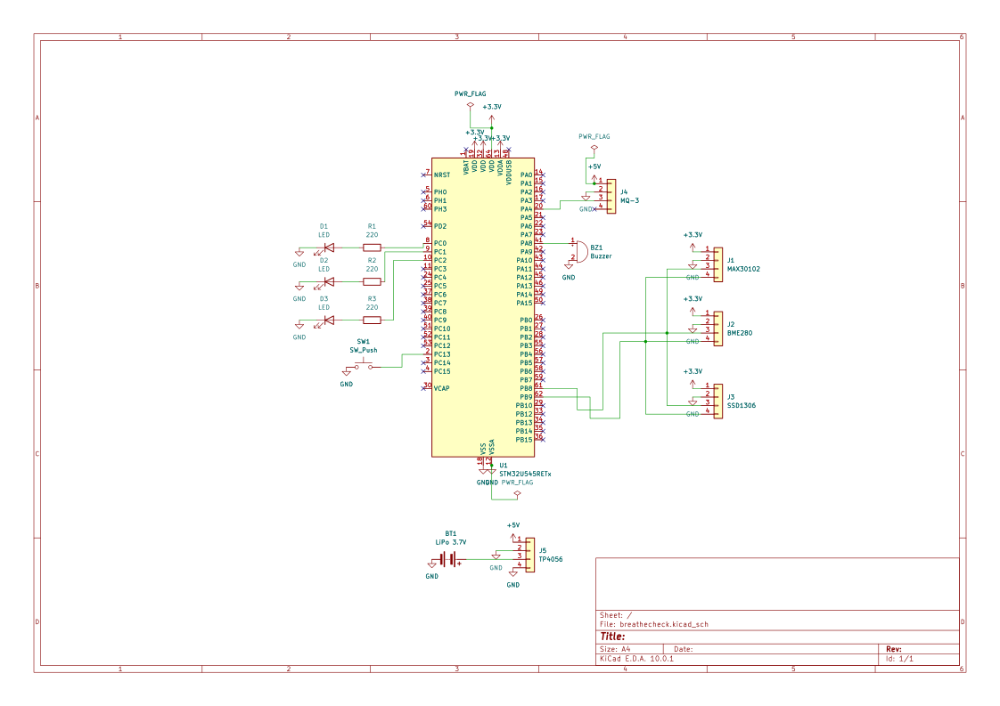

# BreatheCheck
A portable device that measures breath alcohol concentration, heart rate, and SpO2.

:::info

**Author:** Luciana-Ioana Toma \
**GitHub Project Link:** [https://github.com/UPB-PMRust-Students/acs-project-2026-lucianatoma8](https://github.com/UPB-PMRust-Students/acs-project-2026-lucianatoma8)

:::

## Description

BreatheCheck is a small portable device built on the STM32 Nucleo-U545RE-Q board that measures two things: how much alcohol is in your breath and your heart rate and blood oxygen level. 

For alcohol detection, it uses an MQ-3 gas sensor whose analog output is read through the STM32 ADC and converted to a concentration value in mg/L. A BME280 sensor measures the room temperature and humidity and uses those values to correct the MQ-3 reading, since the sensor is sensitive to environmental conditions. For heart rate and SpO2, a MAX30102 optical sensor shines infrared and red light into a fingertip and reads the reflection. The firmware processes the raw samples with a simple moving-average filter and a peak detection algorithm to get BPM, and uses the ratio of the two light wavelengths to estimate SpO2.

Results are shown on a small 0.96" OLED display. Three LEDs (green, yellow, red) and a buzzer give quick feedback about the alcohol level. The device runs on a LiPo battery charged via USB-C through a TP4056 module, so it works without being plugged into a computer.

The firmware is written in Rust using embassy-rs.

## Motivation

I chose this project because I wanted to work with multiple sensors at the same time and learn how to handle them properly in Rust with embassy-rs. The MQ-3 sensor alone is a bit boring, but adding the BME280 compensation and the MAX30102 made it more interesting from a technical point of view. I also wanted to try building something battery-powered that actually works on its own, not just a demo connected to a laptop.

## Architecture

The project is divided into a few main parts that work together to measure and display the biometric data.

Main Components:
* **The Controller**: The STM32 Nucleo-U545RE-Q board — the brain of the device. It reads all sensors, processes the data, and controls the output peripherals.
* **The Alcohol Sensing System**: The MQ-3 gas sensor connected to the ADC, with the BME280 providing temperature and humidity data for environmental correction.
* **The Optical Sensing System**: The MAX30102 sensor connected over I2C, which measures heart rate and SpO2 from a fingertip.
* **The Display and Feedback System**: An SSD1306 OLED displays all measurements. Three LEDs and a passive buzzer give immediate visual and audio feedback based on the alcohol threshold.
* **The Power System**: A 3.7V LiPo battery charged via a TP4056 USB-C module powers the device autonomously.

## Log

### Week 5 - 11 May

### Week 12 - 18 May

### Week 19 - 25 May

## Hardware 

| Component | Role | Interface |
|---|---|---|
| STM32 Nucleo-U545RE-Q | Main microcontroller | — |
| MQ-3 alcohol sensor | Measures alcohol in exhaled breath | ADC (PA4) |
| MAX30102 | Heart rate (BPM) and SpO2 (%) | I2C1 (0x57) |
| BME280 | Temperature and humidity for MQ-3 correction | I2C1 (0x76) |
| SSD1306 OLED 0.96" | Displays all measurements | I2C1 (0x3C) |
| LiPo 3.7V 1000mAh | Battery | — |
| TP4056 (USB-C) | Battery charger | — |
| LED Green | Alcohol OK (< 0.2 mg/L) | GPIO (PC0) |
| LED Yellow | Alcohol caution (0.2–0.5 mg/L) | GPIO (PC1) |
| LED Red | Alcohol exceeded (> 0.5 mg/L) | GPIO (PC2) |
| Passive buzzer | Beeps when alcohol limit exceeded | PWM TIM1_CH1 (PA8) |
| USER button | Starts a measurement | GPIO (PC13) |

### Schematics

### Bill of Materials

| Device | Usage | Price |
|--------|--------|-------|
| STM32 Nucleo-U545RE-Q | Main microcontroller | — RON |
| MQ-3 Alcohol Sensor | Breath alcohol detection | [13.00 RON](https://www.bitmi.ro/electronica/modul-senzor-de-gaze-mq3-10421.html) |
| MAX30102 | Heart rate and SpO2 | [11.98 RON](https://www.bitmi.ro/electronica/senzor-ritm-cardiac-si-spo2-max30102-12117.html) |
| BME280 | Temperature and humidity for MQ-3 correction | [32.67 RON](https://www.emag.ro/modul-senzor-temperatura-umiditate-presiune-bme280-ai0002-s34/pd/DR7HCZBBM/?ref=history-shopping_485342338_50435_1) |
| SSD1306 OLED 0.96" | Display | [16.96 RON](https://sigmanortec.ro/Display-OLED-0-96-I2C-IIC-Albastru-p135055705) |
| TP4056 USB-C | LiPo charger | [4.72 RON](https://sigmanortec.ro/modul-incarcare-baterie-litiu-tp4056-typec-5v-1a-cu-protectie) |
| LiPo 3.7V 1000mAh | Battery | [26.85 RON](https://www.emag.ro/acumulator-litiu-polimer-103040-1000mah-3-7v-protectie-pcm-si-ntc-felix063/pd/DL67KT3BM/?ref=history-shopping_485342338_257765_1) |
| LEDs (x3) + Resistors | Visual feedback | 26.20 RON |
| Passive Buzzer | Audio feedback | [1.45 RON](https://sigmanortec.ro/Buzzer-pasiv-5v-p172425809) |
| Breadboard + Wires | Prototyping | [34.58 RON](https://www.emag.ro/kit-breadboard-830-gauri-65-fire-modul-tensiune-alimentare-mb102-jh027/pd/DY1YP6BBM/?ref=history-shopping_485342338_227191_1) |
| | **Total** | **168.41 RON** |

## Software

| Library | Description | Usage |
|---------|-------------|-------|
| [embassy-stm32](https://docs.embassy.dev/embassy-stm32) | STM32 HAL for embassy-rs | ADC, I2C1, PWM, GPIO peripheral access |
| [embassy-executor](https://docs.embassy.dev/embassy-executor) | Async executor for embedded | Runs mq3_task, max30102_task, display_task, battery_task concurrently |
| [ssd1306](https://github.com/jamwaffles/ssd1306) | OLED display driver | Renders measurements on the SSD1306 screen |
| [bme280](https://docs.rs/bme280/latest/bme280/) | BME280 driver | Reads temperature and humidity for MQ-3 correction |
| [max3010x](https://github.com/eldruin/max3010x-rs) | MAX30102 driver | Reads IR/red FIFO values for BPM and SpO2 |

## Links

1. [MQ-3 Datasheet](https://www.sparkfun.com/datasheets/Sensors/MQ-3.pdf)
2. [MAX30102 Datasheet](https://datasheets.maximintegrated.com/en/ds/MAX30102.pdf)
3. [BME280 Datasheet](https://www.bosch-sensortec.com/media/boschsensortec/downloads/datasheets/bst-bme280-ds002.pdf)
4. [SSD1306 Datasheet](https://cdn-shop.adafruit.com/datasheets/SSD1306.pdf)
5. [TP4056 Datasheet](https://dlnmh9ip6v2uc.cloudfront.net/datasheets/Prototyping/TP4056.pdf)
6. [embassy-rs documentation](https://embassy.dev)
7. [embassy-rs STM32 HAL](https://docs.embassy.dev/embassy-stm32)
8. [STM32U545RE Reference Manual](https://www.st.com/en/microcontrollers-microprocessors/stm32u545re.html)