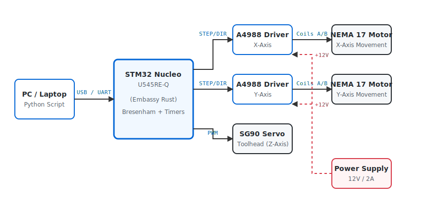

# CNC Pen Plotter

An autonomous 2D plotting machine that translates digital coordinates into physical drawings on paper using a synchronized dual-stepper Cartesian mechanism and a servo-actuated pen.

:::info

**Author**: [Lazarescu Matei-Cristian] \
**GitHub Project Link**: [link_to_github](https://github.com/UPB-PMRust-Students/acs-project-2026-matei1608)

:::

## Description

The CNC Pen Plotter is an embedded real-time device designed to physically draw graphics onto a sheet of paper. The system acts as a precise executor for coordinate data sent from a PC via USB (UART). Instead of relying on a high-level operating system, the STM32 Nucleo-U545RE-Q microcontroller uses DMA to receive a continuous stream of coordinates without blocking the CPU. 

Once the data is parsed, the firmware utilizes Bresenham's line algorithm to calculate the exact interpolation needed to draw straight lines. The X and Y axes are driven by two NEMA 17 stepper motors controlled via A4988 motor drivers, ensuring millimeter precision. An SG90 micro servo is mounted on the toolhead acting as the Z-axis; it receives PWM signals to lower the pen when drawing or lift it when moving between shapes. The entire motion system is strictly synchronized using hardware timers to prevent step loss and maintain smooth kinematics.

## Motivation

Translating digital graphics into physical reality requires a deep understanding of hardware-software synchronization. While commercial plotters or 3D printers handle this using advanced, pre-built frameworks, building one from scratch entirely in bare-metal Rust (`no_std`) represents a significant engineering challenge. This project was chosen to demonstrate the capability of handling asynchronous real-time communications, strict hardware timer management, and mathematical motion control (linear interpolation) on a highly resource-constrained embedded system.

## Architecture

- **Communication Module** — Handles the asynchronous serial communication (UART over USB) between the PC and the STM32 microcontroller. It uses DMA and ring buffers (via `heapless`) to safely store incoming coordinate commands without risking memory overflow or dynamic allocation crashes.
- **Motion Control Module** — The core logical component. It reads the target coordinates and applies Bresenham's line algorithm to determine the exact sequence of steps for the X and Y motors. It configures the MCU's hardware timers to generate precise microsecond pulses sent to the `STEP` and `DIR` pins of the A4988 drivers.
- **Toolhead Module** — Controls the Z-axis actuation. It uses a hardware timer configured for PWM signal generation to rotate the SG90 micro servo, effectively lifting or dropping the pen onto the paper at the start or end of a drawing path.
- **Power & Drive Module** — A 12V 2A power supply feeds the A4988 stepper drivers, providing the necessary current to the NEMA 17 motors. The logic side of the drivers and the MCU run safely isolated at 3.3V/5V.

## Log

### Week 14 - 20 April
- Finalized project theme and received approval.
- Researched kinematics and ordered the stepper motors, drivers, and mechanical components.

### Week 4 - 8 May

### Week 12 - 18 May

### Week 19 - 25 May

## Hardware

The main controller is the **STM32 Nucleo-U545RE-Q**, chosen for its hardware FPU (useful for kinematic math), advanced hardware timers, and robust support within the Rust Embassy async ecosystem.

The physical movement is achieved using two **NEMA 17 Stepper Motors**, which provide excellent torque and step precision. These are driven by two **A4988 Stepper Motor Drivers**, which handle the high-current demands and translate simple digital HIGH/LOW signals from the STM32 into complex motor coil energizing phases. 

The toolhead features an **SG90 Micro Servo**, connected directly to an STM32 PWM pin, providing a simple yet effective mechanism to raise and lower the drawing instrument. 

Power is managed separately to protect the microcontroller: the motors are powered by a dedicated **12V 2A Switched-Mode Power Supply**, while the STM32 logic operates on standard USB 5V/3.3V. The mechanical structure consists of GT2 timing belts, pulleys, and linear guide rods to ensure smooth and accurate translations.

### Bill of Materials

| Device | Usage | Price |
|--------|--------|-------|
| [STM32 Nucleo-U545RE-Q](https://www.st.com/en/evaluation-tools/nucleo-u545re-q.html) | Main microcontroller | ~85 RON |
| [NEMA 17 Stepper Motor x2](https://www.optimusdigital.ro/ro/motoare-pas-cu-pas/143-motor-pas-cu-pas-nema-17-42shd0001-24.html) | X and Y axis movement | ~100 RON |
| [A4988 Stepper Motor Driver x2](https://www.optimusdigital.ro/ro/drivere-de-motoare-pas-cu-pas/123-driver-motor-pas-cu-pas-a4988.html) | Power switching for stepper motors | ~30 RON |
| [SG90 Micro Servo](https://www.emag.ro/servomotor-sg90-180-de-grade-ai156-s297/pd/D33V1GMBM/) | Pen lifting mechanism (Z-axis) | ~15 RON |
| 12V 2A Power Supply | Powering the A4988 drivers & motors | ~40 RON |
| Mechanical Kit (GT2 Belts, Pulleys, Rods) | Cartesian frame assembly | ~100 RON |
| Breadboard + Jumper Wires | Prototyping electronic connections | ~20 RON |
| **Total** | | **~390 RON** |

## Software

| Library | Description | Usage |
|---------|-------------|-------|
| [embassy-stm32](https://github.com/embassy-rs/embassy) | Async HAL for STM32 | Managing UART (DMA), Timers, GPIO pins, and PWM for the servo |
| [embassy-executor](https://github.com/embassy-rs/embassy) | Async task executor | Running concurrent tasks (e.g., listening to UART while stepping motors) |
| [embassy-time](https://github.com/embassy-rs/embassy) | Timekeeping | Managing microsecond delays between motor steps and system timeouts |
| [heapless](https://github.com/japaric/heapless) | `no_std` data structures | Creating ring buffers for storing incoming coordinates without dynamic allocation |
| [defmt](https://github.com/knurling-rs/defmt) | Lightweight logging framework | Structured debug output (e.g., coordinate parsing status) |
| [defmt-rtt](https://github.com/knurling-rs/defmt) | RTT logging transport | Streaming logs to the PC via the debug probe |
| [panic-probe](https://github.com/knurling-rs/probe-run) | Panic handler | Catching errors and safely halting the motors via probe |

## Links

1. [Embassy-rs documentation](https://embassy.dev)
2. [STM32U5 Reference Manual](https://www.st.com/resource/en/reference_manual/rm0456-stm32u5-series-advanced-armbased-32-bit-mcus-stmicroelectronics.pdf)
3. [Bresenham's Line Algorithm Explanation](https://en.wikipedia.org/wiki/Bresenham%27s_line_algorithm)
4. [A4988 Stepper Motor Driver Datasheet](https://www.pololu.com/file/0J450/a4988_DMOS_microstepping_driver_with_translator.pdf)
5. [defmt logging framework](https://defmt.ferrous-systems.com)