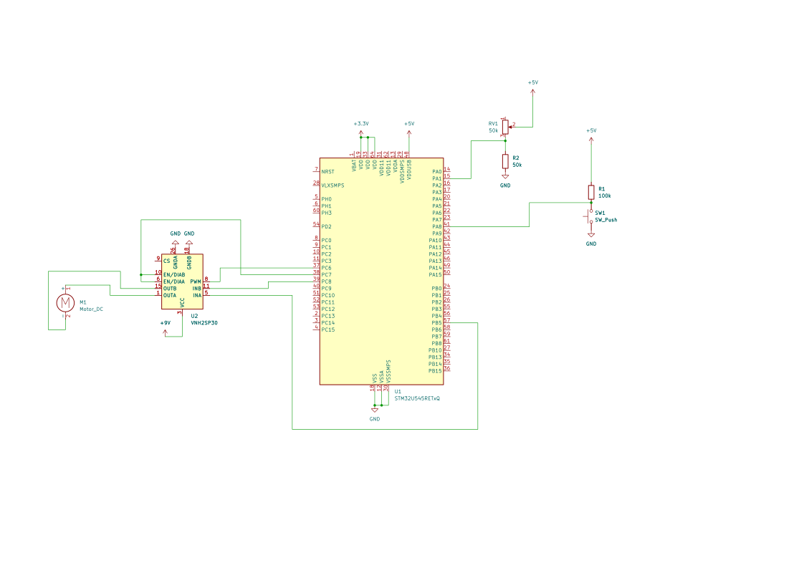

# Randomness-audited Wheel-of-Fortune
A motorized wheel that randomly chooses its output and also proves how fair it is.

:::info 

**Author**: Radu-Alexandru Vasilescu \
**GitHub Project Link**: https://github.com/UPB-PMRust-Students/acs-project-2026-vasilescuradu

:::

## Description

The Randomness-audited Wheel-of-Fortune is an arcade-like
product, designed to be fun and interesting. The user chooses the wheel speed,
presses the “start game” button and the wheel begins to rotate, while specific
visual and sound effects are running. The result is displayed on the LCD screen,
along with statistics. The project uses an entropy source - the jitter from an
unconnected analog pin – to create a carnival experience. At the same time,
fairness is guaranteed by the chi-square test and the distribution of the results is
logged on an SD card for external audit.

## Motivation

I am interested in how mathematics can be
used in practical contexts and the wheel-of-fortune shows exactly that.
Probabilities and statistics have applications in domains such as economics,
physics, gambling, etc. Therefore, they are one of the most straightforward
ways to show that mathematics is not only about theory, but also about
real-life situations.

## Architecture

## Log

### Week 27 April - 3 May

I created the documentation, containing a lot of details about the
project.
### Week 12 - 18 May

### Week 19 - 25 May

## Hardware

The hardware architecture revolves around the STM32 microcontroller. The physical rotation of the wheel is powered by a 6V DC Gear Motor controlled via a VNH2SP30 motor driver using PWM signals. The system is powered via a 5V USB connection, utilizing a DC-DC Boost Converter to step up the voltage for the motor. User inputs are handled by a physical push button to start the game and a 50k potentiometer to configure the spinning speed. All components are prototyped and connected using a standard 830-point breadboard and a dedicated jumper wire set.

### Schematics

### Bill of Materials

| Device | Usage | Price |
|--------|--------|-------|
| [STM32 Nucleo Board](https://www.st.com/en/evaluation-tools/stm32-nucleo-boards.html) | The main microcontroller running the logic | ~ 100.00 RON |
| [6V 96 RPM Plastic Geared Motor](https://www.optimusdigital.ro/ro/motoare-altele/5833-motor-cu-reductor-din-plastic-i-ax-cu-diametrul-de-4-mm-6-v-96-rpm.html?srsltid=AfmBOop9PXG0G7C-zHNTAhXIJz2r2rfr9kBAst5gFgeA-74S_rmirAKH) | Physically rotates the wheel | 11.99 RON |
| [2A DC-DC Boost Module](https://www.optimusdigital.ro/ro/surse-ridicatoare-reglabile/169-modul-dc-dc-boost-de-2a.html?srsltid=AfmBOoox6WjCYDuuwY0qRSkYvsngnhVKMo9N3AZCa5qBWSvFPmQlqV2-) | Steps up the 5V USB voltage to power the DC motor | 9.99 RON |
| [VNH2SP30 Motor Driver Module](https://www.optimusdigital.ro/ro/drivere-de-motoare-cu-perii/477-modul-driver-pentru-motoare-vnh2sp30.html?srsltid=AfmBOorCpeoK8NdSGiNEunGo-vjNDS64Qik-48tXZOUHw1bAlmUx0eQT) | Controls the speed (via PWM) and direction of the DC motor | 29.94 RON |
| [50k Mono Potentiometer](https://www.optimusdigital.ro/ro/componente-electronice-potentiometre/1885-potentiometru-mono-50k.html?srsltid=AfmBOopsy_OdVFuYxkBoo1D9JZx9zzn1B3piJ1i7kABN3P_O6AsyTs_w) | Analog input to adjust the rotation speed | 1.49 RON |
| [White Round Cap Push Button](https://www.optimusdigital.ro/ro/butoane-i-comutatoare/1115-buton-cu-capac-rotund-alb.html?srsltid=AfmBOorTSdiSNy5lCZLD_elUSRuKveDm7G4lwfxWsktSIJ8Z76j-wwe5) | Digital input to trigger the spin event | 1.99 RON |
| [830 Tie-Point Breadboard and Jumper Wire Kit](https://sogest.ro/accesorii-multimetre/set-placa-test-breadboard-830-165x55x085cm-set-cabluri-breadboard-si-alimentat) | Prototyping and interconnecting all electronic modules | 39.00 RON |

## Software

The software architecture is written entirely in **Rust**, utilizing the **Embassy** asynchronous execution framework. This allows the microcontroller to handle multiple concurrent tasks—such as generating precise PWM signals, managing user inputs, and logging data—without blocking the CPU.

| Library | Description | Usage |
|---------|-------------|-------|
| [embassy-stm32](https://github.com/embassy-rs/embassy) | Async HAL & Execution framework | Hardware abstraction and async scheduling. |
| [embedded-hal](https://github.com/rust-embedded/embedded-hal) | Standard hardware traits | Traits for external peripherals (I2C, SPI). |
| [embedded-sdmmc](https://github.com/rust-embedded-community/embedded-sdmmc-rs) | FAT filesystem & SD card driver | Writing CSV audit logs to the SD card. |
| [eeprom24x](https://github.com/eldruin/eeprom24x-rs) | AT24C* series EEPROM driver | Saving stats persistently across reboots. |
| [hd44780-driver](https://github.com/JohnDoneth/hd44780-driver) | HD44780 LCD controller driver | Displaying results and stats on the LCD. |

## Links

1. [Embassy Book](https://embassy.dev/book/) - Official documentation for the Embassy async Rust framework.
2. [STM32 Rust Ecosystem](https://github.com/stm32-rs) - Repositories and Hardware Abstraction Layers for STM32 microcontrollers.