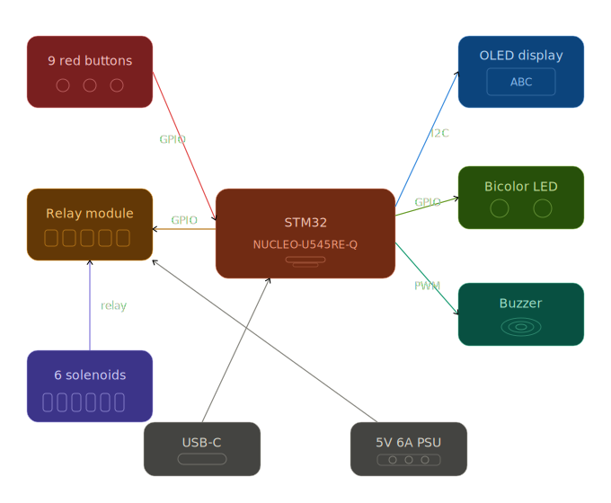
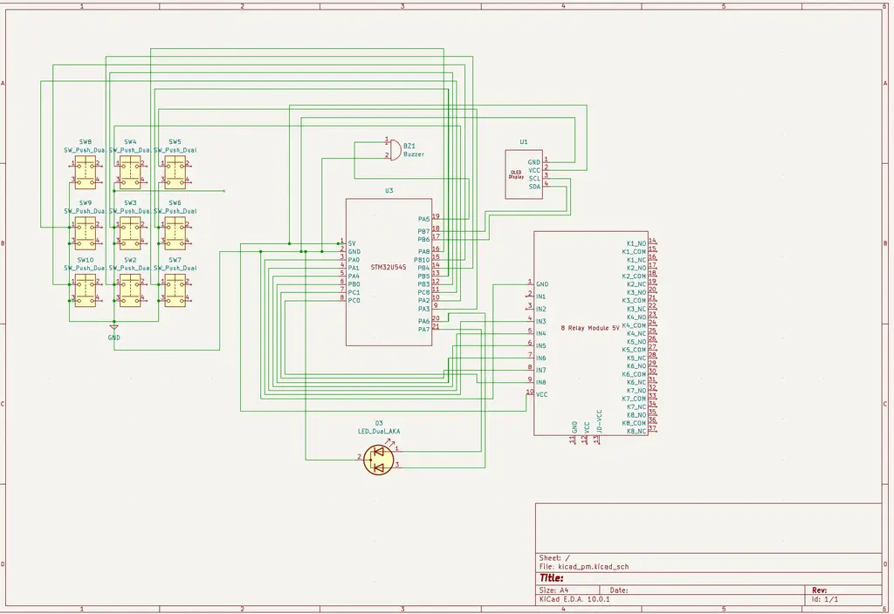
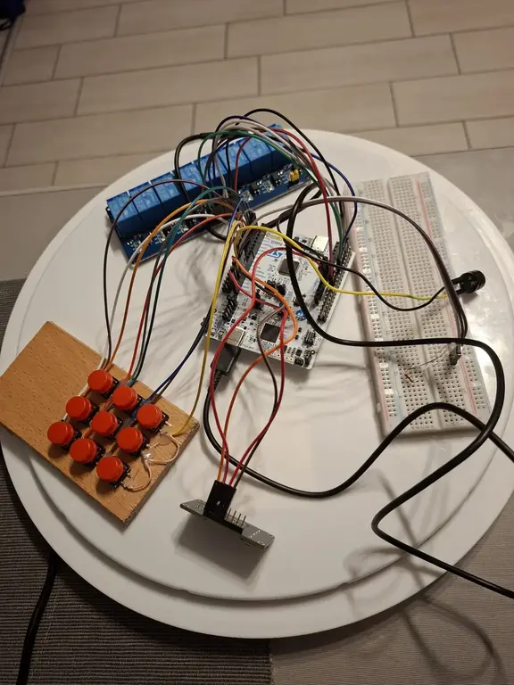

# Braille Bidirectional Trainer
An interactive system for learning Braille through visual, tactile and auditory feedback.

:::info 

**Author**: Ciuperca Robert-Mihai \
**GitHub Project Link**: [Project Repository](https://github.com/UPB-PMRust-Students/acs-project-2026-robert1724)

:::

<!-- do not delete the \ after your name -->

## Description

The Braille Bidirectional Trainer is a dual-mode educational device.
Mode 1 teaches sighted users to write Braille using a 3×3 button matrix, where the second and third columns function as a Braille-style 3×2 input interface based on prompts displayed on the screen.
Mode 2 helps visually impaired users practice reading through a 6-solenoid tactile display, with responses entered using the full 3×3 matrix configured as a T9-style keypad and validated through audio feedback.

## Motivation

I chose this project after meeting a visually impaired person and realizing how much a basic knowledge of Braille would have helped our communication. This experience inspired me to create a tool that assists parents and teachers in supporting blind children, while providing young learners with an interactive, fun way to practice their tactile skills.

## Architecture 



The system operates in two modes, selected at startup by pressing specific buttons. Each mode has 3 levels of increasing difficulty, and the user must achieve at least 80% accuracy to advance.
### Mode 1 — Learn to Write Braille (Sighted Users)
The OLED display shows a random letter or word. The user encodes it in Braille using the second and third columns of the 3×3 button matrix, which together emulate a standard 3×2 Braille cell. There is no confirmation button; instead, the system waits approximately two seconds for the user to press the buttons they consider to represent the correct Braille character, after which the answer is automatically validated. A green LED lights up for correct answers, while a red LED indicates an incorrect response.
### Mode 2 — Learn to Read Braille (Blind Users)
The STM32 activates solenoids through an 8-channel relay module to physically raise Braille dots on a tactile plate. The user feels the pattern and types the corresponding letter on 9 red buttons arranged as a phone keypad (multi-press input, like old Nokia phones). Feedback is given via buzzer: one beep for correct, two beeps for incorrect.
The STM32 NUCLEO-U545RE-Q acts as the central controller, managing all input/output:
- **Input**: 9 red buttons (GPIO)
- **Display**: 0.91" OLED 128×32 via I2C — shows letters, words and game status
- **Tactile output**: 6 push-pull solenoids (5V 0.7A) driven by an 8-channel relay module
- **Feedback**: Bicolor LED (Mode 1) and passive buzzer via PWM (Mode 2)
- **Power**: USB-C for STM32, separate 5V 6A PSU for solenoids

## Log

<!-- write your progress here every week -->

### Week 20 - 26 April

- Drafted the initial hardware documentation (block structure, component list, wiring notes)
- Ordered all required components from Optimus Digital, eMAG, Farnell, AliExpress and Ground Studio
- Refined the project concept: defined the two operating modes (sighted / blind), the level progression logic, and how the selection screen switches between them

### Week 27 April - 3 May

- The majority of the hardware components arrived
- Began learning how to connect and integrate the electronic components
- Studied the datasheets for the STM32, OLED display, relay module, and solenoids

### Week 4 - 10 May

- Attended the Support Project Work session
- Received guidance and recommendations from the assistants regarding the hardware implementation

### Week 11 - 17 May

- Built the hardware part of the project
- Connected and tested the main electronic components
- Assembled the keypad matrix

### Week 18 - 24 May

## Hardware

**1. STM32 Nucleo-U545RE-Q - Main Microcontroller Unit**

- Handles: buttons (GPIO), OLED (I2C), LEDs (GPIO), buzzer (PWM)

**2. 6 Mini Push-Pull Solenoids (5V, 0.7A)**

- Tactile Braille output: 3×2 dot matrix under the tactile plate
- Powered from external 5V/6A supply switched by the relay module

**3. 0.91" OLED Display (128×32, I2C)**

- Visual output for Mode 1: displays random letters, short words and complex words that the user must encode in Braille

**4. Push Buttons (16 total)**

- 9 red buttons form a Nokia T9 keypad (3x3)
- All buttons are debounced in software

**5. Relay Driver Stage (8-Channel Optoisolated Relay Module)**

- One relay channel per solenoid (6 out of 8 channels used; channels 7 and 8 unused)
- Low-side switching for solenoids via relay contacts
- Jumper between VCC and JD-VCC must be removed when external PSU is connected (failure to do so risks damaging STM32 and laptop USB port)
- No external flyback diodes, gate resistors or pull-downs required (all handled internally by the relay module)

**6. Feedback Outputs**

- 1 Bicolor LED (green/red - correct/wrong) working via 220Ω resistor
- 1 passive buzzer for Mode 2 (1 beep = correct, 2 beeps = wrong)

**7. Power Subsystem**

- External 5V/6A feeds the solenoids only: solenoids use up to ~4.2A peak (6 * 0.7A)
- MCU powered via USB-C, only GND shared between the two supplies

**8. Passives & Wiring**

- Resistors: 220Ω (LED, MOSFET gates), 10kΩ (pull-downs), 1kΩ (buzzer transistor base)
- 1× breadboard 830pt
- M-M, M-F, F-F jumpers; plexiglass tactile plate with 6 holes for solenoid pistons

**9. Physical Assembly**

- Plexiglass tactile plate with 6 holes drilled for solenoid pistons
- Solenoids mounted underneath, aligned with the holes
- Buttons arranged on top (T9 keypad)

### Schematics





### Bill of Materials

<!-- Fill out this table with all the hardware components that you might need.

The format is 
```
| [Device](link://to/device) | This is used ... | [price](link://to/store) |

```

-->

| Device | Usage | Price |
|--------|--------|-------|
| [STM32 Nucleo-U545RE-Q](https://ro.farnell.com/stmicroelectronics/nucleo-u545re-q/development-brd-32bit-arm-cortex/dp/4216396?gross_price=true&CMP=KNC-GRO-GEN-SHOPPING-PMax_Test_840_Lowmargin&mckv=_dc%7Cpcrid%7C%7Cplid%7C%7Ckword%7C%7Cmatch%7C%7Cslid%7C%7Cproduct%7C4216396%7Cpgrid%7C%7Cptaid%7C%7C&gad_source=1&gad_campaignid=20659611307&gbraid=0AAAAAD8yeHkSK63CAR63cuQ9pFy5lNcjZ&gclid=Cj0KCQjwj47OBhCmARIsAF5wUEH6Kym6sSE14nqDDJKp0NwKgYvIjM8EmyS4uOmAS9zt2HrlzObdZDQaAiu0EALw_wcB) | Main microcontroller | 130 RON |
| [Mini Push-Pull Solenoids](https://www.aliexpress.com/item/1005007163422306.html?spm=a2g0o.productlist.main.1.11c5sxGhsxGhC6&algo_pvid=cb5e2006-7204-416e-9f57-7f2ee3d3e57b&algo_exp_id=cb5e2006-7204-416e-9f57-7f2ee3d3e57b-0&pdp_ext_f=%7B%22order%22%3A%223795%22%2C%22eval%22%3A%221%22%2C%22fromPage%22%3A%22search%22%7D&pdp_npi=6%40dis%21RON%2119.07%2114.62%21%21%2129.26%2122.43%21%40210384b917758799842563173e4715%2112000039662693694%21sea%21RO%210%21ABX%211%210%21n_tag%3A-29910%3Bd%3Aa45a2b33%3Bm03_new_user%3A-29895%3BpisId%3A5000000201130828&curPageLogUid=kN2AjBacVNhk&utparam-url=scene%3Asearch%7Cquery_from%3A%7Cx_object_id%3A1005007163422306%7C_p_origin_prod%3A#nav-specification) | Raises/Lowers Braille dots | 130 RON |
| [OLED Display](https://ro.farnell.com/dfrobot/dfr0648/oled-display-module-0-91-128x32/dp/4308185) | Displays letters/words | 38 RON |
| [9 red buttons](https://www.optimusdigital.ro/en/buttons-and-switches/1114-red-button-with-round-cover.html?search_query=red+round+button+with+cover&results=8) | Nokita T9 keypad (3x3 matrix) | 18 RON |
| [Bicolor LED](https://www.optimusdigital.ro/en/leds/704-led-bicolor-de-3-mm-rosu-si-verde-cu-catod-comun.html?srsltid=AfmBOopGC_xZWFvGLk5QneMtooFGgOLTJCRYcR8LtzcYMZNfwsi9gH_Q) | Visual feedback | 1 RON |
| [5V6A Power Supply](https://www.emag.ro/sursa-in-comutatie-ac-dc-30w-5v-6a-well-143x59x40mm-psup-so-5v30w-wl/pd/DXZ2MJ3BM/) | Powers solenoids | 52 RON |
| [8 Relay Module](https://www.optimusdigital.ro/en/relay-modules/475-blue-optoisolated-8-relay-module.html?srsltid=AfmBOorN0An2FgZarTmFpJI9X43BIgCUwBJchYU4Q6IJ9V9meI9mRPxg) | Controls solenoids activation | 26 RON
| [Breadboard](https://www.emag.ro/breadboard-h-hct-tronic-830-puncte-de-conectare-abs-200x630-puncte-034-066/pd/DBNQ7R3BM/) | Connects all electronic parts | 10 RON|
| [Buzzer](https://www.optimusdigital.ro/en/buzzers/12247-3-v-or-33v-passive-buzzer.html?search_query=buzzer+5v&results=62) | Audio feedback | 1 RON |
| Resistors, capacitors, diodes, wires | Support the main components | ~30 RON |
| Perforated board | Solenoids mounted underneath raise through the holes | ~10RON |

## Software

| Library | Description | Usage |
|---------|-------------|-------|
| [embassy-stm32](https://docs.embassy.dev/embassy-stm32/) | Hardware Interface | Acts as a bridge between the Rust code and the physical pins (GPIO, I2C, PWM) |
| [defmt](https://defmt.ferrous-systems.com/) | Debug Logging | Sends status messages to the computer for debugging via probe |
| [panic-probe](https://docs.rs/panic-probe/) | Error Handling | Reports crashes and errors through the debug probe |

The rest will be added as I develop the code

## Links

<!-- Add a few links that inspired you and that you think you will use for your project -->

1. [The Braille Alphabet](https://www.pharmabraille.com/pharmaceutical-braille/the-braille-alphabet/)
2. [Interactive Braille Trainer](https://www.michalpaszkiewicz.co.uk/brailletraining/)
3. [People's opinion on learning Braille](https://www.reddit.com/r/Blind/comments/1lehwx9/the_importance_of_braille_in_todays_technology/)
