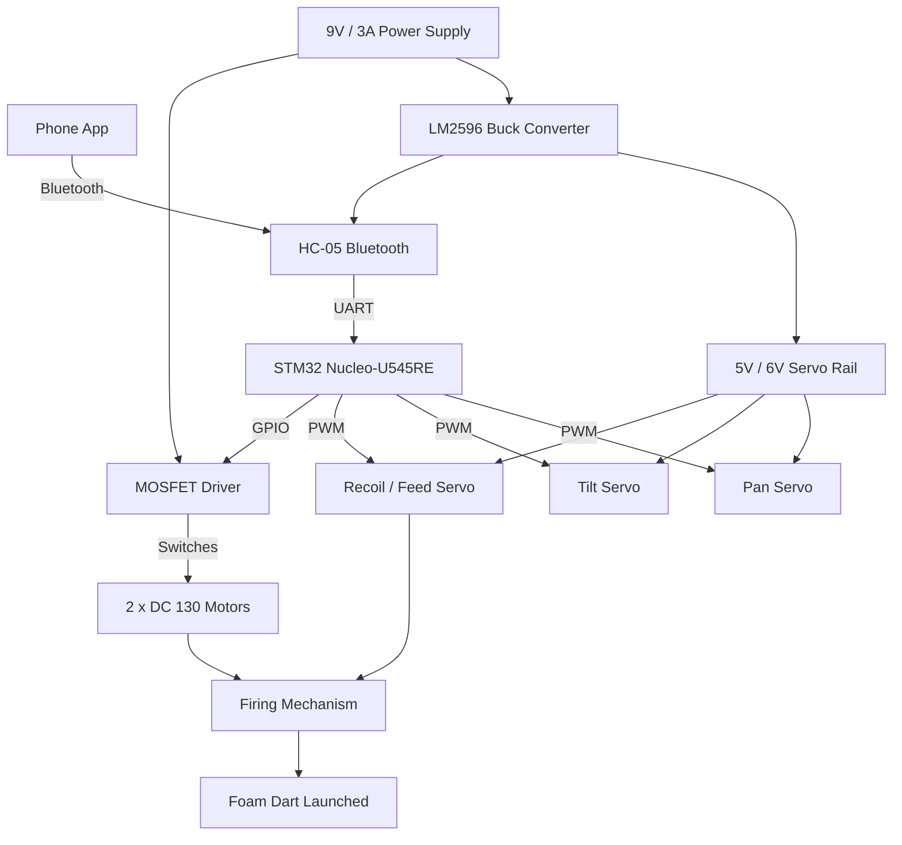

# Bluetooth Nerf Turret

A Bluetooth controlled robotic Nerf turret.

:::info

**Author**: Robert Cristian Petcu \
**GitHub Project Link**:https://github.com/UPB-PMRust-Students/acs-project-2026-robertpetcu

:::

## Description

Bluetooth Nerf Turret is a robotic turret that can be controlled from a mobile phone through Bluetooth. The user can rotate the turret left and right, adjust the shooting angle up and down, start or stop the firing motors and launch foam darts remotely.
The turret receives commands from the phone and converts them into physical actions. When the user sends movement commands, the turret changes its orientation using two servomotors: one for horizontal rotation and one for vertical tilt. When the user activates the firing system, two DC motors spin a pair of flywheels, and a third servomotor pushes a foam dart into the wheels so it can be launched forward.
In its final form, the project will behave like a small remote-controlled foam dart launcher. It will be able to aim in different directions, prepare the firing mechanism and shoot foam darts on command, while keeping the user at a safe distance from the moving parts.

## Motivation

I chose this project because I wanted to work on a practical embedded system with visible real-world behavior.
This makes the project more hardware-oriented and helps me better understand how embedded software interacts with real electrical and mechanical components.
Another reason for choosing this idea is that it combines several subsystems into one complete device. The STM32 firmware, Bluetooth communication, motor control, power supply and 3D printed structure all need to work together, which makes the project both challenging and useful from a practical point of view.

## Architecture

The system is divided into several main modules: the mobile control interface, the Bluetooth module, the control unit, the motion system, the firing system and the power management system.

## Log

### Week 2 - 7 April

- Researched multiple project ideas.
- Chose the Bluetooth Nerf Turret as my project idea.

### Week 7 - 20 April

- Researched the hardware components needed for the project.
- Estimated the total cost of the electronic components.
- Looked into the 3D printed parts required for the turret structure.

### Week 21 - 28 April

- Ordered the hardware components.

## Hardware

1. STM32 board - the main microcontroller board of the project. It receives commands from the Bluetooth module and controls the servomotors and firing system.
2. HC-05 Bluetooth module - the wireless communication module
3. 3 x MG90S servomotors - small servomotors used for precise movement.
4. 2 x DC 130 motors - small high-speed DC motors used for the flywheel launcher.
5. Logic-level MOSFET - an electronic switch used to control the DC motors.
6. Flyback diode - a protection diode used in the motor circuit.
7. LM2596 buck converter - a step-down voltage regulator.
8. External 9V / 2.5A+ power supply - the main power source for the motors and servos.
9. 3D printed turret structure - the mechanical frame of the project.
10. Foam darts - the projectiles launched by the turret.
11. Wires, connectors, screws and rubber bands - assembly and connection materials.

### Schematics

### Bill of Materials

| Device | Usage | Price | Link |
|---|---|---:|---|
| STM32 Nucleo-U545RE | Main microcontroller board | Already owned | - |
| HC-05 Bluetooth module | Bluetooth communication | ~25 RON | [Link](https://sigmanortec.ro/Modul-Bluetooth-HC-05-p141736971) |
| MG90S servomotor x3 | Pan, tilt and dart feeding | ~60 RON | [Link](https://www.optimusdigital.ro/en/servomotors/271-mg90s-servomotor.html) |
| DC 130 motor x2 | Flywheel launcher | ~10 RON | [Link](https://sigmanortec.ro/Motor-DC-3-6V-p125923622) |
| Logic-level MOSFET | DC motor switching | ~8 RON | [Link](https://www.optimusdigital.ro/ro/componente-electronice-tranzistoare/11870-tranzistor-mosfet-irlz44n-canal-n-83w-55v-41a.html) |
| Flyback diode | Motor circuit protection | ~2 RON | [Link](https://www.optimusdigital.ro/ro/componente-electronice-diode/7457-dioda-1n4007.html) |
| LM2596 buck converter | Voltage step-down | ~10 RON | [Link](https://www.optimusdigital.ro/en/adjustable-step-down-power-supplies/805-lm2596-dc-dc-module-with-voltage-display.html) |
| External 9V / 3A power supply | Motor and servo power supply | ~45 RON | [Link](https://www.emag.ro/sursa-de-alimentare-plug-in-qoltec-27w-9v-3a-5-5x2-1-negru-50786/pd/D29DFMYBM/) |
| Wires and connectors | Electrical connections | ~20 RON | - |
| Screws and rubber bands | Mechanical assembly | ~20 RON | - |
| 3D printed turret structure | Turret frame | 0 RON | - |
| Foam darts | Projectiles | ~15 RON | - |

**Estimated total:** ~215 RON

## Software

| Library | Description | Usage |
|--------|------------|-------|
| embassy-stm32 | STM32 support crate for the Embassy framework | Used to configure and control the STM32 peripherals needed by the turret |
| embassy-executor | Asynchronous task scheduler for embedded applications | Used to run multiple parts of the firmware in parallel |
| embedded-hal | Hardware abstraction traits for embedded systems | Provides a standard interface for interacting with peripherals |
| panic-probe | Panic handler for embedded Rust | Used to report crashes or unexpected errors while testing the firmware |
| Bluetooth Serial Controller App | Mobile application for sending serial commands over Bluetooth | Used to control the turret from a phone through the HC-05 module |
| heapless | Fixed-size data structures for embedded systems | Used to store and parse Bluetooth commands without dynamic memory allocation |
| embassy-time | Timing and delay utilities for Embassy | Used for delays, servo timing and the firing sequence |

## Links

1. https://projecthub.arduino.cc/Little_french_kev/bluetooth-nerf-turret-ea2fac#section0
2. https://www.youtube.com/watch?v=3Ma5ZCZVQRs
