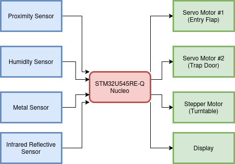
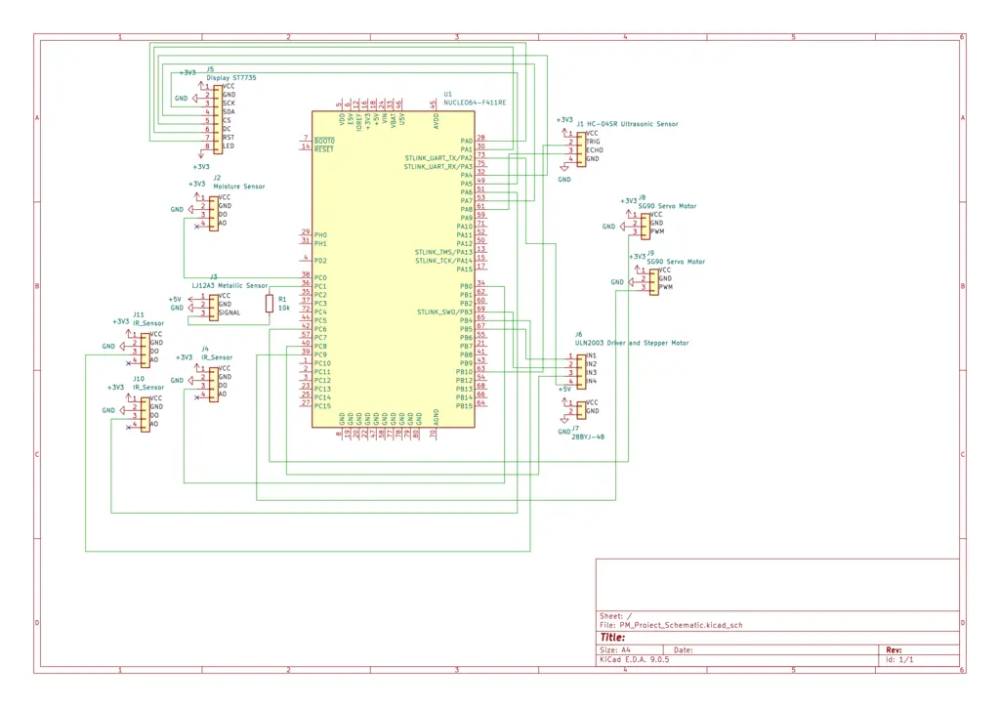

# Smart Bin

:::info

**Author:** Robert Postolache 
**GitHub Project Link:** https://github.com/UPB-PMRust-Students/acs-project-2026-RobertP1021

:::

## Description

Smart Bin is a trash bin that automatically sorts waste without any user intervention. When it detects a hand nearby, it opens a flap and lets the object fall onto an internal analysis platform. There, humidity, metal, and weight sensors analyze the object and classify it into one of three categories: wet, dry, or metal. A motor then rotates the container platform until the correct one is in position, after which the object is released. If a container is full, the system refuses to accept new waste for that category.

## Motivation

My motivation to tackle this project came from my daily commute to work. Every day, before getting on the metro, I would buy a coffee cup and something to eat. Sometimes, if the metro was in the station, I hurriedly threw the cup and the food wrapper in the nearest trash bin, without looking for the correct label. So while I was searching for a project idea, I remembered that it would be nice to have a trash bin that could automatically sort the waste, without me having to worry about it.

## Architecture

Smart Bin is built around an STM32U545RE-Q Nucleo board that coordinates all sensors and actuators through firmware written in Rust with Embassy.

**Main flow:**

1. The proximity sensor detects a hand at the entry and the first servo opens the entry flap
2. The object falls onto the analysis platform where the following are read simultaneously:
   - humidity sensor
   - metal sensor
3. Based on the readings, the microcontroller classifies the object as WET / DRY / METAL
4. The fill level of the target container is checked (one infrared sensor per container)
5. If the container is available: the stepper motor rotates the turntable to the correct position, the second servo releases the object
6. The display shows feedback to the user about the classification result and if a container is full or not

**Interfaces used:**
- SPI: ST7735 LCD Display
- PWM: servo × 2
- GPIO: stepper motor, metal sensor, infrared reflective sensors × 3
- ADC: humidity sensor

## Log
This will be updated as I continue developing the project

### Week 5 - 11 May
I bought the hardware components, and mapped out the pin connections. I started testing each component with simple and minimal code. 

### Week 12 - 18 May
I completed the initial testing for each component, and presented them to the lab assistant.

### Week 19 - 25 May
TODO

## Hardware

### Schematics

### Bill of Materials

| Device | Usage | Price |
|--------|-------|-------|
| [STM32U545RE-Q Nucleo](https://www.st.com/en/evaluation-tools/nucleo-u545re-q.html) | Microcontroller | 90 RON |
| [Servo Motor SG90 × 2](https://www.optimusdigital.ro/en/servomotors/26-sg90-micro-servo-motor.html?search_query=SG90&results=5) | Entry flap + platform trapdoor | 13,99 RON × 2 |
| [TCRT5000 Reflective Photoelectric Sensor x 3](https://www.optimusdigital.ro/en/optical-sensors/42-tcrt5000-photoelectric-sensor.html?search_query=TCRT5000&results=4) | Container fill level detection | 1.49 RON × 3 |
*OR*
| [TCRT5000 Infrared Line Sensor Module with Adjustable Sensitivity x 3](https://www.optimusdigital.ro/en/optical-sensors/2415-modul-senzor-infrarou-de-linie-cu-sensibilitate-reglabila.html?search_query=TCRT5000&results=4) | Container fill level detection | 3.87 RON × 3 |
| [ULN2003 Stepper Driver + 5V Stepper Motor](https://www.optimusdigital.ro/en/stepper-motors/101-stepper-motor-with-uln2003-driver.html?search_query=stepper&results=97) | Stepper motor control for turntable | 16.97 RON |
| [HR202L Resistive Humidity Sensor](https://www.optimusdigital.ro/en/humidity-sensors/590-senzor-rezistiv-de-umiditate-hr202l.html?search_query=rain+sensor&results=46) | Humidity sensor for wet/dry | 3.99 RON |
*OR*
 [Rain Sensor Module](https://www.optimusdigital.ro/en/humidity-sensors/5775-rain-sensor-module.html?search_query=rain+sensor&results=46) | Humidity sensor for wet/dry | 9.99 RON |
| [Senzor inductiv de proximitate - LJ12A3-4-Z/BX](https://ardushop.ro/ro/senzori/2182-senzor-inductiv-de-proximitate-lj12a3-4-z-bx-6427854033659.html) | Inductive proximity sensor for metal detection | 15.57 RON |
| [Senzor Ultrasonic de Distanță HC-SR04+](https://www.optimusdigital.ro/ro/senzori-senzori-ultrasonici/2328-senzor-ultrasonic-de-distana-hc-sr04-compatibil-33-v-i-5-v.html?search_query=HC+SR04&results=15) | Ultrasonic sensor for hand detection | 14.99 RON |
| [1.8 Inch 128 x 160 SPI TFT LCD Display Module ST7735 51/AVR/STM32/ARM 8/16 Bit ](https://www.amazon.de/-/en/Inch-Display-Module-ST7735-STM32/dp/B0B5RVX9BJ/ref=sr_1_5?crid=3OK9OD7CNSDQD&dib=eyJ2IjoiMSJ9.3_7bMaePwHiqT1VxJiDDYqMcf3MEYLs08db-A_noB2P4Km6v76rcO_IJ4UkdW2pKzx1nqF7hgj7hQwZO4oEUuQME23v1ycsK3XGmjYy8MhmZR3uXl4h4CjTXwQsQCQTv8zN5mkAJJkTlzr5h6mszg0E6Sb5RWU9VKmjLE18jA_CcQnokLxzeciWPpmBwJ2cjKuT4iVTUluNs2XoKtIuE8sIS5NBn381Fxy5ooGhK3CQ.FA72fIsMv7lud416DvWnN5Qno7Ko7FT2j4F5Fz0FYQE&dib_tag=se&keywords=ST7735+LCD+Display&qid=1776722780&sprefix=st7735+lcd+display%2Caps%2C199&sr=8-5) | Display for user feedback | 45.86 RON |
| Breadboard + Jumper Wires | Connections | 15 RON |
| Resistors assorted | Pull-ups, current limiting | 5 RON |

## Software

| Library | Description | Usage |
|---------|-------------|-------|
| [embassy-stm32](https://github.com/embassy-rs/embassy) | Async HAL for STM32 | Pin control, PWM, SPI, ADC |
| [embassy-executor](https://github.com/embassy-rs/embassy) | Async executor for embedded | Running concurrent tasks |
| [embassy-time](https://github.com/embassy-rs/embassy) | Async timers and delays | Timing for sensors and motors |
| [embassy-embedded-hal](https://github.com/embassy-rs/embassy) | Embedded HAL adapters for Embassy | SPI bus sharing for display |
| [embedded-graphics](https://github.com/embedded-graphics/embedded-graphics) | 2D graphics library for embedded | Rendering text on the display |
| [embedded-hal](https://github.com/rust-embedded/embedded-hal) | Hardware abstraction layer traits | PWM control for servo motors |
| [mipidsi](https://github.com/almindor/mipidsi) | Display driver for MIPI displays | ST7735 display driver |
| [display-interface-spi](https://github.com/therealprof/display-interface) | SPI display interface | SPI communication with ST7735 |

## Links

1. [Embassy - Async framework for embedded Rust](https://embassy.dev/)
2. [STM32U545RE-Q Nucleo Documentation](https://www.st.com/en/evaluation-tools/nucleo-u545re-q.html)
3. [embedded-graphics](https://github.com/embedded-graphics/embedded-graphics)
4. [PM Course Website](https://embedded-rust-101.wyliodrin.com/)