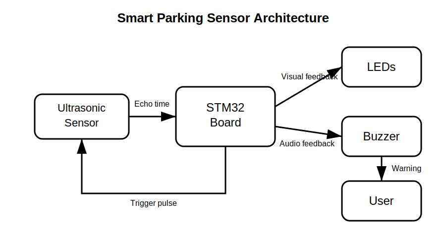

# Smart Parking Sensor

An embedded parking assistance system that measures the distance to nearby obstacles and provides real-time visual and audio feedback.

:::info

**Author:** Sebastian Marcu  \
**GitHub Project Link:** https://github.com/UPB-PMRust-Students/acs-project-2026-SebastianMarcu27

:::

---

## Description

This project implements a smart parking sensor using an STM32 development board and an ultrasonic distance sensor. The system periodically measures the distance between the sensor and a nearby obstacle. Based on this distance, the microcontroller controls multiple LEDs and a buzzer to warn the user. As the obstacle gets closer, the warning level increases through different LED states and faster or continuous buzzer signals.

---

## Motivation

Parking in tight spaces can be difficult without a clear estimation of the distance to obstacles. Modern cars often use parking sensors to help the driver avoid collisions. This project recreates a simplified version of such a system and provides a practical way to work with sensors, GPIO control, timing, distance computation, and real-time embedded feedback.

---

## Architecture

The system is built around the STM32 microcontroller, which coordinates all modules.

- **Input:** ultrasonic sensor used for distance measurement
- **Processing:** STM32 microcontroller computes distance and decides the warning level
- **Output:** LEDs and buzzer provide visual and audio feedback

The ultrasonic sensor is triggered by the microcontroller. The echo response is measured using timing logic, then converted into distance. Depending on the result, the system selects one of several warning states: safe, attention, close, or stop.

---

## Hardware

The hardware part of the project consists of an STM32 development board connected to an ultrasonic distance sensor, several LEDs, and a buzzer. The LEDs indicate the warning level visually, while the buzzer provides audio feedback. The system will be assembled on a breadboard using jumper wires and current-limiting resistors for the LEDs.

---

## Bill of Materials

| Device | Usage | Estimated Price |
|---|---|---|
| STM32 development board | Main microcontroller | Provided |
| HC-SR04 ultrasonic sensor | Distance measurement | ~10 RON |
| Green LED | Safe distance indicator | ~1 RON |
| Yellow LED | Medium distance indicator | ~1 RON |
| Red LED | Close obstacle indicator | ~1 RON |
| Active buzzer | Audio warning signal | ~5 RON |
| Resistors 220Ω / 330Ω | LED current limiting | ~3 RON |
| Breadboard | Circuit prototyping | ~10 RON |
| Jumper wires | Electrical connections | ~5 RON |
| USB cable | Programming and power | Already available |

Optional components, if time allows:

| Device | Usage | Estimated Price |
|---|---|---|
| LCD 16x2 with I2C module | Display exact distance | ~20 RON |
| Potentiometer | Adjustable sensitivity threshold | ~5 RON |

---

## Software

The software periodically sends a trigger pulse to the ultrasonic sensor and measures the duration of the echo signal. This duration is converted into distance. The measured distance is then compared with predefined thresholds.

Possible states:
- **Safe:** obstacle is far away, green LED active, buzzer off
- **Attention:** obstacle is at medium distance, yellow LED active, slow buzzer beeps
- **Close:** obstacle is near, red LED active, fast buzzer beeps
- **Stop:** obstacle is very close, red LED active, continuous buzzer signal

The implementation will use GPIO pins for LEDs and buzzer control, and timing mechanisms for measuring the ultrasonic echo signal.

---

## Log

**Week 1**
- Project idea selected and approved
- Initial documentation created
- Basic architecture and component list defined

---

## Future Improvements

- Add LCD display for showing the measured distance
- Add filtering to reduce unstable sensor readings
- Add adjustable thresholds using a potentiometer
- Design a small enclosure for a cleaner final prototype
- Add serial logging for debugging and testing

---

## Links

- Project repository: https://github.com/UPB-PMRust-Students/acs-project-2026-SebastianMarcu27

