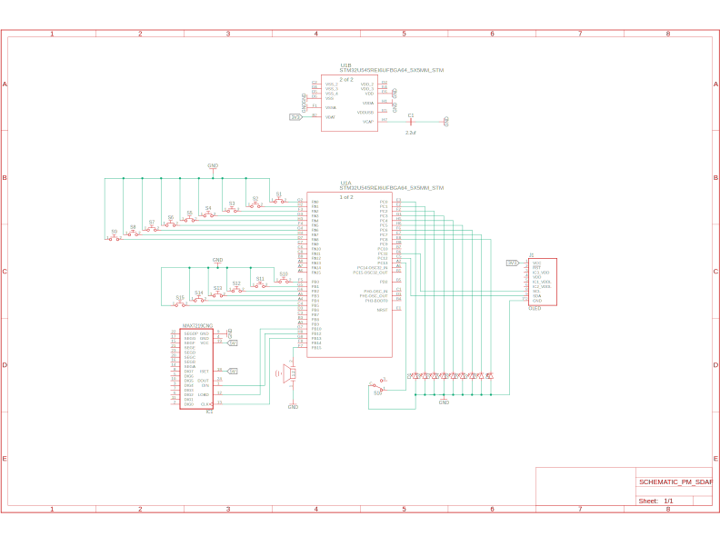

# Stream Deck and Fun
A hybrid USB HID controller and standalone reflex game for streamers and gamers.

:::info 

**Author**: Anghelina Stefan-Emilian \
**GitHub Project Link**: [https://github.com/UPB-PMRust-Students/acs-project-2026-Atackator](https://github.com/UPB-PMRust-Students/acs-project-2026-Atackator)

:::

## Description

**Stream Deck and Fun** is a dual-mode hardware peripheral designed to enhance the streaming and gaming experience. The device operates in two distinct modes, toggleable via a physical switch:
1. **Stream Deck Mode (Control):** Acts as a customizable HID interface that sends macro commands to the PC. It features a bi-directional data flow, receiving real-time system feedback such as audio levels, microphone mute status, or live stream alerts.
2. **"Loading Screen" Mode (Physical Game):** A standalone reflex-based game ("Whack-a-Button") that runs 100% on the local hardware. It is designed to keep the user engaged during long matchmaking queues or lobby wait times without needing to alt-tab from the game.

## Motivation

I chose this project to explore the idea of building an embedded project that could also be linked to areas that i have an interest in like streaming. 

## Architecture 

Main components:

**Microcontroller** (STM32 Nucleo): The central processor running Rust Embassy to manage asynchronous tasks, power distribution, and real-time logic routing.

**Inputs** (Tactile Buttons & Mini Switch): Physical triggers for stream macros and game actions, including a toggle to switch between operating modes.

**Low-Level Drivers** (GPIO, SPI, I2C): The hardware abstraction layer that handles EXTI interrupts, software debouncing, and precise digital communication protocols.

**Visual Outputs** (OLED & LED Matrix): A 1.3" screen and 8x8 matrix that display stream alerts, game targets, and live player scores.

**Feedback Actuators** (LEDs & Buzzer): Provides immediate visual and auditory cues for game hits, alerts, and system status.

## Log

### Week 5 - 11 May

### Week 12 - 18 May

### Week 19 - 25 May

## Hardware

The project utilizes the **STM32 Nucleo-U545RE-Q**, a powerful ARM Cortex-M33 microcontroller. This board was chosen for its native USB support and advanced hardware timers, which are essential for driving addressable LEDs and handling HID reports efficiently.

### Schematics

### Bill of Materials

| Device | Usage | Price |
|--------|--------|-------|
| STM32 Nucleo-U545RE-Q | Main Microcontroller (Cortex-M33) | ~165 RON |
| [Display OLED 1.3" Alb 128x64](https://sigmanortec.ro/Display-OLED-1-3-Alb-128x64-p136081872) | Dashboard and Score Display | 36 RON   |
| [Modul matrice led 8x8, MAX7219, 5V](https://sigmanortec.ro/modul-matrice-led-8x8-max7219-5v) | Volume Visualizer and Status LED | 12 RON|
| [Tactile Buttons 12x12mm](https://sigmanortec.ro/Buton-12x12x7-3-p160373654) | Inputs for Deck and Game (15 pcs) | 15 RON |
| [Buzzer activ 5v](https://sigmanortec.ro/Buzzer-activ-5v-p126421597) | Audio feedback for game events | 2 RON |
| [LEDS](https://sigmanortec.ro/led-5mm-rosu) | LED (9>) | ~10 RON |
| [Passive Components Set](https://www.optimusdigital.ro/) | Resistors, Capacitors, Cables, Breadboards | ~35 RON |

## Software

The firmware is developed in **Rust** using the Embassy framework for modern, asynchronous embedded development.

| Library | Description | Usage |
|---------|-------------|-------|
| [embassy-stm32](https://github.com/embassy-rs/embassy) | Async HAL for STM32 | Low-level peripheral control and task scheduling |
| [usbd-hid](https://crates.io/crates/usbd-hid) | USB HID class device | Emulating keyboard/media keys for PC control |
| [embedded-graphics](https://github.com/embedded-graphics/embedded-graphics) | 2D graphics library | Drawing the UI, icons, and text for the OLED |
| [ssd1306](https://crates.io/crates/ssd1306) | I2C display driver | Interfacing with the OLED panel |
| [smart-leds](https://crates.io/crates/smart-leds) | WS2812B driver | Managing RGB animations and visualizer colors |

## Links

1. [STM32U5 Reference Manual](https://www.st.com/resource/en/reference_manual/rm0456-stm32u5-series-32bit-arm-cortexm33-mcus-stmicroelectronics.pdf)
2. [The Rust Embedded Book](https://docs.rust-embedded.org/book/)
3. [Embassy Project Documentation](https://embassy.dev/)
4. [WS2812B Timing and DMA Implementation](https://controllerstech.com/ws2812-led-with-stm32/)