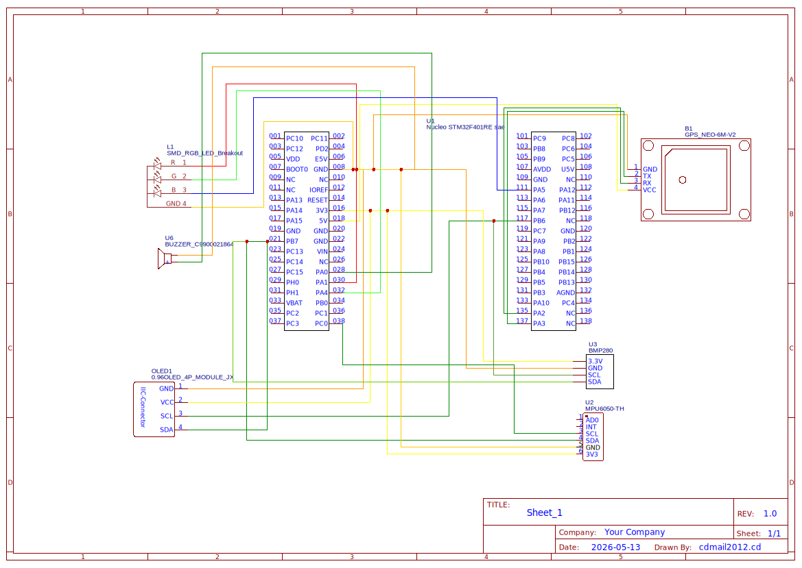

# GPS Datalogger for Bicycle

A embedded system for recording and monitoring bicycle ride data, with real-time display and event detection.

:::info

**Author**: Dorneanu Stefan Cristian \
**GitHub Project Link**: [Project Link](https://github.com/UPB-PMRust-Students/acs-project-2026-stefandorneanu)

:::

<!-- do not delete the \ after your name -->

## Description

The system acquires data from a GPS module (position, speed, altitude), an accelerometer and gyroscope (sudden braking and cornering detection) and a barometric sensor (precise altitude). Data is displayed in real time on a display and saved persistently on an SD card in CSV format. The software runs multiple parallel async tasks: GPS acquisition with data decoding, event detection from the accelerometer and gyroscope with filtering on the magnitude of the acceleration vector, live display and SD card writing. Sensor fusion combines GPS altitude with barometric altitude for improved accuracy.

## Motivation

I have been cycling regularly for the past few years and always wanted a deeper understanding of my rides beyond what a simple phone app can offer. Most commercial solutions are either too expensive or too closed to customize. Building this system from scratch on a microcontroller gives me full control over what data is collected and how it is processed. I also wanted to explore how sudden braking and cornering events can be detected in real time using an IMU, which has practical applications in cyclist safety. The project strikes a good balance between hardware integration and software complexity, making it an ideal fit for this project.

## Architecture

The system is structured around 4 main components running in parallel:

- **GPS Task** — reads position and speed data at 10Hz and calculates distance traveled
- **IMU Task** — reads the accelerometer and gyroscope and detects sudden braking events
- **Display Task** — updates the OLED screen with current data
- **SD Task** — writes data to the CSV file on the SD card once per second

All tasks communicate through Mutex and Channel mechanisms to avoid data conflicts.

## Log

<!-- write your progress here every week -->

### Week 5 - 11 May

Ordered all hardware components (GPS module, accelerometer/gyroscope MPU-6050, barometric sensor AHT20+BMP280, OLED display, SD card module, RGB LED, passive buzzer, LiPo battery, TP4056 charger, wires and breadboard). Set up the Rust embedded development environment with Embassy framework. Created individual test projects for each component. Successfully tested the buzzer (PWM signal generation), RGB LED (common anode, color cycling), OLED display (I2C communication, text rendering) and accelerometer/gyroscope (I2C data reading). Started testing the GPS module — UART communication works and NMEA sentences are being received.

### Week 12 - 18 May

### Week 19 - 25 May

## Hardware

The system uses the NUCLEO-U545RE-Q board as the main microcontroller. The GPS module provides position and speed data via UART. The accelerometer and gyroscope (IMU) are connected via I2C and detect sudden movements. The barometric sensor, also on I2C, measures atmospheric pressure to calculate altitude. An OLED display shows data in real time, while an SD card module saves all data in CSV format. The RGB LED and buzzer signal detected events such as sudden braking and sharp cornering.

### Schematics

### Bill of Materials

| Device | Usage | Price |
| -------- | -------- | ------- |
| [NUCLEO-U545RE-Q](https://www.st.com/en/evaluation-tools/nucleo-u545re-q.html) | Main microcontroller | 130 RON |
| [GPS Module NEO-6M](https://www.optimusdigital.ro/en/gps/2137-gyneo6mv2-gps-module-with-miniature-antenna.html) | Position, speed, GPS altitude | 69.99 RON |
| [Accelerometer and Gyroscope MPU-6050](https://www.optimusdigital.ro/en/inertial-sensors/96-mpu6050-accelerometer-and-gyroscope-module.html) | Sudden braking and cornering detection | 14.68 RON |
| [Barometric Sensor AHT20 + BMP280](https://www.optimusdigital.ro/en/pressure-sensors/1777-bmp280-barometric-pressure-sensor-module.html) | Temperature and barometric altitude | 12.00 RON |
| [OLED Display 0.96" I2C](https://www.optimusdigital.ro/en/lcds/2894-096-i2c-oled-module.html) | Real-time data display | 18.98 RON |
| [MicroSD Card Module](https://www.optimusdigital.ro/en/memories/1516-microsd-card-slot-module.html) | Data logging in CSV format | 4.99 RON |
| MicroSD Card 8GB | CSV file storage | 15 RON |
| RGB LED Module | Visual event indicator | 6.39 RON |
| Passive Buzzer | Audio alert for sudden braking | 2.97 RON |
| LiPo Battery 3.7V + TP4056 module | Mobile power supply and charging | 34.67 RON |
| Wires and Breadboard | Component connections | 38.96 RON |

## Software

| Library | Description | Usage |
| --------- | ------------- | ------- |
| [embassy-stm32](https://github.com/embassy-rs/embassy) | Async framework for embedded Rust | Parallel tasks, peripheral drivers |
| [embassy-time](https://github.com/embassy-rs/embassy) | Time management in Embassy | Async timers and delays |
| [embedded-sdmmc](https://github.com/rust-embedded-community/embedded-sdmmc-rs) | FAT32 file system for SD | CSV writing on SD card |
| [mpu6050](https://github.com/juliangaal/mpu6050) | Driver for accelerometer/gyroscope | IMU data reading via I2C |
| [bmp280-ehal](https://github.com/uber-foo/bmp280) | Driver for barometric sensor | Temperature and pressure reading |
| [ssd1306](https://github.com/jamwaffles/ssd1306) | OLED display driver | Real-time data display |
| [libm](https://github.com/rust-lang/libm) | Math functions for no_std | Haversine formula, sqrt |

## Links

1. [Embassy Rust Framework](https://embassy.dev)
2. [STM32U545 Reference Manual](https://www.st.com/resource/en/reference_manual/rm0456-stm32u5-series-armbased-32bit-mcus-stmicroelectronics.pdf)
3. [Embedded Rust Programming](https://docs.rust-embedded.org/book/)
