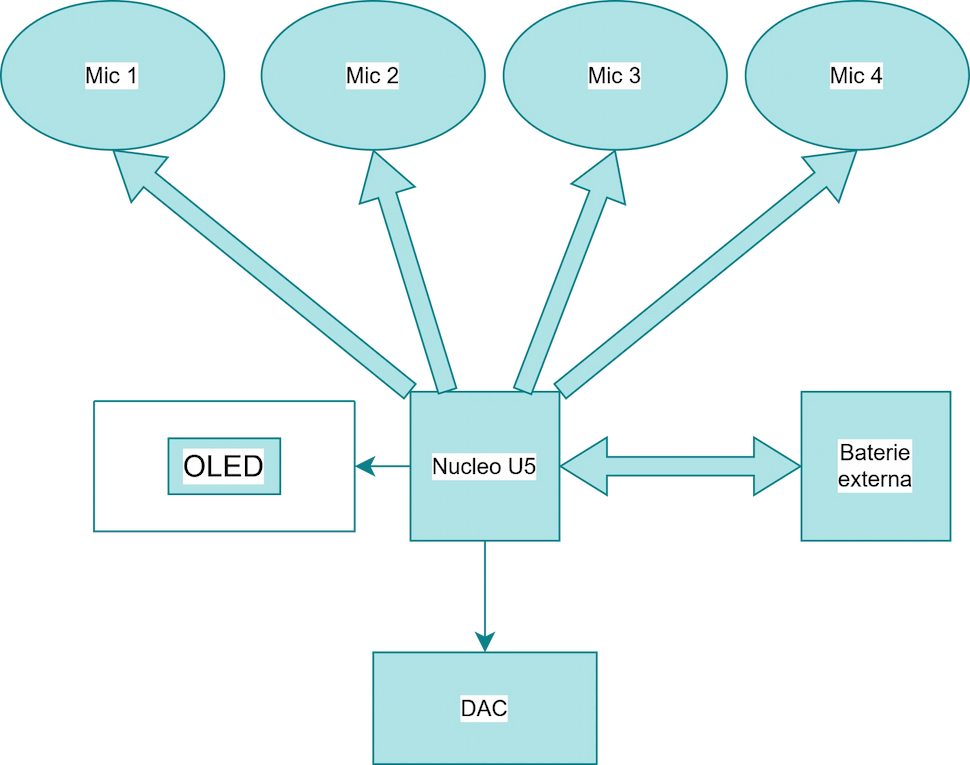
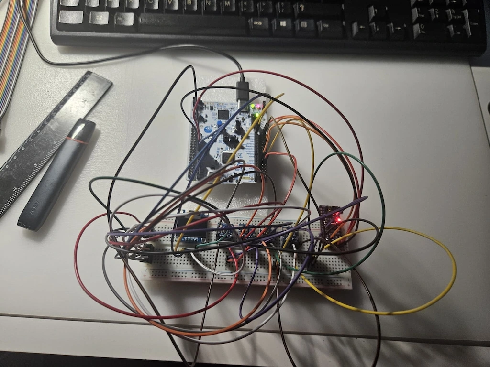
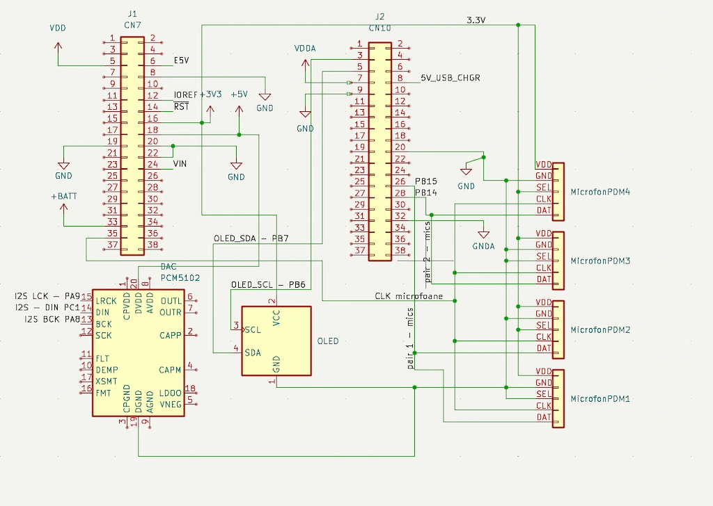

# Microfon Parabolic Digital: Beamforming Audio în Timp Real
Sistem de captură audio direcțională bazat pe un array de microfoane PDM și procesare digitală pe STM32U5.

:::info

**Author**: Manda Stefan-Eduard \
**GitHub Project Link**: https://github.com/UPB-PMRust-Students/acs-project-2026-N1mbusul

:::

## Description

Ideea proiectului este să fac un microfon care "vede" doar într-o singură direcție. Mai exact, folosesc 4 microfoane mici lipite pe o riglă la distanțe egale. Toate cele 4 captează sunetul în același timp, iar placa mea Nucleo adună semnalele lor folosind beamforming. Dacă cineva vorbește fix din față, vocea lui se aude clar și tare. Dacă vine zgomot din lateral, placa îl "anulează" prin software. La final, poți să bagi căștile în montaj și să auzi rezultatul filtrat, iar pe un ecran OLED mic pun un grafic care arată nivelul volumului si mesaje de eroare daca exista.

## Motivation

Am ales proiectul acesta pentru că mi s-a părut super interesant cum poți să "rotești" sau să focusezi un microfon doar din cod, fără să-l miști fizic. Mi se pare o metodă foarte tare de a scăpa de zgomotul de fundal si sincer am văzut-o ca o provocare.
În plus, am vrut să testez placa asta Nucleo U5 care e destul de nouă și am vazut ca are cateva functii speciale pentru audio (perifericul mdf). Totodată, e o ocazie bună să învăț Rust mai serios pe sisteme embedded, pentru că tot aud că e mult mai sigur și mai rapid decât C-ul clasic.

## Architecture

Proiectul este structurat pe un flux de date continuu, împărțit în patru etape principale:

1. **Captura Analogică și Digitalizarea (Input)**:
   Cele 4 microfoane PDM sunt legate în paralel la același semnal de ceas generat de placa Nucleo. Ele trimit fluxuri de biți (0 și 1) către pinii procesorului.

2. **Filtrarea Hardware (MDF)**:
   Semnalul brut de la microfoane intră în perifericul **MDF** (Multi-function Digital Filter). Totul se întâmplă hardware, deci procesorul nu stă ocupat cu asta.

3. **Logica de Procesare (Rust + DMA)**:
   Datele filtrate sunt mutate automat în memoria RAM prin **DMA**.
   - Iau eșantioanele de la cele 4 microfoane.
   - Le adun și fac media lor (algoritmul **Delay-and-Sum**).
   - Acest proces anulează zgomotul care vine din lateral și păstrează doar ce vine din față.

4. **Ieșirea Audio și Vizuală (Output)**:
   - Sunetul procesat este trimis prin protocolul **I2S** către DAC-ul extern, unde pot conecta căștile.
   - În paralel, calculez intensitatea sunetului și trimit datele prin **I2C** către ecranul OLED pentru a avea un feedback vizual (un VU-meter).

## Log

### Week 5

Am stabilit ideea de proiect și am primit aprobarea că este ok.

### Week 7-8

Am dat comanda de piese de pe AlieExpress și am început să caut documentația embassy-rs și să fac un prototip de case pt tot proiectul in Fusion360.

### Week 9

Mi-au venit piesele și m am apucat să scriu documentația.

### Week 11

Am termiant circuitul si mai urmeaza sa i fac un case printat 3d sau un prototip de cutie pt a fi ergonomic

## Hardware

Sistemul se bazează pe placa de dezvoltare Nucleo-U545RE-Q.

Configuratia fizica include:
- **Array-ul de captură**: 4 microfoane digitale PDM, montate liniar la o distanță fixă de 2 cm între ele. Am ales această distanță pentru a optimiza focalizarea pe frecvențele vocii umane și pentru a evita erorile de fază.
- **Sistemul de ieșire**: Un modul DAC I2S  dotat cu mufă jack de 3.5mm, care îmi permite să ascult în timp real sunetul procesat prin orice pereche de căști standard.
- **Interfața vizuală**: Un ecran OLED de 0.96" pe bus-ul I2C, pe care voi afișa starea filtrelor și un indicator vizual pentru intensitatea sunetului captat.

## Schematics

Schematica electrica a sistemului include conexiunile pentru bus-ul de date PDM(microfoane), interfata I2S(DAC audio) si magistrala I2C pentru ecranul OLED

 

## Bill of Materials

| Device | Price |
|--------|--------|
| [Nucleo-U545RE-Q] | Primita de la facultate
| [4x PDM MEMS Mic (MP34DT01)](https://a.aliexpress.com/_EIQWrs6) | ~ 120 de lei |
| [I2S DAC PCM5102](https://a.aliexpress.com/_EHXVHhy) | ~ 30 de lei |
| [OLED 0.96" I2C](https://a.aliexpress.com/_EygJIYq) | ~ 20 de lei |
| [Breadboard & Jumpers] | ~ 30 de lei |

## Software

- TODO: se va adauga pe parcurs

## Links

| Library | Description | Usage |
|---------|-------------|-------|
| [embassy-stm32](https://github.com/embassy-rs/embassy) | Hardware Abstraction Layer pentru Rust | Gestiune periferice (I2C, I2S, MDF, DMA) |
| [cmsis-dsp](https://crates.io/crates/cmsis-dsp) | ARM CMSIS-DSP bindings | Procesare matematică optimizată pentru Cortex-M |
| [embedded-graphics](https://github.com/embedded-graphics/embedded-graphics) | 2D graphics library | Randare VU-meter și text pe OLED |
| [ssd1306](https://github.com/jamwaffles/ssd1306) | Display driver pentru OLED | Controlerul ecranului prin I2C |

