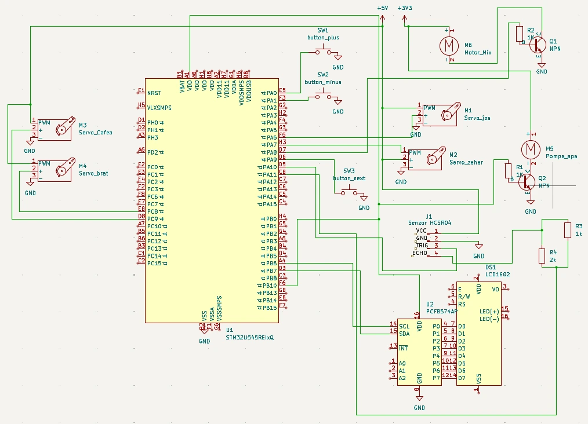

# Automated Coffee Maker
A machine for iced coffee

:::info 

**Author**: Dumitrescu Teodora Cristina \
**GitHub Project Link**: https://github.com/UPB-PMRust-Students/acs-project-2026-t3o27-1

:::

<!-- do not delete the \ after your name -->
<!-- ATENTIE PUNE SENZOR SCR DE DISTANTA PT A VERIFICA CA EXISTA PAHARUL !!!!!!!!!!!!!!!!!!!! -->

## Description

The project is an automated coffee machine that allows the user to choose exactly how much sugar and coffee they want. The process is simple: you turn on the device with a button, select your desired quantities from the menu, and then press a start button. The system then pours the sugar, coffee, and water in the correct order and mixes them together. The result is a finished iced coffee.

## Motivation

I chose this project because I wanted to build something functional that I can actually use at home after the course is finished. I also find it very interesting to take a common object that you can normally buy in a store and try to recreate it from scratch.

## Architecture 

<!-- Add here the schematics with the architecture of your project. Make sure to include:
 - what are the main components (architecture components, not hardware components)
 - how they connect with each other -->

Input: Consists of push-buttons used to select the quantities of coffee and sugar, and an LCD display that provides feedback to the user. Additionally, the user must place the cup in the designated spot for the machine to start.

Processing: The STM32 Nucleo processes the signals from the buttons and coordinates the other components, managing the timing and quantities required for the recipe through the SG90 servo motors. It also verifies that the cup is properly placed with the help of the distance sensor and resets the system once the process is finished. With the help of the water pump and the mixer, the coffee is ready.


## Log

<!-- write your progress here every week -->
### Week 20 - 26 April
Preparing the project documentation and finalizing the structural layout. Purchasing the components.

### Week 27 April - 3 May
Finishing the documentation and starting to experiment with the hardware components. Making the arhitectural scheme.

### Week 4 - 10 May
Making some snippets of code separately for the components. Trying out different design ideas for the dispensers.

### Week 11 - 17 May
Assembled the box for the automate. Completed the wiring for the project. Testing the coffee quantities.

### Week 18 - 23 May

## Hardware
Major Components Used
The servo motors: they disperse the quantities of sugar and coffee and also rotate the platform; also, one is helping the mixer move up and down.

The buttons: they help us select the quantities.

The LCD: it displays the feedback of the buttons.

The pump: it uses a transistor in order to function for an amount of time.

The mixer: it is a motor that mixes the ingredients in the final stage.

### Schematics




### Bill of Materials

<!-- Fill out this table with all the hardware components that you might need .

The format is 
```
| [Device](link://to/device) | This is used ... | [price](link://to/store) |

```

-->

| Device | Usage | Price |
|--------|--------|-------|
| [STM32 Nucleo-U545RE-Q](https://www.st.com/en/evaluation-tools/nucleo-u545re-q.html) | Main microcontroller | Provided by Lab |
| [Servo SG90 (4 pieces)](https://www.temu.com/ro-en/5-10pcs--micro-servo-motors----9g-servo-kit-used-for-remote-control-helicopters-airplanes-cars-boats-robot--hands-walking-servo-door-lock-control-g-601100158512008.html?_oak_mp_inf=EIjXsMuo1ogBGiBiMjY5NGU5Nzk0OGU0YzJiODY4OWNjZWFlZDU1NWUxMiDmp6uw2zM%3D&top_gallery_url=https%3A%2F%2Fimg.kwcdn.com%2Fproduct%2Ffancy%2F793816fb-d6b7-4516-aa4b-e1deca287b15.jpg&spec_gallery_id=86194&refer_page_sn=10009&freesia_scene=2&_oak_freesia_scene=2&_oak_rec_ext_1=NDU1NQ&_oak_gallery_order=368504330%2C1949439591%2C930347573%2C743949400%2C1107688170&search_key=servo%20sg90&refer_page_el_sn=200049&ab_scene=1&enable_vqr=0&_x_sessn_id=fun9allzcx&refer_page_name=search_result&refer_page_id=10009_1776875656999_fapko68tx6) | Solid ingredients dispenser mechanism | 45 RON |
| [LCD 1602 with I2C](https://www.emag.ro/display-lcd-2-x-16-cu-convertor-i2c-80-x-35-mm-verde-albastru-negru-2-e-001/pd/DHRJ0LMBM/) | User menu and status display | 23 RON |
| [Tactile Buttons (3 pieces)](https://www.temu.com/ro-en/premium-skrgaed010--665-mm-mini-momentary-tactile-switch-robot-component-space-saving-design-ideal-for--great-for-or--robotics-applications-compatible-with--esp32---g-601104438055515.html?_oak_mp_inf=ENukg8S41ogBGiBmN2RmMzBlNWEwNWQ0NjU5YTAyNGQ4YzM5NmJkMTkwMSCQ%2Bq6w2zM%3D&top_gallery_url=https%3A%2F%2Fimg.kwcdn.com%2Fproduct%2Fopen%2F6b3673bdeeee43f085c9a852c5650cb3-goods.jpeg&spec_gallery_id=25439598800&refer_page_sn=10009&freesia_scene=2&_oak_freesia_scene=2&_oak_rec_ext_1=OTY3&_oak_gallery_order=1707219694%2C1401704462%2C373535030%2C1348726518%2C1578384367&search_key=buttons&refer_page_el_sn=200049&ab_scene=1&enable_vqr=0&refer_page_name=search_result&refer_page_id=10009_1776875656999_fapko68tx6&_x_sessn_id=fun9allzcx) | User input for quantity and start | 3 RON |
| [DC Mixer Motor](https://www.emag.ro/mixer-spuma-de-lapte-awwaline-negru-ideal-pentru-cappuccino-caffe-latte-ciocolata-calda-cafea-cu-lapte-105466021/pd/DQVQF4MBM/?ref=history-shopping_482864334_51399_1) | Homogenizing the coffee (extracted from handheld mixer) | 18 RON |
| [Water Pump 3.7V](https://www.temu.com/ro-en/1p-mini-370-vacuum-water-pump-electric--motor--instrument---high-pressure-dual-voltage-3-7v-6v-12v--for-home-and-professional-use-hydraulic-pumping-durable-plastic-pump-mini-vacuum-pump-g-601105003866108.html?_oak_mp_inf=EPzP6dG61ogBGiAzYTk2OGE4NTM4MDE0NmIwODEzMDlmN2U1ZGQ3ZTU0MSCP%2BLOw2zM%3D&top_gallery_url=https%3A%2F%2Fimg.kwcdn.com%2Fproduct%2Ffancy%2F9d19e137-dc05-4b27-acd3-9fbbb7f2ca5d.jpg&spec_gallery_id=29368686273&refer_page_sn=10009&freesia_scene=2&_oak_freesia_scene=2&_oak_rec_ext_1=MjA0OA&_oak_gallery_order=424776565%2C820203985%2C1431435730%2C1215000053%2C1777123575&search_key=water%20pump&refer_page_el_sn=200049&ab_scene=1&enable_vqr=0&_x_sessn_id=fun9allzcx&refer_page_name=search_result&refer_page_id=10009_1776875798082_vrwboacf4l) | Liquid dispensing | 20 RON |
| [Water hose](https://www.temu.com/ro-en/2m-4m-6m-transparent--elastic-soft-and-lightweight-pvc-hose-4mm-6mm-8mm-10mm-with-inner-diameter-suitable-for-small-water-pumps--aquariums-gardens--industrial-pumping-water-dispensers-etc-g-606064460319831.html?_oak_mp_inf=ENeY%2BYbm5okBGiAwMTFhYzU3YzZhYmM0Y2U4YmVmOTY5MTBjNWY4NzczYSCz77mw2zM%3D&top_gallery_url=https%3A%2F%2Fimg.kwcdn.com%2Fproduct%2Ffancy%2F614f0c69-e0e4-4185-81cd-c7b1b5b7d4c1.jpg&spec_gallery_id=38055145245&refer_page_sn=10009&freesia_scene=2&_oak_freesia_scene=2&_oak_rec_ext_1=MTE3OA&_oak_gallery_order=2125134407%2C1108771025%2C1250978232%2C1655611518%2C536406149&search_key=furtun&refer_page_el_sn=200049&ab_scene=1&enable_vqr=0&_x_sessn_id=fun9allzcx&refer_page_name=search_result&refer_page_id=10009_1776875895636_ofu63k3z5k) | The hose for the water pump | 12 RON |
| [HC-SR04 Sensor ](https://www.temu.com/ro-en/1pc-hc-sr04--module-distance-measurement-module-sensor8-g-605514972921860.html?_oak_mp_inf=EISA%2BIbn1okBGiBiNjJlZWI3MWI0NzE0YjMxOWZhMDY4ZDRkMzhmNWEyMSD9p7aw2zM%3D&top_gallery_url=https%3A%2F%2Fimg.kwcdn.com%2Fproduct%2Falgo_framework%2FImageCm2InAlgo%2F0dc4a960-1e1d-11f1-a664-0a580aa946c4.jpg&spec_gallery_id=35673484673&refer_page_sn=10009&freesia_scene=2&_oak_freesia_scene=2&_oak_rec_ext_1=MTk0Mw&_oak_gallery_order=138927405%2C1361481989%2C2039794419%2C515447104%2C1381815348&search_key=sensor%20hc%20sr04&refer_page_el_sn=200049&ab_scene=1&enable_vqr=0&refer_page_name=search_result&refer_page_id=10009_1776875823674_lc4i9zqrjt&_x_sessn_id=fun9allzcx) | Detecting the cup | 18 RON |
| [Plexiglas ](https://www.leroymerlin.ro/produse/placi-plexiglas-si-pvc/876/placa-plexiglas-hobbyglass-25-x-50-cm-grosime-4-mm-transparenta/25354) | Making the circle where the cup stays | 15 RON |
| [Wire ](https://www.temu.com/ro-en/120pcs-colorful--wire-kit-male-to-male-female-to-female-male-to-female-connectors-40pin-breadboard-jumper-cables-in-3-9-7-9-11-8-15-7-lengths-for-diy-projects-g-601099549601347.html?_oak_mp_inf=EMPcg6mm1ogBGiAwOTg3MzJmODVjODk0NDgwOTRiZmI2NjRjYTYzYmM0NyDSp5PI4TM%3D&top_gallery_url=https%3A%2F%2Fimg.kwcdn.com%2Fproduct%2Ffancy%2F9a159653-cc4a-47a5-842b-7cc03d4e5e29.jpg&spec_gallery_id=3442&refer_page_sn=10009&freesia_scene=2&_oak_freesia_scene=2&_oak_rec_ext_1=MjAwMw&_oak_gallery_order=1793703736%2C2133695004%2C61436064%2C569981801%2C2012369665&search_key=jumper%20wire&refer_page_el_sn=200049&ab_scene=1&enable_vqr=0&refer_page_name=search_result&refer_page_id=10009_1778536201697_5g1y4mnl0l&_x_sessn_id=66c2ywi4n3) | Making the conexions | 20 RON |
|[Charger 12V 2A](https://www.emag.ro/alimentator-12v-2a-st122a-504096/pd/DSYHVYBBM/?ref=history-shopping_485522869_18482_1)| The power of the project| 18 RON |


## Software

| Library | Description | Usage |
|---------|-------------|-------|
| [embassy-stm32](https://github.com/embassy-rs/embassy) | Hardware abstraction layer for the microcontroller | The interface for GPIO, PWM, and I2C peripherals|
| [embassy-executor](https://github.com/embassy-rs/embassy) | Task executor for async tasks | Managing parallel tasks for the pump, servos, and sensors |
| [embassy-time](https://github.com/embassy-rs/embassy) | Time management library | Handling delays  |
| [embedded-graphics](https://github.com/embedded-graphics/embedded-graphics) | 2D graphics library | Used for drawing to the display |
| [defmt](https://github.com/knurling-rs/defmt) | Efficient logging framework | Used for printing status  |
| [panic-probe](https://github.com/knurling-rs/panic-probe) | Panic handler | Used for handling errors |


## Links

<!-- Add a few links that inspired you and that you think you will use for your project -->

1. [embassy](https://github.com/embassy-rs/embassy)

...


