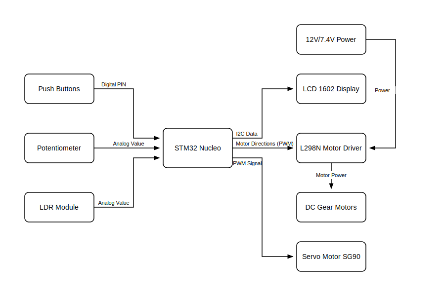

# Interactive Mobile Safe
Multi-factor authentication puzzle box with automatic evasion

:::info

**Author**: Calciu Tudor Andrei \
**GitHub Project Link**: [https://github.com/UPB-PMRust-Students/acs-project-2026-TudorAndreiCalciu](https://github.com/UPB-PMRust-Students/acs-project-2026-TudorAndreiCalciu)

:::

## Description
This project presents an interactive mobile safe that acts as an "escape room" style puzzle box. The system protects its contents and requires the user to successfully pass three consecutive validation stages to unlock: entering a digital PIN via push buttons, calibrating an analog potentiometer to a specific threshold, and blocking light from reaching an LDR sensor. 

To prevent brute-force attacks, the safe features an active evasion mechanism. If the user fails the puzzle stages three times, the system triggers two DC motors that physically drive the safe away from the user to a safe distance, temporarily locking all inputs.

## Motivation
The main idea for this project was inspired by puzzle boxes and escape room mechanics. I wanted to build a security system that isn't just a static box but interacts physically with its environment. Combining standard sensory inputs (digital and analog) with a mobile robotics platform felt like a great engineering challenge, blending logic state machines with physical movement and anti-tampering behaviors.

## Architecture
 

Main Components:
- **Microcontroller (STM32 Nucleo)**: The brain of the project, managing the state machine and processing inputs/outputs.
- **Display (LCD 1602 I2C)**: Guides the user through the puzzle stages and displays warnings.
- **Sensors (Potentiometer & LDR)**: Used for the analog calibration and environmental light puzzles.
- **Buttons**: Used to input the digital PIN code and navigate the interface.
- **Servo Motor**: Used to actuate the physical locking mechanism (latch) of the safe.
- **DC Motors & Motor Driver**: Used to spin the wheels and drive the safe away during the evasion state.
- **Power Supply**: Separate batteries for the motors to prevent voltage drops and noise on the logic board.

## Log

### Week 27 April - 1 May
Created documentation, finalized the logic state machine concept, and defined the Bill of Materials.

### Week 5 - 11 May
[In Progress]

### Week 12 - 18 May
[To be updated]

### Week 19 - 25 May
[To be updated]

## Hardware

Hardware used:
- **Microcontroller (STM32 Nucleo)**: Controls all the other components.
- **Display**: LCD 1602 with I2C module for user interface.
- **Buttons**: 4x Push buttons for entering the PIN and interacting with the menu.
- **Analog Sensors**: 10k Potentiometer and an LDR (Light Dependent Resistor) module.
- **DC Motors & Wheels**: 3V-6V DC Motors with a 2WD robot chassis.
- **Motor Driver**: L298N module controls the speed and direction of the two DC motors.
- **Servo Motor**: SG90 90-degree motor used for releasing the latch.
- **Power Supply**: 2x 18650 Li-Ion batteries to power the L298N driver and motors.

### Schematics

TBD.

### Bill of Materials

| Device | Usage | Price |
| ------------------------------------------ | -------------------------------------------------------- | ----------------|
| STM32 Nucleo-U545RE-Q | Microcontroller | [114.76 RON](https://ro.farnell.com/stmicroelectronics/nucleo-u545re-q/development-brd-32bit-arm-cortex/dp/4216396) |
| Motor driver L298N | Controls DC Motors direction and speed | [12.00 RON](https://www.bitmi.ro/modul-driver-l298n-cu-punte-h-dubla-pentru-motoare-dc-stepper-10400.html?gad_source=1&gad_campaignid=22990790771&gbraid=0AAAAADLag-nuAoi3yuhR6LSwNjQ5iqQMp&gclid=Cj0KCQjwkrzPBhCqARIsAJN460m_WP2kPLRzmiw7AYIyL9DB74mZlgeQQ3BQJfOd9w9X08gYq0v_XN0aAqOEEALw_wcB) |
| 2WD Robot Car Chassis Kit | Mechanical platform, wheels, and DC motors | [45.00 RON](https://www.emag.ro/sasiu-arduino-car-3874783591904/pd/D37L8DYBM/?cmpid=148238&utm_source=google&utm_medium=cpc&utm_campaign=(RO:Whoop!)_3P-Y_%3e_Jucarii_hobby&utm_content=79559830754&gad_source=1&gad_campaignid=2078923891&gbraid=0AAAAACvmxQiow8mBQZ-Asnn5CB6Zb728L&gclid=Cj0KCQjwkrzPBhCqARIsAJN460mom0uIhbaCQqcXeu6Fqw8I_TmADUQesVnb78eB7kMQxa7gcmkq1FUaAi0NEALw_wcB) |
| LCD 1602 Display with I2C | Displays puzzle instructions and status | [24.20 RON](https://ardushop.ro/ro/display-uri-si-led-uri/2348-lcd-display-1602-verde-adaptor-i2c-6427854000996.html?gad_source=1&gad_campaignid=22058879462&gbraid=0AAAAADlKU-6DWqqRb1pFWG_2JFxC5XHy8&gclid=Cj0KCQjwkrzPBhCqARIsAJN460lQu8oDhC8rjvNPywRlIUqaMfLK2Nm0T-dX5h7RIm3_chVEMz8v0zQaAnr_EALw_wcB) |
| Micro Servomotor SG90 | Unlocks the physical latch | [9.50 RON](https://sigmanortec.ro/Servomotor-SG90-limit-switch-p141662062?SubmitCurrency=1&id_currency=2&gad_source=1&gad_campaignid=23069763085&gbraid=0AAAAAC3W72Okq9Nrnwsu4_ykIJCkGAPA8&gclid=Cj0KCQjwkrzPBhCqARIsAJN460lMq9jFqtZwJ0JriYhuUAXx6i20zws4fVgK2csO3WHhHg3Dq2AXKgUaAqyFEALw_wcB) |
| Potentiometer 10k | Analog input for the calibration puzzle | [13.65 RON](https://sigmanortec.ro/modul-potentiometru-rotativ-10k-liniar-3-5v?SubmitCurrency=1&id_currency=2&gad_source=1&gad_campaignid=23069763085&gbraid=0AAAAAC3W72Okq9Nrnwsu4_ykIJCkGAPA8&gclid=Cj0KCQjwkrzPBhCqARIsAJN460nR9i8yTdcC_fzbGDp5Be7-FZYNX5r4DQanP1FZm_5xu4lMI4W2CRoaAlX5EALw_wcB) |
| LDR Light Sensor Module | Detects shadow for the third puzzle | [3.42 RON](https://sigmanortec.ro/Senzor-lumina-fotorezistor-p125423559?SubmitCurrency=1&id_currency=2&gad_source=1&gad_campaignid=23069763085&gbraid=0AAAAAC3W72Okq9Nrnwsu4_ykIJCkGAPA8&gclid=Cj0KCQjwkrzPBhCqARIsAJN460nKTSKHE29bexAtdlbGSRPPKF4cznd8ReaMnvbvTHNgwq9iRahxjZIaAh0DEALw_wcB) |
| Push Buttons | PIN input buttons | [2.00 RON](https://vectro.ro/produs/push-buton-fara-retinere-10x25mm/?utm_source=Google%20Shopping&utm_campaign=Vectro%20-%20Toate%20Produsele&utm_medium=cpc&utm_term=37393&gad_source=1&gad_campaignid=17091351278&gbraid=0AAAAAohTOtZfVyTu0DwpRsMGRwFri7Wo1&gclid=Cj0KCQjwkrzPBhCqARIsAJN460nQE4EabWMaePPcGzGUv2FquVXa5lZoUaTcv-mGjXSfCgI3DrCB2c4aAh4AEALw_wcB) |
| 2x 18650 Batteries + Holder | Power supply for the L298N and motors | [36.00 RON](https://sigmanortec.ro/en/battery-holder-18650-2s) |

## Software

| Library        | Description                                                                 | Usage                                                                 |
|---------------------------|-----------------------------------------------------------------------------|-----------------------------------------------------------------------|
| [embassy-executor](https://docs.rs/embassy-executor/latest/embassy_executor/) | Lightweight async executor for embedded tasks | Runs concurrent tasks for motor control, UI updates, and sensor polling. |
| [embassy-time](https://docs.embassy.dev/embassy-time/) | Time management and delays | Manages timing for the evasion sequence and button debouncing. |
| [embassy-stm32::timer::simple_pwm](https://docs.embassy.dev/embassy-stm32/git/stm32c011d6/timer/simple_pwm/index.html) | PWM module for motor/servo control | Controls DC motor speed and sets the servo angle for the latch. |
| [embassy-stm32::adc](https://docs.embassy.dev/embassy-stm32/git/stm32c011d6/adc/index.html) | Analog-to-Digital Converter module | Reads values from the potentiometer and LDR sensor. |
| [embassy-stm32::i2c](https://docs.embassy.dev/embassy-stm32/git/stm32c011d6/i2c/index.html) | I2C communication protocol | Handles data transmission to the 1602 LCD display. |

## Links

1. [L298N Motor Driver Technical Tutorial](https://lastminuteengineers.com/l298n-dc-stepper-driver-arduino-tutorial/)
2. [Embassy-rs Documentation](https://embassy.dev/book/)
