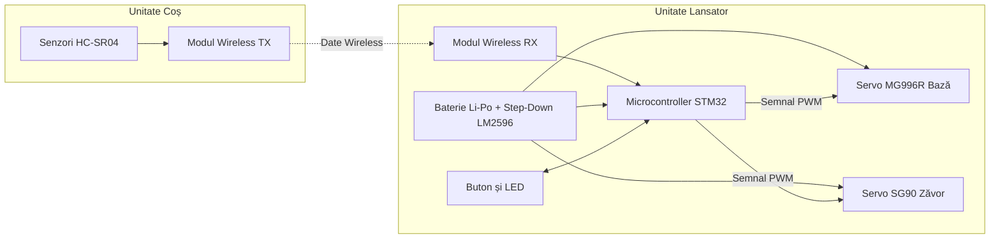
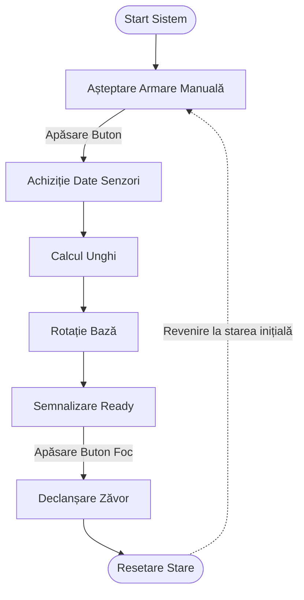

# Lansator Automat de Basket (Miniatură)
Un sistem mecatronic destinat aruncării mingilor de ping-pong către un coș de basket în miniatură.

:::info 

**Author**: Raris Vlad-Cristian \
**GitHub Project Link**: https://github.com/UPB-PMRust-Students/acs-project-2026-duduvlad

:::

## Descriere

Acest proiect implementează un sistem automat de lansare pentru basket în miniatură. Obiectivul principal este ca dispozitivul de lansare să identifice poziția coșului în cameră și să se orienteze precis pe axa orizontală înainte de tragere. Controlul este gestionat de un microcontroller STM32, iar detectarea spațială este realizată prin senzori ultrasonici.

## Motivație
Alegerea acestui proiect a fost determinată de dorința de a explora controlul precis al mișcării și fuziunea datelor de la senzori într-un context practic. Implementarea unui lansator de basket implică provocări specifice de inginerie:

* **Aplicabilitate practică:** Algoritmii de triangulare și orientare automată sunt fundamentali în robotică și sistemele de poziționare.
* **Rust în sisteme embedded:** Utilizarea framework-ului Embassy permite scrierea unui cod asincron și sigur din punct de vedere al memoriei, esențial pentru gestionarea simultană a senzorilor și a motoarelor.
* **Integrare Hardware-Software:** Proiectul necesită corelarea calculelor trigonometrice cu semnalele PWM trimise către servomotoare pentru a obține o precizie ridicată de ochire.
* **Optimizare mecanică:** Utilizarea servomotorului mic exclusiv pentru eliberarea trăgaciului rezolvă problema durabilității componentelor sub tensiune mare.

## Arhitectură

### Schema Bloc

**Conexiunile Componentelor:**
Sistemul este compus din unitatea de calcul (STM32) și unitatea de detecție (montată pe coș). Unitatea de detecție trimite distanțele măsurate către STM32 prin comunicație wireless. Modulul matematic din interiorul STM32 calculează unghiul de rotație necesar. Controlerul de motoare trimite semnale PWM către servo-ul MG996R pentru aliniere și către SG90 pentru declanșare. Interfața cu utilizatorul este formată dintr-un buton fizic și un LED de stare, gestionate prin pini GPIO cu întreruperi hardware. Alimentarea este separată printr-un modul Step-Down pentru a proteja microcontrollerul de consumul ridicat al motoarelor.

## Jurnal de Proiect

soon...

## Hardware
Sistemul utilizează următoarele componente hardware principale:

* **Microcontroller STM32:** Unitatea centrală de procesare a logicii și calculelor.
* **Servo MG996R:** Motor pentru rotirea bazei lansatorului.
* **Servo SG90:** Motor utilizat pentru mecanismul de declanșare.
* **Senzori HC-SR04:** Pereche de senzori pentru măsurarea distanțelor necesare triangulării.
* **Modul Step-Down LM2596:** Regulator de tensiune pentru alimentarea constantă la 5V a servomotoarelor.
* **Buton și LED:** Elemente de control și feedback pentru utilizator.

Protocoale și semnale utilizate:
* **PWM (Pulse Width Modulation):** Pentru controlul poziției servomotoarelor.
* **EXTI (External Interrupts):** Pentru citirea instantanee a butonului de declanșare.
* **Wireless/UART:** Pentru transferul datelor de telemetrie între coș și lansator.
--- urmeaza si altele

## Listă de materiale

| Dispozitiv | Utilizare | Preț Estimativ |
| :--- | :--- | :--- |
| Placă STM32 | Unitatea centrală de control | ~25 RON |
| Servo MG996R | Orientarea orizontală a lansatorului | ~35 RON |
| Servo SG90 | Mecanismul de blocare/eliberare (zăvor) | ~15 RON |
| 2x HC-SR04 | Măsurarea distanțelor pentru poziționare | ~20 RON |
| LM2596 Step-Down | Stabilizarea tensiunii la 5V pentru motoare | ~15 RON |
| Baterie Li-Po 7.4V | Sursa principală de energie | ~50 RON |
| Module Wireless RF | Transferul datelor de la senzori | ~25 RON |
| Materiale brute | Lemn, elastic, șuruburi, fire conexiune | ~35 RON |
| **Total Estimativ** | **-** | **~220 RON** |

## Software

### Prezentare Generală
Implementarea software folosește framework-ul Embassy pentru Rust, oferind o arhitectură asincronă. Aplicația gestionează fluxul de lucru prin stări logice succesive, asigurând controlul precis al timpului pentru semnalele PWM fără a bloca procesorul.

### Design Detaliat
Codul este structurat pe patru piloni principali:

1. **Gestionarea Stărilor:** Controlează succesiunea operațiunilor (IDLE, OCHIRE, READY, FOC). Previne executarea accidentală a comenzilor de către motoare în timpul încărcării manuale.
2. **Modulul de Triangulare:** Procesează distanțele primite de la senzorii de pe coș și aplică funcții trigonometrice pentru a extrage unghiul de pan necesar alinierii.
3. **Controlul Motoarelor:** Calculează factorul de umplere (duty cycle) pentru semnalele PWM în vederea poziționării servomotorului principal și acționării rapide a zăvorului.
4. **Interfața Utilizator:** Monitorizează pinul butonului folosind întreruperi externe (EXTI) pentru a asigura un răspuns prompt la comanda de tragere.

### Diagramă Funcțională

