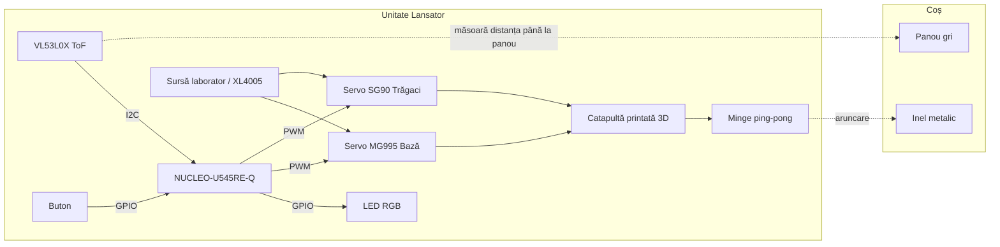
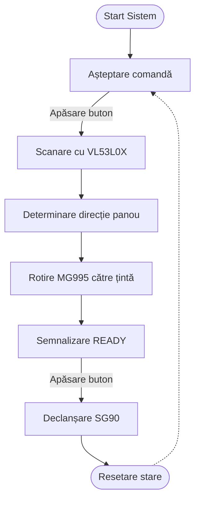

# Lansator Automat de Basket (Miniatură)

Un sistem mecatronic destinat aruncării mingilor de ping-pong către un coș de basket în miniatură.

:::info

**Author**: Raris Vlad-Cristian \
**GitHub Project Link**: https://github.com/UPB-PMRust-Students/acs-project-2026-duduvlad

:::

## Descriere

Acest proiect implementează un lansator automat pentru basket în miniatură. Sistemul folosește o catapultă pentru mingi de ping-pong, montată pe o bază rotativă. Lansatorul detectează panoul coșului cu ajutorul unui senzor de distanță VL53L0X, se orientează pe axa orizontală și apoi declanșează mecanismul de aruncare.

Controlul este realizat cu o placă NUCLEO-U545RE-Q, iar codul proiectului este scris în Rust. Coșul este construit separat și are un panou gri în spate, folosit ca suprafață de detecție pentru senzor. Pentru a simplifica problema de poziționare, lansatorul este deplasat pe un cerc în jurul coșului, iar sistemul trebuie să determine unghiul potrivit de orientare către panou.

## Motivație

Alegerea acestui proiect a fost determinată de dorința de a combina controlul mecanic, măsurarea distanței și programarea embedded în Rust într-un sistem vizibil și ușor de testat.

* **Control embedded:** Proiectul folosește semnale PWM pentru servomotoare și I2C pentru senzorul de distanță.
* **Rust în sisteme embedded:** Implementarea urmărește folosirea Rust pentru controlul sigur și predictibil al perifericelor.
* **Integrare hardware-software:** Sistemul combină partea mecanică a catapultei cu detecția panoului și controlul mișcării.
* **Prototipare practică:** Coșul, panoul și mecanismul de lansare permit testarea rapidă a comportamentului real al sistemului.

## Arhitectură

### Schema Bloc

**Conexiunile Componentelor:**
Senzorul VL53L0X este conectat la placa NUCLEO-U545RE-Q prin I2C. Servo-ul MG995 rotește baza lansatorului, iar servo-ul SG90 acționează mecanismul de declanșare al catapultei. Butonul este folosit pentru comandă, iar LED-ul RGB oferă feedback vizual pentru stările sistemului.

Servomotoarele sunt alimentate separat, folosind sursa de laborator în timpul testelor și modulul XL4005 pentru o alimentare stabilizată la 5-6V. Masa sursei pentru servomotoare este comună cu masa plăcii Nucleo, însă tensiunea `+5V_SERVO` nu este conectată la pinul de 5V al plăcii.

### Schema Electrică

Schema electrică a fost realizată în EasyEDA și arată conexiunile dintre placa NUCLEO-U545RE-Q, senzorul VL53L0X, servomotoare, buton, LED RGB și alimentarea externă a servourilor.

## Jurnal de Proiect

### Săptămâna 1

Am realizat documentația inițială a proiectului și am stabilit ideea generală: un lansator automat pentru mingi de ping-pong, orientat către un coș de basket în miniatură. În această etapă am descris obiectivul proiectului, motivația, arhitectura inițială și principalele componente hardware/software.

### Săptămâna 2

Am simplificat arhitectura sistemului. În loc să pun electronică pe coș, am decis ca senzorul să fie montat pe lansator, iar coșul să rămână o țintă pasivă. Lansatorul este deplasat pe un cerc în jurul coșului, iar sistemul trebuie să determine unghiul potrivit de orientare către panou. Pentru detecție am ales senzorul VL53L0X, care măsoară distanța până la panoul gri din spatele coșului.

### Săptămâna 3

Am ales și cumpărat componentele principale: senzorul VL53L0X, servomotorul MG995 pentru orientarea bazei, servomotorul SG90 pentru declanșare, modulul XL4005 pentru alimentarea servomotoarelor, breadboard-ul, modulul de buton și modulul LED RGB. Tot în această etapă am stabilit că alimentarea servourilor va fi separată de placa Nucleo, folosind sursa de laborator în timpul testelor.

### Săptămâna 4

Am construit coșul fizic, format din bază, suport vertical, panou gri și inel metalic. Am ales panoul gri ca suprafață de detecție pentru senzor, deoarece este mai ușor de identificat decât inelul propriu-zis. De asemenea, am ales modelul de catapultă printată 3D pentru mingi de ping-pong și am pregătit fișierele necesare pentru printare.

### Săptămâna 5

Am realizat schema electrică în EasyEDA și am asamblat partea hardware principală a proiectului. Schema include placa NUCLEO-U545RE-Q, senzorul VL53L0X, servomotoarele MG995 și SG90, butonul, LED-ul RGB, condensatorul de filtrare și alimentarea externă pentru servouri. Am documentat explicit faptul că `+5V_SERVO` este alimentare externă și nu trebuie conectată la pinul de 5V sau 3V3 al plăcii Nucleo, iar masa este comună între alimentarea servourilor și placa de dezvoltare.

## Hardware

Sistemul utilizează următoarele componente hardware principale:

* **NUCLEO-U545RE-Q:** Placa de dezvoltare folosită pentru controlul sistemului.
* **VL53L0X:** Senzor ToF folosit pentru măsurarea distanței până la panoul coșului.
* **Servo MG995:** Servomotor pentru rotirea bazei lansatorului.
* **Servo SG90:** Servomotor pentru mecanismul de declanșare.
* **XL4005 Step-Down:** Modul coborâtor de tensiune pentru alimentarea servomotoarelor.
* **Buton:** Element de control pentru pornirea scanării sau declanșare.
* **LED RGB:** Element de feedback vizual.
* **Catapultă printată 3D:** Mecanismul de lansare pentru mingea de ping-pong.
* **Coș cu panou gri:** Ținta fizică folosită pentru testare și detecție.

Protocoale și semnale utilizate:

* **I2C:** Comunicația cu senzorul VL53L0X.
* **PWM:** Controlul servomotoarelor MG995 și SG90.
* **GPIO:** Citirea butonului și controlul LED-ului RGB.

## Listă de materiale

| Dispozitiv | Utilizare | Preț Estimativ |
| :--- | :--- | :--- |
| NUCLEO-U545RE-Q | Unitatea centrală de control | disponibilă |
| Senzor VL53L0X | Detectarea panoului coșului | ~30 RON |
| Servo MG995 | Orientarea orizontală a lansatorului | ~30 RON |
| Servo SG90 | Mecanismul de declanșare | ~10 RON |
| XL4005 Step-Down | Alimentarea stabilizată a servomotoarelor | ~14 RON |
| Breadboard | Prototipare conexiuni | ~7 RON |
| Modul LED RGB | Feedback vizual | ~2 RON |
| Modul buton | Control utilizator | ~4 RON |
| Fire, rezistențe, condensator | Conexiuni și stabilizare alimentare | disponibile |
| Catapultă printată 3D | Mecanism de aruncare | în lucru |
| Coș și panou | Țintă pentru lansator | realizat |
| **Total cumpărat estimativ** | **-** | **~97 RON** |

## Software

### Prezentare Generală

Implementarea software folosește Rust pe placa NUCLEO-U545RE-Q. Aplicația controlează servomotoarele prin PWM, citește senzorul VL53L0X prin I2C și gestionează stările sistemului în funcție de buton și de distanțele măsurate.

### Design Detaliat

Codul este structurat pe patru module logice:

1. **Gestionarea stărilor:** Controlează succesiunea operațiunilor: IDLE, SCANARE, ALINIERE, READY și FOC.
2. **Scanarea panoului:** Rotește baza lansatorului pe un interval de unghiuri și citește distanța măsurată de VL53L0X.
3. **Controlul motoarelor:** Generează semnalele PWM pentru MG995 și SG90.
4. **Interfața utilizator:** Citește butonul și controlează LED-ul RGB pentru feedback.

### Diagramă Funcțională

