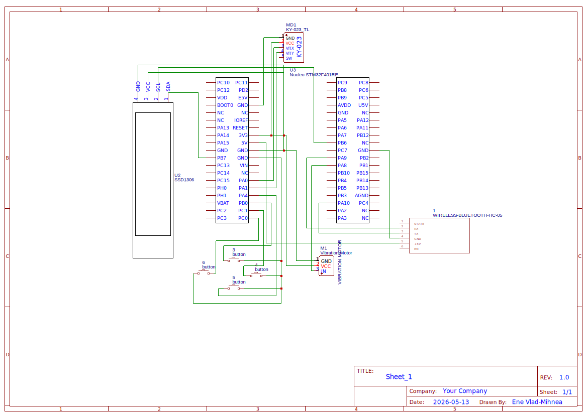

# Wireless Arcade Controller
A wireless arcade game controller built with Rust and Embassy on STM32 Nucleo-U545RE-Q.

:::info

**Author:** Ene Vlad-Mihnea
**GitHub Project Link:** [link_to_github](https://github.com/UPB-PMRust-Students/acs-project-2026-enevlad)

:::

## Description

THe project is a wireless game controller based on the STM32 Nucleo-U545RE-Q microcontroller,
programmed in Rust using the Embassy async framework. It features an analog joystick, four
digital action buttons, an SSD1306 OLED display showing battery level and Bluetooth status,
rumble feedback via a vibration motor, and wireless communication over Bluetooth (HC-05).
Power is provided by a LiPo battery with a TP4056 charging module. All components are mounted
on an open acrylic frame, making the hardware fully visible and accessible.

## Motivation

My motivation for this project stems directly from my passion/hobby for gaming. Building one from scratch in Rust
provides hands-on experience with ADC sampling, GPIO interrupts, UART-based wireless protocols,
and async embedded programming — all within a single cohesive project. Rust's ownership model
makes it especially suitable for embedded development: memory safety without a runtime and
strong type guarantees that catch peripheral misconfigurations at compile time.

## Architecture

The system is split into four main components:

**Input Layer** — The KY-023 analog joystick sampled via ADC and four tactile buttons read via
GPIO interrupts. All input state is collected into a shared data structure protected by an
Embassy Mutex.

**Processing Layer** — The STM32 Nucleo-U545RE-Q runs an Embassy async executor with separate
tasks for ADC sampling, button handling, display updates, battery monitoring, and Bluetooth
transmission.

**Communication Layer** — An HC-05 Bluetooth module receives serialised controller frames over
USART every 10 ms and forwards them to the host PC wirelessly. On the PC side, a Python script
reads the frames from the Bluetooth COM port and forwards them to a vJoy virtual gamepad,
making the controller recognised by any game with gamepad support.

**Output Layer** — An SSD1306 OLED display shows Bluetooth connection status and battery level
over I²C. A coin vibration motor driven via PWM through an N-MOSFET provides haptic feedback.

## Log

### Week 5 - 11 May

Selected project components and ordered hardware. Set up the Rust/Embassy development 
environment with the correct toolchain (1.90) and probe-rs for flashing. Tested basic 
project compilation for the STM32 Nucleo-U545RE-Q target.

### Week 12 - 18 May

Tested all hardware components individually: analog joystick (ADC), tactile buttons (GPIO),
SSD1306 OLED display (I2C), HC-05 Bluetooth module (USART), and vibration motor (PWM).
All components confirmed working. Created EasyEDA schematic with all connections.

### Week 19 - 25 May

## Hardware

The controller is built around the **STM32 Nucleo-U545RE-Q** (ARM Cortex-M33, 160 MHz). Input
comes from a **KY-023 analog joystick module** connected to two ADC channels and four
**tactile push buttons** on GPIO pins with internal pull-ups. Wireless communication is handled
by an **HC-05 Bluetooth module** over USART. An **SSD1306 OLED 128×64** display is connected
via I²C and shows battery level and connection status. A **PWM vibration motor module**
(3–5V, with integrated driver) provides rumble feedback.

## Schematics

## Bill of Materials

| Device | Usage | Price |
|--------|-------|-------|
| [STM32 Nucleo-U545RE-Q](https://www.st.com/en/evaluation-tools/nucleo-u545re-q.html) | Main microcontroller | ~60 RON |
| [KY-023 Analog Joystick](https://www.optimusdigital.ro) × 2 | Analog axis input | ~10 RON |
| [HC-05 Bluetooth Module](https://www.optimusdigital.ro) | Wireless UART communication | ~18 RON |
| [SSD1306 OLED 128×64 I²C](https://www.optimusdigital.ro) | Battery + BT status display | ~15 RON |
| [Tactile push buttons](https://www.optimusdigital.ro) × 6 | Action buttons | ~3 RON |
| [Modul motor vibratii PWM 3-5V](https://sigmanortec.ro/modul-motor-vibratii-dc-control-pwm-3-5v) | Rumble / haptic feedback | ~5 RON | 
| [TP4056 Charger Module](https://www.optimusdigital.ro) | LiPo USB charging + protection | ~6 RON |
| LiPo Battery 3.7V 1000mAh | Power source | ~20 RON |
| AMS1117-3.3 LDO Regulator | 3.3V power supply | ~2 RON |
| Perfboard + wires + resistors | Wiring and assembly | ~10 RON |

## Software

| Library | Description | Usage |
|---------|-------------|-------|
| [embassy-stm32](https://github.com/embassy-rs/embassy) | Async HAL for STM32 | ADC, GPIO, USART, I²C, PWM peripherals |
| [embassy-executor](https://github.com/embassy-rs/embassy) | Async task executor for embedded | Running concurrent tasks on the MCU |
| [ssd1306](https://github.com/jamwaffles/ssd1306) | Display driver for SSD1306 OLED | Rendering battery level and BT status |
| [embedded-graphics](https://github.com/embedded-graphics/embedded-graphics) | 2D graphics library | Drawing text and shapes to the OLED |
| [defmt](https://github.com/knurling-rs/defmt) | Logging framework for embedded Rust | Debug output via probe-rs |
| [pyserial](https://pypi.org/project/pyserial/) (PC) | Serial communication in Python | Reading Bluetooth frames on the host PC |
| [vJoy](https://github.com/njz3/vJoy/) (PC) | Virtual gamepad driver | Exposing controller as HID gamepad to games |

## Links

<!-- Add a few links that inspired you and that you think you will use for your project -->

1. [link](https://example.com)
2. [link](https://example3.com)
...
