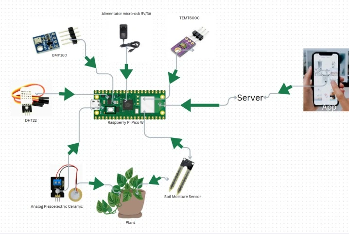
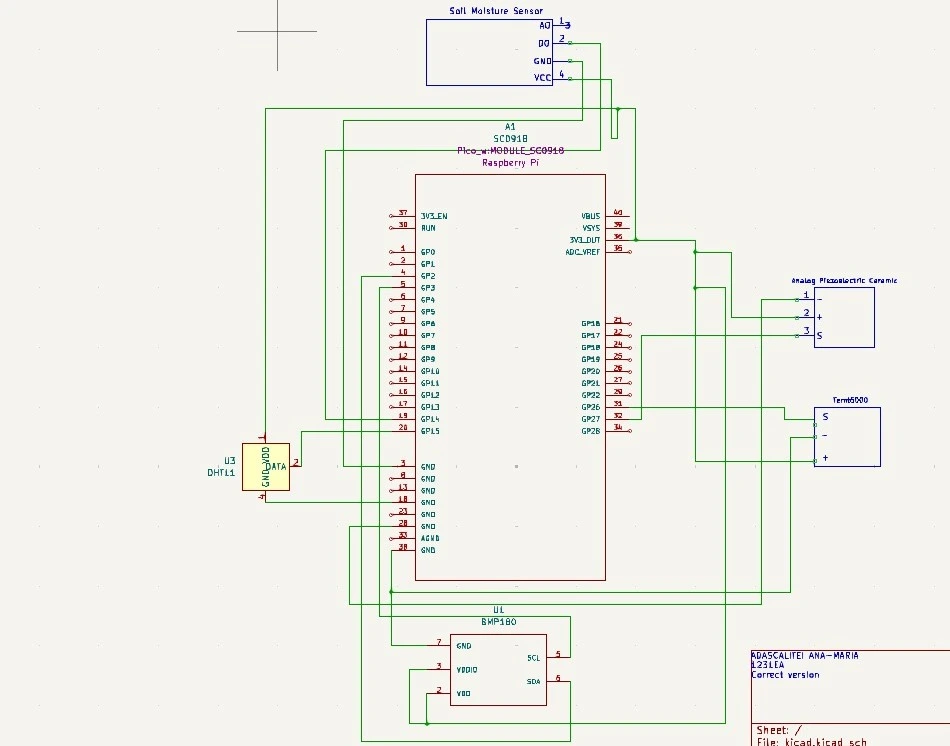

# PlantaSoteria
A smart plant monitoring system

:::info 

**Author**: Ana-Maria Adascalitei 1241EA \
**GitHub Project Link**: https://github.com/UPB-PMRust-Students/project-AnaAdascalitei

:::

## Description

PlantaSoteria (a mix of Latin and Greek meaning "Plant Salvation") is a smart plant monitoring system designed to simplify and optimize plant care. The system continuously monitors key environmental parameters, including soil moisture, light intensity, ambient temperature, humidity, and environmental disturbances. The collected data is transmitted via Wi-Fi to a server, which processes it and serves a web dashboard. Users can observe real-time plant conditions and receive alerts when environmental parameters fall outside optimal ranges.

## Motivation

This project was inspired by my passion for plants and my goal to simplify their care while efficiently monitoring their requirements. Many plants suffer from overwatering, insufficient light, or temperature extremes — all issues that can be avoided with proper data. PlantaSoteria acts as a guardian for your plants, providing real-time insights so you can act before it is too late.

## Architecture

The system is built around the Raspberry Pi Pico W as the central hub. It collects data from five sensors over I2C, one-wire, and ADC interfaces, then transmits the readings to a remote server over Wi-Fi using HTTP. The server stores the data and serves a web dashboard for monitoring.

**Main components:**

- **Raspberry Pi Pico W** — The microcontroller at the heart of the system. It gathers data from all sensors, processes it, and sends it to the server over Wi-Fi.
- **Server** — Receives data from the microcontroller, stores it, and serves it to the web dashboard.
- **Web Dashboard** — Displays real-time sensor data and sends alerts when conditions require attention (e.g. low soil moisture, insufficient light).
- **DHT22** — Measures ambient temperature and humidity of the environment around the plant.
- **BMP180** — Measures temperature and atmospheric pressure, helping detect weather or room condition changes that could affect plant health.
- **TEMT6000** — Ambient light sensor that evaluates whether the plant is receiving sufficient sunlight during the day.
- **Soil Moisture Sensor (Hygrometer)** — Measures soil water levels to determine whether the plant needs watering.
- **Piezoelectric Vibration Sensor** — Detects unusual vibrations in the soil, which could indicate pest activity or accidental disturbances.

## Log

<!-- write your progress here every week -->

### Week 5 - 11 May

Ordered and gathered all necessary hardware components to ensure an organized and smooth development process. Started drafting the system architecture and planning the roles of each component. Simultaneously began writing documentation and outlining the project structure. Tested several sensors (including the soil moisture and temperature sensors) to verify correct operation, and began sketching the initial KiCad schematic to visualize the hardware layout.

### Week 12 - 18 May

### Week 19 - 25 May

## Hardware

The hardware component of PlantaSoteria is designed to monitor various environmental parameters crucial to plant health. At the core is the Raspberry Pi Pico W, which collects data from a range of sensors and transmits it to the backend server. Each sensor targets a specific plant care need:

- **Soil Moisture Sensor (Hygrometer):** Detects soil water levels to inform watering needs.
- **BMP180 Sensor Module:** Measures temperature and air pressure, tracking environmental changes that could affect the plant.
- **Ambient Light Sensor (TEMT6000):** Evaluates light exposure to ensure the plant receives sufficient sunlight.
- **DHT22 Sensor:** Provides additional temperature and humidity readings, offering redundancy and a broader environmental profile.
- **Piezoelectric Vibration Sensor:** Detects unusual movements or disturbances in the soil, such as pest activity or accidental touches.
- **Power Supply:** A stable 5V/3A micro-USB adapter powers the entire system.
- **Wiring & Connectors:** Jumper wires and resistors ensure reliable electrical connections between components.

All sensors connect to the microcontroller via GPIO pins using I2C and analog input interfaces, enabling real-time monitoring and data collection.

### Schematics

### Bill of Materials

| Device | Usage | Price |
|--------|-------|-------|
| [Raspberry Pi Pico W](https://www.raspberrypi.com/documentation/microcontrollers/raspberry-pi-pico.html) | Microcontroller | [34.50 RON](https://www.optimusdigital.ro/en/raspberry-pi-boards/12394-raspberry-pi-pico-w.html) |
| [Alimentator micro-usb 5V/3A](https://www.emag.ro/alimentator-micro-usb-5v-3a-hs0276/pd/DFJ4THMBM/) | Power supply | [29.00 RON](https://www.emag.ro/alimentator-micro-usb-5v-3a-hs0276/pd/DFJ4THMBM/) |
| [Soil Moisture Sensor, Hygrometer](https://lastminuteengineers.com/soil-moisture-sensor-arduino-tutorial/) | Soil moisture sensor | [7.29 RON](https://www.sigmanortec.ro/Senzor-umiditate-sol-higrometru-p125814620) |
| [Analogue Piezoelectric Vibration Sensor](https://wiki.keyestudio.com/Ks0272_keyestudio_Analog_Piezoelectric_Ceramic_Vibration_Sensor) | Vibration/disturbance detection | [9.39 RON](https://www.optimusdigital.ro/ro/senzori-de-vibraii/8249-senzor-de-vibraii-piezoelectric-analogic.html) |
| [BMP180 Temperature and Pressure Sensor Module](https://cdn-shop.adafruit.com/datasheets/BST-BMP180-DS000-09.pdf) | Temperature & pressure sensor | [6.98 RON](https://www.optimusdigital.ro/ro/senzori-senzori-de-presiune/149-modul-senzor-de-temperatura-si-presiune-bmp180.html) |
| [Ambient Light Sensor TEMT6000](https://www.vishay.com/docs/81579/temt6000.pdf) | Light intensity sensor | [9.54 RON](https://ardushop.ro/ro/home/1290-senzor-lumina-ambientala-temt6000.html) |
| [DHT22 Temperature and Humidity Sensor Module](https://www.waveshare.com/wiki/DHT22_Temperature-Humidity_Sensor) | Temperature & humidity sensor | [23.12 RON](https://www.optimusdigital.ro/ro/senzori-senzori-de-temperatura/1449-modul-senzor-de-temperatura-i-umiditate-dht22.html) |
| [Set of 40 Arduino Wires, Male-Male, 30 cm, Multicolor](https://www.circuitrework.com/guides/6-1.html) | Electrical connections | [15.59 RON](https://www.emag.ro/set-40-cabluri-arduino-male-male-30-cm-multicolor-5904162803453/pd/DF8RKLMBM/) |
| [Resistor Kit, 30 Values, 600 Pieces, 1/4W, 10R–1M](https://workforce.libretexts.org/Bookshelves/Electronics_Technology/Book%3A_Electric_Circuits_I_-_Direct_Current_(Kuphaldt)/02%3A_Ohm's_Law/2.05%3A_Resistors) | Pull-up/pull-down & voltage dividers | [22.61 RON](https://www.sigmanortec.ro/kit-rezistori-30-valori-20-bucati) |

## Software

| Library | Description | Usage |
|---------|-------------|-------|
| [embedded-hal](https://github.com/rust-embedded/embedded-hal) | Abstraction layer for embedded hardware | Provides a unified interface for embedded hardware such as I2C, SPI, ADC |
| [embassy-rp](https://github.com/embassy-rs/embassy) | Embassy HAL for Raspberry Pi Pico (RP2040) | Accesses GPIO pins, I2C, ADC, and other RP2040 peripherals |
| [embassy-net](https://github.com/embassy-rs/embassy) | Async networking stack for embedded systems | Sends sensor data from the Pico W to the server over Wi-Fi |
| [cyw43](https://github.com/embassy-rs/embassy) | Wi-Fi driver for Pico W | Manages the on-board CYW43439 Wi-Fi chip |
| [dht-sensor](https://github.com/michaelbeaumont/dht-sensor) | Driver for DHT family sensors | Reads temperature and humidity from the DHT22 |
| [bmp180](https://github.com/eldruin/bmp180-rs) | Driver for BMP180 sensor | Reads temperature and pressure over I2C |
| [cortex-m-rt](https://github.com/rust-embedded/cortex-m-rt) | Real-time runtime for Cortex-M | Handles startup, interrupt vectors, and memory initialization |

## Links

1. [Garduino](https://ocw.cs.pub.ro/courses/pm/prj2023/apredescu/garduino)
2. [Plant Watcher](https://ocw.cs.pub.ro/courses/pm/prj2023/alexau/plantwatcher)
3. [Sistem Monitorizare Plante](https://ocw.cs.pub.ro/courses/pm/prj2023/gpatru/bogdan.brutaru)
4. [Sistem intretinere plante](https://ocw.cs.pub.ro/courses/pm/prj2022/abirlica/sistem_intretinere_plante)
