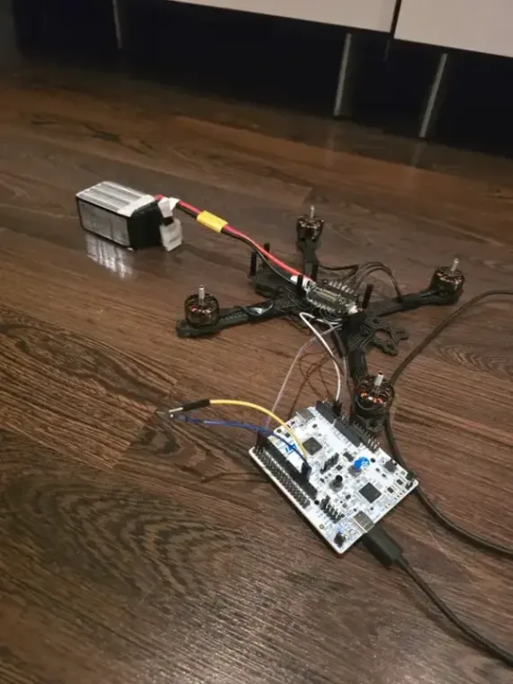
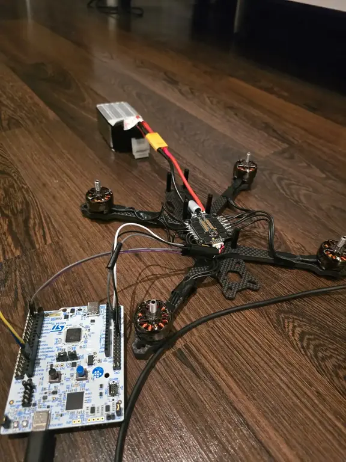
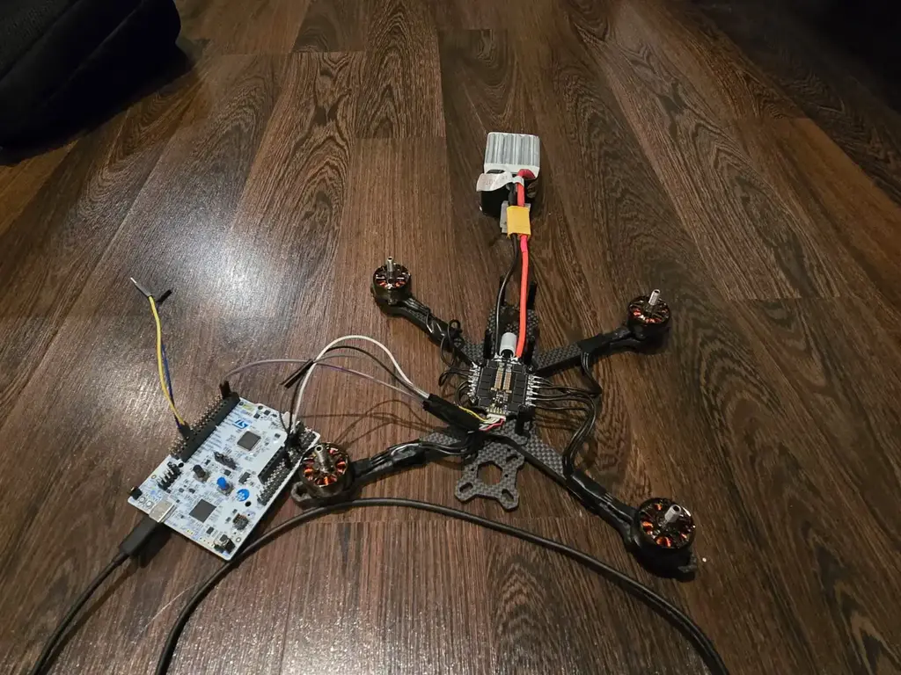
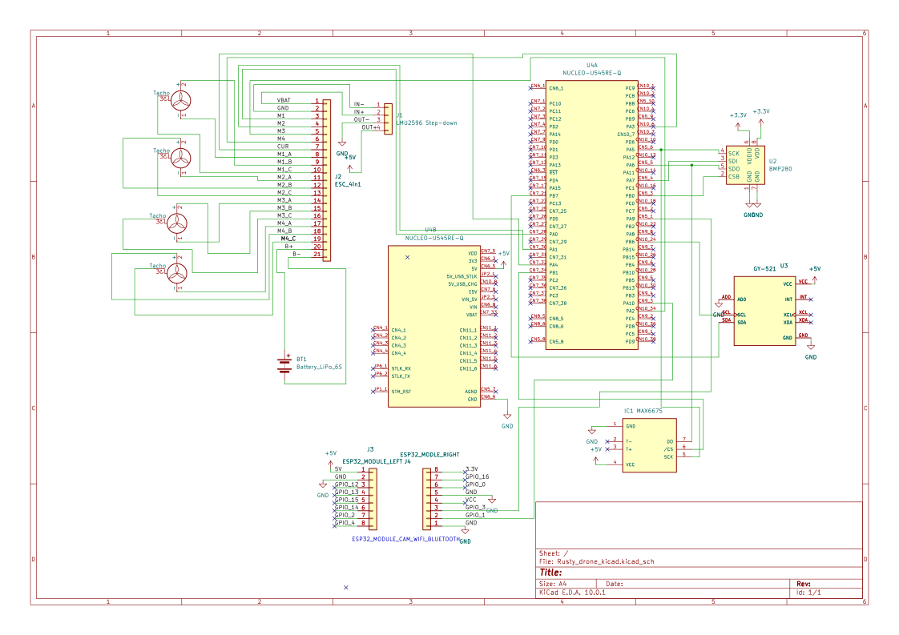

# Rusty Drone
A compact freestyle drone powered by an STM32 and ESP32 that streams real-time video over WiFi and is controlled via Bluetooth using a PS4/PS5 controller.

:::info 

**Author**: Dutu Ana-Antonia \
**GitHub Project Link**: https://github.com/UPB-PMRust-Students/fils-project-2026-anto987678
:::

<!-- do not delete the \ after your name -->

## Description

This project aims to develop a compact freestyle drone using Rust for embedded systems, combining real-time flight control on an STM32 microcontroller with wireless communication handled by an ESP32 module. The drone will stream live video over WiFi while being controlled via Bluetooth using a PS4/PS5 controller, and will also provide telemetry data such as altitude, temperature, speed, and battery level.

## Motivation

I chose this project because it combines multiple areas that interest me, such as embedded systems, wireless communication, and real-time control. Building a drone allows me to work with both hardware and software, while also gaining practical experience with Rust in an embedded context. Additionally, the project is challenging and interactive, involving sensors, communication protocols, and control algorithms, making it a great opportunity to better understand how complex systems are designed and integrated.

## Architecture 


<!-- write your progress here every week -->
### Week 1-4
Researched potential project ideas, focusing on my interest in embedded systems and understanding how drones work behind the scenes. Explored different types of drones and considered their design and manufacturing aspects before choosing a suitable direction.

### Week 5 - 6
Started researching how drones work and selecting suitable components, including choosing the appropriate motors. Placed orders for the required hardware and began writing the project documentation.

### Week 7-8
Started working on the hardware by assembling the drone frame and mounting the motors. Continued by soldering the motors to the ESC and connecting the battery, while integrating the step-down voltage regulator into the power system. Also researched proper soldering techniques and component connections, and began considering different layouts for positioning the battery, STM32, ESP32, sensors, and IMU within the drone frame.

### Week 9-10
I also started working on the software part of the project, mainly on the communication between the STM32 and the ESC using the DShot protocol for controlling the motors. I researched how the protocol works and how it can be implemented using the STM32 timers and DMA peripherals. At the same time, I began writing the first parts of the code in Rust using the Embassy framework, focusing on generating the DShot signals correctly and understanding how the ESC receives throttle commands

## Hardware

The project uses an STM32 Nucleo U545RE-Q microcontroller for flight control, along with an ESP32-CAM module for WiFi video streaming and Bluetooth communication. It includes brushless motors with a 4-in-1 ESC, an MPU6050 IMU for motion sensing, and BMP280 and MAX6675 sensors for environmental data. Power is provided by a LiPo battery with a step-down converter, all mounted on a 5-inch drone frame with standard supporting components.

### Photos





### Schematics



### Bill of Materials

<!-- Fill out this table with all the hardware components that you might need.

The format is 
```
| [Device](link://to/device) | This is used ... | [price](link://to/store) |

```

-->

| Device | Usage | Price |
|--------|--------|-------|
| [STM32 Nucleo U545RE-Q](https://www.st.com/en/evaluation-tools/nucleo-u545re-q.html) | The microcontroller | [~120 RON](https://www.digikey.ro/en/products/detail/stmicroelectronics/NUCLEO-U545RE-Q/22106570) |
| [ESP32-CAM (WiFi + Bluetooth, OV2640, CH340)](https://sigmanortec.ro/placa-dezvoltare-esp32-cam-wifi-bluetooth-ch340-ov2640-2mp) | Video streaming and wireless communication | [~70 RON](https://sigmanortec.ro/placa-dezvoltare-esp32-cam-wifi-bluetooth-ch340-ov2640-2mp)|
| [ESC HGLRC 60A V1, 4-in-1, 2-6S, 30x30mm](https://dronerion.ro/p/esc-hglrc-60a-v1-4-in-1-2-6s-30x30mm-7383/8ff70db9-71a0-45ef-ae46-98acc0c75cd7) | Controls the speed of the brushless motors | [~208 RON](https://dronerion.ro/p/esc-hglrc-60a-v1-4-in-1-2-6s-30x30mm-7383/8ff70db9-71a0-45ef-ae46-98acc0c75cd7)|
| [SpeedyBee Mario 5 XH 04 Advanced Frame](https://dronerion.ro/p/frame-speedybee-mario-5-xh-04-advanced-version-9247/50e8a8c2-d1af-4d3f-ac56-b3bf9cc4f2b5) | Drone frame (structure and component mounting) | [~237 RON](https://dronerion.ro/p/frame-speedybee-mario-5-xh-04-advanced-version-9247/50e8a8c2-d1af-4d3f-ac56-b3bf9cc4f2b5)|
| [Emax ECO II 2207 Brushless Motor (1700KV)](https://dronerion.ro/p/motor-drona-brushless-emax-eco-ii-2207-3778/02fd95ee-bfc9-4412-8673-9e82792ce21c) | Provides thrust for the drone (x4 motors) | [~4 x 80 RON](https://dronerion.ro/p/motor-drona-brushless-emax-eco-ii-2207-3778/02fd95ee-bfc9-4412-8673-9e82792ce21c)|
| [GY-521 MPU6050 (3-axis Gyroscope + Accelerometer)](https://sigmanortec.ro/Modul-giroscopic-si-accelerometru-3-axe-GY-521-p126016326) | Measures orientation and motion (IMU) | [~22 RON](https://sigmanortec.ro/Modul-giroscopic-si-accelerometru-3-axe-GY-521-p126016326)|
| [Tattu R-Line 6S 1550mAh 120C LiPo Battery (XT60)](https://sigmanortec.ro/baterie-lipo-tattu-r-line-6s1p-6s-1550mah-120c-version-30-222v-xt60) | Power supply for the drone | [~305 RON](https://sigmanortec.ro/baterie-lipo-tattu-r-line-6s1p-6s-1550mah-120c-version-30-222v-xt60)|
| [LM2596 DC-DC Step-down Module (4.5–40V, 3A)](https://sigmanortec.ro/Modul-coborator-tensiune-adjustabil-LM2596-DC-DC-4-5-40V-3A-p134532509) | Voltage regulation (steps down battery voltage for components) | [~7 RON](https://sigmanortec.ro/Modul-coborator-tensiune-adjustabil-LM2596-DC-DC-4-5-40V-3A-p134532509)|
| [XT60 Male-Female Connector Pair with 10cm Wire](https://sigmanortec.ro/pereche-mufa-xt60-tata-si-mama-cu-fir-10cm) | Power connection between battery and ESC | [~24 RON](https://sigmanortec.ro/pereche-mufa-xt60-tata-si-mama-cu-fir-10cm)|
| [Gemfan Hurricane 51433 Propellers (3-blade, 2 CW + 2 CCW)](https://electronicmarket.ro/gemfan-uragan-51433-elice-cu-3-pale-2-cw-2-ccw-4buc-roz) | Generates lift and thrust for the drone | [~33 RON](https://electronicmarket.ro/gemfan-uragan-51433-elice-cu-3-pale-2-cw-2-ccw-4buc-roz)|
| [BMP280 Barometric Pressure Sensor](https://www.bosch-sensortec.com/products/environmental-sensors/pressure-sensors/bmp280/) | Measures pressure and estimates altitude | Already owned |
| [MAX6675 Temperature Sensor](https://www.analog.com/en/products/max6675.html) | Measures temperature using thermocouple | Already owned |


## Software

| Library | Description | Usage |
|---------|-------------|-------|
| [embassy-executor](https://github.com/embassy-rs/embassy) | Async task executor for embedded systems | Runs concurrent tasks like sensor reading and motor control |
| [embassy-time](https://github.com/embassy-rs/embassy) | Time management utilities | Handles delays, timers, and scheduling |
| [embassy-sync](https://github.com/embassy-rs/embassy) | Synchronization primitives | Enables safe communication between async tasks |
| [embassy-stm32](https://github.com/embassy-rs/embassy) | HAL for STM32 microcontrollers | Interfaces with peripherals like GPIO, UART, I2C |
| [embedded-hal](https://github.com/rust-embedded/embedded-hal) | Hardware abstraction traits | Standard interface for embedded components |
| [embedded-hal-async](https://github.com/rust-embedded/embedded-hal) | Async version of embedded-hal | Enables non-blocking peripheral communication |
| [esp-idf-hal](https://github.com/esp-rs/esp-idf-hal) | HAL for ESP32 | Interfaces with ESP32 hardware |
| [esp-idf-svc](https://github.com/esp-rs/esp-idf-svc) | High-level ESP32 services | Provides WiFi and Bluetooth functionality |
| [embassy-net](https://github.com/embassy-rs/embassy) | Async networking stack | Handles WiFi communication |
| [smoltcp](https://github.com/smoltcp-rs/smoltcp) | TCP/IP stack | Used internally for network protocols |
| [mpu6050](https://github.com/japaric/mpu6050) | IMU driver | Reads acceleration and gyroscope data |
| [nalgebra](https://github.com/dimforge/nalgebra) | Linear algebra library | Processes sensor data and calculations |
| [pid](https://github.com/braincore/pid-rs) | PID controller implementation | Stabilizes the drone during flight |
| [panic-probe](https://github.com/knurling-rs/probe-run) | Debugging and panic handler | Helps with runtime error debugging |

## Links

<!-- Add a few links that inspired you and that you think you will use for your project -->

1. [Embassy Book](https://embassy.dev/book/#_what_is_embassy)
2. [STM32 32-bit Arm Cortex MCUs - Documentation](https://www.st.com/en/microcontrollers-microprocessors/stm32-32-bit-arm-cortex-mcus/documentation.html)
3. [MPU6050 documentation](https://docs.sunfounder.com/projects/ultimate-sensor-kit/en/latest/components_basic/05-component_mpu6050.html)

4. [How To Get Started With FPV Drone](https://oscarliang.com/fpv-drone-guide/)
5. [Dshot Protocol Description](https://betaflight.com/docs/development/API/Dshot)
6. [ESC HGLRC MANUAL](https://storage.dronerion.com/files/ESC_HGLRC_60A_6S_V1_User_Manual_EN-8292.pdf)

