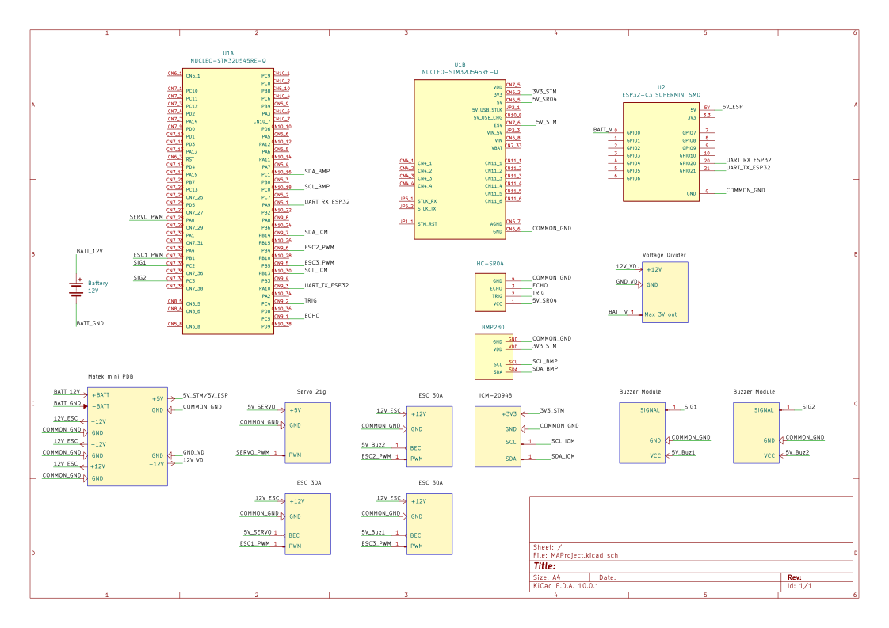

# Tricopter Drone

A Real-Time Flight Control System for a Tricopter. 

:::info 

**Author**: Codita Andrei \
**GitHub Project Link**: https://github.com/UPB-PMRust-Students/fils-project-2026-andreicodita

:::

<!-- do not delete the \ after your name -->

## Description

A Real-Time Flight Control System written in Rust for a drone of type "Tricopter" build on a STM32U545RE-Q that reads data from multiple sensors such as: BMP280 for athmospheric pressure, CM-20948 as an inertial measurement unit. For communication through Wi-Fi/Bluetooth an ESP32-C3 FH4 super mini will be used. The ESP32 will receive the movement desired for the tricopter and will pass it to the Nucleo. A metal-gear servo is used to control the tilt of the rear motor and stabilize the drone. The frame is custom made from readily available materials.

## Motivation

I always liked drones, wanted to build one but the classic quadcopter felt a bit too common. I chose the tricopter because of the way it achieves the yaw control, through a servo, by tilting the rear motor instead of relying on differential thrust as quadcopters do. I also wanted a challenge for the hardware part, building it from scratch.

## Architecture 

### Block Diagram
```
       [POWER SECTION]                       [CONTROL SECTION]

+-----------------------+               +-----------------------+
|  11.1V LiPo Battery   |               |        HOST PC        |
|  2200mAh 30C (3S)     |               |      (Debugging)      |
+-----------+-----------+               +-----------+-----------+
            |                                       ^
            | (Raw Power)                         [USB]
            v                                       |
   +-------------------+                            v
   |  Matek Mini PDB   |               +----------------------------+
   | (12V / 5V Regs)   |               |    NUCLEO STM32U545RE-Q    |
   +---+-------+-------+   +---------->|   (Main Microcontroller)   |
       |       |           |           +---+--------+--------+------+
       |       | [5V REG]  |               |        |        |
       |       +-----------+		   |      [I2C]    [SPI]
       |                                   |        |        |
       | [12V]                             |        v        v
       |                                   |    +-------+ +---------+
       v                                   |    |BMP280 | |ICM-20948|
+--------------+                           |    +-------+ +---------+
|  3x ESC 30A  |<-------- [PWM SIGNALS] ---+   
|  (w/ BEC)    |                           |    +---------------+
+---+---+------+                           |    | ESP32-C3 FH4  |
    |   |                                  +<-->| (Wi-Fi/UART)  |
    |   | [3-WIRE PHASE]                   |    +---------------+
    |   v                                  |
    | +--------------+                     |    +---------------+
    | | 3x BRUSHLESS |                     |    |   HC-SR04     |
    | |1000kV MOTORS |                     +--- | (Trig/Echo)   |
    | +--------------+                     |    +---------------+
    |                                      |
    | [5V BEC Out]                         |    +---------------+
    | (Servo Power)                        +--- |Buzzer Modules |
    v                                      |    |    (GPIO)     |
+--------------+                           |    +---------------+
|  S007 Servo  |<-------- [PWM SIGNAL]-----+
+--------------+
```
### Pin Mapping
```
    +-----------------------+          +----------------------------+
    |  11.1V LiPo Battery   |  VBAT    |  Matek Mini PDB            |
    |  2200mAh 30C (3S)     +--------->|  High Current Input        |
    +-----------------------+          +----------------------------+

    +-----------------------+          +----------------------------+
    |  Matek Mini PDB       |  5V Reg  |  NUCLEO-U545RE-Q           |
    |  (Power Distribution) +--------->|  5V/GND Pins               |
    +-----------+-----------+          +----------------------------+
                |
                | 12V / VBAT Out / GND +----------------------------+
                +--------------------->|  3x ESC 30A                |
                                       |  (Motor Controllers)       |
                                       +-------------+--------------+
                                                     |
                                                     v
                                            3x Brushless Motors

    +-----------------------+          +----------------------------+
    |  3x ESC 30A           |  PWM1 <--+  PB1 - Timer PWM Output    |
    |  (Signal Controllers) |  PWM2 <--+  PB5 - Timer PWM Output    |
    |                       |  PWM3 <--+  PB4 - Timer PWM Output    |
    +-----------------------+          +----------------------------+

    +-----------------------+          +----------------------------+
    |  S007 Servo           |  PWM  <--+  PA0 - Timer PWM Output    |
    |  (Tilt/Yaw)           |  5V   <--+  ESC 5V BEC (Power)        |
    +-----------------------+          +----------------------------+

    +-----------------------+          +----------------------------+
    |  ICM-20948            |  3V3  <--+  STM 3v3                   |
    |  (9-Axis IMU)         |  GND  <--+  Common GND                |
    |                       |  SCL  -->+  PB13	                    |
    |                       |  SDA  <--+  PB14	                    |
    +-----------------------+          +----------------------------+

    +-----------------------+          +----------------------------+
    |  BMP280               |  SCL <---+  PC0	                    |
    |  (Barometer)          |  SDA <-->+  PC1	                    |
    +-----------------------+          +----------------------------+

    +-----------------------+          +----------------------------+
    |  ESP32-C3 FH4         |  TX   -->+  PA9	                    |
    |  (Wi-Fi/BT)           |  RX   <--+  PA10	                    |
    +-----------------------+          +----------------------------+

    +-----------------------+          +----------------------------+
    |  HC-SR04              |  Trig <--+  PC4	                    |
    |  (Ultrasonic)         |  Echo -->+  PC5	                    |
    +-----------------------+          +----------------------------+

    +-----------------------+          +----------------------------+
    |  Buzzer Modules       |  SIG  <--+  PC2/PC3                   |
    |                       |          |                            |
    +-----------------------+          +----------------------------+
```

## Log

<!-- write your progress here every week -->

### Week 4-5
I documented about the hardware and software part of the project, chose the components and ordered them.
### Week 6-7
Took measurements of the hardware, builded the frame from scratch and soldered all the wires I needed, the sensors, voltage dividers. 
### Week 8
Connected the motors, servo, sensors to the STM32 to check they are working as intended.
### Week 9-10
Tried connecting the xbox one controller to the ESP32 and had issues with bluetooth while also checking the motors working along with the servo.
### Week 11
Completed the schematics and made bluetooth work.
## Hardware

The main component is the Nucleo STM32U545RE-Q board that acts as the flight controller with data based from: BMP280 - measures the air pressure and determines how high is it, CM-20948 9 axis to get the acceleration, gyroscope and compass data, HC-SR04 to measure distance at low altitudes. ESP32-C3 FH4 super mini handles the Wi-Fi and Bluetooth connectivity in order to control the drone remotely. Three 30Amps ESCs to control each 2212 1000kV brushless motor. All of them are powered from a 2200mAh 11.1V 30C battery through a Matek Mini Power Hub and a voltage divider is put at the exit of the power distribution board to measure the voltage that comes out of the battery. Two passive buzzers are used to alert when battery is below a certain limit. 

### Photos


### Schematics



### Bill of Materials

<!-- Fill out this table with all the hardware components that you might need.

The format is 
```
| [Device](link://to/device) | This is used ... | [price](link://to/store) |

```

-->

| Device | Usage | Price |
|--------|--------|-------|
| [STM32U545RE-Q](https://estore.st.com/en/products/evaluation-tools/product-evaluation-tools/mcu-mpu-eval-tools/stm32-mcu-mpu-eval-tools/stm32-nucleo-boards/nucleo-u545re-q.html) | The main microcontroller used | [106.59 RON](https://ro.mouser.com/ProductDetail/STMicroelectronics/NUCLEO-U545RE-Q?qs=mELouGlnn3cp3Tn45zRmFA%3D%3D) |
| [ESP32-C3 FH4 super mini](https://ardushop.ro/ro/plci-de-dezvoltare/2224-placa-de-dezvoltare-esp32-c3-super-mini-6427854034298.html) | Wi-Fi/Bluetooth communication module | [26.03 RON](https://ardushop.ro/ro/plci-de-dezvoltare/2224-placa-de-dezvoltare-esp32-c3-super-mini-6427854034298.html) |
| [BMP280](https://ardushop.ro/ro/electronica/1641-modul-senzor-presiune-atmosferica-bmp280-6427854024640.html) | Atmospheric pressure sensing | [7.54 RON](https://ardushop.ro/ro/electronica/1641-modul-senzor-presiune-atmosferica-bmp280-6427854024640.html) |
| [CM-20948 9 axis](https://ardushop.ro/ro/groundstudio/1163-modul-9-axe-icm-20948-groundstudio-6427854000699.html) | Inertial measurement unit (IMU) | [36.72 RON](https://ardushop.ro/ro/groundstudio/1163-modul-9-axe-icm-20948-groundstudio-6427854000699.html) |
| 3 * [Brushless motors A2212/13T 1000KV](https://hobbymarket.ro/motor-brushless-1000kv-a2212-13t-pentru-drone-si-aeromodele.html) | Propulsion motors | [149.8 RON](https://hobbymarket.ro/motor-brushless-1000kv-a2212-13t-pentru-drone-si-aeromodele.html) |
| [Matek Mini Power Hub PDB](https://electronicmarket.ro/en-gb/matek-pdb-distribution-board-with-bec-5v-12v?search=pdb) | Power distribution board | [32.57 RON](https://electronicmarket.ro/en-gb/matek-pdb-distribution-board-with-bec-5v-12v?search=pdb) |
| [DSPOWER S007M Mini Servo](https://electronicmarket.ro/en-gb/dspower-21g-metal-gear-mini-servo-%E2%80%93-4.2kg-high-torque-micro-servo?search=servo) | Tilts rear motor for stabilization/yaw control | [67.85 RON](https://electronicmarket.ro/en-gb/dspower-21g-metal-gear-mini-servo-%E2%80%93-4.2kg-high-torque-micro-servo?search=servo) |
| 3 * [1045 Gemfan Propellers ABS](https://electronicmarket.ro/en-gb/gemfan-1045-abs-drone-propeller-set-cw-ccw-black?search=1045%20gemfan) | Propellers | [26.91 RON](https://electronicmarket.ro/en-gb/gemfan-1045-abs-drone-propeller-set-cw-ccw-black?search=1045%20gemfan) |
| 2 * [XT60 connectors](https://www.emag.ro/set-mufa-xt60-tata-mama-30a-setmufaxt60tata-mama/pd/DS5HNXMBM/) | Power connectors | [15.74 RON](https://www.emag.ro/set-mufa-xt60-tata-mama-30a-setmufaxt60tata-mama/pd/DS5HNXMBM/) |
| 3 * [ESC 30A](https://www.emag.ro/controler-motor-esc-30a-galben-45x24x11mm-hvyznq-controller-30a/pd/D37MPD2BM/) | Electronic speed controllers | [138.24 RON](https://www.emag.ro/controler-motor-esc-30a-galben-45x24x11mm-hvyznq-controller-30a/pd/D37MPD2BM/) |
| [LiPo Battery 11.1V - 30C 3S1P](https://hpi-racing.ro/li-po-3s-111v/acumulator-lipo-gens-ace-g-tech-soaring-2200mah-111v-30c-3s1p-cu-conector-xt60.html) | Powering the hardware | [100 RON](https://hpi-racing.ro/li-po-3s-111v/acumulator-lipo-gens-ace-g-tech-soaring-2200mah-111v-30c-3s1p-cu-conector-xt60.html) |
| [HC-SR04 Sensor](https://www.emag.ro/modul-senzor-ultrasonic-detector-distanta-hc-sr04-xbaxah-ultrasonic/pd/D5HMPD2BM/) | Ultrasonic sensor to measure distance | [6.73 RON](https://www.emag.ro/modul-senzor-ultrasonic-detector-distanta-hc-sr04-xbaxah-ultrasonic/pd/D5HMPD2BM/) |
| 2 * [Passive Buzzer Module](https://electronicmarket.ro/en-gb/passive-buzzer-module-for-arduino?search=buzzer) | Sounds for alerts such as low battery | [6.44 RON](https://electronicmarket.ro/en-gb/passive-buzzer-module-for-arduino?search=buzzer) |

## Software

| Library | Description | Usage |
|---------|-------------|-------|
| [icm20948](https://crates.io/crates/icm20948) | Driver for IMU | Decodes raw electrical signals |
| [bmp280-rs](https://crates.io/crates/bmp280-rs) | Barometer driver | Converts raw air pressure readings |
| [pid](https://crates.io/crates/pid) | Loop Control | It calculates thrust to stabilize the drone |
| [micromath](https://crates.io/crates/micromath) | Advanced math library | Provides optimized math functions to calculate tilt and orientation|
| [ahrs](https://crates.io/crates/ahrs) | Sensor data fusion | Combines Accelerometer, Gyro and Magnetometer data filtering out noise |
| [cortex-m](https://crates.io/crates/cortex-m) | Cortex low-level support | Low-level CPU features on the STM32U545RE-Q |
| [cortex-m-rt](https://crates.io/crates/cortex-m-rt) | Cortex-M runtime | Startup/interrupt |
| [defmt](https://crates.io/crates/defmt) | Logging framwork | Structured logging from firmware |
| [defmt-rtt](https://crates.io/crates/defmt-rtt) | RTT logging transport | Sends defmt logs via RTT |
| [panic-probe](https://crates.io/crates/panic-probe) | Panic handler | Printing panic info |
| [embedded-hal](https://crates.io/crates/embedded-hal) | Hardware abstraction | Standard traits used by drivers |
| [embassy-executor](https://crates.io/crates/embassy-executor) | Async task executor | Run async tasks |
| [embassy-time](https://crates.io/crates/embassy-time) | Timers and delays | Timeouts, delays |
| [embassy-sync](https://crates.io/crates/embassy-sync) | Async synchronization | Channels to pass sensor data safely |
| [embassy-stm32](https://crates.io/crates/embassy-stm32) | STM32 Hal | Hardware control |
| [embassy-embedded-hal](https://crates.io/crates/embassy-embedded-hal) | Embassy enbedded-hal adapters | Lets embedded-hal based drivers work with Embassy objects | 


## Links

<!-- Add a few links that inspired you and that you think you will use for your project -->

1. [Embassy Book](https://embassy.dev/book/#_what_is_embassy)
2. [BMP280 Data Sheet](https://www.bosch-sensortec.com/media/boschsensortec/downloads/datasheets/bst-bmp280-ds001.pdf)
3. [ICM20948 Documentation](https://product.tdk.com/system/files/dam/doc/product/sensor/mortion-inertial/imu/data_sheet/ds-000189-icm-20948-v1.5.pdf)
