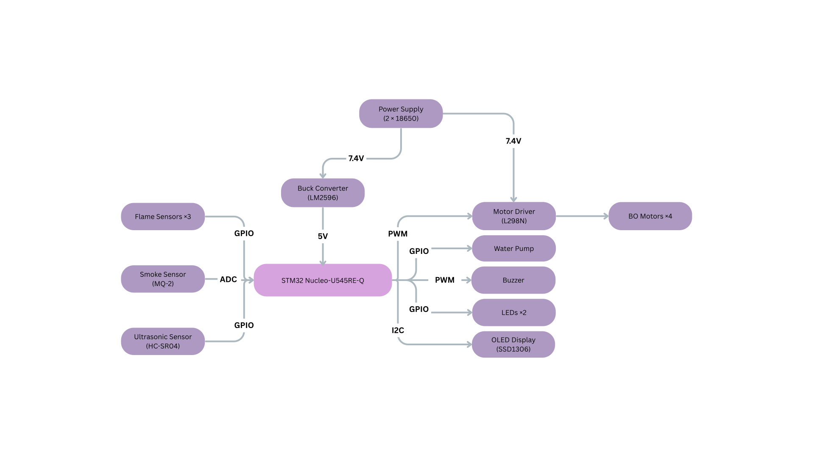

# RustRescue
An autonomous firetruck robot that detects fire and puts it out.

:::info 

**Author**: Ioniță Carmen Ana-Maria \
**GitHub Project Link**: https://github.com/UPB-PMRust-Students/fils-project-2026-carmen020305#

:::

<!-- do not delete the \ after your name -->

## Description

RustRescue is a small autonomous robot designed to detect and extinguish fires without human intervention. It is built around the STM32 NUCLEO-U545RE-Q microcontroller and programmed in Rust using the embassy-rs framework. The firetruck continuously monitors its surroundings using three flame sensors and  one smoke sensor. When a flame or smoke is detected, the robot determines the direction of the threat and steers toward it while activating a siren and flashing LEDs, autonomously avoiding any obstacles in its path using an ultrasonic distance sensor. A display shows the current state of the system in real time. Once close enough to the fire, it stops and activates a small water pump to put it out. When the flame is no longer detected, the pump, siren, and LEDs turn off automatically. Then the robot will continue to look for another fire.

## Motivation

The inspiration behind this project is my father, who is a firefighter. Knowing that he puts his life in danger every time he goes to work made me think about ways technology could help. While a small robot cannot replace a firefighter, it could serve as a first responder in situations involving small or early-stage fires, acting quickly before the situation escalates and reducing the need for human intervention in dangerous environments.

## Architecture 

The STM32 Nucleo-U545RE-Q is the central component of the system. It reads data from three flame sensors and the HC-SR04 ultrasonic sensor via GPIO, and from the MQ-2 smoke sensor via ADC. Based on this input, it controls the L298N motor driver and the water pump via GPIO, the buzzer via PWM, and the OLED display via I2C. The entire system is powered by two 18650 batteries (7.4V), with a buck converter (LM2596) stepping the voltage down to 5V for the microcontroller and sensors.




## Log

<!-- write your progress here every week -->

### Week 13 - 19 April
The STM32 NUCLEO-U545RE-Q and the first batch of components arrived. After checking what was missing, placed another order for the remaining parts.

### Week 20 - 26 April
Started putting the project documentation together. Created the architecture diagram showing how all the components connect to the microcontroller. Also began working on the KiCad schematic.


## Hardware

The hardware is built around the STM32 NUCLEO-U545RE-Q microcontroller, which connects to all the other components. Three IR flame sensors and an HC-SR04 ultrasonic sensor are wired via GPIO, the flame sensors to detect where the fire is coming from, and the ultrasonic sensor to avoid obstacles along the way. The MQ-2 smoke sensor connects via ADC to detect smoke in the surroundings. For movement, four BO motors are controlled through an L298N motor driver using PWM signals. A passive buzzer produces a siren sound via PWM, and two red LEDs are used as visual alerts via GPIO. The SSD1306 OLED display communicates over I2C and shows the current system state of the robot in real time. The water pump is switched on and off through a 2N2222 NPN transistor driven by a GPIO pin. The entire system is powered by two 18650 batteries in series (7.4V), brought down to 5V by an LM2596 buck converter.

### Schematics

Place your KiCAD or similar schematics here in SVG format.

### Bill of Materials

<!-- Fill out this table with all the hardware components that you might need.

The format is 
```
| [Device](link://to/device) | This is used ... | [price](link://to/store) |

```

-->

| Device | Usage | Price |
|--------|--------|-------|
| [STM32 Nucleo-U545RE-Q](https://www.farnell.com/datasheets/3927507.pdf) | The microcontroller | [106.59 RON](https://ro.mouser.com/ProductDetail/STMicroelectronics/NUCLEO-U545RE-Q?qs=mELouGlnn3cp3Tn45zRmFA%3D%3D) |
| [IR Flame Sensor (×3)](https://www.optimusdigital.ro/en/optical-sensors/110-ir-flame-sensor.html?srsltid=AfmBOop8VjL629drvlz1A7VhuRbYEV0Yz_4w77LuM5maQuD1TsU7SeaP) | Detects fire direction (left, front, right) | [7.47 RON](https://www.optimusdigital.ro/en/optical-sensors/110-ir-flame-sensor.html?srsltid=AfmBOop8VjL629drvlz1A7VhuRbYEV0Yz_4w77LuM5maQuD1TsU7SeaP) |
| [MQ-2 Smoke Sensor](https://www.pololu.com/file/0j309/mq2.pdf) | Detects smoke | [15.67 RON](https://www.aliexpress.com/item/1005007204353237.html?spm=a2g0o.order_list.order_list_main.47.c53218027nnulr) |
| [HC-SR04 Ultrasonic Sensor](https://www.osepp.com/electronic-modules/sensor-modules/62-osepp-ultrasonic-sensor-module) | Measures distance to obstacles | [14.99 RON](https://www.optimusdigital.ro/ro/senzori-senzori-ultrasonici/2328-senzor-ultrasonic-de-distana-hc-sr04-compatibil-33-v-i-5-v.html?gad_source=1&gad_campaignid=19615979487&gbraid=0AAAAADv-p3A-Myib66m9-wzJ7txMYhxqL&gclid=CjwKCAjwhqfPBhBWEiwAZo196t4sCRam1sz4-fqibm6c7sdeu7xWMxo6oqlce_P_9HwfoUP9Nv2_shoCmWkQAvD_BwE) |
| [OLED Display SSD1306](https://cdn-shop.adafruit.com/datasheets/SSD1306.pdf) | Displays system state in real time | [13.34 RON](https://www.aliexpress.com/item/1005007389730469.html?spm=a2g0o.order_list.order_list_main.53.c53218027nnulr) |
| [LM2596 Step Down DC-DC Power Supply Module](https://www.ti.com/lit/ds/symlink/lm2596.pdf) | Converts battery voltage to 5V | [12.99 RON](https://www.optimusdigital.ro/en/5-v-step-down-power-supplies/13597-lm2596-step-down-dc-dc-power-supply-module-fixed-5v-output.html) |
| [BO Motors + Wheels (×4)](https://electronicmarket.ro/6v-250-rpm-motor-si-roti?gad_source=1&gad_campaignid=21513542058&gbraid=0AAAAA-D1O9acEsStbymViBOmpPcXLDBAR&gclid=CjwKCAjwhqfPBhBWEiwAZo196gfH81pOcZK2Ucz2cZz5h4i5FypfZGwJO9qDQHNNiiOXzqlKI0m4phoCEn8QAvD_BwE) | Robot locomotion | [62.56 RON](https://electronicmarket.ro/6v-250-rpm-motor-si-roti?gad_source=1&gad_campaignid=21513542058&gbraid=0AAAAA-D1O9acEsStbymViBOmpPcXLDBAR&gclid=CjwKCAjwhqfPBhBWEiwAZo196gfH81pOcZK2Ucz2cZz5h4i5FypfZGwJO9qDQHNNiiOXzqlKI0m4phoCEn8QAvD_BwE) |
| [L298N Motor Driver](https://www.handsontec.com/dataspecs/L298N%20Motor%20Driver.pdf) | Controls the DC motors | [10.35 RON](https://electronicmarket.ro/l298n-placa-driver-dual-motor-cu-regulator-de-tensiune?gad_source=1&gad_campaignid=21513542058&gbraid=0AAAAA-D1O9acEsStbymViBOmpPcXLDBAR&gclid=CjwKCAjwhqfPBhBWEiwAZo196jJmXlLhnGvgmvTCj1WHthxlxGtnW-f4dHO3jvC_7y_tAVBwz5JH_BoCs5kQAvD_BwE) |
| [5V DC Water Pump + pipe](https://www.aliexpress.com/item/1005009549206702.html?spm=a2g0o.order_list.order_list_main.17.c53218027nnulr) | Extinguishes the fire | [14.83 RON](https://www.aliexpress.com/item/1005009549206702.html?spm=a2g0o.order_list.order_list_main.17.c53218027nnulr) |
| [Water tank / bottle] | Water reservoir for the pump | [N/A] |
| [Passive Buzzer](https://www.aliexpress.com/item/1005007274812383.html?spm=a2g0o.order_list.order_list_main.5.c53218027nnulr) | Emits siren sound | [1.34 RON](https://www.aliexpress.com/item/1005007274812383.html?spm=a2g0o.order_list.order_list_main.5.c53218027nnulr) |
| [Red LED (×2)](https://ardushop.ro/ro/led-uri/293-467-led-5mm.html#/4-culoare-rosu) | Emergency flashing lights | [0.60 RON](https://ardushop.ro/ro/led-uri/293-467-led-5mm.html#/4-culoare-rosu) |
| [Transistor NPN 2n2222](https://www.optimusdigital.ro/en/transistors/935-transistor-npn-2n2222-to-92.html) | Switches the water pump circuit | [0.17 RON](https://www.optimusdigital.ro/en/transistors/935-transistor-npn-2n2222-to-92.html) |
| [100nF Capacitor](https://ardushop.ro/ro/condensatori-tht/571-948-condensator-ceramic-50v-alege-valoarea.html#/348-capacitate-100_nf) | Filters noise from the water pump | [0.24 RON](https://ardushop.ro/ro/condensatori-tht/571-948-condensator-ceramic-50v-alege-valoarea.html#/348-capacitate-100_nf) |
| [1KΩ Resistor](https://www.optimusdigital.ro/en/resistors/13607-resistor-set-110-resistors.html?search_query=resistor+330&results=21) | Limits current to transistor base | [0.10 RON](https://www.optimusdigital.ro/en/resistors/13607-resistor-set-110-resistors.html?search_query=resistor+330&results=21) |
| [330Ω Resistor (×2)](https://www.optimusdigital.ro/en/resistors/13607-resistor-set-110-resistors.html?search_query=resistor+330&results=21) | Limits current to LEDs | [0.20 RON](https://www.optimusdigital.ro/en/resistors/13607-resistor-set-110-resistors.html?search_query=resistor+330&results=21) |
| [Breadboard](https://www.aliexpress.com/item/1005008788953967.html?spm=a2g0o.order_list.order_list_main.41.c53218027nnulr) | Prototyping connections | [19.47 RON](https://www.aliexpress.com/item/1005008788953967.html?spm=a2g0o.order_list.order_list_main.41.c53218027nnulr) |
| [Jumper wires](https://www.optimusdigital.ro/en/wires-with-connectors/93-separated-male-male-wires-20-cm-10-p.html?search_query=Separated+Male-Male+Wires+20+cm+-+10+p&results=18) | Electrical connections | [5.95 RON](https://www.optimusdigital.ro/en/wires-with-connectors/93-separated-male-male-wires-20-cm-10-p.html?search_query=Separated+Male-Male+Wires+20+cm+-+10+p&results=18) |
| [18650 Battery (×2)](https://milnik.ro/format-18650/8173292-nk512-m29-lg-lg-inr18650-m29-2850mah-10a-7417940524771.html) | Power source | [20.00 RON](https://milnik.ro/format-18650/8173292-nk512-m29-lg-lg-inr18650-m29-2850mah-10a-7417940524771.html) |
| [Battery holder](https://www.optimusdigital.ro/ro/suporturi-de-baterii/941-suport-de-baterii-2-x-18650.html?search_query=Suport+de+Baterii+2+x+18650&results=13) | Holds the 18650 batteries | [3.99 RON](https://www.optimusdigital.ro/ro/suporturi-de-baterii/941-suport-de-baterii-2-x-18650.html?search_query=Suport+de+Baterii+2+x+18650&results=13) |


## Software

| Library | Description | Usage |
|---------|-------------|-------|
| [embassy-executor](https://github.com/embassy-rs/embassy) | Async task executor | Runs concurrent tasks on the microcontroller |
| [embassy-stm32](https://github.com/embassy-rs/embassy) | STM32 hardware abstraction | GPIO, PWM, ADC, I2C, timers for STM32U545 |
| [embassy-time](https://github.com/embassy-rs/embassy) | Async time utilities | Delays and timeouts |
| [embassy-sync](https://github.com/embassy-rs/embassy) | Synchronization primitives | Communication between tasks |
| [ssd1306](https://github.com/rust-embedded-community/ssd1306) | OLED display driver | Drives the SSD1306 display over I2C |
| [embedded-hal](https://github.com/rust-embedded/embedded-hal) | Hardware abstraction traits | Interface for peripherals |
| [embedded-hal-async](https://github.com/rust-embedded/embedded-hal) | Async hardware abstraction traits | Async interface for peripherals |
| [defmt](https://github.com/knurling-rs/defmt) + [defmt-rtt](https://github.com/knurling-rs/defmt) | Debug logging | Lightweight logging over RTT |
| [panic-probe](https://github.com/knurling-rs/defmt) | Panic handler | Panic handler with defmt output |
| [heapless](https://github.com/rust-embedded/heapless) | Fixed-size data structures | String formatting for OLED display |

## Links

<!-- Add a few links that inspired you and that you think you will use for your project -->

1. [The Rust Programming Language](https://doc.rust-lang.org/book/)
2. [The Embedded Rust Book](https://docs.rust-embedded.org/book/)
3. [Embassy-rs Documentation](https://embassy.dev/)
4. [STM32 datasheet](https://www.farnell.com/datasheets/3927507.pdf)
5. [Electric RC Car - Basic Concepts](https://www.tamiya.co.th/blog-detail/basic-knowledge-of-electric-rc-cars-tamiya-rc-start-guide)
6. [Hardware inspiration](https://www.youtube.com/results?search_query=automatic+fire+truck+project)
