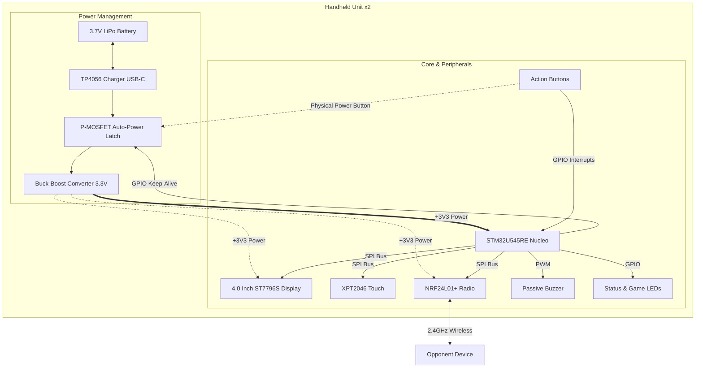
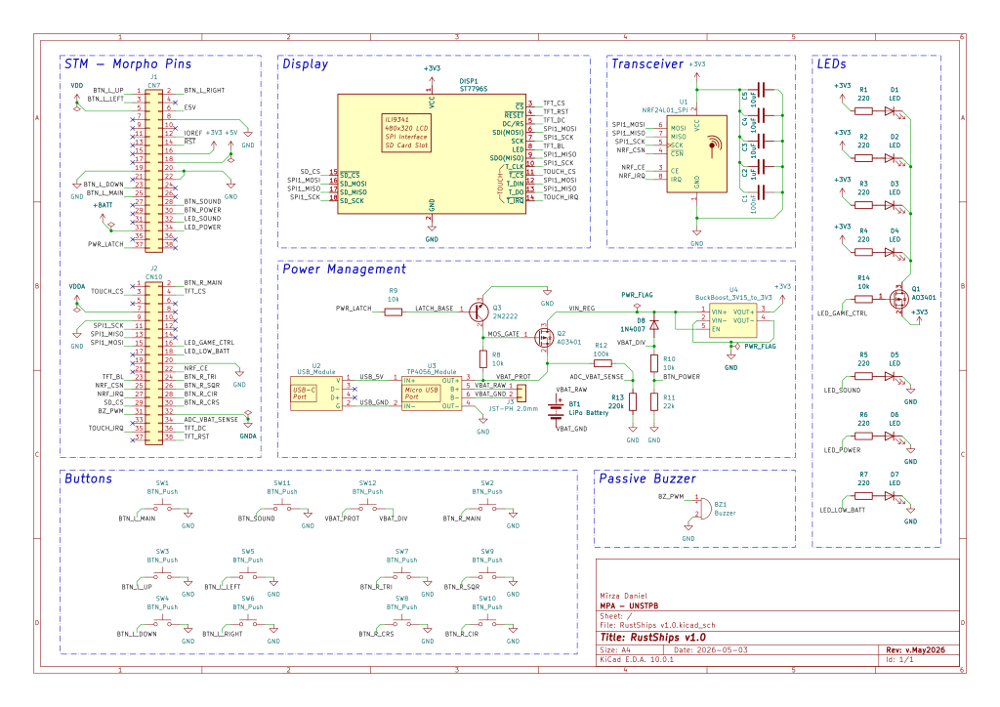
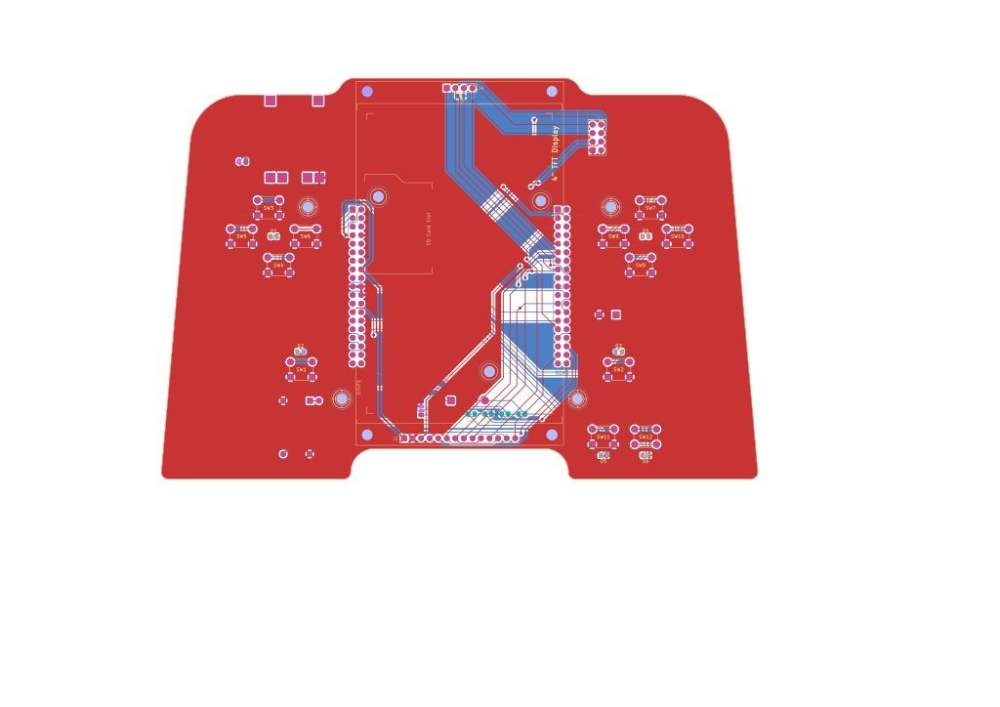
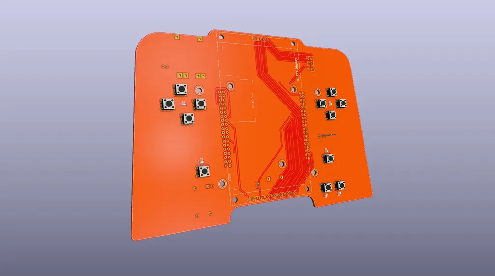
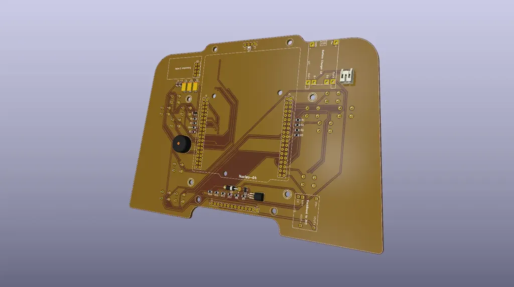

# RustShips v1.0

A two-player Battleship game running on devices having a 4" touchscreen display and wireless peer-to-peer communication.

:::info 

**Author**: Mîrza Daniel \
**GitHub Project Link**: https://github.com/UPB-PMRust-Students/fils-project-2026-Danum1z

:::

## Description

RustShips is a fully embedded, wireless two-player Battleship game. Each player owns a dedicated device consisting of an STM32U545RE Nucleo-64 board connected to a 4" TFT touchscreen (ST7796S, 320×480) wtih action buttons and a passive buzzer. The two devices communicate wirelessly via NRF24L01+ radio modules over SPI.

Each player places a fleet of 5 ships on a 10×10 grid, then takes turns firing at the opponent's grid. The game tracks two matrices per device: `my_fleet` (own ships and incoming hits) and `enemy_radar` (shots fired and confirmed results). A dedicated button toggles between the two views.

The game features three special mechanics, each usable once per game:
- **Sonar Scan**: hold the action button for 3 seconds to reveal a 3×3 area of the enemy grid for 2 seconds
- **Airstrike**: double-press the action button to instantly sink an entire enemy ship
- **Ferris Repair**: named after Ferris the Rust mascot — fully repair a damaged ship and move it to a new position

The entire game logic is written as a `no_std` Rust library (`game-core`) that compiles for both the real MCU and a desktop simulator built with `embedded-graphics-simulator`.


## Motivation

The choice of this project comes from a long-standing interest in classical strategy games like Battleships and a desire to translate tactile, paper-based mechanics into a robust digital embedded system. Beyond the childhood nostalgia, this project serves as a comprehensive learning platform for several reasons:

- **Software Complexity**: Developing a full-featured game from scratch in Rust requires mastering state machines and no_std logic.
- **Hardware Integration**: The project offers hands-on experience with SPI bus sharing between high-resolution displays, touch controllers, and wireless radio modules.
- **Future Potential**: This handheld terminal is designed as a versatile gaming platform. Its low energy consumption and independent peer-to-peer wireless link make it ideal for offline use (trains, planes, or remote trips). It establishes a foundation for a suite of offline multiplayer games like or Connect 4, Tic-Tac-Toe, or even singleplayer Sudoku.

## Architecture 

The project is split into three crates inside a Cargo workspace:

**`game-core`** — `no_std` pure logic library, no hardware dependencies. Compiles for both x86_64 (simulator) and `thumbv8m.main-none-eabihf` (MCU). Contains the grid, ship fleet, game state machine, special mechanics, and network message types.

**`simulator`** — `std` desktop application. Uses `embedded-graphics-simulator` (SDL2) to render the game in a window on the development laptop. Uses the exact same `game-core` types as the real hardware. Used for developing and testing all game logic before using hardware.

**`embassy-app`** — `no_std` Embassy application for the real hardware. Spawns independent async tasks that communicate via Embassy channels and signals.

**Game State Machine (per device):**
```text
Placement ──► WaitingForOpponent ──► Battle ──► GameOver
                                        ├── Aiming
                                        ├── WaitingForResult
                                        ├── OpponentTurn
                                        └── FerrisRepair                        
```

**Communication protocol** (NRF24L01+, peer-to-peer, no server):

Each game action is serialized into a `NetworkMessage` and sent to the opponent. Message types include `FireShot`, `ShotResult`, `SonarRequest/Response`, `AirstrikeResult`, `FerrisRepairUpdate`, and `GameOver`.



## Log

### Week 5 - 7

- Searched for a suitable project idea
- Adopted the BattleShips game concept
- Defined the project logic and workflow

### Week 8 - 9

- Chose STM32U545RE + Embassy async Rust stack
- Ordered two 4.0"SPI TFT Modules
- Set up the Cargo workspace with `game-core`, `simulator`, and `embassy-app` crates
- Implemented the `grid.rs`, `ship.rs`, and `state.rs` (in `game-core`)
- Received the ordered TFT modules
- Ordered two NUCLEO-U545RE-Q boards and the NRF24L01+ modules
- Passed the Documentation Milestone

### Week 10 - 11

- Received the other ordered components
- Learned to use KiCad Software by reading and watching tutorials
- Started to work on KiCAD for the PCB
- Finished the hardware prototype using breadboards and jumpers
- Completed the KiCad schematic
- Assigned and generated new footprints for KiCAD components
- Completed the mecanical placement and layout of the PCB
- Ordered and unpacked the last components needed
- Completed the rouding on the PCB
- Passed the Hardware Milestone

### Week 12 - 13

- _to be continued..._

## Hardware

Each player's device consists of:

- **STM32U545RE-Q Nucleo-64**: Arm Cortex-M33 microcontroller running at up to 160 MHz, 512 KB flash, 274 KB SRAM. Runs the Embassy async runtime with multiple concurrent tasks.
- **4.0" TFT LCD (ST7796S, 320×480)**: Connected via SPI. Displays both game grids, ship positions, hit/miss markers, and special ability highlights. Driven by the `mipidsi` crate with `embedded-graphics`.
- **XPT2046 resistive touch controller**: Shares the SPI bus with the display (separate CS pin). Used for cell selection on the touchscreen.
- **NRF24L01+ radio module**: Connected via SPI. Provides 2.4 GHz peer-to-peer wireless communication between the two devices. No server or router required.
- **Passive buzzer**: Driven via PWM. Provides audio feedback for shots, hits, sinks, special abilities, and win/lose outcomes.
- **Navigation buttons**: Arrow buttons (up/down/left/right) for cursor movement and ship placement, plus Action, View-Toggle, and Rotate buttons.

### Schematics

#### 1. Schematic Design

The schematic integrates the STM32 Nucleo, nRF24L01+ transceiver, SPI TFT Display, and a custom P-Channel MOSFET auto-power latch circuit for battery management.


*Figure 1: Full system schematic including power management, MCU, and peripherals.*

#### 2. PCB Layout and Routing (2D)

The board has been floorplanned to accommodate a comfortable handheld form factor. Critical components (like the nRF24 decoupling capacitors) have been placed as close to their target pins as possible.


*Figure 2: Current 2-layer copper routing (Front: Red, Back: Blue).*

#### 3. 3D Render

This is the physical representation of the board, which will be used to design the 3D-printed enclosure. 



*Figure 3: 3D visualization of the assembled PCB (front and back).*

### Bill of Materials

| Device | Usage | Price |
|--------|--------|-------|
| [STM32U545RE Nucleo-64](https://www.st.com/en/evaluation-tools/nucleo-u545re-q.html#overview) | Main microcontroller board (×2) | [130 RON](https://ro.mouser.com/ProductDetail/STMicroelectronics/NUCLEO-U545RE-Q?qs=mELouGlnn3cp3Tn45zRmFA%3D%3D&countryCode=RO&currencyCode=RON) × 2 |
| [4.0" TFT LCD ST7796S 320×480](https://www.lcdwiki.com/4.0inch_SPI_Module_ST7796) | Touchscreen display (×2) | [130 RON](https://www.amazon.es/-/en/gp/product/B0CQ87KN3Q/ref=ox_sc_act_title_1?smid=A3E5QOOXTLF93M&th=1) × 2 |
| [NRF24L01+ module](https://www.handsontec.com/dataspecs/module/NRF24L01+.pdf) | 2.4GHz wireless link (×2) | [7 RON](https://www.optimusdigital.ro/ro/ism-24-ghz/48-modul-tranceiver-nrf24l01-24-ghz.html?search_query=NRF24L01++module&results=5) × 2 |
| [TP4056 Charger module]() | Charger module (x2) | [4 Ron](https://www.optimusdigital.ro/ro/electronica-de-putere-incarcatoare/7534-incarcator-tp4056-cu-micro-usb-pt-baterie-lipo-1a-cu-protectie-pentru-circuite.html?search_query=TP4056+&results=4) × 2 |
| [Buck-Boost 3V3]() | Constant and regulated 3.3V voltage (x2) | [15 Ron](https://www.emag.ro/convertor-buck-boost-elektroweb-3v-15v-la-3-3v-rosu-3-h-051/pd/D8HNPBYBM/) × 2 |
| [Tantalum Capacitors]() | Help the radio transmission | [4 RON]() × 6 |
| [LEDs]() | Illumination + feedback | [4 Ron](https://www.optimusdigital.ro/ro/optoelectronice-led-uri/11629-led-portocaliu-0603.html?search_query=0104110000072290&results=1) × 3 |
| [Resisistors]() | Leds and power management | [20 RON](https://www.optimusdigital.ro/ro/componente-electronice-rezistoare/638-set-de-rezistoare-smd-0805.html?search_query=0104110000003560&results=1) |
| [Push buttons]() | Navigation + action input (×2 sets) | [0.36 RON](https://www.optimusdigital.ro/en/buttons-and-switches/1119-6x6x6-push-button.html?search_query=button&results=379) × 20 |
| [Jumper wires]() + [breadboard](https://www.optimusdigital.ro/en/breadboards/13244-breadboard-175-x-67-x-9-mm.html) | Prototyping connections | [~12 RON]() |
| **Total (estimated)** | | **~ 650 RON** |

## Software

| Library | Description | Usage |
|---------|-------------|-------|
| [embassy](https://github.com/embassy-rs/embassy) | Async embedded framework | Task scheduler, async SPI/GPIO/PWM drivers for STM32U5 |
| [mipidsi](https://github.com/almindor/mipidsi) | MIPI display driver | Drives the ST7796S TFT display over SPI |
| [embedded-graphics](https://github.com/embedded-graphics/embedded-graphics) | 2D graphics library | Draws grids, ships, cursors, highlights, text |
| [embedded-graphics-simulator](https://github.com/embedded-graphics/simulator) | SDL2-based simulator | Runs the full game on laptop for logic testing |
| [xpt2046](https://crates.io/crates/xpt2046) | Resistive touch driver | Reads touch coordinates from XPT2046 controller |
| [heapless](https://github.com/japaric/heapless) | Fixed-size collections | Stack-allocated Vec/Queue replacements for no_std |
| [defmt](https://github.com/knurling-rs/defmt) | Embedded logging | RTT-based debug logging via probe-rs |

## Links

1. [Battleship - Wikipedia](https://en.wikipedia.org/wiki/Battleship_(game)): General rules and history of the classic board game.
2. [Sea Battle (App Store)](https://apps.apple.com/ro/app/sea-battle-online/id884947296?l=ro): A popular mobile version that inspired the digital UI and special mechanics.
3. [Embassy - Async Rust for Embedded](https://embassy.dev/): Documentation for the framework powering the game's concurrency.
