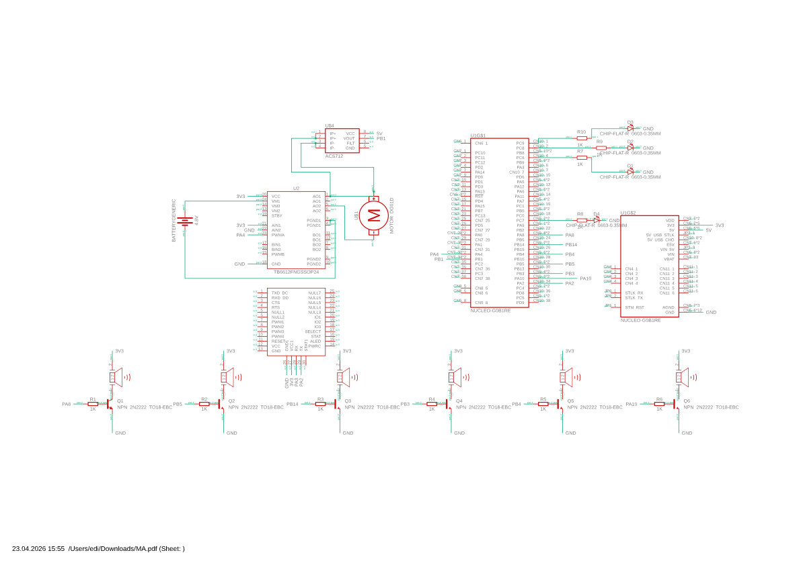

# Internal Combustion Engine Emulator
An emulator that brings electric cars to life.

:::info 

**Author**: Eduard-Costin Ionescu \
**GitHub Project Link**: https://github.com/UPB-PMRust-Students/fils-project-2026-edi10pro1

:::

<!-- do not delete the \ after your name -->

## Description

iCEE (short for Internal Combustion Engine Emulator) uses the STM32 Nucleo G0B1RE to add audio, mechanical and visual feedback, similar to a thermic engine vehicle to an electric car platform. For the audio simulation it uses 6 buzzers, capable to mimic the audio signature of different engine layouts (inline 4, 6, V8, V10, V12) by the help of realistic software cylinder mapping. Commands such as acceleration, driving mode, engine start-up or shutdown are sent to the system using a phone app connected to a JDY-18 BLE module. The acceleration is filtered and mapped to a specific power map of each different engine type that ressembles its mechanical characteriscitcs, then sent over to a DC motor which simulates the electric car motor. The power curve is converted through software algorhithms from a linear one (specific to electric motors) to a non-homogenous bell shaped one, simulating the thermic engine. Also, to add to the realism the system simulates an automatic gearbox, giving the DC motor a short "hickup" reenacting a real gear change. The load of the motor is read by an ACS712 Current sensor, to feed the system back with how much the motor is struggling so that the virtual RPM of the motor decreases accordingly. Exhaust pipes are routed from the buzzers to the back of the platform to guide the sound underneath and behind it like a real thermic car. To top the experience up, for the Sport mode, there is a "Pops and Bangs" feature added to symbolize sportivity, with audio and LED light effects in the exhaust system. Also on the platform there is a TFT screen to see the menu, see the power curve of the engine and see the current gear.

## Motivation

The reason I came up with this idea relies in my early passion for cars and what makes each one unique feelings for the driver. Another reason is the fact that the world seems to be slowly but surely shifting to the EVs. But EVs are "boring" especially for people that appreciate the engineering behind "classic" cars. And while they are powerful and deliver instant loads of torque, they often feel soulless. 
My goal with this project is to prove that electric vehicles implementing this kind of emulation can get extremely fun.

## Architecture 


iCEE recieves, remodels signals and output power through a multi-layered async architecture:

1.  **Signal Input Layer**: 
    * **Bluetooth (UART)**: Receives real-time acceleration data and commands from the phone app.
    * **Load Sensing (ADC)**: Monitors motor effort via the ACS712 sensor to dynamically adjust the virtual RPM.
2.  **Processing Layer (Engine Logic Engine)**: 
    * **Physics Simulator**: Maps linear pedal input to non-linear engine power curves.
    * **Gearbox Emulator**: Manages gear ratios and introduces power "hickups" during shifts for realism.
    * **Acoustic Mapper**: Calculates precision timing for the 6 buzzers based on engine firing orders.
3.  **Output Layer**:
    * **Audio Synthesis**: High-frequency digital pulses sent to 6 buzzers to mimic cylinder explosions.
    * **Visual Feedback**: Real-time rendering of telemetry and power plots on the TFT screen via SPI.
    * **Power Simulation**: DC Motor speed control via PWM.

| Module | Pin Nucleo G0B1 | Protocol / Signal Type | Description |
| :--- | :--- | :--- | :--- |
| **JDY-18 BLE** | PA2 (TX), PA3 (RX) | **UART** (9600 baud) | User input (Pedal, Start/Stop) |
| **TFT Display** | PA5 (SCK), PA7 (MOSI), PA1 (DC), PA9 (RST), PB0 (CS) | **SPI** | Menu and Telemetry interface |
| **Buzzers (x6)** | PA8, PB5, PB14, PB3, PB4, PA10 | **Software PWM** | Engine sound (Cylinders 1-6) |
| **DC Motor** | PA4 | **PWM** (TIM14) | Electric drivetrain simulation |
| **ACS712 Sensor** | PB1 | **Analog (ADC1)** | Current monitoring for Load Penalty |
| **User Button** | PC13 | Digital In (Pull-up) | Engine selector & Start trigger |
| **4 LEDs** | TBD | **Software PWM** | Exhaust Visualisation for Pops & Bangs |

## Log

<!-- write your progress here every week -->

### Week 5 - 11 May

Assembled everything on the breadboard, created an unpolished software variant, set up the bluetooth connection.

### Week 12 - 18 May

### Week 19 - 25 May

## Hardware

Built around the STM32 Nucleo G0B1RE, iCEE uses an array of six passive buzzers to synthesize multi-cylinder engine sounds through precise software timing. It features wireless control via a JDY-18 BLE module and visual telemetry on an ST7735 TFT display. The mechanical simulation employs a DC motor driven by an TB6612FNG module, using an ACS712 current sensor for real-time load feedback and dynamic RPM adjustment.

### Schematics



### Bill of Materials

<!-- Fill out this table with all the hardware components that you might need.

The format is 
```
| [Device](link://to/device) | This is used ... | [price](link://to/store) |

```

-->

| Device | Usage | Price |
|--------|-------|-------|
| [STM32 Nucleo G0B1RE](https://www.st.com/en/evaluation-tools/nucleo-g0b1re.html) | The main microcontroller unit | [120 RON](https://ardushop.ro/ro/plci-de-dezvoltare/2411-stmicroelectronics-nucleo-g0b1re-6427854012296.html) |
| [JDY-18 BLE Module](https://ardushop.ro/ro/comunicatie/2018-modul-bluetooth-42-jdy-18-6427854030764.html) | Wireless communication with phone app | [22 RON](https://ardushop.ro/ro/comunicatie/2018-modul-bluetooth-42-jdy-18-6427854030764.html) |
| [ST7735 1.8" TFT Display](https://ardushop.ro/ro/electronica/2124-modul-lcd-spi-128x160-6427854032546.html) | Real-time telemetry and menu interface | [24.5 RON](https://ardushop.ro/ro/electronica/2124-modul-lcd-spi-128x160-6427854032546.html) |
| [ACS712 Current Sensor (5A)](https://ardushop.ro/ro/electronica/345-556-modul-senzor-curent-5a-20a-30a.html#/106-amperaj_maxim-5a) | Motor load monitoring for dynamic RPM | [13.30 RON](https://ardushop.ro/ro/electronica/345-556-modul-senzor-curent-5a-20a-30a.html#/106-amperaj_maxim-5a) |
| [Passive Buzzers (x6)](https://ardushop.ro/ro/difuzoare-si-buzzere/1724-1283-buzzer.html#/333-tip-pasiv) | Cylinder sound synthesis | [24 RON](https://ardushop.ro/ro/difuzoare-si-buzzere/1724-1283-buzzer.html#/333-tip-pasiv) |
| [TB6612FNG Motor Driver](https://ardushop.ro/ro/motoare-si-drivere/517-modul-diver-de-motoare-dual-tb6612fng-6427854006028.html) | DC Motor power management | [26.45 RON](https://ardushop.ro/ro/motoare-si-drivere/517-modul-diver-de-motoare-dual-tb6612fng-6427854006028.html) |
| [DC Motor 3-6V](https://ardushop.ro/ro/electronica/752-motor-dc-3v-6v-cu-reductor-1-48-6427854009609.html) | Drivetrain powertrain simulation | [7.20 RON](https://ardushop.ro/ro/electronica/752-motor-dc-3v-6v-cu-reductor-1-48-6427854009609.html) |


## Software

Here is the complete software table using your exact template, covering the full stack used in your iCEE project:

| Library | Description | Usage |
|---------|-------------|-------|
| [embassy-stm32](https://github.com/embassy-rs/embassy) | Hardware Abstraction Layer (HAL) | Provides async support for UART, SPI, ADC, and PWM peripherals. |
| [embassy-executor](https://github.com/embassy-rs/embassy) | Async/Await Runtime | Manages concurrent tasks for engine logic, BLE parsing, and display updates. |
| [embassy-time](https://github.com/embassy-rs/embassy) | Time management library | Handles precision microsecond delays for Software PWM and engine firing orders. |
| [embassy-sync](https://github.com/embassy-rs/embassy) | Async synchronization primitives | Uses `Signal` to safely communicate engine states between the main loop and display task. |
| [embedded-graphics](https://github.com/embedded-graphics/embedded-graphics) | 2D graphics library | Used for drawing text, power plots, and menu UI elements on the TFT screen. |
| [static_cell](https://crates.io/crates/static_cell) | Static resource allocation | Used for safe, zero-cost aliasing of hardware peripherals like the SPI bus. |
| [defmt](https://defmt.ferrous-systems.com/) | Deferred formatting logger | High-efficiency logging used for real-time debugging of RPM and current sensor values. |
| [panic-probe](https://crates.io/crates/panic-probe) | Panic handler | Provides detailed error traces over RTT in case of a system crash. |

## Links

<!-- Add a few links that inspired you and that you think you will use for your project -->

1. [STM32 Datasheet](https://www.st.com/resource/en/datasheet/stm32g0b1re.pdf)
2. [STM32 Reference Manual](https://www.st.com/resource/en/reference_manual/rm0444-stm32g0x1-advanced-armbased-32bit-mcus-stmicroelectronics.pdf)
3. [ACS712 Current Sensor Datasheet](https://www.allegromicro.com/-/media/files/datasheets/acs712-datasheet.ashx)
4. [Rust Embedded Manual](https://docs.rust-embedded.org/book/)
5. [Dual Motor Driver Datasheet](https://cdn.sparkfun.com/assets/0/1/b/b/3/TB6612FNG.pdf)
6. [JDY-18 BLE Module Manual](https://manuals.plus/bluetooth-module/bluetooth-jdy-18-4-2-ble-module-usage-manual)
