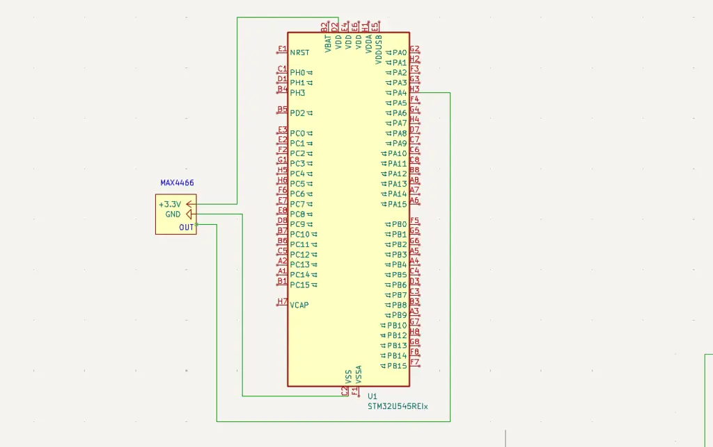

# Real-Time Audio Spectrum Visualizer

A real-time audio spectrum visualizer that captures sound via a microphone, processes it using FFT on an STM32U545RE, and displays the frequency bands live on a PC.

:::info

**Author**: Popescu Iacob Cristian  \
**GitHub Project Link**:  https://github.com/UPB-PMRust-Students/fils-project-2026-PopescuIacob 

:::

## Description

This project implements a real-time audio spectrum visualizer using the STM32U545RE microcontroller.
Audio signals are captured via an analog microphone module, digitized using the MCU's built-in ADC,
processed using a Fast Fourier Transform (FFT) algorithm, and the resulting frequency band data is
streamed over USB CDC (serial) to a host PC, where a Python script renders a live bar chart of the
audio spectrum.

The system continuously samples audio, splits the spectrum into bass, midrange, and high-frequency
bands, and visualizes their amplitudes in real time.

---

## Motivation

I chose this project because of my passion for music and curiosity about how audio signals are
processed digitally. The project naturally combines several core topics of the Microprocessor
Architecture course — real-time data acquisition, DMA transfers, signal processing, async
programming, and USB communication — in a single, practical, and visually engaging system.

---

## Architecture

The system is composed of the following main components:

- **Audio Capture Module** — the MAX4466 analog microphone captures ambient sound and outputs
  an analog voltage signal proportional to the sound pressure level.
- **ADC Acquisition Module** — the STM32U545RE's 14-bit ADC samples the microphone output
  continuously using DMA, filling a fixed-size buffer without CPU involvement.
- **Signal Processing Module (FFT)** — once a buffer of 256 samples is ready, the `microfft`
  crate computes the Fast Fourier Transform, converting the time-domain samples into
  frequency-domain amplitudes grouped into bass, midrange, and high bands.
- **USB CDC Communication Module** — the processed band amplitudes are serialized and sent
  over USB as a virtual serial port to the host PC using `embassy-usb`.
- **PC Visualization** — a Python script reads the serial data and renders a live updating
  bar chart of the frequency spectrum using `matplotlib`.


---

## Log

### Week 5 - 11 May

- Set up Rust Embassy project scaffold (Cargo.toml, config.toml, rust-toolchain.toml)

### Week 12 - 18 May

### Week 19 - 25 May

---

## Hardware

The hardware setup is intentionally minimal. The STM32U545RE Nucleo board is connected to a
MAX4466 analog microphone amplifier module. The microphone's analog output feeds directly into
one of the MCU's ADC input pins. The board is connected to the host PC via USB, which serves
both as the power supply and the data link for streaming FFT results.

The MAX4466 module includes a built-in adjustable gain amplifier, which allows tuning the
microphone sensitivity to the environment without any additional circuitry.

### Schematics



### Bill of Materials

| Device | Usage | Price |
| --- | --- | --- |
| STM32U545RE Nucleo Board | Main microcontroller | Borrowed |
| MAX4466 Microphone Amplifier Module | Analog audio capture | 20 RON |

---

## Software

| Library | Description | Usage |
| --- | --- | --- |
| embassy-stm32 | STM32 async HAL | ADC, DMA, GPIO, USB peripheral drivers |
| embassy-executor | Async task scheduler | Runs audio, processing, and USB tasks concurrently |
| embassy-sync | Async channels and primitives | Inter-task communication between ADC and FFT tasks |
| embassy-time | Timers and delays | Sampling rate control and timeouts |
| embassy-usb | USB device stack | USB CDC (virtual serial port) for PC communication |
| microfft | FFT computation (no_std) | Converts ADC sample buffer into frequency amplitudes |
| heapless | Fixed-size data structures | Sample buffers and queues without heap allocation |
| defmt + defmt-rtt | Embedded logging | Debug output over RTT via probe-rs |
| panic-probe | Panic handler | Reports panics through the debug probe |
| cortex-m + cortex-m-rt | Low-level CPU support | Cortex-M33 boot and runtime initialization |
| pyserial *(PC)* | Serial port communication | Reads USB CDC data from the STM32 on the host PC |
| matplotlib *(PC)* | Plotting library | Renders the live frequency spectrum bar chart |

### Functional Diagram

```
[Embassy Async Runtime]
        |
        |----[Task: ADC Capture]
        |       - DMA fills 256-sample buffer from MAX4466
        |       - Sends buffer via async channel when full
        |
        |----[Task: FFT Processing]
        |       - Receives buffer from ADC task
        |       - Runs microfft on samples
        |       - Groups bins into Bass / Mids / Highs
        |       - Sends amplitudes to USB task
        |
        |----[Task: USB CDC Send]
                - Receives band amplitudes
                - Serializes as comma-separated values
                - Writes to USB CDC virtual serial port

[Host PC]
        - pyserial reads USB CDC port
        - matplotlib renders live bar chart
```

---

## Links

1. [Embassy Framework](https://embassy.dev/)
2. [STM32U545RE Datasheet](https://www.st.com/resource/en/datasheet/stm32u545re.pdf)
3. [microfft crate](https://docs.rs/microfft)
4. [Fast Fourier Transform — Wikipedia](https://en.wikipedia.org/wiki/Fast_Fourier_transform)
5. [MAX4466 Datasheet](https://datasheets.maximintegrated.com/en/ds/MAX4465-MAX4469.pdf)
6. [Embedded Rust Book](https://docs.rust-embedded.org/book/)
7. [Embassy STM32 Examples](https://github.com/embassy-rs/embassy/tree/main/examples/stm32u5)
