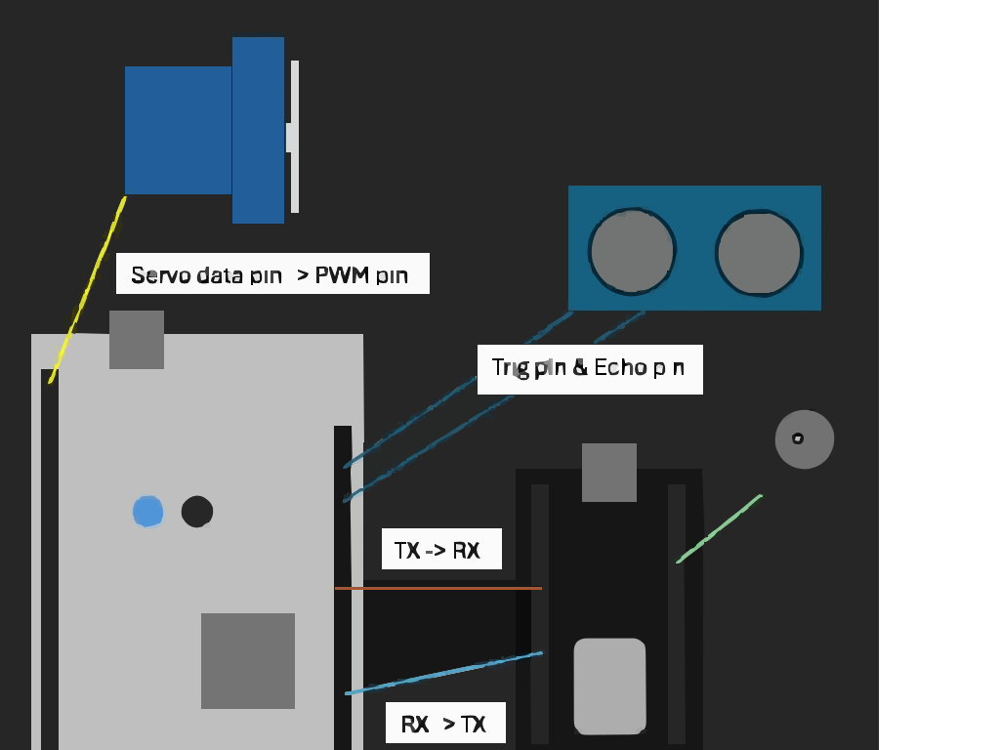

# Smart TrashHD

:::info 

**Author**: Bajan Ionut \
**GitHub Project Link**: https://github.com/UPB-PMRust/fils-project-2026-bajanionut

:::

<!-- do not delete the \ after your name -->

## Description
The main idea of my project is that very often people tend to throw trash in the wrong bin slot, this project is focused on making it be more efficient at sorting the trash so it doesn't get to be sorted for more time than it need to be.

## Motivation

Seeing so many people just throwing away trash where they can without looking in which compartament was the fundation of my idea, but seeing project like this one on social media got my attention and my interest level high.

## Architecture 

The architecture consists of an Edge Controller (STM32) managing local sensors and actuators, a Wireless Bridge (ESP32-CAM) for image relay, and a PC Intelligence Hub for Python-based AI processing, all interconnected through a hybrid UART and Wi-Fi communication pipeline.

## Log

<!-- write your progress here every week -->

### Week 5 - 11 May

Discussed the idea to the lab assistent 
Started working on the 3D model and looking for which components to buy
Bought all the things i need and slowly got into the coding part

### Week 12 - 18 May

### Week 19 - 25 May

## Hardware

The hardware centers on an STM32 Nucleo-U545RE-Q master controller paired with an ESP32-CAM for wireless vision and a laptop for Python-driven AI processing. A 16x2 I2C LCD and dual tactile buttons provide the user interface, while an HC-SR04 ultrasonic sensor triggers the capture and an MG996R servo executes the physical sorting

### Schematics

Place your KiCAD or similar schematics here in SVG format.

### Bill of Materials

| Device | Usage | Price |
| :--- | :--- | :--- |
| [STM32 Nucleo-U545RE-Q](https://www.st.com/en/evaluation-tools/nucleo-u545re.html) | This is used as the master orchestrator running Rust to manage the hardware state machine and real-time sensor logic. | [128 RON](https://www.st.com/en/evaluation-tools/nucleo-u545re.html) |
| [ESP32-CAM + MB](https://www.optimusdigital.ro/ro/esp32/11559-modul-esp32-cam-cu-interfata-usb-ch340.html) | This is used as a wireless bridge to capture images and relay data between the Nucleo and the Python AI on the laptop. | [78 RON](https://www.optimusdigital.ro/ro/esp32/11559-modul-esp32-cam-cu-interfata-usb-ch340.html) |
| [LCD 1602 with I2C](https://www.optimusdigital.ro/ro/optoelectronice-lcd-uri/10-afisaj-lcd-1602-cu-interfata-i2c-si-fundal-albastru.html) | This is used to provide the user interface by displaying object classification results and confirmation prompts. | [22 RON](https://www.optimusdigital.ro/ro/optoelectronice-lcd-uri/10-afisaj-lcd-1602-cu-interfata-i2c-si-fundal-albastru.html) |
| [HC-SR04 Ultrasonic Sensor](https://www.optimusdigital.ro/ro/senzori-senzori-ultrasonici/11-senzor-ultrasonic-hc-sr04.html) | This is used to detect when an object is placed on the sorting plate, initiating the automated capture sequence. | [Owned](https://www.optimusdigital.ro/ro/senzori-senzori-ultrasonici/11-senzor-ultrasonic-hc-sr04.html) |
| [MG996R Servo Motor](https://www.optimusdigital.ro/ro/servomotoare/111-servomotor-mg996r.html) | This is used to physically move the sorting mechanism to the correct bin based on the final object classification. | [Owned](https://www.optimusdigital.ro/ro/servomotoare/111-servomotor-mg996r.html) |
| [Tactile Buttons](https://www.optimusdigital.ro/ro/butoane-si-comutatoare/2513-set-10-butoane-6x6x5-mm.html) | This is used to receive physical "Yes" or "No" confirmation inputs from the user during the sorting process. | [Owned](https://www.optimusdigital.ro/ro/butoane-si-comutatoare/2513-set-10-butoane-6x6x5-mm.html) |
| (https://www.optimusdigital.ro/ro/surse-de-alimentare-surse-in-comutatie/2996-sursa-de-alimentare-5v-3a.html) |
| [Jumper Wires](https://www.optimusdigital.ro/ro/fire-si-conectori-fire-conectori/128-set-fire-tata-tata-65-bucati.html) | This is used to securely connect the sensors, actuators, and bridge modules to the Nucleo board and breadboard. | [25 RON](https://www.optimusdigital.ro/ro/fire-si-conectori-fire-conectori/128-set-fire-tata-tata-65-bucati.html) |

## Software

| Library | Description | Usage |
| :--- | :--- | :--- |
| [embassy-stm32](https://github.com/embassy-rs/embassy) | Async hardware abstraction layer for STM32. | Used to control GPIOs, UART communication, and PWM for the servo on the Nucleo. |
| [hd44780-driver](https://github.com/idubrov/hd44780-driver) | Generic driver for the HD44780 LCD. | Used to send text commands and classification results to the 16x2 LCD. |
| [esp32-camera](https://github.com/espressif/esp32-camera) | Official Espressif camera driver for C++. | Used to initialize the OV2640 sensor and capture frame buffers on the ESP32. |
| [Flask](https://github.com/pallets/flask) | Lightweight Python web framework. | Used to create the local server on your laptop that receives image uploads via Wi-Fi. |
| [ultralytics](https://github.com/ultralytics/ultralytics) | Real-time object detection (YOLO). | Used in the Python script to identify if the object is plastic, metal, or paper. |
| [embedded-graphics](https://github.com/embedded-graphics/embedded-graphics) | 2D graphics library for Rust. | Used for advanced text formatting and positioning on the LCD screen. |

## Links

<!-- Add a few links that inspired you and that you think you will use for your project -->

1. [link](https://www.instagram.com/reels/DJ1TKzJMeLl/)
2. [link](https://www.youtube.com/watch?v=bZIKVaD3dRk)
...
