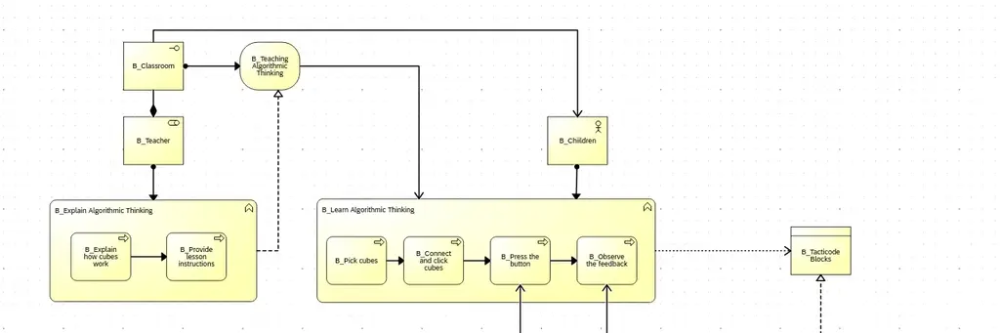
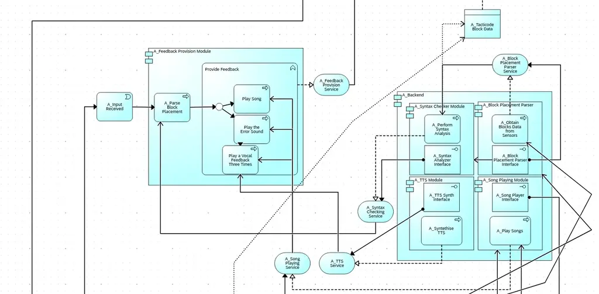

# Physical Music Blocks for Teaching Algorithmic Thinking PoC
A physical programming interface allowing visually impaired children to learn algorithmic thinking by composing music using magnetic blocks.

:::info 

**Author**: Iris-Alexandra Vavilov \
**GitHub Project Link**: [link_to_github](https://github.com/UPB-PMRust-Students/fils-project-2026-unirisel)

:::

## Description

This project aims to create an accessible, physical programming interface using custom 3D-printed blocks that snap together magnetically for a better UX. The system features a smart reading track that utilizes passive RFID tags embedded in the nested blocks to parse the user's code. Once the blocks are arranged, the system provides immediate auditory feedback by playing a composed musical melody or triggering voice prompts for syntax error checking and educational feedback. 

## Motivation

As a part-time teacher, I faced the challenge of making classroom lessons interactive and inclusive for all students. It is especially difficult to include visually impaired kids alongside other children when working on algorithmic thinking challenges that are traditionally computer-based. This project was chosen to bridge that gap by providing a tactile, screen-free learning environment, making the learning environment for algorithmic thinking more inclusive even without direct access to a computer.

## Architecture 

 
The Archimate Business Layer describes the main interaction of the actors: the Children and the Teachers.
The main business function that the B Children will perform is described through "B Learn Algorithmic Thinking" business function. The only service we care about in this layer is the B Teaching Algorithmic Thinking that is Realized by the Teacher's function. Back to B Learn Algorithmic Thinking" function: the core process we will try to support is: "B Observe Feedback" through the Application Layer.

The application Layer is split into two components: the Frontend :  "A Feedback Provision Module". This module role is to trigger the "Backend" processing of the sensor data, syntax analysis, and sound playing and TTS synthesis. All the modules in the backend component are decoupled and provide their interfaces as well as realise their services. This ensures hardware and conversely software agnosticism. Further, the software will interface with hardware through APIs and the Embedded HAL APIs

For the Technology Layer, we will have a single node, represented through the "T Tacticode" Node which hosts the single dev board - an ESP32S3. Further details in the picture.

* **Smart Reading Track:** Acts as a physical 3D-printed staging board and custom PCB housing, featuring multiple integrated RFID reader coils spaced along the track.
* **Magnetic Nested Blocks:** These are passive 3D-printed blocks embedded with 13.56MHz RFID stickers and neodymium magnets that use "Poka-Yoke" polarity to prevent incorrect connections.
* **Microcontroller (ESP32-S3):** The central processing unit that handles asynchronous RFID polling, anti-collision parsing, syntax validation and UART audio control.
* **Audio Output:** A DFPlayer Mini module and an 8-ohm speaker translate the interpreted block code into auditory feedback and musical notes.
* **High-Speed SPI Bus:** All RFID readers share MOSI, MISO, and SCK lines, with the ESP32-S3 assigning unique Chip Select (CS) pins to each to enable fast hardware anti-collision loops.
* **UART Audio Control:** The microcontroller triggers specific MP3 files by sending serial UART commands to the DFPlayer.
* **Async Wi-Fi Web Server:** Using the embassy framework, the parsed sequence is asynchronously pushed via TCP sockets to a local network webpage to provide a live Wi-Fi dashboard for teachers or parents.

## Log

### Week 5 - 11 May

### Week 12 - 18 May

### Week 19 - 25 May

## Hardware

The physical components involve a custom PCB reading track, 3D-printed interlocking magnetic blocks with embedded RFID stickers, an ESP32-S3 brain, and a DFPlayer module for audio output.

### Schematics

### Bill of Materials

| Device | Usage | Price |
|--------|--------|-------|
| ESP32-S3 Dev Board | Dual-core processor with native Wi-Fi and ample GPIO for SPI CS pins | ~$9.00 / ~42 RON |
| PN532 RFID Modules (x4) | Superior multi-tag anti-collision support via SPI | ~$24.00 / ~110 RON |
| NTAG213 RFID Stickers | 13.56MHz passive tags for embedding in blocks | ~$10.00 / ~46 RON |
| DFPlayer Mini + Speaker | UART-controlled MP3 player and 3W 8-ohm speaker | ~$6.00 / ~28 RON |
| Custom PCB Prototype | Base track routing manufactured via JLCPCB or PCBWay | ~$15.00 / ~70 RON |
| Neodymium Magnets | Small circular magnets for the Poka-Yoke joints | ~$8.00 / ~37 RON |
| 3D Printer Filament | Bambu Lab PLA or PETG for the physical blocks and housing | ~$20.00 / ~93 RON |
| Misc. Components | Push buttons, female headers, resistors, jumper wires | ~$6.00 / ~28 RON |

## Software

| Library | Description | Usage |
|---------|-------------|-------|
| esp-hal & esp-wifi | Safe Rust hardware abstraction for the ESP32-S3 and native network stack initialization in a no_std environment. | Base hardware control and networking. |
| embassy-executor & embassy-net | Framework for async tasks and network serving. | Managing hardware polling and establishing the TCP socket for the live dashboard. |
| pn532 | Platform-agnostic Rust crate for SPI RFID scanners. | Interfacing with readers and utilizing hardware anti-collision loops to read nested tags. |
| heapless | Statically allocated, memory-safe data structures. | Storing scanned block sequences without dynamic allocation overhead. |
| dfplayer | Driver for the MP3 module. | Sending serial commands over UART. |

## Links

1. [Scratch Foundation Inspo](https://www.scratchfoundation.org/learn/learning-library/physical-computing-with-scratch-makey-makey)
2. [Google Research for making code physical](https://research.google/blog/project-bloks-making-code-physical-for-kids/)
3. [Ghana introduces physical coding lego blocks](https://www.physical3dscratchblocks.org/)