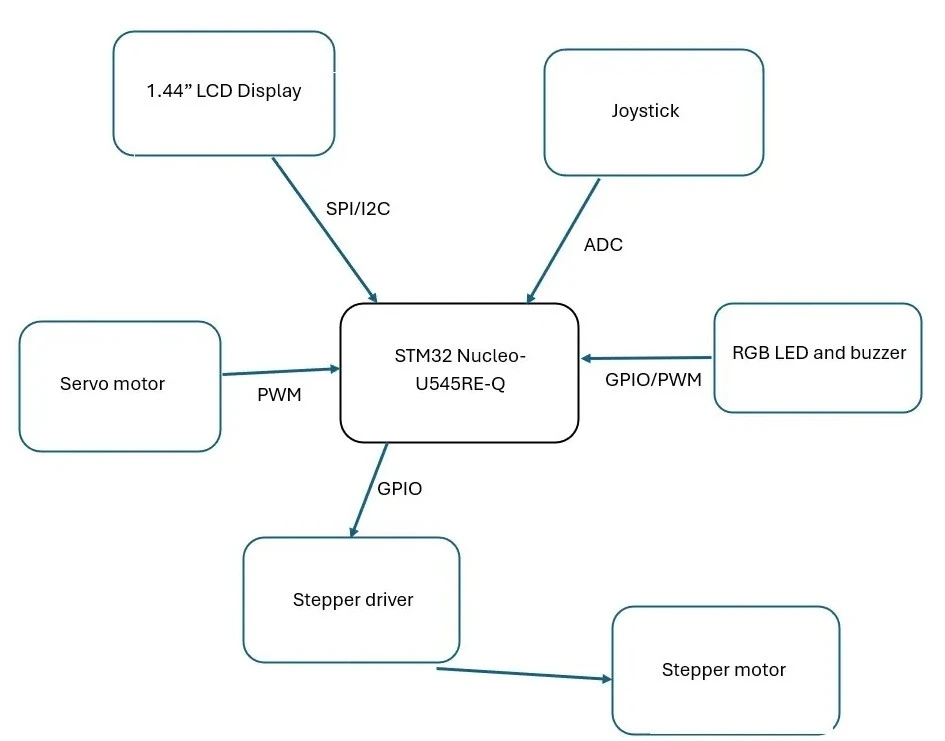

# CD Storage and Retrieval System
An STM32 system-based CD storage that selects and ejects CDs using servo mechanisms.

:::info

**Student:** Savage Jessica-Andreea \
**GitHub Repository**: https://github.com/UPB-PMRust-Students/fils-project-2026-jessicasavage24

:::

## Description

This project is a CD storage and retrieval system that is build on a stand where CDs are arranged on a rotating platform. In the center of the structure there is a stepper motor that rotates the entire stand.
The system can be controlled by a joystick and a display or remotely via Bluetooth from a phone. Once a CD is selected, the stepper motor rotates the stand until the chosen CD reaches the front position. At this point, a servo motor is activated and pushes the CD outward for an easier access. 

## Motivation

I chose this project idea beacause i wanted to make something that accesses a CD collection easier and faster. Instead of manually seaching through a stack of CDs, you cand simply browse for a desired album and the system will locate and present it.

## Architecture

The whole system is built around an STM32 microcontroller. It receives commands either from the joystick-based local interface or through the Bluetooth module connected to a phone.

## Schematics

KitCAD schematics

## Log

### Week 6

I came with the project idea and recieved a feedback.

### Weeks 7-8

 According to the feedback i tried to improve my project and I ordered the components.

### Week 9

I received the components and started testing them to see if everything works.

## Hardware

| Device | Usage | Price |
|--------|-------|-------|
| STM32 Nucleo-U545RE-Q | main controller | borrowed |
|  1.44'' LCD | Displays CD slection menu | 34.99 RON |
| Joystick Breakout Board | Navigates and selects options | 5.35 RON |
| Breadboard 830 points MB-102 | Connects the components to the microcontroller | 24.83 RON |
| Stepper motor | Moves the mechanism to position | 48.99 RON |
| Servo motor | Pushes the CD | 13.99 RON |
| Wires (M-F and M-F) | Component Interconnections | 15 RON |
| Resistors | Protects the components | 3.57 RON |
| Active Buzzer | Audio feedback | 0.99 RON |
| RGB LED | Status indicator | 0.99 RON |

## Software

| Library | Description | Usage |
| ------- | ----------- | ----- |
| embassy-stm32 | STM32 hardware control | Used for handling the motors, LEDs and joystick |
| st7735-lcd | Display driver | Used to control the screen |
| embedded-graphics | Graphics library | Used to display the menu |
| embedded-hal | Hardware interface | Used for communication with the peripherals |

## Links
1. [Embedded Rust 101 course labs](https://embedded-rust-101.wyliodrin.com/docs/fils_en/lab/01)
2. [STM32U5 Reference Manual](https://www.st.com/resource/en/reference_manualrm0456-stm32u5-series-32bit-arm-based-mcus-stmicroelectronics.pdf)

