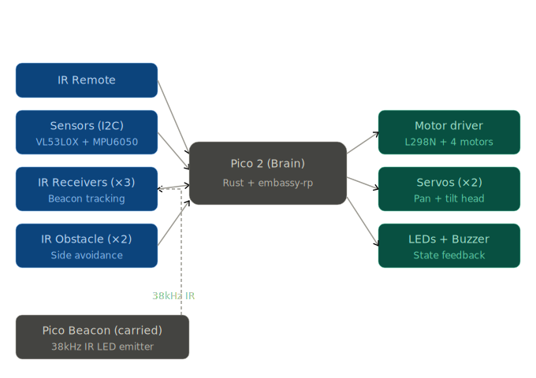

# R3X-3 Autonomous Rover

A multi-mode autonomous rover with follow-me, patrol, sentry and tilt detection, controllable via IR remote.

:::info 

**Author**: Tita Matei Alexandru \
**GitHub Project Link**: https://github.com/UPB-PMRust-Students/fils-project-2026-Matei13x13

:::

<!-- do not delete the \ after your name -->

## Description

The R3X-3 is a 4-wheel-drive autonomous rover built on a Raspberry Pi Pico 2 and programmed in Rust using the embassy-rp async framework. It implements five operational modes: follow-me, patrol, sentry, expressive LED states and tilt/pickup detection, all switchable at runtime via an IR remote control.

The rover uses a VL53L0X time-of-flight sensor mounted on a pan-tilt servo head to perform follow-me tracking, obstacle avoidance and sentry scanning. A second Raspberry Pi Pico carried by the user serves as an IR beacon for an alternative beacon-tracking follow mode. An MPU6050 IMU detects when the rover is picked up, tilted or stuck. WS2812B addressable LEDs provide expressive visual feedback for each rover state, and a passive buzzer delivers audio alerts for sentry intrusions and pickup alarms.

## Motivation

I chose this project because it combines several areas I want to learn deeply: embedded Rust on a modern microcontroller (the RP2350 in the Pico 2), real-time sensor fusion, async multitasking without an RTOS and basic robotics control.

Building a rover with multiple distinct behavior modes forces me to design a clean state-machine architecture rather than the typical single-purpose hobby project. The IR beacon system adds a second microcontroller communicating with the first, which is a useful skill beyond a single-board project.

The five modes are independent enough that I can ship the rover incrementally: even after just the first mode works, I have a functional robot, and each additional mode adds a clearly visible new capability.

## Architecture

The rover firmware is organized as a set of independent async tasks running concurrently on the Pico 2 under the embassy executor. A central shared rover state, protected by an async mutex, holds the current mode, sensor readings, orientation data and alert flags. Sensor tasks write to this state, and behavior tasks read from it.

**Main architectural components:**

- **Mode State Machine**: top-level controller that owns the current `RoverMode` enum (Follow, Patrol, Sentry, Idle, Manual). Receives mode-change requests from the IR remote decoder and dispatches to the appropriate behavior task.
- **IR Remote Decoder**: listens on a dedicated IR receiver, decodes NEC protocol button codes from the remote and translates them into mode-change events or manual drive commands.
- **Sensor Polling Task**: continuously reads VL53L0X distance, beacon-tracking IR receivers, IR obstacle sensors and MPU6050 orientation. Publishes to shared state.
- **Head Sweep Task**: controls pan/tilt servos to sweep the ToF sensor for patrol scanning, sentry monitoring and follow-me search.
- **Motor Control Task**: receives drive commands via channel, applies PWM ramping and drives the L298N. All motor commands flow through here so emergency stops are centralized.
- **LED Animation Task**: runs at 30 FPS, reads current rover state, renders the appropriate animation pattern on the WS2812B strip and eye LED, drives the buzzer for alerts.
- **IR Beacon Firmware (separate Pico)**: generates 38kHz PWM driving an IR LED with a recognizable burst pattern. Runs as a single async task on the second Pico, no other logic.

The tasks communicate through:

- **Shared state mutex** for sensor readings and rover mode (read by many tasks)
- **Embassy channels** for motor commands and mode-change events (point-to-point messaging)
- **Embassy signals** for instant notification of state changes (e.g. pickup alarm triggers immediate LED task wakeup)

## Log

<!-- write your progress here every week -->

### Week 5 - 11 May

### Week 12 - 18 May

### Week 19 - 25 May

## Hardware

The rover is built on a generic 4WD acrylic chassis with four TT gear motors driven by an L298N dual H-bridge motor driver. The brain is a Raspberry Pi Pico 2, which handles all sensor reading, motor control and LED animation.

A pan-tilt servo head carries a VL53L0X time-of-flight sensor that is swept across the front of the rover for follow-me, patrol and sentry scanning. Three IR receivers provide an alternative beacon-based following method, with the IR beacon emitter built on a second Raspberry Pi Pico that the user carries. A fourth IR receiver listens for commands from a handheld IR remote, used to switch modes and manually drive the rover. Two side-mounted IR obstacle sensors handle lateral collision avoidance.

An MPU6050 6-axis IMU on the I2C bus detects tilt, slope, pickup events and stuck conditions. Visual feedback is provided by a WS2812B addressable RGB LED strip mounted as underglow, a red 5mm LED on the turret as an "eye" indicator and a passive piezo buzzer for audio alerts.

Power is supplied by a battery routed through the L298N's onboard 5V regulator to the Pico, servos and LEDs.

### Schematics

Place your KiCAD or similar schematics here in SVG format.

### Bill of Materials

| Device | Usage | Price |
|--------|--------|-------|
| [Raspberry Pi Pico 2](https://www.raspberrypi.com/products/raspberry-pi-pico-2/) | Main rover brain, runs all firmware tasks | [30 RON](https://www.optimusdigital.ro/) |
| [4WD Robot Chassis Kit](https://www.optimusdigital.ro/) | Acrylic platform, 4× TT motors, wheels and hardware, the physical rover body | [20 RON](https://www.optimusdigital.ro/) |
| [L298N Dual Motor Driver](https://www.st.com/en/motor-drivers/l298.html) | Dual H-bridge that drives the 4 TT motors with PWM speed control and direction | [10 RON](https://www.optimusdigital.ro/ro/punti-h/1061-driver-de-motoare-l298n-dual-h-bridge.html) |
| [VL53L0X ToF Sensor](https://www.st.com/en/imaging-and-photonics-solutions/vl53l0x.html) | Laser distance sensor used for follow-me stop distance, patrol obstacle detection and sentry scanning | [17 RON](https://www.optimusdigital.ro/ro/senzori-senzori-de-distanta/3380-modul-vl53l0x-timp-de-zbor.html) |
| [MPU6050 IMU](https://invensense.tdk.com/products/motion-tracking/6-axis/mpu-6050/) | 6-axis accelerometer and gyroscope that detects pickup, slopes and stuck conditions | [14 RON](https://www.optimusdigital.ro/ro/senzori-senzori-de-acceleratie/93479-modul-cu-accelerometru-i-giroscop-mpu6050-pini-lipii.html) |
| [HX1838 IR Receiver Kit (×3)](https://www.optimusdigital.ro/) | 38kHz IR receiver with remote, 3 receivers used for beacon tracking plus 1 for IR remote control input | [21 RON](https://www.optimusdigital.ro/) |
| [IR Obstacle Sensor (×2)](https://www.optimusdigital.ro/ro/senzori-senzori-optici/996-senzor-infrarosu-de-obstacole.html) | Side-mounted reflective IR proximity sensors for lateral collision avoidance | [6 RON](https://www.optimusdigital.ro/ro/senzori-senzori-optici/996-senzor-infrarosu-de-obstacole.html) |
| [SG90 Micro Servo (×2)](https://www.optimusdigital.ro/ro/motoare-servo-motoare/26-servo-motor-sg90.html) | Pan and tilt servos for the head, sweeps the ToF sensor for scanning | [12 RON](https://www.optimusdigital.ro/ro/motoare-servo-motoare/26-servo-motor-sg90.html) |
| [WS2812B LED Strip](https://www.optimusdigital.ro/ro/leduri/) | Addressable RGB underglow that shows expressive state animations | [4 RON](https://www.optimusdigital.ro/ro/leduri/) |
| [5mm 940nm IR LED](https://www.optimusdigital.ro/ro/optoelectronice-led-uri/708-led-infrarosu-de-5-mm-cu-lungime-de-unda-940-nm.html) | Beacon emitter LED, driven at 38kHz by the carried Pico | [1 RON](https://www.optimusdigital.ro/ro/optoelectronice-led-uri/708-led-infrarosu-de-5-mm-cu-lungime-de-unda-940-nm.html) |
| [5mm Red LED + 220Ω resistor](https://www.optimusdigital.ro/) | Turret "eye" indicator for alert and state visualization | [1 RON](https://www.optimusdigital.ro/) |
| [Passive Buzzer](https://www.optimusdigital.ro/) | Piezo buzzer for audio alerts on sentry intrusion and pickup alarm | [2 RON](https://www.optimusdigital.ro/) |
| [Plusivo Resistor Kit (250 pcs)](https://www.optimusdigital.ro/) | Various resistors for IR LED current limiting (47Ω), red LED limiting (220Ω) and I2C pull-ups (4.7kΩ) | [14 RON](https://www.optimusdigital.ro/) |
| [Mini Breadboard 400 pts](https://www.optimusdigital.ro/) | Prototyping connections before final wiring | [5 RON](https://www.optimusdigital.ro/) |
| [Dupont Wire Kit (M-M, M-F, F-F)](https://www.optimusdigital.ro/) | Connecting Pico, sensors, motor driver, servos and LEDs | [24 RON](https://www.optimusdigital.ro/) |

**Estimated total: ~170 RON**

## Software

| Library | Description | Usage |
|---------|-------------|-------|
| [embassy-rp](https://github.com/embassy-rs/embassy) | Async HAL for the RP2040/RP2350 | Core hardware access for GPIO, PWM, I2C, PIO and timers |
| [embassy-executor](https://github.com/embassy-rs/embassy) | Async task executor for embedded systems | Runs all rover tasks concurrently without an RTOS |
| [embassy-time](https://github.com/embassy-rs/embassy) | Async timing primitives | Delays, tickers and timeouts in all tasks |
| [embassy-sync](https://github.com/embassy-rs/embassy) | Synchronization primitives for async embedded | Channels, mutexes and signals between tasks |
| [vl53l0x](https://crates.io/crates/vl53l0x) | Driver for VL53L0X ToF sensor | Reads distance for follow-me, patrol and sentry |
| [mpu6050](https://crates.io/crates/mpu6050) | Driver for MPU6050 6-axis IMU | Reads accelerometer and gyroscope for tilt detection |
| [defmt](https://github.com/knurling-rs/defmt) | Lightweight logging framework | Debug logging during development |
| [panic-probe](https://crates.io/crates/panic-probe) | Panic handler that prints over RTT | Diagnoses crashes during development |

## Links

<!-- Add a few links that inspired you and that you think you will use for your project -->

1. [Embassy embedded async framework documentation](https://embassy.dev/book/)
2. [RP2350 datasheet](https://datasheets.raspberrypi.com/rp2350/rp2350-datasheet.pdf)
3. [VL53L0X datasheet](https://www.st.com/resource/en/datasheet/vl53l0x.pdf)
4. [MPU6050 register map](https://invensense.tdk.com/wp-content/uploads/2015/02/MPU-6000-Register-Map1.pdf)
5. [NEC IR protocol reference](https://www.sbprojects.net/knowledge/ir/nec.php)
