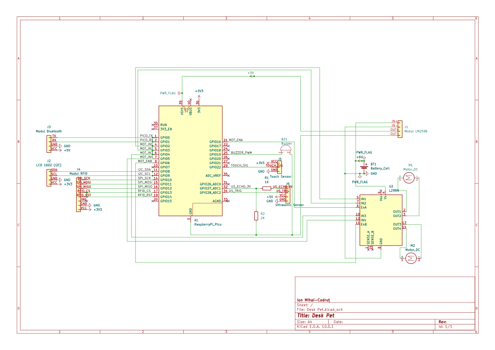
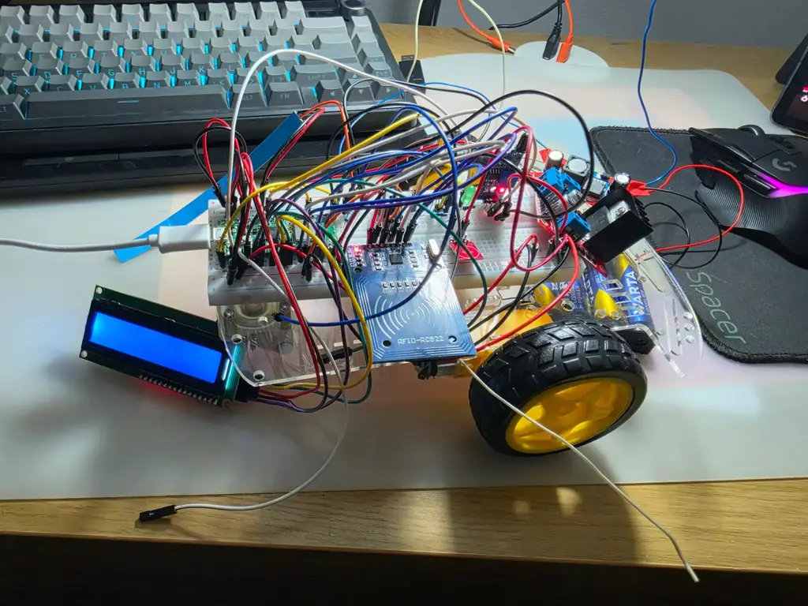

# Desk Pet

A small interactive robot that lives on your desk and reacts to the world around it, built on Raspberry Pi Pico (RP2040) and written in Rust.

:::info

**Author:** Ion Mihai-Codruț  \
**GitHub Project Link:** https://github.com/UPB-PMRust-Students/fils-project-2026-justiMpuls3

:::

## Description

Desk Pet is a 2WD robot designed to sit on a desk and behave like a simple companion. It has five moods managed by a Finite State Machine: it wanders around when idle, gets excited when you touch it, reacts to RFID cards that act as "food", turns sad if you ignore it for too long, and can be driven manually over Bluetooth. The HC-SR04 ultrasonic sensor keeps it from falling off the edge of the desk.

Everything runs asynchronously using the Embassy framework — each sensor and actuator has its own task, and they communicate through shared channels without blocking each other.

## Motivation

I wanted to build something that felt alive, not just functional. The idea of a robot with moods that change based on real input, touch, proximity, RFID; made the project interesting to design. Using Rust for embedded also appealed to me because the compiler forces you to think carefully about every resource you use, which is a good habit for hardware projects.

## Architecture

The system is built around a central FSM task. Sensor tasks detect events and send them over Embassy channels to the FSM, which decides the next state and commands the actuator tasks.

```
┌──────────────────────────────────────────────────────────┐
│                    Raspberry Pi Pico (RP2040)            │
│                                                          │
│  [touch_task]      ──┐                                  │
│  [rfid_task]       ──┤──► [fsm_task] ──► [motor_task]  │
│  [ultrasonic_task] ──┤              ├──► [lcd_task]     │
│  [bluetooth_task]  ──┘              └──► [buzzer_task]  │
└──────────────────────────────────────────────────────────┘
```

### Power Architecture

The batteries feed the L298N motor driver directly. The LM2596 buck converter steps the battery voltage down to a stable 5V, which goes into the Pico's VSYS pin (Pin 39). The Pico's internal regulator then produces 3.3V on Pin 36, which powers all sensors (RFID, touch, LCD). This keeps the noisy motor power completely separated from the logic supply.

```
[4xAA Batteries ~6V]
        |
        |-------------------------------------------> L298N motor power (direct)
        |
        +--> [LM2596 Buck Converter -> 5V] --> Pico VSYS (Pin 39)
                                                       |
                                                Pico 3V3_OUT (Pin 36)
                                                       |
                                          .------------+------------.
                                       MFRC522        LCD        TTP223
```

### FSM State Table

| State | Entry Trigger | Motors | LCD | Buzzer |
|---|---|---|---|---|
| `Idle` | Startup / timeout reset | Slow wander | "Hello! :)" | Silent |
| `Happy` | Touch sensor (GP22) | Spin in place | "Yay! ^_^" | Happy tone |
| `Fed` | RFID tag detected (GP10-14) | Short dance | "Yum! Nom nom" | Jingle |
| `Sad` | No input for 30 s | Slow drift | "Feed me... :(" | Low tone |
| `RemoteControl` | BT command via GP0/1 | Follows commands | "Remote mode" | Silent |

### Schematic



### Hardware

## Week 4-10

*Figure 1: Current hardware prototype of the Desk Pet robot. All electrical connections have been completed and tested successfully. Remaining work focuses on cable organization and final component placement on the chassis.*

### Bill of Materials

| # | Component | Qty | Shop | Price |
|---|---|---|---|---|
| 1 | Raspberry Pi Pico (RP2040) | 1 | [Optimus Digital](https://www.optimusdigital.ro/ro/placi-raspberry-pi/12024-raspberry-pi-pico-728886755172.html?srsltid=AfmBOorpPzvNPuwFdCTWcdtTJYVHecubgZsXgqlxiSDFFIw_ij9PCpwD) | ~23 RON |
| 2 | 2WD Robot Car Chassis + DC motors | 1 | [Optimus Digital](https://www.emag.ro/sasiu-arduino-car-3874783591904/pd/D37L8DYBM/?utm_campaign=share_product&utm_source=mobile_dynamic_share&utm_medium=android) | ~45 RON |
| 3 | L298N Dual Motor Driver | 1 | [Optimus Digital](https://www.emag.ro/modul-driver-motoare-l298n-compatibil-arduino-ai016-s190/pd/DXK3ZQBBM/?utm_campaign=share_product&utm_source=mobile_dynamic_share&utm_medium=android) | ~23 RON |
| 4 | MFRC522 RFID Module + 2 tags | 1 | [Optimus Digital](https://www.emag.ro/modul-rfid-rc522-card-si-tag-ai0007-s50/pd/DHYQ1GMBM/?utm_campaign=share_product&utm_source=mobile_dynamic_share&utm_medium=android) | ~23 RON |
| 5 | TTP223 Capacitive Touch Sensor | 1 | [Optimus Digital](https://www.optimusdigital.ro/ro/senzori-senzori-de-atingere/861-modul-cu-senzor-capacitiv-ttp223.html?search_query=Modul+cu+Senzor+Capacitiv+TTP223&results=2) | ~2 RON |
| 6 | HC-SR04 Ultrasonic Sensor | 1 | [Optimus Digital](https://www.optimusdigital.ro/en/optical-sensors/4514-infrared-obstacle-sensor.html?srsltid=AfmBOoqMvtFoXd0UfkgUX3G8U8qwIl8qWRQxpK1hzNdWWJpUS7vd94eX) | ~4 RON |
| 7 | LCD 1602 with I2C backpack | 1 | [Optimus Digital](https://www.optimusdigital.ro/en/lcds/2894-1602-lcd-with-i2c-interface-and-blue-backlight.html?search_query=LCD+1602+&results=14) | ~16 RON |
| 8 | Passie Buzzer | 1 | [Optimus Digital](https://www.optimusdigital.ro/en/buzzers/12247-3-v-or-33v-passive-buzzer.html?search_query=passive+buzzer+&results=10) | ~1 RON |
| 9 | HC-05 Bluetooth Module | 1 | [Optimus Digital](https://www.emag.ro/modul-bluetooth-hc-05-3874784221244/pd/DMZGZKYBM/?utm_campaign=share_product&utm_source=mobile_dynamic_share&utm_medium=android) | ~35 RON |
| 10 | LM2596 Buck Converter | 1 | [Optimus Digital](https://www.optimusdigital.ro/ro/surse-coboratoare-de-5-v/13597-sursa-coboratoare-de-tensiune-lm2596-cu-iesire-fixa-de-5v.html) | ~13 RON |
| 11 | Breadboard 400p | 1 | [Optimus Digital](https://www.emag.ro/placa-test-breadboard-830-bb830/pd/D6SCSBMBM/?utm_campaign=share_product&utm_source=mobile_dynamic_share&utm_medium=android) | ~13 RON |
**Total: ~198 RON**

### Pin Mapping

| GPIO | Pico Pin | Peripheral | Signal | Notes |
|---|---|---|---|---|
| GP0 | 1 | HC-05 Bluetooth | UART0 TX | Connects to HC-05 RX |
| GP1 | 2 | HC-05 Bluetooth | UART0 RX | Connects to HC-05 TX |
| GP2 | 4 | L298N | IN1 | Motor A direction |
| GP3 | 5 | L298N | IN2 | Motor A direction |
| GP4 | 6 | L298N | IN3 | Motor B direction |
| GP5 | 7 | L298N | IN4 | Motor B direction |
| GP6 | 9 | L298N | ENB | Motor B speed (PWM) |
| GP8 | 11 | LCD 1602 | I2C0 SDA | Data line |
| GP9 | 12 | LCD 1602 | I2C0 SCL | Clock line |
| GP10 | 14 | MFRC522 | SPI1 SCK | SPI clock |
| GP11 | 15 | MFRC522 | SPI1 MOSI | SPI data out |
| GP12 | 16 | MFRC522 | SPI1 MISO | SPI data in |
| GP13 | 17 | MFRC522 | SPI1 CS | Chip select |
| GP14 | 19 | MFRC522 | RST | Reset pin |
| GP16 | 21 | L298N | ENA | Motor A speed (PWM) |
| GP19 | 25 | Buzzer | PWM out | PWM SLICE1 B |
| GP22 | 29 | TTP223 | GPIO in | Touch signal |
| GP27 | 32 | HC-SR04 | ECHO in | Via 1kΩ/2kΩ voltage divider (5V→3.3V) |
| GP28 | 34 | HC-SR04 | TRIG out | Trigger pulse |
| VSYS | 39 | LM2596 | Power in | 5V from buck converter |
| 3V3_OUT | 36 | Sensors | Power out | 3.3V to RFID, LCD, Touch |
| GND | 3, 38 | All modules | Common ground | Shared with LM2596 GND |

:::note

The HC-SR04 ECHO pin outputs 5V logic but the RP2040 GPIO is 3.3V tolerant only. A voltage divider (1kΩ in series + 2kΩ to GND) brings the signal down to ~3.3V before it enters GP27.

:::

## Software

The firmware is written in Rust using the **Embassy** async executor on `thumbv6m-none-eabi` (Cortex-M0+).

## Results

- Firmware compiles with `cargo build --release` targeting `thumbv6m-none-eabi`.
- All five FSM states work correctly on hardware.
- LCD shows the right message for each state in real time.
- RFID tag detection is reliable and correctly triggers the `Fed` state.
- HC-SR04 stops the robot before it reaches the desk edge (~10 cm threshold).
- TTP223 touch response is immediate with no debounce issues.
- HC-05 Bluetooth responds to W/A/S/D/X serial commands from a phone terminal.
- Motor PWM control gives smooth speed transitions.

## Resources

1. [Embassy RP2040 Documentation](https://embassy.dev/book/)
2. [Raspberry Pi Pico Datasheet](https://datasheets.raspberrypi.com/pico/pico-datasheet.pdf)
3. [RP2040 Technical Reference Manual](https://datasheets.raspberrypi.com/rp2040/rp2040-datasheet.pdf)
4. [`mfrc522` crate on crates.io](https://crates.io/crates/mfrc522)
5. [`hd44780-driver` crate on crates.io](https://crates.io/crates/hd44780-driver)


## Inspiration
1. [Takway AI - Mobile Robot Platform](https://takway.ai/)
2. [Zeroth W1 - Home Robot with Camera Eyes (DesignBoom)](https://www.designboom.com/technology/mobile-robot-camera-eyes-monitors-smoke-open-windows-home-zeroth-w1-ces-2026-01-05-2026/)