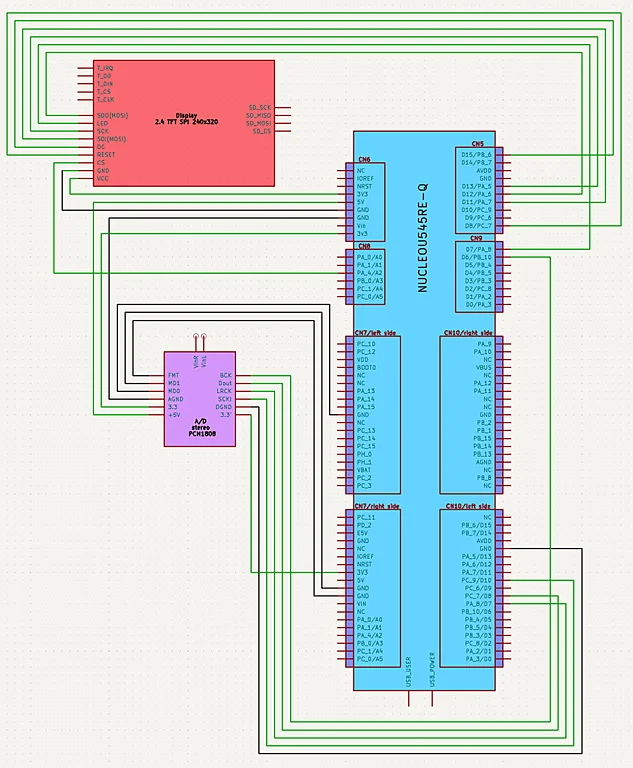

# Audio Spectrum Analyzer on STM32

Real-time audio spectrum visualization using FFT on embedded hardware

:::info

**Author**: Mykyta Troinych \
**GitHub Project Link**: https://github.com/UPB-PMRust-Students/fils-project-2026-TrOyKa23
:::

## Description

This project implements a real-time audio spectrum analyzer using an STM32 microcontroller.  
Audio signals are captured via a 3.5 mm jack, digitized using an external ADC, processed using Fast Fourier Transform (FFT), and displayed on a TFT screen.

The system provides real-time visualization of frequency components in audio signals.

---

## Motivation

The motivation behind this project is to better understand real-time digital signal processing on embedded systems and to build a practical tool for audio analysis.

It combines multiple important concepts:

- Embedded Rust development
- Digital Signal Processing (DSP)
- Real-time data acquisition using DMA
- Hardware-software integration

---

## Architecture

The system is composed of the following main components:

- **Audio Input Module** – captures analog audio signal
- **ADC Module (PCM1808)** – converts analog signal to digital (I2S)
- **Data Acquisition Module (I2S + DMA)** – streams data into memory
- **Processing Module (FFT)** – transforms signal into frequency domain
- **Display Module (SPI TFT)** – renders frequency spectrum

### Data Flow

Audio → ADC → I2S + DMA → Buffer → FFT → Display

---

## Log

### Week 4-5

- Project idea defined
- Research on FFT and embedded DSP

Defined the project idea: a real-time audio spectrum analyzer running on an STM32 microcontroller.
Researched FFT algorithms suitable for embedded systems — compared fixed-point vs floating-point implementations and evaluated CMSIS-DSP as a potential acceleration library.
Studied I2S protocol for audio data acquisition and DMA double-buffering patterns to avoid blocking the main processing loop.
Decided on the PCM1808 as the external ADC due to its I2S output and straightforward analog front-end requirements.

### Week 6-7

- PC prototype implemented for FFT visualization
- Basic signal processing pipeline tested

Implemented a desktop prototype to validate the FFT pipeline before moving to hardware. Fed a Windows Loopback audio steam and confirmed the frequency peaks appeared at the correct position as refference Fab-filter VST plugin in my DAW.
Set up the Rust embedded project targeting the NUCLEO-U545RE-Q. Configured the Embassy executor with a basic blinky task to verify the toolchain.
Ordered all hardware components: PCM1808 module, ST7789V 2.4" TFT display, and supporting passives.

### Week 8

- SPI display connected and tested
- Initial hardware setup completed

Connected the ST7789V display over SPI. The display initialized without panicking but showed only a white blank screen.

Initially suspected incorrect SPI polarity — switched CPOL/CPHA combinations, no change.
Tried lowering SPI clock from 32 MHz down to 8 MHz — screen still blank.
After hours of debugging, discovered the root cause: the SPI DMA transfer buffer was allocated at 128 bytes, far too small for a full 240×320 frame. Partial writes were silently completing and leaving the framebuffer in an undefined state. Increasing the buffer to 8 KB resolved the issue immediately — the display lit up with a solid color fill on the first successful run.

Verified display orientation and color order (RGB vs BGR) — the ST7789V requires explicit BGR mode configuration, which was missing from the initial driver setup and caused inverted colors.
Rendered a simple horizontal bar chart using embedded-graphics as a placeholder for the spectrum. Confirmed text rendering at 16px is readable at arm's length on the 2.4" panel.

### Week 9

- Working on the documentation.

Integrated the I2S + DMA audio pipeline with the FFT processing block. Initial DMA transfers produced garbled samples — traced to a mismatched sample rate: the PCM1808 was clocked at 48 kHz but the I2S peripheral was configured for 48 kHz (my audio interface is working on this freq), causing drift and aliasing artifacts in the spectrum output. Correcting the clock dividers resolved the issue.
Connected the rotary encoder on GPIO pins. Used it to control display brightness and to switch between linear and logarithmic frequency scale modes. Added software debounce after observing double-trigger events on fast knob turns.
Designed a frame enclosure in FreeCAD for 3D printing — a two-piece snap-fit shell sized to hold the NUCLEO board, breadboard section, and display flush on the front panel. Printed a first draft; found the display cutout was 1.5 mm too narrow and the encoder hole was slightly off-center. Adjusted the model and queued a second print.
Working on final documentation and cleaning up firmware constants.

---

## Hardware

- STM32 Nucleo-U545RE-Q (main microcontroller)
- PCM1808 external ADC (audio input via I2S)
- 2.4" TFT SPI display (ST7789V, 240x320)
- 3.5 mm audio jack

---

### Schematics

                    [POWER & DEBUGGING SECTION]

+-----------------------+      +--------------------------+
|        Host PC        |      |         Host PC          |
|    (USB Power 5V)     |      |    (Debug / Logging)     |
+-----------+-----------+      +------------+-------------+
            |                               |
            | (5V via USB)                  | [USB / UART]
            v                               v
+----------------------------------------------------------------+
|                                                                |
|                     NUCLEO STM32U545RE-Q                       |
|                    (Main Microcontroller)                      |
|                                                                |
|  - I2S + DMA (Audio Input)                                     |
|  - Double Buffering                                            |
|  - FFT Processing                                              |
|  - Spectrum Rendering                                          |
|                                                                |
+--------+-------------------+-------------------+---------------+
         |                   |                   |
       [I2S]               [SPI]               [GPIO]
         |                   |                   |
         v                   v                   v
+------------------+ +-------------------+ +------------------+
|                  | |                   | |                  |
|     PCM1808      | | 2.4" TFT Display  | |    Buttons /     |
|    Audio ADC     | |      ST7789V      | |     Controls     |
|  (Analog → I2S)  | |  (240x320, SPI)   | | (Potentiometer)  |
+--------+---------+ +---------+---------+ +------------------+
         |
  [Analog Audio]
         v
+------------------+
|                  |
|   3.5 mm Jack    |
|  (Audio Input)   |
+------------------+

---

### Bill of Materials

| Device                       | Usage                                   | Price                                                                                                                           |
| ---------------------------- | --------------------------------------- | ------------------------------------------------------------------------------------------------------------------------------- |
| STM32 Nucleo-U545RE-Q        | Main microcontroller                    | [106.00 RON](https://ro.mouser.com/ProductDetail/STMicroelectronics/NUCLEO-U545RE-Q?qs=mELouGlnn3cp3Tn45zRmFA%3D%3D)            |
| PCM1808                      | Audio ADC (analog → digital conversion) | [41.5 RON](https://www.emag.ro/convertor-a-d-stereo-pcm1808-24-biti-snr-99-db-tssop-14-pini-741050522202/pd/DKB6J83BM/)         |
| ST7789V TFT Display          | Frequency spectrum visualization        | [54.4 RON](https://www.emag.ro/display-tft-spi-2-4-inch-240x320-lcd-cu-touchscreen-driver-st7789v-arduino-emg178/pd/DXZMBSYBM/) |
| 3.5 mm Jack                  | Audio input                             | [2.0 RON]                                                                                                                       |
| Rotary digital Potentiometer | Scaling, changing graphical interface   | [10.0 RON]                                                                                                                      |

---

## Software

| Library             | Description                | Usage                       |
| ------------------- | -------------------------- | --------------------------- |
| embedded-hal        | Hardware abstraction layer | Used for peripheral control |
| stm32-hal           | MCU-specific HAL           | Used for STM32 peripherals  |
| embedded-graphics   | 2D graphics library        | Rendering spectrum          |
| CMSIS-DSP (planned) | DSP optimized library      | FFT acceleration            |

---

## Links

1. https://en.wikipedia.org/wiki/Fast_Fourier_transform
2. https://www.analog.com/en/products/pcm1808.html
3. https://docs.rust-embedded.org/book/
4. https://github.com/embedded-graphics/embedded-graphics
