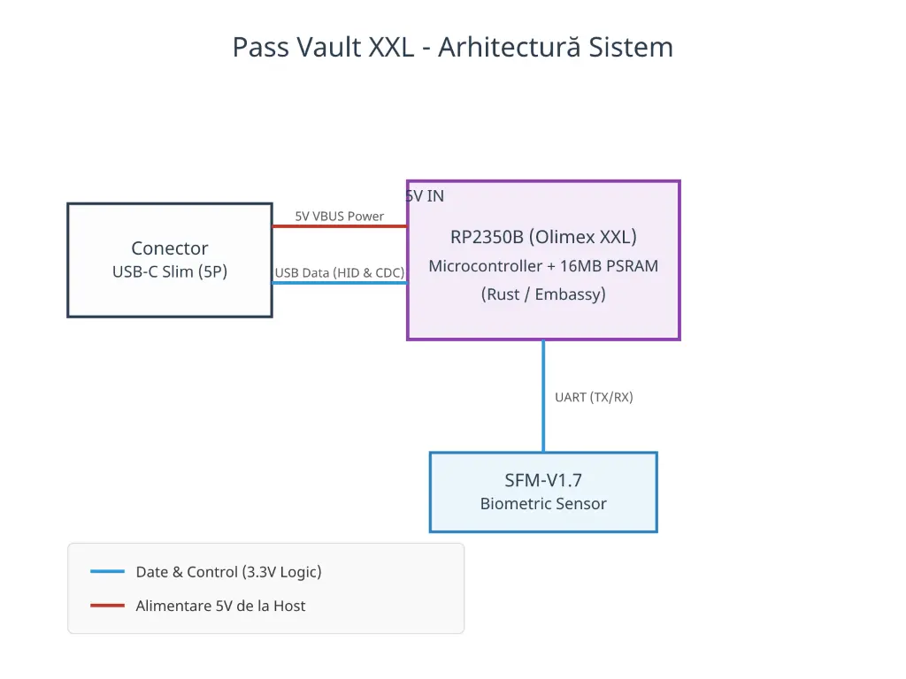

# Pass Vault
A biometric hardware security key that acts as a USB HID keyboard, mapping 10 fingerprints to specific passwords or macros.

:::info 

**Author**: Polojan Radu-Mihai \
**GitHub Project Link**: https://github.com/UPB-PMRust-Students/fils-project-2026-radupolojan

:::

<!-- do not delete the \ after your name -->

## Description

The Pass Vault is a hardware security device that stores encrypted passwords and types them automatically when a recognized fingerprint is scanned. By acting as a USB keyboard (HID), it requires no special software on the host PC. It features a Multi-Profile interface where each finger triggers a different credential, all managed via a secure USB-C smartphone or pc companion app.

## Motivation

I chose this project to create a physical-first security solution that eliminates the vulnerability of software-based password managers. It combines biometric authentication with Rust’s memory safety to ensure that credentials remain unhackable and accessible only by the physical owner.

## Architecture 

## Log

<!-- write your progress here every week -->

### Week 5 - 11 May

### Week 12 - 18 May

### Week 19 - 25 May

## Hardware

The project uses the high-pin-count RP2350B, featuring 16MB FLASH and a 8MB PSRAM for advanced data handling.

### Schematics

### Bill of Materials

-->

| Device | Usage | Price |
|--------|--------|-------|
| [RP2350-PICO2-XXL OLIMEX](https://www.tme.eu/ro/details/rp2350-pico2-xxl/kituri-de-dezvoltare-altele/olimex/) | Main MCU | [55 RON](https://www.tme.eu/ro/) |
| [Senzor amprenta SFM-V1.7](https://www.emag.ro/modul-senzor-amprenta-sfm-v1-7-ai779-s808/pd/DLGZLTMBM/?ref=history-shopping_485604297_38837_3) | Biometric authentication | [94 RON](https://www.emag.ro/) |

## Software

| Library | Description | Usage |
|---------|-------------|-------|
| [st7789](https://github.com/almindor/st7789) | Display driver for ST7789 | Used for the display for the Pico Explorer Base |
| [embedded-graphics](https://github.com/embedded-graphics/embedded-graphics) | 2D graphics library | Used for drawing to the display |

## Links

<!-- Add a few links that inspired you and that you think you will use for your project -->

1. [Rust documentation](https://youtu.be/oWThq9rKjQw?si=yXI7mbcZzjzmGdt4)
2. [XIAO RP2040 as DebugProbe](https://community.element14.com/products/raspberry-pi/b/blog/posts/seeed-studio-xiao-rp2040-as-picoprobe)
