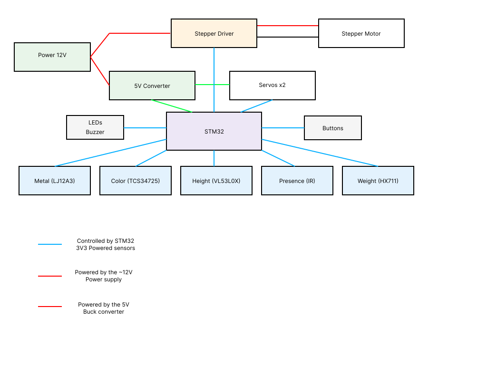

# Sorty the conveyor belt
A conveyor belt that sorts items based on multiple tests .

:::info

**Author**: Preda Razvan-Ilie \
**GitHub Project Link**: https://github.com/UPB-PMRust-Students/fils-project-2026-xrazvan06

:::

<!-- do not delete the \ after your name -->

## Description

Sorty is a smart conveyor belt system that automatically sorts objects based on their properties, such as color, weight, height, and whether they contain metal. The system uses different sensors to detect these characteristics and an STM32 microcontroller to process the data . It uses a series of servo-motors to push the objects into a box which corresponds to their properties . 

## Motivation

I chose this project because conveyor belts are used in many real-life applications like factories, airports, supermarkets and many others.To increase the difficulty of the project, I decided to improve a simple conveyor belt by adding sensors and an automatic sorting system, so it can detect and classify objects based on different properties. Also it seemed interesting to try and build one from scratch .

## Architecture 



## Log

<!-- write your progress here every week -->
### Week 21 - 27 April

 Ordered most of the sensors and motors needed for the project.
 Thought of a few ways of implementing the project.

### Week 28 April - 4 May

### Week 5 - 11 May

### Week 12 - 18 May

### Week 19 - 25 May

## Hardware

STM32U545 (NUCLEO): The microcontroller .
Buck Converter (12V → 5V): Powers the STM32 and low-voltage components.
Stepper Motor + Driver: Drives the conveyor belt.
Servo Motors (x2): Used for sorting or gate control.
Sensors: Color sensor (TCS34725), metal detector, weight sensor (load cell + HX711), and distance sensor for object detection.
User Interface: LEDs, buttons, and buzzer for feedback and control.

### Schematics

### Bill of Materials

<!-- Fill out this table with all the hardware components that you might need.

The format is 
```
| [Device](link://to/device) | This is used ... | [price](link://to/store) |

```

-->

| Device | Usage | Price |
|--------|--------|-------|
| [STM32 Nucleo-U545RE-Q](https://www.st.com/en/evaluation-tools/nucleo-u545re-q.html#documentation) | The microcontroller | [110 RON](https://ro.mouser.com/ProductDetail/STMicroelectronics/NUCLEO-U545RE-Q?qs=mELouGlnn3cp3Tn45zRmFA%3D%3D) |
| [TCS34725](https://cdn-shop.adafruit.com/datasheets/TCS34725.pdf) | RGB Color sensor | [19.73 RON](https://www.optimusdigital.ro/ro/toate-produsele/5823-modul-senzor-de-culoare-tcs34725.html?search_query=TCS34725+&results=2) |
| [Load cell + HX711](https://docs.soldered.com/hx711/how-it-works/) | Weight sensor 5kg | [27.16 RON](https://www.emag.ro/senzor-de-greutate-5-kg-ai300-s122/pd/DD7GS3MBM/) |
| [VL53L0X (GY-530)](https://www.st.com/resource/en/datasheet/vl53l0x.pdf) | Measures height | [30 RON](https://www.emag.ro/senzor-de-distanta-gy-530-vl53l0x-time-of-flight-tof-i2c-bmx298/pd/DQJMXS3BM/?ref=embedding_similar_model_1_1&provider=rec&recid=rec_109_4d122f3408c9c6f28021f47fd2cd6c8c2e490b370bbfcafe9feceaf4412ba914_1777066175&scenario_ID=109) |
| [IR Obstacle Sensor (LM393)](https://www.ti.com/product/LM393) | Detects objects | [20 RON x 2](https://www.optimusdigital.ro/ro/senzori-senzori-optici/4347-modul-senzor-de-obstacole-digital-cu-infrarosu-reglabil-3-100-cm.html?search_query=senzor+IR&results=646) |
| [Inductive Sensor LJ12A34Z/BX](https://www.alldatasheet.com/datasheet-pdf/pdf/1132467/ETC2/LJ12A3-4-Z.html) | Detects metals | [15 RON](https://www.optimusdigital.ro/ro/senzori-senzori-de-distanta/3753-senzor-de-metal-normal-deschis-lj12a34zbx.html?search_query=senzor+metal&results=19) |
| [Buzzer](https://product.tdk.com/info/en/catalog/datasheets/piezoelectronic_buzzer_ps_en.pdf) | It is used as an alarm | [1 RON](https://www.optimusdigital.ro/ro/audio-buzzere/12247-buzzer-pasiv-de-33v-sau-3v.html?search_query=buzzer&results=44) |
| [LM2596 step-down](https://d25vv4z8gtre3w.cloudfront.net/fajlcsatolas/2706.pdf) | Lowers the voltage from ~12V to 5V | [13 RON](https://www.optimusdigital.ro/ro/surse-coboratoare-de-5-v/13597-sursa-coboratoare-de-tensiune-lm2596-cu-iesire-fixa-de-5v.html?search_query=LM2596&results=13) |

## Software

| Library | Description | Usage |
|---------|-------------|-------|
| [embassy-stm32](https://github.com/embassy-rs/embassy) | HAL for STM32 microcontrollers | Used to configure peripherals (GPIO, I2C, timers, ADC) |
| [embassy-executor](https://github.com/embassy-rs/embassy) | Async task executor | Used to run concurrent tasks (sensors, motors, logic) |
| [embassy-time](https://github.com/embassy-rs/embassy) | Async timers and delays | Used for delays, timeouts, and scheduling |
| [embassy-sync](https://github.com/embassy-rs/embassy) | Synchronization primitives | Used for communication between tasks (signals, channels) |
| [embassy-futures](https://github.com/embassy-rs/embassy) | Async utilities | Used for select/join between events (e.g. sensor vs timer) |
| [embedded-hal](https://github.com/rust-embedded/embedded-hal) | Hardware abstraction traits | Standard interface used by drivers (I2C, GPIO, PWM) |
| [embedded-hal-async](https://github.com/rust-embedded/embedded-hal) | Async HAL traits | Used with Embassy async drivers |
| [cortex-m](https://github.com/rust-embedded/cortex-m) | Cortex-M support crate | Low-level MCU access |
| [cortex-m-rt](https://github.com/rust-embedded/cortex-m-rt) | Runtime for Cortex-M | Startup code and interrupt handling |
| [defmt](https://github.com/knurling-rs/defmt) | Logging framework | Used for debugging over RTT |
| [defmt-rtt](https://github.com/knurling-rs/defmt) | RTT transport for defmt | Sends logs to host PC |
| [panic-probe](https://github.com/knurling-rs/probe-run) | Panic handler | Prints panic messages using defmt |

## Links

<!-- Add a few links that inspired you and that you think you will use for your project -->

1. [https://youtube.com/shorts/HdYP6mvLWew?si=p890I0Eqb_ZgoHAU](https://youtube.com/shorts/HdYP6mvLWew?si=p890I0Eqb_ZgoHAU)
2. [https://youtu.be/o7VVmtX7SKs?si=MxJZP-G2SN3kIiRf](https://youtu.be/o7VVmtX7SKs?si=MxJZP-G2SN3kIiRf)
3. [https://www.youtube.com/watch?v=zFARtdGX9TY](https://www.youtube.com/watch?v=zFARtdGX9TY)
4. [https://www.youtube.com/watch?v=PjL9drjZAQU](https://www.youtube.com/watch?v=PjL9drjZAQU)
...
