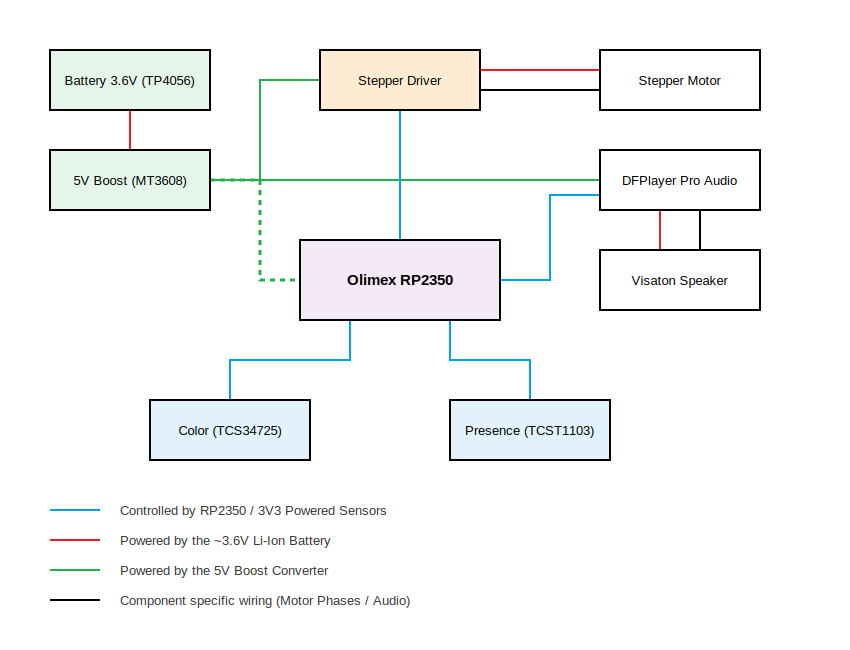

# Optical Currency Identifier
An assistive device that identifies Romanian Lei banknotes using RGB color scanning, mechanical transport, and audio feedback.

:::info 

**Author**: Polojan Stefan-Alexandru \
**GitHub Project Link**: https://github.com/UPB-PMRust-Students/fils-project-2026-PolojanStefan

:::

## Description

The Optical Currency Identifier is a complex assistive device designed to help visually impaired individuals identify Romanian Lei banknotes. The device automates the process by mechanically pulling the banknote through a slot, scanning its color profile with an RGB sensor, and announcing the value out loud using a speaker.

## Motivation

Physical currency remains a vital part of daily life, but it presents a significant accessibility challenge for the visually impaired. While coins have tactile differences, banknotes are extremely difficult to distinguish by touch. This project aims to provide financial independence by combining optical recognition with a mechanical transport system and audio feedback, eliminating the need to rely on another person for verification.

## Architecture 

The system is divided into four main subsystems coordinated by the RP2350 microcontroller:
1. **Processing System:** Olimex RP2350-PICO2-XXL running bare-metal software written in Rust.
2. **Portable Power System:** A Li-Ion 18650 battery managed by a TP4056 charging module, and an MT3608 step-up converter to ensure stable 5V power for the motor and audio.
3. **Transport & Detection System:** A 28BYJ-48 stepper motor (with ULN2003 driver) for moving the banknote, and a TCST1103 optocoupler to detect when a note is inserted.
4. **Acquisition & Output System:** A TCS34725 RGB sensor for color reading, and a DFR0954 audio module with a Visaton speaker for vocal announcements.

## Log

### Week 5 - 11 May
Established the project topic, researched the color palettes of Romanian banknotes, and defined the hardware requirements.

### Week 12 - 18 May
Acquired the Olimex RP2350-PICO2-XXL board and the TCS34725 RGB sensor. Began initial hardware testing.

### Week 19 - 25 May

## Hardware

The hardware consists of a main RP2350 processing unit handling I2C communication for sensors, UART for audio playback, and GPIO sequencing for motor control, all powered by a boosted portable Li-Ion circuit.

### Schematics

### Bill of Materials

| Device | Usage | Price |
|--------|--------|-------|
| [Olimex RP2350-PICO2-XXL](https://www.tme.eu/Document/abfc4357f0d1ffa6023328425ee8a429/RP2350-PICO2-XXL-DTE.pdf) | The main microcontroller | [50 RON](https://www.tme.eu/ro/en/) |
| [TCS34725 Module](https://cdn-shop.adafruit.com/datasheets/TCS34725.pdf) | I2C RGB Color Sensor | [35 RON](https://www.emag.ro) |
| [Samsung INR18650-29E](https://eu.nkon.nl/samsung-18650-inr18650-29e.html) | Li-Ion Battery (2750mAh, 3.6V) | [20 RON](https://milnik.ro) |
| [TP4056 Module](https://dlnmh9ip6v2uc.cloudfront.net/datasheets/Prototyping/TP4056.pdf) | Li-Ion Micro USB battery charging | [5 RON](https://www.emag.ro) |
| [MT3608 Module](#) | Step-up boost converter (raises 3.6V to 5V) | [5 RON](https://www.emag.ro) |
| [28BYJ-48 + ULN2003](#) | Stepper motor and driver for note transport | [15 RON](https://www.emag.ro) |
| [DFROBOT DFR0954](https://dfimg.dfrobot.com/wiki/20560/DFR0954_max98357a-i2s_datasheet_1.0.pdf) | Audio playback module for voice feedback | [30 RON](https://www.tme.eu/ro/en/) |
| [Visaton 2945](https://www.tme.eu/Document/e9e82c18d529e5eb244b6298ae1eb7bd/VS-K28.40-8.pdf) | Audio speaker | [15 RON](https://www.tme.eu/ro/en/) |
| [TCST1103](https://www.tme.eu/Document/8d63b75bfc278bc19f8f5ebde16b04ae/tcst1103_1202_2103.pdf) | Optocoupler for note insertion detection | [5 RON](https://www.tme.eu/ro/en/) |

## Software

| Library | Description | Usage |
|---------|-------------|-------|
| `rp235x-hal` | Hardware Abstraction Layer | Used to configure clocks, GPIO pins, and I2C/UART hardware on the RP2350 |
| `cortex-m-rt` | ARM Cortex-M runtime | Provides the startup code and critical CPU entry points |
| `usb-device` | Core USB stack | Used to implement native USB device functionality |
| `usbd-serial` | USB CDC implementation | Used for debugging and streaming sensor data to the PC |
| `embedded-hal` | Embedded hardware traits | Provides standard traits for blocking I2C and UART communication |

## Links

1.-https://www.youtube.com/watch?v=Fy4IUyWjFX4
2.-https://www.youtube.com/watch?v=zByu_-Q0F7E
3.-