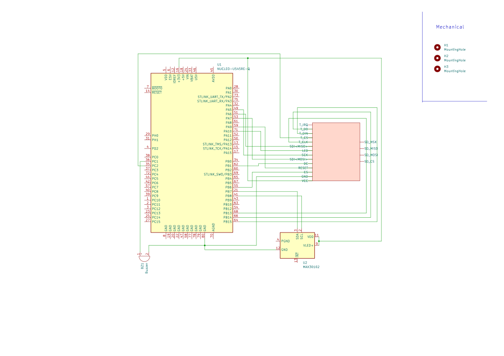

# PulseOx
A device that monitors your pulse and oxygen levels, alerting you the moment vitals lose balance

:::info
**Author**: Grushchenko Vlada \
**GitHub Project Link**: https://github.com/UPB-PMRust-Students/fils-project-2026-vladagr-151107

:::

## Description

PulseOx is a sophisticated health-monitoring station designed for real-time tracking of heart rate and oxygen saturation. Using advanced optical sensing, the system provides instant physiological insights through live waveforms and clear data visualization on an integrated display. With an intuitive tactile interface and audio feedback, it offers a seamless way to monitor and manage your vital signs in any environment.

## Motivation

The PulseOx project was born from the need for reliable, accessible monitoring of life-critical parameters. From an engineering perspective, it presented a complex system integration challenge: synchronizing high-frequency data acquisition from optical sensors with real-time waveform rendering on a TFT display. The goal is to bridge the gap between raw signal processing and intuitive user feedback, creating a responsive, standalone device that transforms physiological data into actionable health insights.

## Architecture

Here is the schematic of the project:

## Log

### Week 5

Brainstormed the ideas for the project and searched for the required components.

### Week 6

Discussed the idea of the project with lab assistant and ordered the components & other necessary supplies. 

### Weeks 7-8

Started working on my project: 
- soldered MAX30102 sensor(and 2 back-up ones)
- found data sheets for the sensor and the screen
- set up the display of the information on the display 
- sped up the process of the update on the screen

### Week 9

I focused on stabilizing the raw data feed from the sensor, stripping out the noise that was messing with the readings. Now the stream stays clean and runs indefinitely without crashing.

### Week 10

I performed a complete refactor of the core analysis functions and calibrated the system to align with reference standards. As a result, the approximation error has been reduced, achieving a high level of precision in data interpretation.

## Hardware

The hardware architecture of PulseOx utilizes an STM32U5 microcontroller as its high-performance processing core. Physiological sensing is handled by a MAX30102 high-sensitivity optical sensor, capturing both heart rate (BPM) and blood oxygen saturation (SpO2). The system features a TFT ST7789V display for real-time data visualization, capable of rendering complex signal waveforms alongside numerical measurements. User interaction is enhanced through an active buzzer for synchronized audio feedback and a tactile button interface for seamless measurement control.

# Schematics 

## Bill of Materials

| Device | Usage | Price |
| :--- | :--- | :--- |
| STM32 NUCLEO-U545RE-Q | The microcontroller | borrowed |
| TFT Display ST7789V | User interface screen | 55 RON |
| BPM and SpO2 sensor MAX30102 | Measurement of pulse and blood oxygen | 30 RON |
| Active buzzer | Feedback giver | 1 RON |

## Software

| Library | Description | Usage |
| :--- | :--- | :--- |
| embassy_stm32 | Hardware abstraction layer for STM32 | Configures clocks, GPIO, SPI and initializes microcontroller |
| embassy_executor | Async task executor for bare-metal embedded systems | Manages scheduling and running async tasks on the device |
| display_interface_spi | SPI communication interface for displays | Connects SPI bus with the display driver |
| ili9341 | Display driver for ILI9341 TFT | Controls the display (init, clear, draw pixels) | 
| embedded_graphics | 2D graphics library for embedded displays | Draws text, buttons, shapes on the screen |
| embassy_time | Async timers and delays | Used for delays |
| embassy_sync | Synchronization primitives | Provides Mutex for safe shared access to SPI |
| embassy_embedded_hal | HAL abstraction for Embassy async framework | Provides SpiDevice to safely share SPI bus between devices |
| core | Rust core library | Provides basic functionality |
| panic_probe | Panic handler for embedded systems | Captures and displays panics for debugging | 
| defmt_rtt | Logging framework for embedded | Sends debug messages from MCU to PC |

## Links
 1. [MAX30102 Data Sheet](https://www.analog.com/media/en/technical-documentation/data-sheets/max30102.pdf)
 2. [ILI9341 Data Sheet](https://cdn-shop.adafruit.com/datasheets/ILI9341.pdf)